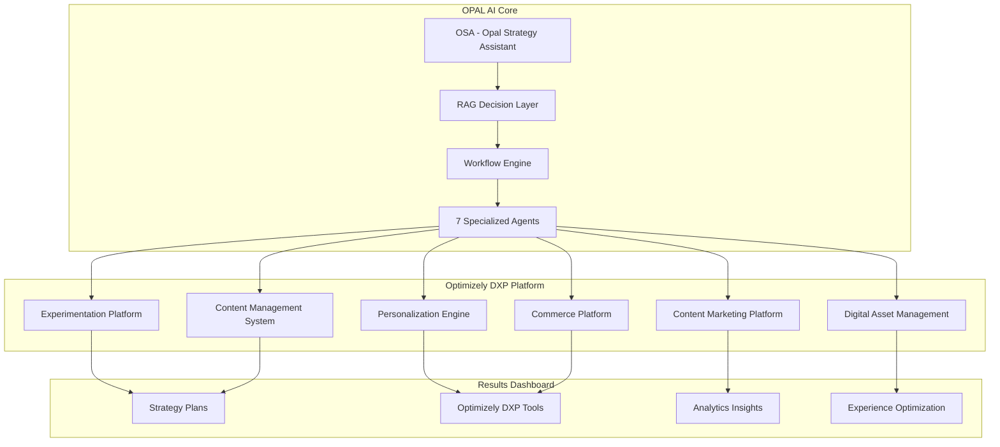

# Optimizely Strategy Assistant - Project Overview

## Executive Summary

The OSA (Optimizely Strategy Assistant) is an AI-powered platform designed to automate personalization strategy generation for marketing teams. Built on Next.js and integrated with Opal AI agents, OSA transforms complex personalization planning from weeks of manual work into minutes of intelligent automation.

**Key Business Value:**
- **Time Reduction**: 90% reduction in strategy development time (from weeks to minutes)
- **Quality Improvement**: AI-driven recommendations based on marketing technology analysis
- **Scalability**: Supports multiple clients with personalized strategy generation
- **Intelligence**: Leverages RAG (Retrieval-Augmented Generation) for contextual recommendations

**Target Users:** Marketing teams, content creators, UX designers, and executive teams seeking data-driven personalization strategies.

---

## Project Goals & Objectives

### Primary Goals
1. **Automate Strategy Generation**: Replace manual personalization planning with AI-driven automation
2. **Optimize Marketing Technology**: Analyze existing tech stacks to maximize ROI and identify synergies
3. **Accelerate Implementation**: Provide actionable roadmaps with clear phases and timelines
4. **Enable Data-Driven Decisions**: Combine multiple data sources for comprehensive analysis

### Business Problems Solved
- **Manual Process Inefficiency**: Eliminates weeks of manual research and analysis
- **Technology Stack Fragmentation**: Identifies gaps and optimization opportunities
- **Inconsistent Strategy Quality**: Standardizes approach using AI and best practices
- **Resource Planning Challenges**: Provides clear implementation roadmaps and resource requirements
- **ROI Uncertainty**: Delivers measurable KPIs and expected business impact

### Benefits Delivered
- **Rapid Strategy Development**: Complete personalization strategies in minutes
- **Intelligent Recommendations**: Context-aware suggestions based on current capabilities
- **Technology Integration Insights**: Identifies synergies between marketing tools
- **Phased Implementation Plans**: Clear roadmaps from crawl → walk → run → fly
- **Multi-format Outputs**: Dashboards, analytics, and exportable reports

---

## Architecture Overview

### Core Technology Stack
- **Frontend**: Next.js 14 with React and TypeScript
- **UI Framework**: Tailwind CSS with Radix UI components
- **AI Integration**: Opal AI agent orchestration system with Optimizely DXP
- **Data Processing**: Real-time RAG (Retrieval-Augmented Generation)
- **Authentication**: Custom authentication layer with API key management
- **Deployment**: Vercel with environment-based configuration
- **Visualization**: Recharts for analytics dashboards and data visualization

### System Components
1. **OSA Workflow Engine**: Orchestrates the complete strategy generation process
2. **Opal Agent Network**: Seven specialized AI agents for different analysis types
3. **Optimizely DXP Integration**: Six core tools for experience optimization
4. **RAG Personalization System**: Intelligent recommendation engine with contextual insights
5. **Data Store**: In-memory workflow and result management with session persistence
6. **Hybrid Analytics Dashboard**: Four-section navigation with role-based personalization

### OPAL-Optimizely Integration Architecture



---

## Opal Integration & Agent Architecture

### Opal Workflow System
OSA leverages Opal's agent orchestration platform to execute complex, multi-step analysis workflows. The system triggers agent workflows and polls for completion, providing real-time status updates to users.

### Seven Core Agents

#### 1. **Strategic Roadmap Agent**
- **Purpose**: Generates 4-phase implementation roadmaps (Crawl → Walk → Run → Fly)
- **Input**: Business objectives, current capabilities, technology stack
- **Output**: Phased implementation plan with timelines and resource requirements

#### 2. **Content Review Agent**
- **Purpose**: Analyzes existing content for optimization opportunities
- **Focus**: SEO improvements, performance enhancements, user experience
- **Output**: Prioritized optimization suggestions with impact assessments

#### 3. **GEO Audit Agent**
- **Purpose**: Evaluates AI citation readiness and search optimization
- **Analysis**: Schema markup, structured data, search visibility
- **Output**: Technical SEO score and quick-win recommendations

#### 4. **Audience Suggester Agent**
- **Purpose**: Identifies high-value audience segments for personalization
- **Methodology**: Behavioral analysis, demographic insights, engagement patterns
- **Output**: Targeted audience definitions with activation strategies

#### 5. **Experiment Blueprinter Agent**
- **Purpose**: Designs A/B testing strategies with statistical power calculations
- **Features**: Variant design, traffic allocation, success metrics
- **Output**: Ready-to-deploy experiment specifications

#### 6. **Personalization Ideas Agent**
- **Purpose**: Generates placement-specific personalization strategies
- **Coverage**: Multiple touchpoints across customer journey
- **Output**: Actionable personalization tactics with fallback options

#### 7. **Data Insights Agent**
- **Purpose**: Analyzes data sources and integration opportunities
- **Focus**: Data quality, identity resolution, activation potential
- **Output**: Data strategy recommendations and implementation priorities

### Agent Communication & Data Flow
- **Trigger**: OSA Form submission initiates Opal workflow
- **Orchestration**: Agents execute in parallel where possible, sequentially when dependencies exist
- **Data Sharing**: Agents share context through Opal's data store
- **Results**: Aggregated outputs feed into RAG system for final strategy generation

---

## Optimizely DXP Integration & Tool Mapping

### Six Core Optimizely DXP Tools

#### 1. **Experimentation Platform**
- **Purpose**: Advanced A/B testing and multivariate experimentation
- **OPAL Integration**: Experiment Blueprinter Agent provides test designs and statistical frameworks
- **Key Features**:
  - Statistical significance monitoring with early stopping rules
  - Multi-armed bandit optimization for traffic allocation
  - Cross-device and cross-channel experiment tracking
  - Progressive rollout capabilities with audience targeting
- **Dashboard Integration**:
  - **Strategy Plans → Testing Strategy**: Experiment roadmaps and hypothesis banks
  - **Optimizely DXP → Experimentation**: Active experiments with real-time results
  - **Experience Optimization → Conversion**: A/B test impact on conversion funnels

#### 2. **Personalization Engine**
- **Purpose**: Real-time content and experience personalization
- **OPAL Integration**: Personalization Ideas Agent and Audience Suggester Agent drive targeting
- **Key Features**:
  - Behavioral targeting with real-time decisioning
  - Content variation management across touchpoints
  - Predictive audience modeling with ML recommendations
  - Cross-channel personalization orchestration
- **Dashboard Integration**:
  - **Strategy Plans → Personalization**: Audience strategies and journey mapping
  - **Optimizely DXP → Personalization**: Campaign performance and audience insights
  - **Experience Optimization → User Journey**: Personalization impact analysis

#### 3. **Content Marketing Platform (CMP)**
- **Purpose**: Content lifecycle management and performance optimization
- **OPAL Integration**: Content Review Agent provides optimization recommendations
- **Key Features**:
  - Editorial workflow automation with approval chains
  - Content performance analytics with engagement scoring
  - Multi-channel distribution optimization
  - AI-powered content recommendations and gap analysis
- **Dashboard Integration**:
  - **Strategy Plans → Content Strategy**: Editorial calendar and content planning
  - **Optimizely DXP → Content Marketing**: Content performance and distribution analytics
  - **Analytics Insights → Content Analytics**: 7 specialized content reports (detailed below)

#### 4. **Digital Asset Management (DAM)**
- **Purpose**: Centralized media library with usage analytics and brand compliance
- **OPAL Integration**: Data Insights Agent analyzes asset utilization patterns
- **Key Features**:
  - Automated asset tagging using computer vision
  - Usage analytics and asset performance tracking across campaigns
  - Brand compliance monitoring with automated alerts
  - Asset lifecycle management with expiration tracking
- **Dashboard Integration**:
  - **Optimizely DXP → Digital Assets**: Asset library and usage metrics
  - **Analytics Insights → Performance**: Asset effectiveness scoring
  - **Experience Optimization → Creative Testing**: Asset variation performance

#### 5. **Content Management System (CMS)**
- **Purpose**: Headless content delivery with multi-site management
- **OPAL Integration**: GEO Audit Agent provides SEO optimization recommendations
- **Key Features**:
  - API-first headless architecture with flexible content delivery
  - Multi-site content syndication with localization support
  - SEO optimization with automated meta-data generation
  - Content freshness monitoring with update recommendations
- **Dashboard Integration**:
  - **Optimizely DXP → Content Management**: Site performance and content health
  - **Analytics Insights → Content Analytics**: Freshness and semantic analysis
  - **Experience Optimization → Page Optimization**: Page-level performance insights

#### 6. **Commerce Platform**
- **Purpose**: E-commerce optimization with personalized shopping experiences
- **OPAL Integration**: Strategic Roadmap Agent provides commerce optimization strategies
- **Key Features**:
  - Product catalog optimization with AI recommendations
  - Cart abandonment recovery with personalized messaging
  - Revenue attribution modeling across touchpoints
  - Inventory-aware personalization and dynamic pricing
- **Dashboard Integration**:
  - **Optimizely DXP → Commerce**: E-commerce performance and catalog optimization
  - **Analytics Insights → Revenue**: Commerce analytics and conversion funnels
  - **Experience Optimization → Conversion**: Purchase journey optimization

---

## Results Dashboard Architecture & Report Mapping

### Navigation Structure: Four Main Areas

#### 1. **Strategy Plans** (Blue Theme)
**Purpose**: High-level strategic planning and roadmap visualization

**Sub-navigation Tabs:**
- **OSA**: Core maturity assessment results and strategic roadmaps
  - **Reports**: Maturity plan display with phased implementation (Crawl→Walk→Run→Fly)
  - **Components**: `ModernMaturityPlanDisplay`, `MaturityAnalyticsDashboard`
  - **Data Source**: OSA Workflow Output from all 7 OPAL agents

- **Quick Wins**: High-impact, low-effort optimization opportunities
  - **Reports**: Impact-effort matrix with prioritized recommendations
  - **Components**: `ImpactEffortMatrix` with interactive quadrant visualization
  - **Data Source**: Strategic Roadmap Agent + RAG-enhanced prioritization

- **Personalization**: Audience strategy and journey optimization
  - **Reports**: Audience sync recommendations and behavioral analytics
  - **Components**: `AudienceSyncRecommendations`, `AIPersonalizationRecommendations`
  - **Data Source**: Audience Suggester Agent + Personalization Ideas Agent

- **Testing Strategy**: Experiment planning and A/B testing roadmaps
  - **Reports**: A/B testing blueprints and experimentation recommendations
  - **Components**: `ABTestBlueprintGenerator`, `AIExperimentationRecommendations`
  - **Data Source**: Experiment Blueprinter Agent + statistical frameworks

#### 2. **Optimizely DXP Tools** (Green Theme)
**Purpose**: Direct integration with Optimizely platform tools

**Sub-navigation Tabs:**
- **Experimentation**: Active experiments and testing results
- **Personalization**: Campaign management and audience insights
- **Content Marketing**: Editorial workflow and content performance
- **Digital Assets**: Media library and asset utilization
- **Content Management**: Site management and SEO optimization
- **Commerce**: E-commerce analytics and product optimization

*Note: These tabs show real-time data from Optimizely DXP platforms when integrated*

#### 3. **Analytics Insights** (Purple Theme)
**Purpose**: Data-driven insights and performance analytics

**Sub-navigation Tabs:**
- **Content Analytics**: 7 specialized content marketing reports
  1. **Content Engagement Report**: Time on page, scroll depth, interaction metrics
  2. **Topic Performance Analysis**: Subject matter effectiveness and trend identification
  3. **Most Popular Content**: Top-performing pieces with engagement signals
  4. **AI Visibility & Citation Report**: Content references in AI-generated answers
  5. **Semantic Structure & Readability**: Machine readability and user comprehension
  6. **Geographic & Localization Performance**: Regional engagement patterns
  7. **Content Freshness & Update Frequency**: Content lifecycle and maintenance needs

  - **Components**: `AnalyticsContentDashboard` with 7 interactive reports
  - **Data Source**: Content Review Agent + GEO Audit Agent + real-time analytics
  - **Visualization**: Recharts library (BarChart, LineChart, PieChart, ScatterChart)

- **Performance**: Conversion analytics and technical performance
  - **Reports**: Content performance scoring and optimization recommendations
  - **Components**: `ContentPerformanceScoring`, `EnhancedAnalyticsDashboard`
  - **Data Source**: All agents + performance metrics integration

- **Data Insights**: Data platform analysis and integration recommendations
  - **Reports**: Comprehensive data insights dashboard
  - **Components**: `DataInsightsDashboard` with predictive analytics
  - **Data Source**: Data Insights Agent + cross-platform analytics integration

#### 4. **Experience Optimization** (Orange Theme)
**Purpose**: User experience optimization and journey analysis

**Sub-navigation Tabs:**
- **User Journey**: Journey mapping and drop-off analysis
- **Page Optimization**: Page-level performance and heatmap analysis
- **Conversion**: Funnel optimization and conversion rate improvement

*Note: These sections provide UX-focused analytics and optimization recommendations*

### Role-Based Dashboard Personalization

**Marketing Teams**: Focus on content performance, campaign analytics, and audience insights
**UX Designers**: Emphasize user journey, page optimization, and experience metrics
**Executives**: Highlight ROI projections, strategic roadmaps, and business impact
**Content Teams**: Prioritize content analytics, editorial workflows, and freshness reports

### Cross-Linking and Related Insights

**Sidebar Accordions** (Collapsed by default):
- **Related Insights**: Cross-references between different dashboard sections
- **Implementation Ready**: Actionable tasks with detailed instructions
- **Quick Actions**: Secondary tab navigation under main content areas

---

## RAG (Retrieval-Augmented Generation) System

### Knowledge Base Components
- **Marketing Technology Catalog**: 100+ technology capabilities and use cases
- **Personalization Use Case Library**: Industry-specific scenarios and implementations
- **Integration Patterns**: Technology synergies and best practices
- **Maturity Framework**: 4-phase progression model with readiness criteria

### Intelligence Features
- **Context-Aware Recommendations**: Suggestions based on current technology stack
- **Cross-Technology Synergies**: Identifies optimization opportunities between tools
- **Business Impact Scoring**: Prioritizes recommendations by potential ROI
- **Implementation Complexity Assessment**: Realistic timeline and resource estimates

### Enhanced Recommendations
When Opal agents complete analysis, the RAG system:
1. **Incorporates Agent Insights**: Merges agent findings with knowledge base
2. **Generates Contextual Strategies**: Creates targeted recommendations
3. **Prioritizes Quick Wins**: Identifies high-impact, low-effort opportunities
4. **Maps Technology Synergies**: Shows integration opportunities

---

## Site Organization & User Flow

### Navigation Structure
```
/engine (Main Strategy Generation)
├── /results (Strategy Dashboard)
└── /admin (Administrative Controls)

/api/osa (OSA API Endpoints)
├── /workflow (Main workflow orchestration)
└── /workflow/discovery (Opal discovery interface)
```

### User Journey
1. **Assessment Input**: Users complete strategy assessment form
2. **Workflow Trigger**: System initiates Opal agent workflows
3. **Real-time Processing**: Live progress updates during agent execution
4. **Results Dashboard**: Comprehensive strategy presentation across multiple tabs
5. **Export & Action**: Download strategies and access implementation guidance

### Dashboard Tabs
- **Strategy**: Core maturity plan and implementation roadmap
- **Content**: Content optimization recommendations and scoring
- **Experimentation**: A/B testing blueprints and recommendations
- **Personalization**: AI-generated personalization strategies
- **Data Insights**: Data platform analysis and recommendations
- **More**: Additional analytics and audience sync recommendations

---

## Technical Implementation Details

### Workflow Management
- **Status Tracking**: Real-time workflow status with polling mechanisms
- **Rate Limiting**: 5 workflows per day with admin override capability
- **Session Management**: User session tracking across workflow execution
- **Error Handling**: Graceful failure management with retry mechanisms

### Data Integration
- **Input Processing**: Form data validation and transformation
- **Agent Coordination**: Parallel and sequential agent execution patterns
- **Result Aggregation**: Multi-agent output synthesis
- **Format Standardization**: Consistent output structure across all components

### Performance Optimization
- **Caching**: Strategic caching of agent results and RAG recommendations
- **Lazy Loading**: Component-based loading for improved performance
- **Background Processing**: Non-blocking workflow execution
- **Real-time Updates**: Live status updates without page refreshes

### Security & Authentication
- **API Key Management**: Secure authentication for all API endpoints
- **Request Validation**: Input sanitization and validation
- **Rate Limiting**: Protection against abuse and overuse
- **Audit Logging**: Comprehensive request and workflow tracking

---

## Integration Points & APIs

### Opal Integration
- **Workflow Trigger**: `/api/opal/status` - Initiates agent workflows
- **Status Polling**: `/api/opal/status/{session_id}` - Real-time status checks
- **Discovery**: `/api/osa/workflow/discovery` - Opal-compatible function definitions

### Internal APIs
- **Workflow Management**: `/api/osa/workflow` - Main workflow orchestration
- **Data Synchronization**: `/api/opal/sync` - Force sync capabilities
- **Administrative Controls**: Admin panel integration for workflow management

### External Integrations
- **Marketing Technology Platforms**: Data source analysis and integration recommendations
- **Analytics Platforms**: Performance tracking and measurement frameworks
- **Email Systems**: Strategy delivery and notification systems

---

## Monitoring & Analytics

### Workflow Analytics
- **Execution Metrics**: Workflow completion times and success rates
- **Agent Performance**: Individual agent execution statistics
- **User Engagement**: Dashboard interaction and usage patterns
- **Error Tracking**: Comprehensive error logging and analysis

### Business Intelligence
- **Strategy Effectiveness**: Track implementation success metrics
- **User Satisfaction**: Feedback collection and analysis
- **Technology Adoption**: Monitor recommended technology implementations
- **ROI Measurement**: Business impact tracking and reporting

---

## Admin Implementation Guide: Deploying OSA with Optimizely DXP

### Prerequisites
- **Optimizely DXP Access**: Valid licenses for required Optimizely tools
- **OPAL Platform**: Active OPAL AI agent orchestration account
- **Cloud Infrastructure**: Vercel account or compatible hosting platform
- **Analytics Integration**: Google Analytics, Adobe Analytics, or similar platform
- **Development Resources**: React/TypeScript developers for customization

### Phase 1: Infrastructure Setup (Week 1)

#### Step 1: Environment Configuration
```bash
# Clone OSA repository
git clone [repository-url]
cd my-nextjs-app

# Install dependencies
npm install

# Configure environment variables
cp .env.example .env.local
```

#### Required Environment Variables:
```bash
# OPAL Integration
OPAL_API_BASE_URL=https://api.opal.ai
OPAL_API_KEY=your_opal_api_key
OPAL_WORKSPACE_ID=your_workspace_id

# Optimizely DXP Integration
OPTIMIZELY_SDK_KEY=your_optimizely_sdk_key
OPTIMIZELY_PROJECT_ID=your_project_id
OPTIMIZELY_ACCESS_TOKEN=your_access_token

# Analytics Integration
GA_TRACKING_ID=your_google_analytics_id
ADOBE_ANALYTICS_SUITE=your_adobe_suite_id

# Authentication
JWT_SECRET=your_jwt_secret_key
API_KEY_ENCRYPTION=your_encryption_key

# Database (if using persistent storage)
DATABASE_URL=your_database_connection_string
```

#### Step 2: Optimizely DXP Tool Configuration

**Experimentation Platform Setup:**
1. Access Optimizely Experimentation dashboard
2. Create new project for OSA integration
3. Generate API credentials with experiment read/write permissions
4. Configure webhook endpoints for real-time experiment updates
5. Set up statistical significance thresholds (95% confidence, 80% power)

**Personalization Engine Setup:**
1. Configure audience definitions in Optimizely Personalization
2. Set up behavioral event tracking for visitor segmentation
3. Create content variation templates for dynamic delivery
4. Configure real-time decisioning API endpoints
5. Set up fallback content for new visitors

**Content Marketing Platform Setup:**
1. Connect content repositories (CMS, DAM systems)
2. Configure editorial workflow automation
3. Set up content performance tracking events
4. Create content distribution channel integrations
5. Configure AI content recommendation engine

### Phase 2: OPAL Agent Configuration (Week 2)

#### Agent Workflow Setup:
```javascript
// Example OPAL agent configuration
const agentConfig = {
  "strategic_roadmap": {
    "agent_id": "osa_strategic_roadmap",
    "timeout": 300000, // 5 minutes
    "dependencies": ["content_review", "geo_audit"],
    "output_format": "structured_json"
  },
  "content_review": {
    "agent_id": "osa_content_review",
    "timeout": 180000, // 3 minutes
    "parallel_execution": true,
    "output_format": "structured_json"
  }
  // ... additional agent configurations
};
```

#### RAG System Configuration:
1. **Knowledge Base Initialization**:
   - Upload marketing technology catalog (100+ tools)
   - Configure personalization use case library
   - Set up integration pattern templates
   - Initialize maturity framework definitions

2. **Decision Layer Setup**:
   - Configure recommendation scoring algorithms
   - Set up cross-technology synergy detection
   - Initialize business impact assessment models
   - Configure implementation complexity calculations

### Phase 3: Dashboard Deployment (Week 3)

#### Component Configuration:
```typescript
// Dashboard configuration
export const dashboardConfig = {
  navigation: {
    areas: [
      {
        id: 'strategy-plans',
        title: 'Strategy Plans',
        color: 'blue',
        tabs: ['osa', 'quick-wins', 'personalization', 'testing-strategy']
      },
      {
        id: 'optimizely-dxp',
        title: 'Optimizely DXP',
        color: 'green',
        tabs: ['experimentation', 'personalization', 'content-marketing', 'digital-assets', 'content-management', 'commerce']
      }
      // ... additional areas
    ]
  },
  roleBasedViews: {
    marketing: ['content-analytics', 'campaign-performance'],
    ux: ['user-journey', 'page-optimization'],
    executive: ['roi-projections', 'strategic-roadmaps'],
    content: ['editorial-workflow', 'freshness-reports']
  }
};
```

#### Real-time Data Integration:
1. **API Endpoint Configuration**:
   ```typescript
   // API routes setup
   /api/osa/workflow - Main workflow orchestration
   /api/opal/status - Agent status polling
   /api/optimizely/experiments - Live experiment data
   /api/analytics/content - Content performance metrics
   /api/dashboard/sync - Real-time dashboard updates
   ```

2. **WebSocket Setup for Live Updates**:
   ```javascript
   // Real-time dashboard updates
   const wsConfig = {
     endpoint: 'wss://your-domain.com/api/ws',
     channels: ['experiment-updates', 'content-performance', 'workflow-status'],
     reconnection: { attempts: 5, delay: 1000 }
   };
   ```

### Phase 4: Integration Testing & Validation (Week 4)

#### Testing Checklist:
- [ ] **OPAL Agent Workflows**: All 7 agents execute successfully
- [ ] **Optimizely Integration**: Live data from all 6 DXP tools
- [ ] **Dashboard Functionality**: All 4 navigation areas working
- [ ] **Role-Based Access**: Personalization working correctly
- [ ] **Real-time Updates**: WebSocket connections stable
- [ ] **Export Functions**: PDF/Excel generation working
- [ ] **Mobile Responsiveness**: All breakpoints functioning
- [ ] **Performance Metrics**: Page load times under 2 seconds

#### Integration Validation:
```bash
# Run integration tests
npm run test:integration

# Test OPAL connectivity
npm run test:opal-agents

# Validate Optimizely DXP connections
npm run test:optimizely-integration

# Performance testing
npm run test:performance
```

### Phase 5: Go-Live Preparation (Week 5)

#### Production Deployment:
1. **Vercel Deployment Configuration**:
   ```bash
   # Deploy to production
   vercel --prod

   # Configure environment variables in Vercel dashboard
   vercel env add OPAL_API_KEY production
   vercel env add OPTIMIZELY_SDK_KEY production
   # ... add all production environment variables
   ```

2. **DNS and SSL Setup**:
   - Configure custom domain (e.g., osa.ifpa.com)
   - Set up SSL certificate through Vercel or CloudFlare
   - Configure CDN for global performance optimization

3. **Monitoring and Alerting**:
   ```javascript
   // Production monitoring setup
   const monitoringConfig = {
     uptime: { interval: '1m', threshold: '99.9%' },
     performance: { target: '2s', alertThreshold: '5s' },
     errors: { logLevel: 'error', alertThreshold: 10 },
     workflows: { timeoutThreshold: '10m', failureAlert: true }
   };
   ```

### Admin User Training & Documentation

#### Training Modules:
1. **OSA Overview** (30 minutes): System architecture and capabilities
2. **Dashboard Navigation** (45 minutes): Four-area navigation and report interpretation
3. **Workflow Management** (30 minutes): Triggering and monitoring OPAL agents
4. **Optimizely Integration** (60 minutes): Managing DXP tool connections
5. **Troubleshooting** (30 minutes): Common issues and resolution procedures

#### Administrative Tasks:
- **Daily**: Monitor workflow executions and system health
- **Weekly**: Review performance metrics and user feedback
- **Monthly**: Update OPAL agent configurations and knowledge base
- **Quarterly**: Optimizely DXP integration reviews and upgrades

#### Support Escalation:
1. **Level 1**: Basic user support and dashboard guidance
2. **Level 2**: Technical troubleshooting and configuration issues
3. **Level 3**: OPAL agent modifications and complex integrations
4. **Vendor Support**: Optimizely technical support for DXP issues

### Security and Compliance Configuration

#### Security Hardening:
```javascript
// Security configuration
const securityConfig = {
  authentication: {
    method: 'jwt',
    expiration: '24h',
    refreshTokens: true,
    multiFactorAuth: true
  },
  apiSecurity: {
    rateLimiting: { requests: 100, window: '15m' },
    requestValidation: true,
    corsOrigins: ['https://osa.ifpa.com'],
    encryption: 'AES-256'
  },
  dataProtection: {
    encryption: 'at-rest-and-in-transit',
    retention: '2-years',
    anonymization: true,
    gdprCompliance: true
  }
};
```

#### Compliance Requirements:
- **GDPR**: Data processing consent and right-to-deletion
- **CCPA**: California privacy rights and data transparency
- **SOC 2**: Security controls and audit requirements
- **HIPAA**: Healthcare data protection (if applicable)

### Deployment & Operations

### Environment Management
- **Development**: Local development with full feature parity and hot reloading
- **Staging**: Pre-production testing with production data connections
- **Production**: Vercel deployment with environment variables and monitoring
- **Configuration**: Environment-specific API keys, endpoints, and feature flags
- **Monitoring**: Real-time application performance monitoring with alerting

### Maintenance Procedures
- **Agent Updates**: Coordinate with OPAL team for agent improvements and new capabilities
- **Knowledge Base Refresh**: Monthly updates to RAG system content and technology catalog
- **Performance Tuning**: Ongoing optimization of workflow execution and dashboard loading
- **Security Updates**: Regular security patches, vulnerability management, and penetration testing
- **Optimizely DXP Sync**: Weekly synchronization with Optimizely platform updates and new features

---

## Future Enhancements

### Planned Features
- **Multi-language Support**: Internationalization for global teams
- **Advanced Analytics**: Deeper insights and predictive analytics
- **Integration Marketplace**: Pre-built integrations with marketing platforms
- **Collaborative Features**: Team-based strategy development and review

### Scalability Roadmap
- **Enterprise Features**: Advanced user management and permissions
- **API Extensions**: Public API for third-party integrations
- **White-label Solutions**: Customizable branding and deployment options
- **Advanced AI Features**: Enhanced agent capabilities and intelligence

---

## Maintenance Guidelines

This document should be updated when:
- **New Agents Added**: Document new agent capabilities and integration points
- **Workflow Changes**: Update process flows and technical implementations
- **Feature Additions**: Add new functionality and user journey updates
- **Architecture Changes**: Reflect system architecture modifications
- **Integration Updates**: Document new external integrations and APIs

**Last Updated**: November 2025
**Version**: 1.0
**Next Review**: Monthly or after major releases