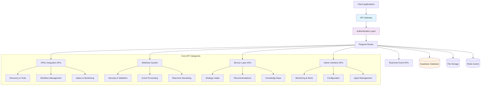
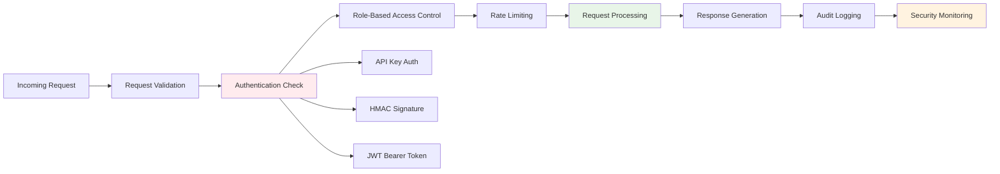
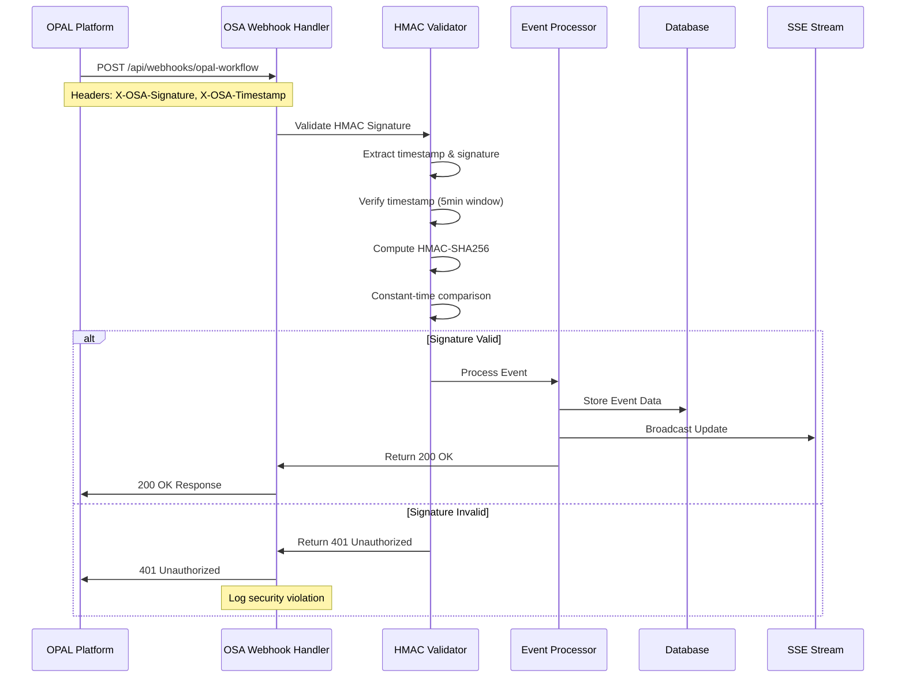

# OSA API & Webhook System - Complete Guide

**🚀 PRODUCTION SYSTEM**: https://opal-2025.vercel.app
**📅 Last Updated**: November 13, 2024
**🔧 API Version**: v2.1.0
**🎯 Purpose**: Comprehensive guide to OSA's API endpoints, webhook system, and integration patterns

---

## Table of Contents

1. [API Architecture Overview](#api-architecture-overview)
2. [OPAL Integration APIs](#opal-integration-apis)
3. [Webhook System Architecture](#webhook-system-architecture)
4. [Real-time Event APIs](#real-time-event-apis)
5. [Admin Interface APIs](#admin-interface-apis)
6. [Service Layer APIs](#service-layer-apis)
7. [Authentication & Security](#authentication--security)
8. [Rate Limiting & Performance](#rate-limiting--performance)
9. [Error Handling & Status Codes](#error-handling--status-codes)
10. [Integration Examples](#integration-examples)
11. [Testing & Development](#testing--development)
12. [Troubleshooting Guide](#troubleshooting-guide)

---

## API Architecture Overview

### 🏗️ API Design Principles

OSA follows **RESTful API design principles** with **event-driven architecture** for real-time capabilities:



### 📋 API Categories & Endpoints

#### **1. OPAL Integration APIs** (`/api/opal/*`)
- **Purpose**: Direct integration with OPAL platform
- **Authentication**: API Key + Workspace ID
- **Base URL**: `/api/opal/`
- **Total Endpoints**: 12

#### **2. Webhook System APIs** (`/api/webhooks/*`)
- **Purpose**: External system notifications and events
- **Authentication**: HMAC-SHA256 signatures
- **Base URL**: `/api/webhooks/`
- **Total Endpoints**: 8

#### **3. Real-time Event APIs** (`/api/webhook-events/*`)
- **Purpose**: Server-Sent Events for live dashboard updates
- **Authentication**: Session-based
- **Base URL**: `/api/webhook-events/`
- **Total Endpoints**: 4

#### **4. Admin Interface APIs** (`/api/admin/*`)
- **Purpose**: System administration and monitoring
- **Authentication**: Admin tokens
- **Base URL**: `/api/admin/`
- **Total Endpoints**: 15

#### **5. Service Layer APIs** (`/api/services/*`)
- **Purpose**: Microservice communication and orchestration
- **Authentication**: Internal service tokens
- **Base URL**: `/api/services/`
- **Total Endpoints**: 12

### 🔒 Security Architecture



---

## OPAL Integration APIs

### 🧠 Core OPAL Endpoints

#### **1. Enhanced Tools Discovery**
**Endpoint**: `GET /api/opal/enhanced-tools`
**Purpose**: Discover available OPAL tools and capabilities

```typescript
interface ToolDiscoveryRequest {
  workspace_id?: string;  // Optional, defaults to configured workspace
  tool_category?: 'analysis' | 'optimization' | 'reporting' | 'all';
  include_deprecated?: boolean;
}

interface ToolDiscoveryResponse {
  tools: {
    id: string;
    name: string;
    description: string;
    version: string;
    category: string;
    parameters: ToolParameter[];
    capabilities: string[];
    last_updated: string;
  }[];
  total_count: number;
  api_version: string;
  workspace_id: string;
}
```

**Example Request**:
```bash
curl -X GET "https://opal-2025.vercel.app/api/opal/enhanced-tools" \
  -H "Authorization: Bearer YOUR_API_KEY" \
  -H "Content-Type: application/json"
```

**Example Response**:
```json
{
  "tools": [
    {
      "id": "strategy_generator",
      "name": "AI Strategy Generator",
      "description": "Generates personalization strategies based on audience analysis",
      "version": "1.2.0",
      "category": "optimization",
      "parameters": [
        {
          "name": "max_ideas",
          "type": "integer",
          "required": false,
          "default": 25,
          "description": "Maximum number of strategy ideas to generate"
        }
      ],
      "capabilities": ["personalization", "audience_analysis", "roi_projection"],
      "last_updated": "2024-11-13T10:30:00Z"
    }
  ],
  "total_count": 1,
  "api_version": "2.0.0",
  "workspace_id": "ws_12345"
}
```

#### **2. Workflow Trigger**
**Endpoint**: `POST /api/opal/trigger`
**Purpose**: Initiate OPAL agent workflow execution

```typescript
interface WorkflowTriggerRequest {
  workflow_type: 'full_strategy_analysis' | 'targeted_analysis' | 'quick_assessment';
  priority: 'low' | 'medium' | 'high' | 'urgent';
  context: {
    business_objectives: string[];
    constraints: string[];
    focus_areas: string[];
    timeline?: {
      start_date: string;
      target_completion: string;
    };
  };
  agent_configuration?: {
    [agent_id: string]: {
      enabled: boolean;
      timeout_override?: number;
      tool_overrides?: Record<string, any>;
    };
  };
}

interface WorkflowTriggerResponse {
  workflow_id: string;
  status: 'initiated' | 'queued' | 'failed';
  estimated_completion_time: string;
  agents_scheduled: string[];
  webhook_url: string;
  monitoring_url: string;
}
```

**Example Request**:
```bash
curl -X POST "https://opal-2025.vercel.app/api/opal/trigger" \
  -H "Authorization: Bearer YOUR_API_KEY" \
  -H "Content-Type: application/json" \
  -d '{
    "workflow_type": "full_strategy_analysis",
    "priority": "high",
    "context": {
      "business_objectives": ["increase_conversion", "improve_engagement"],
      "constraints": ["budget_limited", "timeline_urgent"],
      "focus_areas": ["personalization", "content", "experiments"]
    }
  }'
```

#### **3. Real-time Status Monitoring**
**Endpoint**: `GET /api/opal/status/{workflow_id}`
**Purpose**: Monitor workflow execution progress in real-time

```typescript
interface WorkflowStatusResponse {
  workflow_id: string;
  status: 'running' | 'completed' | 'failed' | 'timeout';
  progress: {
    total_agents: number;
    completed_agents: number;
    failed_agents: number;
    progress_percentage: number;
    current_phase: 1 | 2 | 3;
  };
  agents: {
    [agent_id: string]: {
      status: 'idle' | 'starting' | 'running' | 'completed' | 'failed' | 'timeout';
      start_time?: string;
      end_time?: string;
      execution_time_ms?: number;
      error_message?: string;
    };
  };
  estimated_completion: string;
  last_updated: string;
}
```

**Example Request**:
```bash
curl -X GET "https://opal-2025.vercel.app/api/opal/status/wf_12345" \
  -H "Authorization: Bearer YOUR_API_KEY"
```

#### **4. Results Retrieval**
**Endpoint**: `GET /api/opal/workflow-results/{workflow_id}`
**Purpose**: Retrieve complete workflow results and insights

```typescript
interface WorkflowResultsResponse {
  workflow_id: string;
  completion_status: 'completed' | 'partial' | 'failed';
  execution_summary: {
    total_execution_time_ms: number;
    successful_agents: number;
    failed_agents: number;
    overall_confidence_score: number;
  };
  agent_results: {
    [agent_id: string]: {
      status: 'completed' | 'failed';
      execution_time_ms: number;
      results: {
        insights: Insight[];
        recommendations: Recommendation[];
        metrics: Metric[];
        confidence_score: number;
      };
    };
  };
  synthesized_recommendations: SynthesizedRecommendation[];
  performance_metrics: PerformanceMetric[];
  generated_at: string;
}
```

### 🔧 Advanced OPAL Operations

#### **5. Manual Force Sync**
**Endpoint**: `POST /api/opal/sync`
**Purpose**: Manually trigger workflow synchronization with retry logic

```typescript
interface ForceSyncRequest {
  force_restart?: boolean;        // Restart failed workflows
  agent_filter?: string[];        // Only sync specific agents
  timeout_override?: number;      // Override default timeout
  retry_failed_only?: boolean;    // Only retry failed components
}

interface ForceSyncResponse {
  sync_id: string;
  status: 'initiated' | 'in_progress' | 'completed' | 'failed';
  workflows_triggered: string[];
  agents_synced: string[];
  retry_attempts: number;
  completion_time: string;
}
```

#### **6. Agent Data Management**
**Endpoint**: `GET/POST /api/opal/agent-data/{agent_id}`
**Purpose**: Retrieve or update specific agent execution data

```typescript
interface AgentDataRequest {
  workflow_id?: string;           // Filter by workflow
  date_range?: {                  // Filter by date range
    start: string;
    end: string;
  };
  include_raw_data?: boolean;     // Include raw execution data
  format?: 'json' | 'csv' | 'excel';
}

interface AgentDataResponse {
  agent_id: string;
  executions: {
    workflow_id: string;
    execution_time: string;
    status: string;
    execution_duration_ms: number;
    results_summary: {
      insights_generated: number;
      recommendations_count: number;
      confidence_score: number;
      data_points_analyzed: number;
    };
    raw_data?: any;               // Optional raw execution data
  }[];
  performance_summary: {
    total_executions: number;
    success_rate: number;
    average_execution_time_ms: number;
    average_confidence_score: number;
  };
}
```

### 🏥 Health & Diagnostics

#### **7. System Health Check**
**Endpoint**: `GET /api/opal/health`
**Purpose**: Comprehensive system health monitoring

```typescript
interface HealthCheckResponse {
  status: 'healthy' | 'degraded' | 'unhealthy';
  timestamp: string;
  components: {
    opal_connectivity: {
      status: 'up' | 'down' | 'degraded';
      response_time_ms: number;
      last_success: string;
    };
    database: {
      status: 'up' | 'down' | 'degraded';
      connection_pool: {
        active_connections: number;
        idle_connections: number;
        max_connections: number;
      };
    };
    webhooks: {
      status: 'up' | 'down' | 'degraded';
      events_processed_24h: number;
      error_rate: number;
    };
    agents: {
      [agent_id: string]: {
        status: 'available' | 'busy' | 'error';
        last_execution: string;
        success_rate_24h: number;
      };
    };
  };
  performance_metrics: {
    average_workflow_duration_ms: number;
    workflows_completed_24h: number;
    success_rate_24h: number;
  };
}
```

---

## Webhook System Architecture

### 🔔 Webhook Security & Validation

OSA implements **production-grade webhook security** with HMAC-SHA256 signature validation:

#### **Security Flow**


#### **HMAC Signature Format**
```typescript
// Header Format
X-OSA-Signature: t=1699876543,v1=a8b7c6d5e4f3g2h1i0j9k8l7m6n5o4p3q2r1s0t9u8v7w6x5y4z3

// Signature Components
interface WebhookSignature {
  timestamp: number;    // Unix timestamp
  signature: string;    // HMAC-SHA256 hex digest
}

// Validation Process
const payload = request.body;
const signature = request.headers['x-osa-signature'];
const [timestamp, signatureHash] = parseSignature(signature);

// Verify timestamp (prevent replay attacks)
if (Math.abs(Date.now() / 1000 - timestamp) > 300) {
  throw new Error('Timestamp too old');
}

// Compute expected signature
const expectedSignature = crypto
  .createHmac('sha256', WEBHOOK_SECRET)
  .update(`${timestamp}.${payload}`)
  .digest('hex');

// Constant-time comparison
if (!crypto.timingSafeEqual(
  Buffer.from(signatureHash, 'hex'),
  Buffer.from(expectedSignature, 'hex')
)) {
  throw new Error('Invalid signature');
}
```

### 📊 Webhook Event Processing

#### **Primary Webhook Endpoint**
**Endpoint**: `POST /api/webhooks/opal-workflow`
**Purpose**: Production OPAL workflow event handler

```typescript
interface OPALWebhookEvent {
  event_type: 'agent_status_update' | 'workflow_progress' | 'workflow_completion' | 'error_notification';
  timestamp: string;
  workflow_id: string;
  agent_id?: string;
  data: {
    // Agent Status Update
    agent_status?: {
      previous_status: AgentStatus;
      current_status: AgentStatus;
      execution_time_ms?: number;
      error_details?: ErrorDetails;
    };

    // Workflow Progress
    workflow_progress?: {
      completed_agents: number;
      total_agents: number;
      current_phase: number;
      estimated_completion: string;
    };

    // Workflow Completion
    workflow_completion?: {
      status: 'completed' | 'failed' | 'timeout';
      total_execution_time_ms: number;
      successful_agents: number;
      failed_agents: number;
      results_available: boolean;
    };

    // Error Notification
    error_notification?: {
      error_type: string;
      error_message: string;
      affected_agents: string[];
      severity: 'low' | 'medium' | 'high' | 'critical';
      recovery_action?: string;
    };
  };
}

interface WebhookProcessingResponse {
  status: 'processed' | 'duplicate' | 'error';
  webhook_id: string;
  processing_time_ms: number;
  events_triggered: string[];
  error_message?: string;
}
```

#### **Idempotency & Deduplication**
```typescript
interface DeduplicationSystem {
  // Generate unique hash for event deduplication
  generateEventHash(event: OPALWebhookEvent): string {
    return crypto
      .createHash('sha256')
      .update(JSON.stringify({
        workflow_id: event.workflow_id,
        agent_id: event.agent_id,
        timestamp: event.timestamp,
        event_type: event.event_type
      }))
      .digest('hex');
  }

  // Check for duplicate processing
  async isDuplicate(eventHash: string): Promise<boolean> {
    const existing = await database.query(
      'SELECT id FROM webhook_events WHERE dedup_hash = ?',
      [eventHash]
    );
    return existing.length > 0;
  }

  // Store processed event
  async storeEvent(event: OPALWebhookEvent, processingResult: any): Promise<void> {
    const eventHash = this.generateEventHash(event);
    await database.query(
      `INSERT INTO webhook_events
       (workflow_id, agent_id, event_type, payload_json, dedup_hash,
        http_status, processing_time_ms, created_at)
       VALUES (?, ?, ?, ?, ?, ?, ?, NOW())`,
      [
        event.workflow_id,
        event.agent_id,
        event.event_type,
        JSON.stringify(event),
        eventHash,
        200,
        processingResult.processing_time_ms
      ]
    );
  }
}
```

### 🔗 External Integration Webhooks

#### **Google Analytics 4 Integration**
**Endpoint**: `POST /api/webhooks/ga4`
**Purpose**: Receive GA4 analytics events and insights

```typescript
interface GA4WebhookEvent {
  event_type: 'conversion_update' | 'audience_insight' | 'performance_alert';
  property_id: string;
  timestamp: string;
  data: {
    conversions?: {
      conversion_name: string;
      conversion_count: number;
      conversion_value: number;
      time_period: string;
    }[];
    audiences?: {
      audience_id: string;
      audience_name: string;
      audience_size: number;
      growth_rate: number;
    }[];
    performance_alerts?: {
      alert_type: string;
      metric_name: string;
      threshold_value: number;
      current_value: number;
      severity: string;
    }[];
  };
}
```

#### **Salesforce CRM Integration**
**Endpoint**: `POST /api/webhooks/salesforce`
**Purpose**: Receive Salesforce CRM events and lead data

```typescript
interface SalesforceWebhookEvent {
  event_type: 'lead_created' | 'opportunity_updated' | 'account_modified';
  organization_id: string;
  timestamp: string;
  data: {
    lead?: {
      lead_id: string;
      lead_source: string;
      lead_score: number;
      conversion_probability: number;
    };
    opportunity?: {
      opportunity_id: string;
      stage: string;
      amount: number;
      close_date: string;
    };
    account?: {
      account_id: string;
      account_type: string;
      annual_revenue: number;
      industry: string;
    };
  };
}
```

### 📈 Webhook Performance Monitoring

#### **Performance Metrics Endpoint**
**Endpoint**: `GET /api/webhook-events/stats`
**Purpose**: Webhook system performance statistics

```typescript
interface WebhookPerformanceStats {
  time_period: {
    start: string;
    end: string;
    duration_hours: number;
  };
  processing_stats: {
    total_events_received: number;
    successful_processing: number;
    failed_processing: number;
    duplicate_events: number;
    success_rate: number;
  };
  performance_metrics: {
    average_processing_time_ms: number;
    median_processing_time_ms: number;
    p95_processing_time_ms: number;
    p99_processing_time_ms: number;
  };
  error_analysis: {
    authentication_failures: number;
    validation_errors: number;
    processing_errors: number;
    timeout_errors: number;
    top_error_types: {
      error_type: string;
      count: number;
      percentage: number;
    }[];
  };
  event_breakdown: {
    [event_type: string]: {
      count: number;
      success_rate: number;
      average_processing_time_ms: number;
    };
  };
}
```

---

## Real-time Event APIs

### 📡 Server-Sent Events (SSE)

#### **Live Event Stream**
**Endpoint**: `GET /api/webhook-events/stream`
**Purpose**: Real-time dashboard updates via Server-Sent Events

```typescript
interface SSEConnection {
  // Connection Parameters
  endpoint: '/api/webhook-events/stream';
  authentication: 'session-based';
  reconnection: 'automatic';
  timeout: 30000; // 30 seconds

  // Event Types
  eventTypes: [
    'agent_status_change',
    'workflow_progress_update',
    'performance_metric_update',
    'error_notification',
    'system_health_alert'
  ];
}

// Client-side connection
const eventSource = new EventSource('/api/webhook-events/stream');

eventSource.onmessage = (event) => {
  const data = JSON.parse(event.data);
  updateDashboard(data);
};

eventSource.addEventListener('agent_status_change', (event) => {
  const agentUpdate = JSON.parse(event.data);
  updateAgentStatus(agentUpdate.agent_id, agentUpdate.status);
});

// Auto-reconnection on failure
eventSource.onerror = (error) => {
  console.log('SSE connection error, will auto-reconnect');
  // EventSource automatically reconnects
};
```

#### **SSE Event Format**
```typescript
interface SSEEvent {
  id: string;                    // Unique event ID for deduplication
  event: string;                 // Event type for filtering
  data: string;                  // JSON payload
  retry?: number;                // Reconnection delay (ms)
}

// Example SSE Event
/*
id: evt_12345
event: agent_status_change
data: {
  "workflow_id": "wf_67890",
  "agent_id": "personalization_generator",
  "previous_status": "running",
  "current_status": "completed",
  "execution_time_ms": 45230,
  "results_available": true,
  "confidence_score": 0.87,
  "timestamp": "2024-11-13T14:32:15Z"
}
retry: 3000
*/
```

#### **Event Filtering & Subscription**
**Endpoint**: `GET /api/webhook-events/stream?filter={filter_params}`

```typescript
interface EventFilterParams {
  workflow_id?: string;          // Filter by specific workflow
  agent_ids?: string[];          // Filter by specific agents
  event_types?: string[];        // Filter by event types
  min_priority?: 'low' | 'medium' | 'high' | 'critical';
  include_historical?: boolean;  // Include recent events on connection
}

// Example filtered connection
const filteredEventSource = new EventSource(
  '/api/webhook-events/stream?filter=' + encodeURIComponent(JSON.stringify({
    workflow_id: 'wf_12345',
    event_types: ['agent_status_change', 'workflow_progress_update'],
    min_priority: 'medium'
  }))
);
```

### 📊 Dashboard Integration

#### **Real-time Dashboard Updates**
```typescript
interface DashboardUpdate {
  updateType: 'agent_status' | 'workflow_progress' | 'performance_metric' | 'alert';
  timestamp: string;
  data: {
    // Agent Status Updates
    agent_status?: {
      agent_id: string;
      status: AgentStatus;
      progress_percentage?: number;
      execution_time_ms?: number;
    };

    // Workflow Progress Updates
    workflow_progress?: {
      workflow_id: string;
      completed_agents: number;
      total_agents: number;
      current_phase: number;
      estimated_completion: string;
    };

    // Performance Metric Updates
    performance_metric?: {
      metric_name: string;
      current_value: number;
      previous_value: number;
      trend: 'up' | 'down' | 'stable';
      threshold_status: 'normal' | 'warning' | 'critical';
    };

    // Alert Updates
    alert?: {
      alert_type: string;
      severity: 'low' | 'medium' | 'high' | 'critical';
      message: string;
      action_required: boolean;
      resolution_steps?: string[];
    };
  };
}

// Dashboard update processing
function processDashboardUpdate(update: DashboardUpdate) {
  switch (update.updateType) {
    case 'agent_status':
      updateAgentStatusWidget(update.data.agent_status);
      break;
    case 'workflow_progress':
      updateWorkflowProgressBar(update.data.workflow_progress);
      break;
    case 'performance_metric':
      updatePerformanceChart(update.data.performance_metric);
      break;
    case 'alert':
      displayAlert(update.data.alert);
      break;
  }
}
```

---

## Admin Interface APIs

### 🛠️ System Administration

#### **System Diagnostics**
**Endpoint**: `GET /api/admin/diagnostics`
**Purpose**: Comprehensive system diagnostic information

```typescript
interface SystemDiagnostics {
  system_health: {
    overall_status: 'healthy' | 'warning' | 'critical';
    uptime_seconds: number;
    last_restart: string;
    memory_usage: {
      used_mb: number;
      total_mb: number;
      usage_percentage: number;
    };
    cpu_usage: {
      current_percentage: number;
      average_1m: number;
      average_5m: number;
    };
  };
  database_health: {
    connection_status: 'connected' | 'disconnected' | 'degraded';
    active_connections: number;
    query_performance: {
      average_query_time_ms: number;
      slow_queries_count: number;
    };
    storage_usage: {
      used_gb: number;
      total_gb: number;
      usage_percentage: number;
    };
  };
  api_health: {
    response_times: {
      average_ms: number;
      p95_ms: number;
      p99_ms: number;
    };
    error_rates: {
      last_hour: number;
      last_24h: number;
    };
    request_volume: {
      requests_per_minute: number;
      peak_requests_per_minute: number;
    };
  };
  opal_integration: {
    connectivity_status: 'connected' | 'disconnected' | 'degraded';
    agent_availability: {
      [agent_id: string]: 'available' | 'busy' | 'error';
    };
    workflow_queue: {
      pending_workflows: number;
      active_workflows: number;
      average_wait_time_ms: number;
    };
  };
}
```

#### **Configuration Management**
**Endpoint**: `GET/PUT /api/admin/configuration`
**Purpose**: System configuration management and updates

```typescript
interface SystemConfiguration {
  opal_settings: {
    api_base_url: string;
    workspace_id: string;
    agent_timeout_seconds: number;
    max_retry_attempts: number;
    parallel_execution_limit: number;
  };
  webhook_settings: {
    webhook_url: string;
    signature_validation_enabled: boolean;
    timestamp_tolerance_seconds: number;
    event_retention_days: number;
  };
  performance_settings: {
    api_rate_limit_rpm: number;
    database_connection_pool_size: number;
    cache_ttl_seconds: number;
    log_retention_days: number;
  };
  security_settings: {
    authentication_required: boolean;
    session_timeout_minutes: number;
    password_policy: {
      min_length: number;
      require_uppercase: boolean;
      require_numbers: boolean;
      require_symbols: boolean;
    };
  };
  notification_settings: {
    email_notifications_enabled: boolean;
    alert_thresholds: {
      error_rate_percentage: number;
      response_time_ms: number;
      failure_count: number;
    };
  };
}
```

### 📊 Monitoring & Analytics

#### **Performance Metrics**
**Endpoint**: `GET /api/admin/metrics`
**Purpose**: Detailed system performance metrics

```typescript
interface PerformanceMetrics {
  time_range: {
    start: string;
    end: string;
    granularity: 'minute' | 'hour' | 'day';
  };
  api_metrics: {
    endpoint_performance: {
      [endpoint: string]: {
        request_count: number;
        average_response_time_ms: number;
        error_rate: number;
        p95_response_time_ms: number;
      };
    };
    overall_performance: {
      total_requests: number;
      successful_requests: number;
      failed_requests: number;
      average_response_time_ms: number;
    };
  };
  workflow_metrics: {
    total_workflows: number;
    successful_workflows: number;
    failed_workflows: number;
    average_execution_time_ms: number;
    agent_performance: {
      [agent_id: string]: {
        executions: number;
        success_rate: number;
        average_execution_time_ms: number;
        error_count: number;
      };
    };
  };
  resource_utilization: {
    cpu_usage_history: TimeSeriesData[];
    memory_usage_history: TimeSeriesData[];
    disk_usage_history: TimeSeriesData[];
    network_io_history: TimeSeriesData[];
  };
}
```

#### **Alert Management**
**Endpoint**: `GET/POST /api/admin/alerts`
**Purpose**: System alert configuration and management

```typescript
interface AlertRule {
  id: string;
  name: string;
  description: string;
  enabled: boolean;
  conditions: {
    metric_name: string;
    operator: '>' | '<' | '==' | '!=' | '>=' | '<=';
    threshold_value: number;
    evaluation_period_minutes: number;
    consecutive_breaches: number;
  }[];
  actions: {
    type: 'email' | 'webhook' | 'sms' | 'slack';
    configuration: Record<string, any>;
    severity: 'low' | 'medium' | 'high' | 'critical';
  }[];
  created_at: string;
  last_triggered: string;
  trigger_count: number;
}

interface AlertHistory {
  alert_id: string;
  triggered_at: string;
  resolved_at?: string;
  severity: 'low' | 'medium' | 'high' | 'critical';
  message: string;
  affected_components: string[];
  resolution_notes?: string;
  acknowledged_by?: string;
  acknowledgment_time?: string;
}
```

---

## Service Layer APIs

### 🧩 Microservice Communication

#### **Strategy Intake Service**
**Endpoint**: `POST /api/services/intake`
**Purpose**: Business context collection and validation

```typescript
interface StrategyIntakeRequest {
  business_context: {
    company_name: string;
    industry: string;
    business_model: 'b2b' | 'b2c' | 'b2b2c' | 'marketplace';
    target_market: string[];
    current_challenges: string[];
  };
  objectives: {
    primary_goals: string[];
    success_metrics: string[];
    timeline: {
      short_term: string;  // 0-3 months
      medium_term: string; // 3-12 months
      long_term: string;   // 1+ years
    };
    budget_range: 'low' | 'medium' | 'high' | 'enterprise';
  };
  current_state: {
    digital_maturity: 'basic' | 'intermediate' | 'advanced' | 'expert';
    existing_tools: string[];
    team_size: number;
    technical_constraints: string[];
  };
  preferences: {
    risk_tolerance: 'low' | 'medium' | 'high';
    innovation_appetite: 'conservative' | 'moderate' | 'aggressive';
    implementation_speed: 'gradual' | 'moderate' | 'rapid';
  };
}

interface StrategyIntakeResponse {
  intake_id: string;
  validation_status: 'valid' | 'incomplete' | 'invalid';
  validation_errors: string[];
  enriched_context: {
    industry_benchmarks: IndustryBenchmark[];
    recommended_focus_areas: string[];
    estimated_complexity: 'low' | 'medium' | 'high';
    suggested_timeline: string;
  };
  workflow_recommendation: {
    recommended_agents: string[];
    priority_sequence: string[];
    estimated_duration_minutes: number;
  };
}
```

#### **Recommendation Service**
**Endpoint**: `GET /api/services/recommendations/{workflow_id}`
**Purpose**: AI-powered recommendation generation and synthesis

```typescript
interface RecommendationRequest {
  workflow_id: string;
  synthesis_mode: 'comprehensive' | 'prioritized' | 'quick_wins';
  focus_areas?: string[];
  confidence_threshold?: number; // 0-1, default 0.7
  max_recommendations?: number;  // Default 25
}

interface RecommendationResponse {
  workflow_id: string;
  synthesis_metadata: {
    generated_at: string;
    synthesis_mode: string;
    confidence_threshold: number;
    agents_included: string[];
    data_freshness: string;
  };
  recommendations: {
    id: string;
    category: 'content' | 'audience' | 'personalization' | 'experiment' | 'optimization' | 'strategy';
    priority: 'high' | 'medium' | 'low';
    title: string;
    description: string;
    rationale: string;
    supporting_agents: string[];
    confidence_score: number;
    impact_estimation: {
      roi_projection: {
        min_percentage: number;
        max_percentage: number;
        confidence: number;
      };
      implementation_effort: 'low' | 'medium' | 'high';
      timeline_estimate: string;
      risk_assessment: 'low' | 'medium' | 'high';
    };
    implementation_guidance: {
      steps: string[];
      prerequisites: string[];
      success_metrics: string[];
      potential_obstacles: string[];
    };
    supporting_evidence: {
      data_points: DataPoint[];
      benchmark_comparisons: BenchmarkComparison[];
      historical_performance: HistoricalData[];
    };
  }[];
  performance_summary: {
    total_recommendations: number;
    high_priority_count: number;
    average_confidence_score: number;
    estimated_total_roi: {
      min_percentage: number;
      max_percentage: number;
    };
  };
}
```

#### **Knowledge & Retrieval Service**
**Endpoint**: `GET/POST /api/services/knowledge`
**Purpose**: Semantic search and knowledge base management

```typescript
interface KnowledgeQuery {
  query_text: string;
  query_type: 'semantic_search' | 'keyword_search' | 'hybrid';
  knowledge_domains: string[];  // ['strategy', 'optimization', 'analytics', etc.]
  max_results: number;          // Default 10
  confidence_threshold: number; // 0-1, default 0.5
  include_metadata: boolean;    // Include source metadata
}

interface KnowledgeResponse {
  query_id: string;
  results: {
    id: string;
    content: string;
    relevance_score: number;
    knowledge_domain: string;
    source_type: 'workflow_result' | 'external_data' | 'user_input' | 'benchmark_data';
    metadata: {
      created_at: string;
      workflow_id?: string;
      agent_id?: string;
      data_sources: string[];
      last_updated: string;
    };
    related_concepts: string[];
    confidence_indicators: {
      data_quality_score: number;
      source_credibility: number;
      recency_factor: number;
    };
  }[];
  query_metadata: {
    execution_time_ms: number;
    total_documents_searched: number;
    search_strategy_used: string;
    query_expansion_applied: boolean;
  };
}

interface KnowledgeIngestion {
  content: string;
  content_type: 'text' | 'json' | 'csv' | 'pdf';
  knowledge_domain: string;
  source_metadata: {
    source_type: string;
    source_url?: string;
    author?: string;
    created_at: string;
    reliability_score: number;
  };
  processing_options: {
    extract_entities: boolean;
    generate_embeddings: boolean;
    auto_categorize: boolean;
    link_related_content: boolean;
  };
}
```

### 🔄 Service Orchestration

#### **Service Health Monitoring**
**Endpoint**: `GET /api/services/health`
**Purpose**: Monitor health of all microservices

```typescript
interface ServiceHealthResponse {
  overall_status: 'healthy' | 'degraded' | 'unhealthy';
  timestamp: string;
  services: {
    [service_name: string]: {
      status: 'up' | 'down' | 'degraded';
      response_time_ms: number;
      last_check: string;
      health_score: number; // 0-100
      dependencies: {
        [dependency_name: string]: {
          status: 'up' | 'down' | 'degraded';
          response_time_ms: number;
        };
      };
      metrics: {
        request_count_1h: number;
        error_rate_1h: number;
        average_response_time_1h: number;
        cpu_usage: number;
        memory_usage: number;
      };
    };
  };
  dependency_graph: {
    nodes: ServiceNode[];
    edges: ServiceDependency[];
  };
}
```

---

## Authentication & Security

### 🔐 Authentication Methods

#### **1. API Key Authentication**
**Usage**: OPAL platform integration, external service access
**Header**: `Authorization: Bearer API_KEY`

```typescript
interface APIKeyAuth {
  // API Key Format
  key_format: 'opal_prod_' + base64(32_random_bytes);

  // Validation Process
  validate(key: string): Promise<AuthResult> {
    // 1. Format validation
    if (!key.startsWith('opal_prod_')) throw new Error('Invalid key format');

    // 2. Database lookup
    const keyRecord = await db.findAPIKey(key);
    if (!keyRecord) throw new Error('Invalid API key');

    // 3. Expiration check
    if (keyRecord.expires_at < new Date()) throw new Error('Expired API key');

    // 4. Rate limit check
    const usage = await rateLimit.check(key);
    if (usage.exceeded) throw new Error('Rate limit exceeded');

    return {
      valid: true,
      workspace_id: keyRecord.workspace_id,
      permissions: keyRecord.permissions,
      rate_limit: usage
    };
  }
}
```

#### **2. HMAC Signature Authentication**
**Usage**: Webhook endpoints
**Headers**: `X-OSA-Signature`, `X-OSA-Timestamp`

```typescript
interface HMACAuth {
  // Signature generation (sender side)
  generateSignature(payload: string, secret: string): string {
    const timestamp = Math.floor(Date.now() / 1000);
    const signedPayload = `${timestamp}.${payload}`;
    const signature = crypto
      .createHmac('sha256', secret)
      .update(signedPayload)
      .digest('hex');
    return `t=${timestamp},v1=${signature}`;
  }

  // Signature validation (receiver side)
  validateSignature(
    payload: string,
    signatureHeader: string,
    secret: string
  ): boolean {
    const [timestampPart, signaturePart] = signatureHeader.split(',');
    const timestamp = parseInt(timestampPart.split('=')[1]);
    const signature = signaturePart.split('=')[1];

    // Verify timestamp (5-minute tolerance)
    const now = Math.floor(Date.now() / 1000);
    if (Math.abs(now - timestamp) > 300) return false;

    // Compute expected signature
    const expectedSignature = crypto
      .createHmac('sha256', secret)
      .update(`${timestamp}.${payload}`)
      .digest('hex');

    // Constant-time comparison
    return crypto.timingSafeEqual(
      Buffer.from(signature, 'hex'),
      Buffer.from(expectedSignature, 'hex')
    );
  }
}
```

#### **3. JWT Bearer Token Authentication**
**Usage**: Admin interface, user sessions
**Header**: `Authorization: Bearer JWT_TOKEN`

```typescript
interface JWTAuth {
  // Token structure
  token_structure: {
    header: {
      alg: 'RS256';
      typ: 'JWT';
    };
    payload: {
      sub: string;        // User ID
      iss: string;        // Issuer (OSA system)
      aud: string;        // Audience (admin interface)
      exp: number;        // Expiration timestamp
      iat: number;        // Issued at timestamp
      jti: string;        // Token ID for revocation
      scope: string[];    // Permissions/scopes
      workspace_id: string;
    };
  };

  // Token validation
  async validateToken(token: string): Promise<TokenPayload> {
    // 1. Decode and verify signature
    const decoded = jwt.verify(token, PUBLIC_KEY, {
      algorithms: ['RS256'],
      issuer: 'osa-system',
      audience: 'admin-interface'
    });

    // 2. Check revocation list
    const isRevoked = await redis.get(`revoked_token:${decoded.jti}`);
    if (isRevoked) throw new Error('Token revoked');

    // 3. Validate workspace access
    const hasAccess = await checkWorkspaceAccess(decoded.sub, decoded.workspace_id);
    if (!hasAccess) throw new Error('Workspace access denied');

    return decoded as TokenPayload;
  }
}
```

### 🛡️ Security Middleware

#### **Request Validation Pipeline**
```typescript
interface SecurityPipeline {
  // 1. Rate Limiting
  rateLimiter: {
    window_size: '1m' | '1h' | '1d';
    max_requests: number;
    key_generator: (req: Request) => string; // IP, API key, or user ID
  };

  // 2. Input Validation
  inputValidator: {
    sanitize_input: boolean;
    max_payload_size: number;    // 10MB default
    allowed_content_types: string[];
    validate_schema: boolean;
  };

  // 3. CORS Configuration
  cors: {
    allowed_origins: string[];
    allowed_methods: string[];
    allowed_headers: string[];
    credentials: boolean;
    max_age: number;
  };

  // 4. Security Headers
  securityHeaders: {
    'X-Content-Type-Options': 'nosniff';
    'X-Frame-Options': 'DENY';
    'X-XSS-Protection': '1; mode=block';
    'Strict-Transport-Security': 'max-age=31536000; includeSubDomains';
    'Content-Security-Policy': string;
    'Referrer-Policy': 'strict-origin-when-cross-origin';
  };
}
```

---

## Rate Limiting & Performance

### ⚡ Rate Limiting Strategy

#### **Multi-Tier Rate Limiting**
```typescript
interface RateLimitConfig {
  tiers: {
    // Public API endpoints
    public: {
      requests_per_minute: 60;
      burst_allowance: 10;
      key_strategy: 'ip_address';
    };

    // Authenticated API access
    authenticated: {
      requests_per_minute: 300;
      burst_allowance: 50;
      key_strategy: 'api_key';
    };

    // Admin interface
    admin: {
      requests_per_minute: 600;
      burst_allowance: 100;
      key_strategy: 'user_session';
    };

    // Internal service communication
    internal: {
      requests_per_minute: 1000;
      burst_allowance: 200;
      key_strategy: 'service_token';
    };
  };

  // Rate limit algorithms
  algorithms: {
    sliding_window: boolean;      // More accurate but higher memory
    token_bucket: boolean;        // Allows bursts within limits
    fixed_window: boolean;        // Simple but less accurate
  };

  // Response headers
  response_headers: {
    'X-RateLimit-Limit': number;
    'X-RateLimit-Remaining': number;
    'X-RateLimit-Reset': number;
    'X-RateLimit-Policy': string;
  };
}
```

#### **Rate Limit Implementation**
```typescript
class RateLimiter {
  async checkLimit(
    key: string,
    tier: 'public' | 'authenticated' | 'admin' | 'internal'
  ): Promise<RateLimitResult> {
    const config = RATE_LIMIT_CONFIG.tiers[tier];
    const windowKey = `ratelimit:${tier}:${key}:${Math.floor(Date.now() / 60000)}`;

    // Get current usage
    const currentCount = await redis.get(windowKey) || 0;

    if (currentCount >= config.requests_per_minute) {
      return {
        allowed: false,
        limit: config.requests_per_minute,
        remaining: 0,
        resetTime: Math.ceil(Date.now() / 60000) * 60000,
        retryAfter: 60 - (Math.floor(Date.now() / 1000) % 60)
      };
    }

    // Increment counter
    await redis.multi()
      .incr(windowKey)
      .expire(windowKey, 120) // 2-minute expiry for safety
      .exec();

    return {
      allowed: true,
      limit: config.requests_per_minute,
      remaining: config.requests_per_minute - currentCount - 1,
      resetTime: Math.ceil(Date.now() / 60000) * 60000,
      retryAfter: null
    };
  }
}
```

### 📈 Performance Optimization

#### **Caching Strategy**
```typescript
interface CachingConfig {
  layers: {
    // L1: In-memory cache (Redis)
    memory_cache: {
      ttl_seconds: 300;           // 5 minutes
      max_memory_mb: 512;
      eviction_policy: 'lru';
      key_patterns: [
        'api:opal:discovery:*',
        'api:health:*',
        'config:*'
      ];
    };

    // L2: Database query cache
    query_cache: {
      ttl_seconds: 1800;          // 30 minutes
      max_size_mb: 256;
      cache_queries: [
        'SELECT * FROM agent_configurations',
        'SELECT * FROM performance_metrics WHERE timestamp > ?',
        'SELECT * FROM workflow_results WHERE workflow_id = ?'
      ];
    };

    // L3: CDN/Edge cache
    edge_cache: {
      ttl_seconds: 3600;          // 1 hour
      cache_static_assets: boolean;
      cache_api_responses: [
        'GET /api/opal/discovery',
        'GET /api/admin/configuration',
        'GET /api/services/health'
      ];
    };
  };

  // Cache invalidation
  invalidation: {
    strategies: ['ttl_expiry', 'manual_purge', 'event_triggered'];
    invalidation_patterns: {
      'config_update': ['config:*', 'api:*:discovery:*'];
      'workflow_completion': ['api:results:*', 'api:metrics:*'];
      'agent_status_change': ['api:opal:status:*', 'api:health:*'];
    };
  };
}
```

#### **Database Performance**
```typescript
interface DatabaseOptimization {
  // Connection pooling
  connection_pool: {
    min_connections: 5;
    max_connections: 20;
    idle_timeout_ms: 30000;
    connection_timeout_ms: 5000;
  };

  // Query optimization
  query_optimization: {
    prepared_statements: boolean;
    query_timeout_ms: 10000;
    slow_query_threshold_ms: 1000;
    explain_analyze: boolean;     // Log execution plans for slow queries
  };

  // Indexing strategy
  indexes: [
    'CREATE INDEX idx_workflow_id ON opal_agent_results(workflow_id)',
    'CREATE INDEX idx_agent_timestamp ON opal_agent_results(agent_id, created_at)',
    'CREATE INDEX idx_webhook_dedup ON webhook_events(dedup_hash)',
    'CREATE INDEX idx_performance_metrics ON opal_performance_metrics(metric_name, timestamp)'
  ];

  // Monitoring queries
  monitoring_queries: {
    slow_queries: 'SELECT * FROM pg_stat_statements WHERE mean_time > 1000';
    connection_stats: 'SELECT * FROM pg_stat_activity';
    index_usage: 'SELECT * FROM pg_stat_user_indexes WHERE idx_scan = 0';
  };
}
```

---

## Error Handling & Status Codes

### 📊 HTTP Status Code Standards

#### **Success Codes (2xx)**
```typescript
interface SuccessResponses {
  200: {
    description: 'OK - Request successful';
    usage: 'GET requests, successful operations';
    example: 'GET /api/opal/status/{workflow_id}';
  };
  201: {
    description: 'Created - Resource created successfully';
    usage: 'POST requests that create new resources';
    example: 'POST /api/opal/trigger';
  };
  202: {
    description: 'Accepted - Request accepted for processing';
    usage: 'Async operations, webhook processing';
    example: 'POST /api/webhooks/opal-workflow';
  };
  204: {
    description: 'No Content - Successful with no response body';
    usage: 'DELETE operations, configuration updates';
    example: 'DELETE /api/admin/alerts/{alert_id}';
  };
}
```

#### **Client Error Codes (4xx)**
```typescript
interface ClientErrorResponses {
  400: {
    description: 'Bad Request - Invalid request format or parameters';
    error_format: {
      error: 'validation_failed';
      message: 'Request validation failed';
      details: ValidationError[];
      request_id: string;
      timestamp: string;
    };
    common_causes: [
      'Invalid JSON payload',
      'Missing required parameters',
      'Invalid parameter values',
      'Malformed request structure'
    ];
  };
  401: {
    description: 'Unauthorized - Authentication failed';
    error_format: {
      error: 'authentication_failed';
      message: 'Invalid or missing authentication credentials';
      auth_methods: string[];
      request_id: string;
      timestamp: string;
    };
    common_causes: [
      'Missing API key',
      'Invalid HMAC signature',
      'Expired JWT token',
      'Insufficient permissions'
    ];
  };
  403: {
    description: 'Forbidden - Access denied';
    error_format: {
      error: 'access_denied';
      message: 'Insufficient permissions for this operation';
      required_permissions: string[];
      current_permissions: string[];
      request_id: string;
      timestamp: string;
    };
  };
  404: {
    description: 'Not Found - Resource does not exist';
    error_format: {
      error: 'resource_not_found';
      message: 'The requested resource was not found';
      resource_type: string;
      resource_id: string;
      request_id: string;
      timestamp: string;
    };
  };
  429: {
    description: 'Too Many Requests - Rate limit exceeded';
    error_format: {
      error: 'rate_limit_exceeded';
      message: 'Request rate limit exceeded';
      rate_limit: {
        limit: number;
        remaining: number;
        reset_time: string;
        retry_after: number;
      };
      request_id: string;
      timestamp: string;
    };
  };
}
```

#### **Server Error Codes (5xx)**
```typescript
interface ServerErrorResponses {
  500: {
    description: 'Internal Server Error - Unexpected server error';
    error_format: {
      error: 'internal_server_error';
      message: 'An unexpected error occurred';
      error_id: string;        // For error tracking
      support_contact: string;
      request_id: string;
      timestamp: string;
    };
    handling: [
      'Log detailed error information',
      'Generate unique error ID',
      'Trigger alerting system',
      'Return generic error message to client'
    ];
  };
  502: {
    description: 'Bad Gateway - Upstream service error';
    error_format: {
      error: 'upstream_service_error';
      message: 'External service unavailable';
      service_name: string;
      retry_suggestions: string[];
      request_id: string;
      timestamp: string;
    };
    common_services: ['OPAL Platform', 'Supabase Database', 'External APIs'];
  };
  503: {
    description: 'Service Unavailable - System maintenance or overload';
    error_format: {
      error: 'service_unavailable';
      message: 'Service temporarily unavailable';
      maintenance: {
        scheduled: boolean;
        estimated_duration: string;
        alternative_endpoints?: string[];
      };
      request_id: string;
      timestamp: string;
    };
  };
  504: {
    description: 'Gateway Timeout - Operation timeout';
    error_format: {
      error: 'operation_timeout';
      message: 'Operation timed out';
      timeout_details: {
        operation_type: string;
        timeout_duration_ms: number;
        retry_recommendations: string[];
      };
      request_id: string;
      timestamp: string;
    };
  };
}
```

### 🔧 Error Recovery Mechanisms

#### **Automatic Retry Logic**
```typescript
interface RetryConfiguration {
  retry_policies: {
    // OPAL API calls
    opal_integration: {
      max_attempts: 3;
      base_delay_ms: 1000;
      max_delay_ms: 10000;
      backoff_multiplier: 2;
      jitter: true;
      retryable_errors: [502, 503, 504, 'ECONNRESET', 'ENOTFOUND'];
    };

    // Database operations
    database_operations: {
      max_attempts: 2;
      base_delay_ms: 500;
      max_delay_ms: 2000;
      backoff_multiplier: 2;
      retryable_errors: ['connection_timeout', 'deadlock_detected'];
    };

    // Webhook processing
    webhook_processing: {
      max_attempts: 3;
      base_delay_ms: 2000;
      max_delay_ms: 30000;
      backoff_multiplier: 3;
      retryable_errors: [500, 502, 503, 504];
    };
  };

  // Retry implementation
  async executeWithRetry<T>(
    operation: () => Promise<T>,
    policy: RetryPolicy
  ): Promise<T> {
    let lastError: Error;

    for (let attempt = 1; attempt <= policy.max_attempts; attempt++) {
      try {
        return await operation();
      } catch (error) {
        lastError = error;

        // Check if error is retryable
        if (!this.isRetryable(error, policy)) {
          throw error;
        }

        // Don't delay after the last attempt
        if (attempt < policy.max_attempts) {
          const delay = this.calculateDelay(attempt, policy);
          await this.sleep(delay);
        }
      }
    }

    throw new Error(`Operation failed after ${policy.max_attempts} attempts: ${lastError.message}`);
  }
}
```

#### **Circuit Breaker Pattern**
```typescript
interface CircuitBreakerConfig {
  failure_threshold: number;        // Number of failures to open circuit
  success_threshold: number;        // Number of successes to close circuit
  timeout_ms: number;              // Time to wait in open state
  monitor_window_ms: number;       // Rolling window for failure counting

  states: {
    CLOSED: {
      description: 'Normal operation - requests pass through';
      behavior: 'Execute all requests normally';
    };
    OPEN: {
      description: 'Circuit breaker activated - requests fail fast';
      behavior: 'Return error immediately without execution';
    };
    HALF_OPEN: {
      description: 'Testing recovery - limited requests allowed';
      behavior: 'Allow test requests to check service recovery';
    };
  };
}

class CircuitBreaker {
  private state: 'CLOSED' | 'OPEN' | 'HALF_OPEN' = 'CLOSED';
  private failureCount = 0;
  private successCount = 0;
  private lastFailureTime = 0;

  async execute<T>(operation: () => Promise<T>): Promise<T> {
    if (this.state === 'OPEN') {
      if (Date.now() - this.lastFailureTime < this.config.timeout_ms) {
        throw new Error('Circuit breaker is OPEN');
      } else {
        this.state = 'HALF_OPEN';
        this.successCount = 0;
      }
    }

    try {
      const result = await operation();
      this.onSuccess();
      return result;
    } catch (error) {
      this.onFailure();
      throw error;
    }
  }

  private onSuccess(): void {
    this.failureCount = 0;

    if (this.state === 'HALF_OPEN') {
      this.successCount++;
      if (this.successCount >= this.config.success_threshold) {
        this.state = 'CLOSED';
      }
    }
  }

  private onFailure(): void {
    this.failureCount++;
    this.lastFailureTime = Date.now();

    if (this.failureCount >= this.config.failure_threshold) {
      this.state = 'OPEN';
    }
  }
}
```

---

## Integration Examples

### 🔗 OPAL Workflow Integration

#### **Complete Workflow Example**
```typescript
// Example: Triggering and monitoring a complete OPAL workflow
class OPALWorkflowExample {
  async runCompleteWorkflow() {
    try {
      // Step 1: Trigger workflow
      const triggerResponse = await fetch('/api/opal/trigger', {
        method: 'POST',
        headers: {
          'Authorization': 'Bearer YOUR_API_KEY',
          'Content-Type': 'application/json'
        },
        body: JSON.stringify({
          workflow_type: 'full_strategy_analysis',
          priority: 'high',
          context: {
            business_objectives: ['increase_conversion', 'improve_engagement'],
            constraints: ['budget_limited'],
            focus_areas: ['personalization', 'content', 'experiments']
          }
        })
      });

      const { workflow_id } = await triggerResponse.json();
      console.log(`Workflow triggered: ${workflow_id}`);

      // Step 2: Monitor progress with polling
      await this.monitorWorkflowProgress(workflow_id);

      // Step 3: Retrieve results
      const results = await this.getWorkflowResults(workflow_id);
      console.log('Workflow completed with results:', results);

      return results;
    } catch (error) {
      console.error('Workflow execution failed:', error);
      throw error;
    }
  }

  async monitorWorkflowProgress(workflowId: string): Promise<void> {
    const maxAttempts = 60; // 10 minutes with 10-second intervals
    let attempts = 0;

    while (attempts < maxAttempts) {
      const statusResponse = await fetch(`/api/opal/status/${workflowId}`, {
        headers: { 'Authorization': 'Bearer YOUR_API_KEY' }
      });

      const status = await statusResponse.json();
      console.log(`Progress: ${status.progress.progress_percentage}% - Phase ${status.progress.current_phase}`);

      if (status.status === 'completed') {
        console.log('Workflow completed successfully');
        return;
      } else if (status.status === 'failed') {
        throw new Error('Workflow failed: ' + JSON.stringify(status.agents));
      }

      await new Promise(resolve => setTimeout(resolve, 10000)); // Wait 10 seconds
      attempts++;
    }

    throw new Error('Workflow monitoring timeout');
  }

  async getWorkflowResults(workflowId: string): Promise<any> {
    const response = await fetch(`/api/opal/workflow-results/${workflowId}`, {
      headers: { 'Authorization': 'Bearer YOUR_API_KEY' }
    });

    if (!response.ok) {
      throw new Error(`Failed to get results: ${response.statusText}`);
    }

    return await response.json();
  }
}
```

### 📡 Real-time Dashboard Integration

#### **SSE Dashboard Example**
```typescript
// Example: Real-time dashboard with Server-Sent Events
class RealTimeDashboard {
  private eventSource: EventSource | null = null;
  private reconnectAttempts = 0;
  private maxReconnectAttempts = 5;

  startRealTimeUpdates(): void {
    this.connectEventSource();
  }

  private connectEventSource(): void {
    try {
      // Connect to SSE endpoint with authentication
      this.eventSource = new EventSource('/api/webhook-events/stream', {
        withCredentials: true
      });

      this.eventSource.onopen = () => {
        console.log('SSE connection established');
        this.reconnectAttempts = 0;
        this.updateConnectionStatus('connected');
      };

      this.eventSource.onmessage = (event) => {
        try {
          const data = JSON.parse(event.data);
          this.handleGenericUpdate(data);
        } catch (error) {
          console.error('Error parsing SSE message:', error);
        }
      };

      // Handle specific event types
      this.eventSource.addEventListener('agent_status_change', (event) => {
        const data = JSON.parse(event.data);
        this.updateAgentStatus(data.agent_id, data.current_status);
        this.updateExecutionMetrics(data);
      });

      this.eventSource.addEventListener('workflow_progress_update', (event) => {
        const data = JSON.parse(event.data);
        this.updateWorkflowProgress(data.workflow_id, data);
      });

      this.eventSource.addEventListener('error_notification', (event) => {
        const data = JSON.parse(event.data);
        this.displayErrorAlert(data);
      });

      this.eventSource.onerror = (event) => {
        console.error('SSE connection error:', event);
        this.handleConnectionError();
      };

    } catch (error) {
      console.error('Failed to establish SSE connection:', error);
      this.scheduleReconnect();
    }
  }

  private handleConnectionError(): void {
    this.updateConnectionStatus('disconnected');
    this.eventSource?.close();
    this.scheduleReconnect();
  }

  private scheduleReconnect(): void {
    if (this.reconnectAttempts < this.maxReconnectAttempts) {
      this.reconnectAttempts++;
      const delay = Math.min(1000 * Math.pow(2, this.reconnectAttempts), 30000);

      console.log(`Reconnecting in ${delay}ms (attempt ${this.reconnectAttempts})`);
      setTimeout(() => this.connectEventSource(), delay);
    } else {
      console.error('Max reconnection attempts reached');
      this.updateConnectionStatus('failed');
    }
  }

  private updateAgentStatus(agentId: string, status: string): void {
    const statusElement = document.getElementById(`agent-${agentId}-status`);
    if (statusElement) {
      statusElement.textContent = status;
      statusElement.className = `status-${status}`;
    }

    // Update progress indicators
    this.updateProgressIndicator(agentId, status);
  }

  private updateWorkflowProgress(workflowId: string, progress: any): void {
    const progressBar = document.getElementById(`workflow-${workflowId}-progress`);
    if (progressBar) {
      progressBar.style.width = `${progress.progress_percentage}%`;
    }

    const phaseIndicator = document.getElementById(`workflow-${workflowId}-phase`);
    if (phaseIndicator) {
      phaseIndicator.textContent = `Phase ${progress.current_phase}/3`;
    }
  }

  private displayErrorAlert(errorData: any): void {
    const alertContainer = document.getElementById('alert-container');
    if (alertContainer) {
      const alertElement = document.createElement('div');
      alertElement.className = `alert alert-${errorData.severity}`;
      alertElement.innerHTML = `
        <strong>${errorData.error_type}</strong>: ${errorData.message}
        <button onclick="this.parentElement.remove()">×</button>
      `;
      alertContainer.appendChild(alertElement);

      // Auto-remove after 10 seconds for non-critical alerts
      if (errorData.severity !== 'critical') {
        setTimeout(() => alertElement.remove(), 10000);
      }
    }
  }

  stopRealTimeUpdates(): void {
    if (this.eventSource) {
      this.eventSource.close();
      this.eventSource = null;
    }
  }
}

// Initialize dashboard
const dashboard = new RealTimeDashboard();
dashboard.startRealTimeUpdates();
```

### 🔔 Webhook Integration Example

#### **External Service Webhook**
```typescript
// Example: Setting up webhook endpoint for external service integration
class ExternalWebhookIntegration {

  // Webhook endpoint implementation
  async handleWebhook(request: Request): Promise<Response> {
    try {
      // Step 1: Extract and validate signature
      const signature = request.headers.get('x-webhook-signature');
      const timestamp = request.headers.get('x-webhook-timestamp');
      const payload = await request.text();

      if (!this.validateSignature(payload, signature, timestamp)) {
        return new Response('Unauthorized', { status: 401 });
      }

      // Step 2: Parse and validate payload
      const event = JSON.parse(payload);
      const validation = this.validatePayload(event);

      if (!validation.valid) {
        return new Response(
          JSON.stringify({ error: 'Invalid payload', details: validation.errors }),
          { status: 400 }
        );
      }

      // Step 3: Check for duplicate processing
      const eventHash = this.generateEventHash(event);
      if (await this.isDuplicate(eventHash)) {
        return new Response('Already processed', { status: 200 });
      }

      // Step 4: Process event asynchronously
      const processingResult = await this.processWebhookEvent(event);

      // Step 5: Store event and result
      await this.storeWebhookEvent(event, processingResult, eventHash);

      // Step 6: Trigger real-time updates
      await this.broadcastUpdate(event, processingResult);

      return new Response(
        JSON.stringify({
          status: 'processed',
          processing_time_ms: processingResult.duration,
          event_id: processingResult.id
        }),
        { status: 200 }
      );

    } catch (error) {
      console.error('Webhook processing error:', error);

      // Log error for debugging
      await this.logError(error, request);

      return new Response(
        JSON.stringify({ error: 'Internal server error' }),
        { status: 500 }
      );
    }
  }

  private validateSignature(payload: string, signature: string, timestamp: string): boolean {
    // Implement HMAC validation (similar to previous examples)
    const expectedSignature = this.computeHMAC(payload, timestamp);
    return crypto.timingSafeEqual(
      Buffer.from(signature, 'hex'),
      Buffer.from(expectedSignature, 'hex')
    );
  }

  private async processWebhookEvent(event: any): Promise<ProcessingResult> {
    const startTime = Date.now();

    try {
      // Route to appropriate handler based on event type
      let result;
      switch (event.type) {
        case 'analytics_update':
          result = await this.handleAnalyticsUpdate(event.data);
          break;
        case 'performance_alert':
          result = await this.handlePerformanceAlert(event.data);
          break;
        case 'system_notification':
          result = await this.handleSystemNotification(event.data);
          break;
        default:
          throw new Error(`Unknown event type: ${event.type}`);
      }

      return {
        id: crypto.randomUUID(),
        status: 'success',
        duration: Date.now() - startTime,
        result
      };
    } catch (error) {
      return {
        id: crypto.randomUUID(),
        status: 'error',
        duration: Date.now() - startTime,
        error: error.message
      };
    }
  }

  private async broadcastUpdate(event: any, result: ProcessingResult): Promise<void> {
    // Send update via Server-Sent Events
    const sseMessage = {
      type: 'webhook_processed',
      timestamp: new Date().toISOString(),
      data: {
        event_type: event.type,
        processing_status: result.status,
        processing_time_ms: result.duration
      }
    };

    await this.sseManager.broadcast(JSON.stringify(sseMessage));
  }
}
```

---

## Testing & Development

### 🧪 API Testing Framework

#### **Automated Test Suite**
```typescript
// Example: Comprehensive API testing setup
class APITestSuite {
  private baseURL = process.env.TEST_BASE_URL || 'http://localhost:3000';
  private apiKey = process.env.TEST_API_KEY;

  async runAllTests(): Promise<TestResults> {
    const results = {
      passed: 0,
      failed: 0,
      errors: [] as string[]
    };

    // Test categories
    const testCategories = [
      this.testOPALIntegration,
      this.testWebhookSecurity,
      this.testRateLimiting,
      this.testErrorHandling,
      this.testRealTimeEvents
    ];

    for (const testCategory of testCategories) {
      try {
        const categoryResult = await testCategory.call(this);
        results.passed += categoryResult.passed;
        results.failed += categoryResult.failed;
        results.errors.push(...categoryResult.errors);
      } catch (error) {
        results.failed++;
        results.errors.push(`Test category failed: ${error.message}`);
      }
    }

    return results;
  }

  async testOPALIntegration(): Promise<TestCategoryResult> {
    const tests = [
      {
        name: 'OPAL Discovery',
        test: () => this.testOPALDiscovery()
      },
      {
        name: 'Workflow Trigger',
        test: () => this.testWorkflowTrigger()
      },
      {
        name: 'Status Monitoring',
        test: () => this.testStatusMonitoring()
      },
      {
        name: 'Results Retrieval',
        test: () => this.testResultsRetrieval()
      }
    ];

    return await this.runTestCategory('OPAL Integration', tests);
  }

  private async testOPALDiscovery(): Promise<void> {
    const response = await fetch(`${this.baseURL}/api/opal/enhanced-tools`, {
      headers: { 'Authorization': `Bearer ${this.apiKey}` }
    });

    if (!response.ok) {
      throw new Error(`Discovery failed: ${response.status}`);
    }

    const data = await response.json();

    // Validate response structure
    if (!data.tools || !Array.isArray(data.tools)) {
      throw new Error('Invalid discovery response structure');
    }

    // Validate tool structure
    for (const tool of data.tools) {
      if (!tool.id || !tool.name || !tool.version) {
        throw new Error(`Invalid tool structure: ${JSON.stringify(tool)}`);
      }
    }
  }

  private async testWorkflowTrigger(): Promise<void> {
    const payload = {
      workflow_type: 'full_strategy_analysis',
      priority: 'medium',
      context: {
        business_objectives: ['test_objective'],
        constraints: ['test_constraint'],
        focus_areas: ['content']
      }
    };

    const response = await fetch(`${this.baseURL}/api/opal/trigger`, {
      method: 'POST',
      headers: {
        'Authorization': `Bearer ${this.apiKey}`,
        'Content-Type': 'application/json'
      },
      body: JSON.stringify(payload)
    });

    if (!response.ok) {
      throw new Error(`Trigger failed: ${response.status}`);
    }

    const data = await response.json();

    if (!data.workflow_id || !data.status) {
      throw new Error('Invalid trigger response');
    }

    // Store workflow ID for subsequent tests
    this.testWorkflowId = data.workflow_id;
  }

  async testWebhookSecurity(): Promise<TestCategoryResult> {
    const tests = [
      {
        name: 'Valid HMAC Signature',
        test: () => this.testValidHMACSignature()
      },
      {
        name: 'Invalid HMAC Signature',
        test: () => this.testInvalidHMACSignature()
      },
      {
        name: 'Timestamp Validation',
        test: () => this.testTimestampValidation()
      },
      {
        name: 'Duplicate Prevention',
        test: () => this.testDuplicatePrevention()
      }
    ];

    return await this.runTestCategory('Webhook Security', tests);
  }

  private async testValidHMACSignature(): Promise<void> {
    const payload = JSON.stringify({
      event_type: 'test_event',
      timestamp: new Date().toISOString(),
      workflow_id: 'test_workflow_123',
      data: { test: true }
    });

    const signature = this.generateHMACSignature(payload);

    const response = await fetch(`${this.baseURL}/api/webhooks/opal-workflow`, {
      method: 'POST',
      headers: {
        'Content-Type': 'application/json',
        'X-OSA-Signature': signature
      },
      body: payload
    });

    if (response.status !== 200) {
      throw new Error(`Valid signature rejected: ${response.status}`);
    }
  }

  private async testInvalidHMACSignature(): Promise<void> {
    const payload = JSON.stringify({ test: 'invalid_signature' });
    const invalidSignature = 't=1234567890,v1=invalid_signature_hash';

    const response = await fetch(`${this.baseURL}/api/webhooks/opal-workflow`, {
      method: 'POST',
      headers: {
        'Content-Type': 'application/json',
        'X-OSA-Signature': invalidSignature
      },
      body: payload
    });

    if (response.status !== 401) {
      throw new Error(`Invalid signature accepted: ${response.status}`);
    }
  }

  private generateHMACSignature(payload: string): string {
    const timestamp = Math.floor(Date.now() / 1000);
    const signedPayload = `${timestamp}.${payload}`;
    const signature = crypto
      .createHmac('sha256', process.env.TEST_WEBHOOK_SECRET!)
      .update(signedPayload)
      .digest('hex');
    return `t=${timestamp},v1=${signature}`;
  }
}
```

### 🔧 Development Tools

#### **Local Development Setup**
```typescript
// Development utilities for local testing
class DevelopmentTools {

  // Mock OPAL responses for local development
  setupOPALMocks(): void {
    if (process.env.NODE_ENV !== 'development') {
      throw new Error('OPAL mocks only available in development');
    }

    // Mock discovery endpoint
    this.mockRoute('GET', '/api/opal/enhanced-tools', {
      tools: [
        {
          id: 'mock_strategy_generator',
          name: 'Mock Strategy Generator',
          description: 'Mock tool for development',
          version: '1.0.0-dev',
          category: 'optimization',
          parameters: [],
          capabilities: ['mock_analysis'],
          last_updated: new Date().toISOString()
        }
      ],
      total_count: 1,
      api_version: '2.0.0-dev',
      workspace_id: 'dev_workspace'
    });

    // Mock workflow trigger
    this.mockRoute('POST', '/api/opal/trigger', (request) => ({
      workflow_id: `dev_workflow_${Date.now()}`,
      status: 'initiated',
      estimated_completion_time: new Date(Date.now() + 300000).toISOString(),
      agents_scheduled: ['mock_agent_1', 'mock_agent_2'],
      webhook_url: `${request.baseURL}/api/webhooks/opal-workflow`,
      monitoring_url: `${request.baseURL}/engine/admin/opal-monitoring`
    }));
  }

  // Generate test data for development
  generateTestData(): TestDataSet {
    return {
      workflows: this.generateMockWorkflows(10),
      agent_results: this.generateMockAgentResults(50),
      webhook_events: this.generateMockWebhookEvents(100),
      performance_metrics: this.generateMockMetrics(200)
    };
  }

  private generateMockWorkflows(count: number): MockWorkflow[] {
    return Array.from({ length: count }, (_, i) => ({
      workflow_id: `dev_workflow_${i + 1}`,
      status: this.randomChoice(['completed', 'running', 'failed']),
      created_at: new Date(Date.now() - Math.random() * 86400000 * 7).toISOString(),
      completion_time_ms: Math.random() * 600000,
      agent_count: 9,
      success_rate: 0.8 + Math.random() * 0.2
    }));
  }

  // Load testing utilities
  async runLoadTest(options: LoadTestOptions): Promise<LoadTestResults> {
    const {
      endpoint,
      concurrent_users,
      duration_seconds,
      ramp_up_seconds
    } = options;

    const results = {
      total_requests: 0,
      successful_requests: 0,
      failed_requests: 0,
      average_response_time: 0,
      p95_response_time: 0,
      error_breakdown: {} as Record<string, number>
    };

    // Implement load testing logic
    const users = Array.from({ length: concurrent_users }, () => new LoadTestUser(endpoint));

    // Ramp up users
    for (let i = 0; i < users.length; i++) {
      setTimeout(() => users[i].start(), (i / users.length) * ramp_up_seconds * 1000);
    }

    // Run for specified duration
    await new Promise(resolve => setTimeout(resolve, duration_seconds * 1000));

    // Stop all users and collect results
    for (const user of users) {
      user.stop();
      const userResults = user.getResults();

      results.total_requests += userResults.requests;
      results.successful_requests += userResults.successful;
      results.failed_requests += userResults.failed;

      // Merge error breakdown
      for (const [error, count] of Object.entries(userResults.errors)) {
        results.error_breakdown[error] = (results.error_breakdown[error] || 0) + count;
      }
    }

    return results;
  }
}
```

---

## Troubleshooting Guide

### 🔍 Common Issues & Resolutions

#### **Issue 1: OPAL Integration Failures**
**Symptoms**:
- 502 Bad Gateway errors from `/api/opal/*` endpoints
- Timeout errors during workflow execution
- Agent status stuck in "starting" state

**Diagnostic Steps**:
```bash
# Check OPAL connectivity
curl -H "Authorization: Bearer YOUR_API_KEY" \
     "https://opal-2025.vercel.app/api/opal/health"

# Verify environment variables
echo "OPAL_API_BASE: $OPAL_API_BASE"
echo "OPAL_API_KEY: ${OPAL_API_KEY:0:8}..."
echo "OPAL_WORKSPACE_ID: $OPAL_WORKSPACE_ID"

# Check admin dashboard
open https://opal-2025.vercel.app/engine/admin/opal-monitoring
```

**Common Solutions**:
1. **API Key Issues**: Regenerate API key in OPAL platform
2. **Network Connectivity**: Check firewall and DNS resolution
3. **Workspace Configuration**: Verify workspace ID and permissions
4. **Rate Limiting**: Check if OPAL platform rate limits are exceeded

#### **Issue 2: Webhook Authentication Failures**
**Symptoms**:
- 401 Unauthorized responses from webhook endpoints
- Missing webhook events in dashboard
- HMAC signature validation errors

**Diagnostic Process**:
```typescript
// Debug webhook signature validation
function debugWebhookSignature(payload: string, signature: string, secret: string) {
  console.log('Payload:', payload);
  console.log('Received signature:', signature);

  const [timestampPart, signaturePart] = signature.split(',');
  const timestamp = timestampPart.split('=')[1];
  const receivedSignature = signaturePart.split('=')[1];

  console.log('Timestamp:', timestamp);
  console.log('Signature hash:', receivedSignature);

  // Compute expected signature
  const expectedSignature = crypto
    .createHmac('sha256', secret)
    .update(`${timestamp}.${payload}`)
    .digest('hex');

  console.log('Expected signature:', expectedSignature);
  console.log('Signatures match:', expectedSignature === receivedSignature);

  // Check timestamp
  const now = Math.floor(Date.now() / 1000);
  const age = now - parseInt(timestamp);
  console.log('Signature age (seconds):', age);
  console.log('Within tolerance:', age <= 300);
}
```

**Resolution Steps**:
1. **Verify Secret**: Ensure `OSA_WEBHOOK_SHARED_SECRET` matches sender configuration
2. **Check Format**: Verify signature header format: `t=timestamp,v1=signature`
3. **Time Sync**: Ensure server time is synchronized (NTP)
4. **Debug Logging**: Enable detailed logging for webhook processing

#### **Issue 3: Real-time Dashboard Not Updating**
**Symptoms**:
- Dashboard shows outdated information
- SSE connection failures in browser console
- Missing real-time notifications

**Troubleshooting Steps**:
```javascript
// Browser console debugging
// Check SSE connection status
const eventSource = new EventSource('/api/webhook-events/stream');

eventSource.onopen = () => console.log('SSE: Connected');
eventSource.onerror = (e) => console.error('SSE Error:', e);
eventSource.onmessage = (e) => console.log('SSE Message:', e.data);

// Check for browser security restrictions
console.log('EventSource supported:', typeof EventSource !== 'undefined');
console.log('Origin:', window.location.origin);
console.log('Cookies enabled:', navigator.cookieEnabled);

// Network connectivity test
fetch('/api/webhook-events/stream')
  .then(response => console.log('Stream endpoint accessible:', response.ok))
  .catch(error => console.error('Stream endpoint error:', error));
```

**Common Fixes**:
1. **Browser Settings**: Disable ad blockers and privacy extensions
2. **Network Configuration**: Ensure SSE traffic is not blocked
3. **Session Authentication**: Verify user session is valid
4. **Server Resources**: Check server memory and CPU usage

### 📊 Performance Diagnostics

#### **Performance Monitoring Queries**
```sql
-- Slow API endpoints
SELECT
  endpoint_path,
  AVG(response_time_ms) as avg_response_time,
  COUNT(*) as request_count,
  COUNT(*) FILTER (WHERE response_time_ms > 5000) as slow_requests
FROM api_request_logs
WHERE created_at > NOW() - INTERVAL '1 hour'
GROUP BY endpoint_path
ORDER BY avg_response_time DESC;

-- Failed workflows analysis
SELECT
  agent_id,
  COUNT(*) as total_executions,
  COUNT(*) FILTER (WHERE status = 'failed') as failed_executions,
  ROUND(COUNT(*) FILTER (WHERE status = 'failed') * 100.0 / COUNT(*), 2) as failure_rate
FROM opal_agent_status_tracking
WHERE execution_start > NOW() - INTERVAL '24 hours'
GROUP BY agent_id
ORDER BY failure_rate DESC;

-- Webhook processing performance
SELECT
  DATE_TRUNC('hour', created_at) as hour,
  COUNT(*) as events_processed,
  AVG(processing_time_ms) as avg_processing_time,
  COUNT(*) FILTER (WHERE http_status >= 400) as error_count
FROM opal_webhook_events
WHERE created_at > NOW() - INTERVAL '24 hours'
GROUP BY hour
ORDER BY hour DESC;
```

#### **System Resource Monitoring**
```bash
#!/bin/bash
# System diagnostics script

echo "=== OSA System Diagnostics ==="
echo "Timestamp: $(date)"
echo

# Memory usage
echo "Memory Usage:"
free -h

# CPU usage
echo -e "\nCPU Usage:"
top -bn1 | grep "Cpu(s)" | awk '{print $2 $3}'

# Disk usage
echo -e "\nDisk Usage:"
df -h | grep -E "(/$|/var|/tmp)"

# Network connections
echo -e "\nActive Connections:"
netstat -tuln | grep -E "(3000|5432|6379)" | wc -l

# Process status
echo -e "\nNode.js Processes:"
ps aux | grep -E "(node|npm)" | wc -l

# Database connections
echo -e "\nDatabase Connection Status:"
# Replace with actual database check
curl -s "http://localhost:3000/api/admin/diagnostics" | jq '.database_health.connection_status'

echo -e "\n=== End Diagnostics ==="
```

### 🚨 Emergency Procedures

#### **System Recovery Checklist**
1. **Immediate Assessment** (0-5 minutes)
   - [ ] Check system status dashboard
   - [ ] Identify affected components
   - [ ] Assess user impact scope
   - [ ] Notify incident response team

2. **Service Restoration** (5-30 minutes)
   - [ ] Stop failing workflows if needed
   - [ ] Restart affected services
   - [ ] Verify database connectivity
   - [ ] Test critical API endpoints

3. **Validation & Monitoring** (30-60 minutes)
   - [ ] Run health checks on all components
   - [ ] Verify real-time monitoring restoration
   - [ ] Test workflow execution end-to-end
   - [ ] Monitor error rates and performance

4. **Post-Incident** (1+ hours)
   - [ ] Document incident timeline
   - [ ] Analyze root cause
   - [ ] Update monitoring and alerts
   - [ ] Schedule follow-up review

---

## 📚 Additional Resources

### 📖 Documentation Links
- **[OSA System Overview](OSA_SYSTEM_OVERVIEW.md)**: Complete system guide
- **[OPAL Integration Processes](OPAL_INTEGRATION_PROCESSES.md)**: Detailed OPAL workflows
- **[Quick Start Guide](quick-start.md)**: 10-minute setup
- **[Admin Interface Guide](OSA_ADMIN.md)**: Administrative procedures
- **[Error Prevention Guide](ERROR_PREVENTION_GUIDE.md)**: Troubleshooting

### 🔗 External API Documentation
- **OPAL Platform API**: https://docs.opal.optimizely.com/api
- **Optimizely DXP APIs**: https://docs.developers.optimizely.com
- **Supabase API Reference**: https://supabase.com/docs/reference/api
- **Vercel Functions**: https://vercel.com/docs/functions

### 🛠️ Development Tools
- **API Testing**: Postman collection available in `/docs/postman/`
- **OpenAPI Specification**: Available at `/docs/openapi.yaml`
- **Interactive API Docs**: https://opal-2025.vercel.app/docs
- **System Status Page**: https://opal-2025.vercel.app/engine/admin

---

**📊 Document Information**
- **Version**: 2.1.0
- **Last Updated**: November 13, 2024
- **API Version**: v2.1.0
- **Next Review**: December 13, 2024

**🎯 Quick Links**
- **Live System**: https://opal-2025.vercel.app
- **Admin Dashboard**: https://opal-2025.vercel.app/engine/admin
- **API Documentation**: https://opal-2025.vercel.app/docs
- **System Status**: https://opal-2025.vercel.app/engine/admin/opal-monitoring

**📞 Support Contact**
- **System Issues**: Use admin interface feedback system
- **API Questions**: Check interactive documentation first
- **Emergency Issues**: Follow escalation procedures in this guide