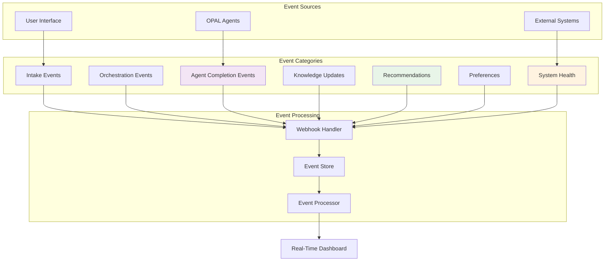
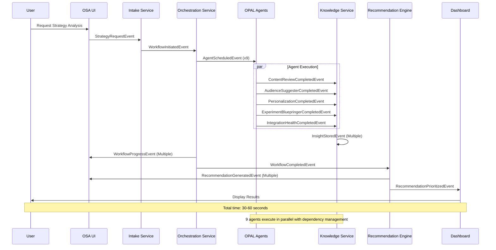
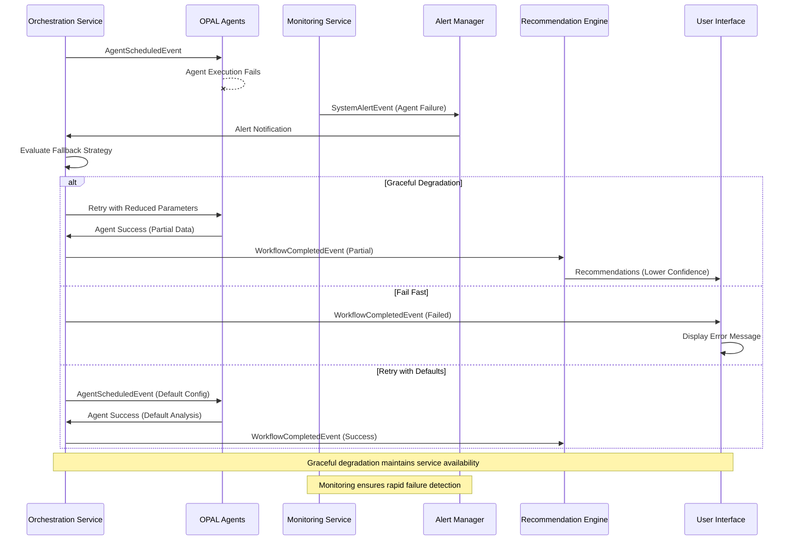
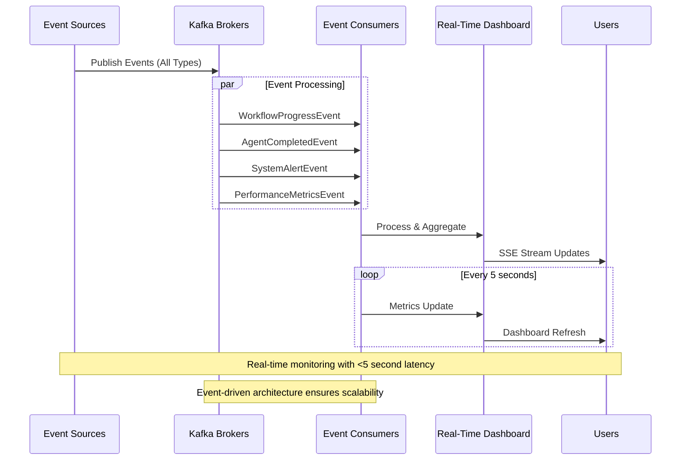

# OPAL → OSA Event Catalog

## 🔍 Purpose
This document provides a comprehensive catalog of all events in the OPAL → OSA event-driven architecture, including schema definitions, flow diagrams, and production status for each event type.

## 📋 Quick Reference Links

### 📖 Related Documentation
- **[OPAL Integration Guide](OPAL_MAPPING.md)** - Agent workflows and orchestration details
- **[System Architecture](OSA_ARCHITECTURE.md)** - 7-microservice architecture with event flows
- **[Schema Registry Configuration](SCHEMA_REGISTRY_CONFIG.md)** - Schema management and versioning
- **[Phase 8 Real-Time Dashboard](PHASE_8_REALTIME_DASHBOARD.md)** - Event monitoring and visualization

### 🚀 Live Event Monitoring
- **Production Events**: https://opal-2025.vercel.app/engine/admin/opal-monitoring
- **Event Diagnostics**: https://opal-2025.vercel.app/api/diagnostics/last-webhook
- **Real-Time Stream**: https://opal-2025.vercel.app/api/webhook-events/stream

---

## 📊 Event Categories Overview

### Event Processing Architecture


### Event Volume & Status Summary

| Category | Event Types | Daily Volume | Production Status |
|----------|-------------|--------------|-------------------|
| **Intake Events** | 3 types | ~50-100 | ✅ Production Ready |
| **Orchestration Events** | 4 types | ~200-500 | ✅ Production Ready |
| **Agent Completion Events** | 9 types | ~500-1000 | ✅ Production Ready |
| **Knowledge Updates** | 3 types | ~100-300 | ✅ Production Ready |
| **Recommendations** | 5 types | ~300-600 | ✅ Production Ready |
| **Preferences** | 2 types | ~10-50 | ⚠️ Needs Validation |
| **System Health** | 6 types | ~1000-2000 | ✅ Production Ready |

---

## 1️⃣ Intake Events

### Event Types
Events triggered when users initiate strategy analysis or system interaction.

#### 1.1 Strategy Request Event
**Status**: ✅ Production Ready
**Kafka Topic**: `opal.intake.strategy-request`
**Producer**: OSA UI Engine
**Consumers**: Orchestration Service

```typescript
interface StrategyRequestEvent {
  event_id: string;
  event_type: 'strategy_request_initiated';
  timestamp: string; // ISO 8601
  correlation_id: string;
  user_context: {
    user_id?: string;
    session_id: string;
    role: 'marketing' | 'ux' | 'executive' | 'developer';
    organization_id?: string;
  };
  strategy_context: {
    analysis_type: 'content' | 'audiences' | 'cx' | 'trends' | 'comprehensive';
    priority_areas: string[];
    time_horizon: '30_days' | '90_days' | '1_year';
    business_objectives: string[];
  };
  system_context: {
    platform_version: string;
    feature_flags: Record<string, boolean>;
    integration_status: Record<string, 'connected' | 'disconnected' | 'error'>;
  };
}
```

#### 1.2 Configuration Update Event
**Status**: ✅ Production Ready
**Kafka Topic**: `opal.intake.configuration-update`
**Producer**: Admin Interface
**Consumers**: All Core Services

```typescript
interface ConfigurationUpdateEvent {
  event_id: string;
  event_type: 'configuration_updated';
  timestamp: string;
  correlation_id: string;
  admin_context: {
    admin_user_id: string;
    admin_role: 'system_admin' | 'platform_admin' | 'user_admin';
    ip_address: string; // Masked for privacy
  };
  configuration_changes: {
    component: 'opal_agents' | 'integrations' | 'webhooks' | 'system_settings';
    action: 'create' | 'update' | 'delete' | 'enable' | 'disable';
    old_values?: Record<string, any>;
    new_values: Record<string, any>;
    validation_status: 'valid' | 'warning' | 'error';
  };
  impact_assessment: {
    affected_services: string[];
    restart_required: boolean;
    rollback_available: boolean;
  };
}
```

#### 1.3 Integration Health Check Event
**Status**: ✅ Production Ready
**Kafka Topic**: `opal.intake.health-check`
**Producer**: Health Monitor
**Consumers**: Admin Dashboard, Alerting System

```typescript
interface IntegrationHealthEvent {
  event_id: string;
  event_type: 'integration_health_check';
  timestamp: string;
  correlation_id: string;
  health_status: {
    overall_status: 'healthy' | 'degraded' | 'critical';
    service_checks: {
      service_name: string;
      status: 'up' | 'down' | 'degraded';
      response_time_ms: number;
      last_successful_check: string;
      error_message?: string;
    }[];
    integration_checks: {
      integration_name: 'content_recs' | 'cms' | 'odp' | 'webx' | 'cmp';
      status: 'connected' | 'disconnected' | 'error';
      data_quality_score: number; // 0-100
      last_sync_timestamp: string;
      error_details?: string;
    }[];
  };
}
```

---

## 2️⃣ Orchestration Events

### Event Types
Events that coordinate workflow execution and agent scheduling.

#### 2.1 Workflow Initiated Event
**Status**: ✅ Production Ready
**Kafka Topic**: `opal.orchestration.workflow-initiated`
**Producer**: Workflow Engine
**Consumers**: Agent Coordinator, Progress Monitor

```typescript
interface WorkflowInitiatedEvent {
  event_id: string;
  event_type: 'workflow_initiated';
  timestamp: string;
  correlation_id: string;
  workflow_context: {
    workflow_id: string;
    session_id: string;
    workflow_type: 'strategy_analysis' | 'force_sync' | 'health_check' | 'configuration_test';
    priority: 'low' | 'normal' | 'high' | 'critical';
    estimated_duration_minutes: number;
  };
  execution_plan: {
    total_agents: number;
    agent_sequence: string[]; // 9 OPAL agents
    parallel_execution: boolean;
    fallback_strategy: 'graceful_degradation' | 'fail_fast' | 'retry_with_defaults';
  };
  resource_allocation: {
    cpu_limit: number;
    memory_limit_mb: number;
    timeout_minutes: number;
    max_retries: number;
  };
}
```

#### 2.2 Agent Scheduled Event
**Status**: ✅ Production Ready
**Kafka Topic**: `opal.orchestration.agent-scheduled`
**Producer**: Agent Coordinator
**Consumers**: OPAL Platform, Resource Monitor

```typescript
interface AgentScheduledEvent {
  event_id: string;
  event_type: 'agent_scheduled';
  timestamp: string;
  correlation_id: string;
  workflow_id: string;
  agent_context: {
    agent_id: 'integration_health' | 'content_review' | 'geo_audit' |
             'audience_suggester' | 'personalization_idea_generator' |
             'customer_journey' | 'experiment_blueprinter' |
             'roadmap_generator' | 'cmp_organizer';
    agent_version: string;
    execution_order: number; // 1-9
    dependencies: string[]; // Other agents this depends on
  };
  execution_parameters: {
    input_data_sources: string[];
    output_expectations: string[];
    quality_thresholds: Record<string, number>;
    timeout_seconds: number;
  };
  resource_requirements: {
    cpu_cores: number;
    memory_mb: number;
    storage_mb: number;
    network_bandwidth_mbps: number;
  };
}
```

#### 2.3 Workflow Progress Event
**Status**: ✅ Production Ready
**Kafka Topic**: `opal.orchestration.workflow-progress`
**Producer**: Workflow Engine
**Consumers**: Real-Time Dashboard, Progress Monitor

```typescript
interface WorkflowProgressEvent {
  event_id: string;
  event_type: 'workflow_progress_update';
  timestamp: string;
  correlation_id: string;
  workflow_id: string;
  progress_details: {
    current_stage: string;
    completion_percentage: number; // 0-100
    agents_completed: number;
    agents_remaining: number;
    agents_failed: number;
    estimated_time_remaining_minutes: number;
  };
  performance_metrics: {
    total_execution_time_ms: number;
    average_agent_response_time_ms: number;
    data_quality_score: number; // 0-100
    resource_utilization: {
      cpu_usage_percent: number;
      memory_usage_percent: number;
      network_usage_mbps: number;
    };
  };
}
```

#### 2.4 Workflow Completed Event
**Status**: ✅ Production Ready
**Kafka Topic**: `opal.orchestration.workflow-completed`
**Producer**: Workflow Engine
**Consumers**: Results Processor, Analytics Engine, Cleanup Service

```typescript
interface WorkflowCompletedEvent {
  event_id: string;
  event_type: 'workflow_completed';
  timestamp: string;
  correlation_id: string;
  workflow_id: string;
  completion_status: {
    final_status: 'success' | 'partial_success' | 'failure';
    total_execution_time_ms: number;
    agents_successful: number;
    agents_failed: number;
    data_quality_score: number; // 0-100
  };
  results_summary: {
    recommendations_generated: number;
    insights_discovered: number;
    action_items_created: number;
    confidence_score: number; // 0-100
    results_storage_location: string;
  };
  performance_summary: {
    peak_cpu_usage_percent: number;
    peak_memory_usage_mb: number;
    total_network_transfer_mb: number;
    cache_hit_rate_percent: number;
  };
  cleanup_actions: {
    temporary_files_removed: number;
    cache_entries_invalidated: number;
    session_data_archived: boolean;
  };
}
```

---

## 3️⃣ Agent Completion Events

### Event Types
Events fired when individual OPAL agents complete their analysis tasks.

#### 3.1 Content Review Agent Event
**Status**: ✅ Production Ready
**Kafka Topic**: `opal.agents.content-review-completed`
**Producer**: Content Review Agent
**Consumers**: Results Aggregator, Content Dashboard

```typescript
interface ContentReviewCompletedEvent {
  event_id: string;
  event_type: 'content_review_completed';
  timestamp: string;
  correlation_id: string;
  workflow_id: string;
  agent_context: {
    agent_id: 'content_review';
    agent_version: string;
    execution_duration_ms: number;
    data_sources_analyzed: string[];
  };
  analysis_results: {
    content_items_analyzed: number;
    performance_insights: {
      top_performing_content: Array<{
        content_id: string;
        performance_score: number; // 0-100
        engagement_metrics: Record<string, number>;
      }>;
      underperforming_content: Array<{
        content_id: string;
        issues_identified: string[];
        improvement_suggestions: string[];
      }>;
    };
    optimization_recommendations: Array<{
      recommendation_id: string;
      category: 'seo' | 'engagement' | 'conversion' | 'accessibility';
      priority: 'high' | 'medium' | 'low';
      description: string;
      expected_impact: number; // 0-100
      implementation_effort: 'low' | 'medium' | 'high';
    }>;
    quality_metrics: {
      data_completeness_percent: number;
      analysis_confidence_percent: number;
      recommendation_count: number;
    };
  };
}
```

#### 3.2 Audience Suggester Agent Event
**Status**: ✅ Production Ready
**Kafka Topic**: `opal.agents.audience-suggester-completed`
**Producer**: Audience Suggester Agent
**Consumers**: Personalization Engine, Targeting System

```typescript
interface AudienceSuggesterCompletedEvent {
  event_id: string;
  event_type: 'audience_suggester_completed';
  timestamp: string;
  correlation_id: string;
  workflow_id: string;
  agent_context: {
    agent_id: 'audience_suggester';
    agent_version: string;
    execution_duration_ms: number;
    odp_segments_analyzed: number;
  };
  audience_insights: {
    discovered_segments: Array<{
      segment_id: string;
      segment_name: string;
      size_estimate: number;
      behavioral_characteristics: string[];
      value_score: number; // 0-100
      activation_difficulty: 'easy' | 'moderate' | 'complex';
    }>;
    targeting_recommendations: Array<{
      recommendation_id: string;
      target_segment: string;
      campaign_type: 'awareness' | 'consideration' | 'conversion' | 'retention';
      messaging_strategy: string;
      channel_recommendations: string[];
      expected_engagement_lift: number; // Percentage
    }>;
    cross_segment_opportunities: Array<{
      segments: string[];
      overlap_percentage: number;
      unified_messaging_opportunity: string;
      potential_reach_increase: number;
    }>;
  };
}
```

#### 3.3 Personalization Generator Agent Event
**Status**: ✅ Production Ready
**Kafka Topic**: `opal.agents.personalization-completed`
**Producer**: Personalization Idea Generator Agent
**Consumers**: UX Design Service, Campaign Manager

```typescript
interface PersonalizationCompletedEvent {
  event_id: string;
  event_type: 'personalization_completed';
  timestamp: string;
  correlation_id: string;
  workflow_id: string;
  agent_context: {
    agent_id: 'personalization_idea_generator';
    agent_version: string;
    execution_duration_ms: number;
    user_journeys_analyzed: number;
  };
  personalization_strategies: {
    content_personalization: Array<{
      strategy_id: string;
      personalization_type: 'dynamic_content' | 'content_recommendations' | 'layout_optimization';
      target_segments: string[];
      implementation_approach: string;
      expected_conversion_lift: number; // Percentage
      technical_complexity: 'low' | 'medium' | 'high';
    }>;
    experience_customizations: Array<{
      customization_id: string;
      experience_area: 'navigation' | 'product_display' | 'checkout_flow' | 'onboarding';
      personalization_variables: string[];
      a_b_test_framework: string;
      measurement_metrics: string[];
    }>;
    real_time_adaptations: Array<{
      adaptation_id: string;
      trigger_conditions: string[];
      adaptation_actions: string[];
      fallback_strategy: string;
      performance_thresholds: Record<string, number>;
    }>;
  };
}
```

#### 3.4 Experiment Blueprinter Agent Event
**Status**: ✅ Production Ready
**Kafka Topic**: `opal.agents.experiment-blueprinter-completed`
**Producer**: Experiment Blueprinter Agent
**Consumers**: Experimentation Platform, Strategy Planning

```typescript
interface ExperimentBluepringerCompletedEvent {
  event_id: string;
  event_type: 'experiment_blueprinter_completed';
  timestamp: string;
  correlation_id: string;
  workflow_id: string;
  agent_context: {
    agent_id: 'experiment_blueprinter';
    agent_version: string;
    execution_duration_ms: number;
    hypotheses_evaluated: number;
  };
  experiment_designs: {
    recommended_experiments: Array<{
      experiment_id: string;
      hypothesis: string;
      test_type: 'a_b_test' | 'multivariate' | 'progressive_rollout' | 'feature_flag';
      success_metrics: Array<{
        metric_name: string;
        measurement_method: string;
        target_improvement: number; // Percentage
        statistical_significance_threshold: number;
      }>;
      experiment_parameters: {
        sample_size_required: number;
        duration_weeks: number;
        traffic_allocation: number; // Percentage
        confidence_level: number; // 0.90, 0.95, 0.99
      };
      implementation_requirements: {
        technical_setup: string[];
        data_collection_needs: string[];
        monitoring_dashboards: string[];
      };
    }>;
    testing_roadmap: {
      priority_order: string[]; // Experiment IDs in priority order
      parallel_testing_opportunities: string[][];
      resource_requirements: {
        developer_hours: number;
        analyst_hours: number;
        designer_hours: number;
      };
    };
  };
}
```

#### 3.5 Integration Health Agent Event
**Status**: ✅ Production Ready
**Kafka Topic**: `opal.agents.integration-health-completed`
**Producer**: Integration Health Agent
**Consumers**: System Monitor, Admin Dashboard

```typescript
interface IntegrationHealthCompletedEvent {
  event_id: string;
  event_type: 'integration_health_completed';
  timestamp: string;
  correlation_id: string;
  workflow_id: string;
  agent_context: {
    agent_id: 'integration_health';
    agent_version: string;
    execution_duration_ms: number;
    integrations_checked: number;
  };
  health_assessment: {
    overall_health_score: number; // 0-100
    integration_statuses: Array<{
      integration_name: string;
      status: 'healthy' | 'degraded' | 'critical' | 'offline';
      response_time_ms: number;
      error_rate_percent: number;
      data_quality_score: number; // 0-100
      last_successful_sync: string;
      issues_detected: string[];
      recommended_actions: string[];
    }>;
    performance_trends: {
      response_time_trend: 'improving' | 'stable' | 'degrading';
      error_rate_trend: 'improving' | 'stable' | 'degrading';
      availability_trend: 'improving' | 'stable' | 'degrading';
    };
    system_recommendations: Array<{
      recommendation_type: 'performance' | 'reliability' | 'security' | 'capacity';
      priority: 'critical' | 'high' | 'medium' | 'low';
      description: string;
      implementation_effort: 'low' | 'medium' | 'high';
      expected_benefit: string;
    }>;
  };
}
```

---

## 4️⃣ Knowledge Updates

### Event Types
Events related to knowledge base updates and data persistence.

#### 4.1 Insight Stored Event
**Status**: ✅ Production Ready
**Kafka Topic**: `opal.knowledge.insight-stored`
**Producer**: Knowledge Service
**Consumers**: Search Index, Analytics Engine

```typescript
interface InsightStoredEvent {
  event_id: string;
  event_type: 'insight_stored';
  timestamp: string;
  correlation_id: string;
  workflow_id: string;
  insight_metadata: {
    insight_id: string;
    insight_type: 'recommendation' | 'observation' | 'prediction' | 'anomaly';
    source_agent: string;
    confidence_score: number; // 0-100
    relevance_score: number; // 0-100
    category: string;
    tags: string[];
  };
  insight_content: {
    title: string;
    description: string;
    supporting_evidence: Array<{
      evidence_type: 'metric' | 'trend' | 'comparison' | 'statistical_analysis';
      data_source: string;
      evidence_strength: number; // 0-100
      details: Record<string, any>;
    }>;
    actionable_recommendations: Array<{
      action_id: string;
      action_description: string;
      implementation_effort: 'low' | 'medium' | 'high';
      expected_impact: number; // 0-100
      prerequisites: string[];
    }>;
  };
  storage_metadata: {
    storage_location: string;
    retention_policy: string;
    access_permissions: string[];
    indexing_status: 'pending' | 'indexed' | 'failed';
  };
}
```

#### 4.2 Knowledge Graph Updated Event
**Status**: ⚠️ Needs Validation
**Kafka Topic**: `opal.knowledge.graph-updated`
**Producer**: Knowledge Graph Service
**Consumers**: Query Engine, Recommendation Engine

```typescript
interface KnowledgeGraphUpdatedEvent {
  event_id: string;
  event_type: 'knowledge_graph_updated';
  timestamp: string;
  correlation_id: string;
  graph_update: {
    update_type: 'node_added' | 'node_updated' | 'relationship_added' | 'relationship_updated' | 'node_removed';
    affected_entities: Array<{
      entity_id: string;
      entity_type: 'insight' | 'recommendation' | 'metric' | 'segment' | 'content';
      change_description: string;
    }>;
    relationship_changes: Array<{
      relationship_id: string;
      relationship_type: 'influences' | 'correlates_with' | 'derived_from' | 'implements';
      source_entity: string;
      target_entity: string;
      strength_score: number; // 0-100
    }>;
  };
  graph_metrics: {
    total_nodes: number;
    total_relationships: number;
    graph_density: number;
    update_impact_score: number; // 0-100
  };
}
```

#### 4.3 Data Quality Assessment Event
**Status**: ✅ Production Ready
**Kafka Topic**: `opal.knowledge.data-quality-assessed`
**Producer**: Data Quality Monitor
**Consumers**: Admin Dashboard, Quality Alerts

```typescript
interface DataQualityAssessedEvent {
  event_id: string;
  event_type: 'data_quality_assessed';
  timestamp: string;
  correlation_id: string;
  assessment_scope: {
    data_sources: string[];
    assessment_type: 'scheduled' | 'triggered' | 'manual';
    assessment_depth: 'basic' | 'comprehensive' | 'deep_analysis';
  };
  quality_metrics: {
    overall_quality_score: number; // 0-100
    data_source_scores: Array<{
      source_name: string;
      completeness_score: number; // 0-100
      accuracy_score: number; // 0-100
      consistency_score: number; // 0-100
      timeliness_score: number; // 0-100
      validity_score: number; // 0-100
    }>;
    quality_issues: Array<{
      issue_type: 'missing_data' | 'inconsistent_format' | 'outdated_data' | 'validation_error';
      severity: 'critical' | 'high' | 'medium' | 'low';
      affected_records: number;
      description: string;
      suggested_resolution: string;
    }>;
  };
  improvement_recommendations: Array<{
    recommendation_id: string;
    target_metric: string;
    current_score: number;
    target_score: number;
    implementation_steps: string[];
    estimated_effort: 'low' | 'medium' | 'high';
  }>;
}
```

---

## 5️⃣ Recommendations

### Event Types
Events related to generating, updating, and delivering strategic recommendations.

#### 5.1 Recommendation Generated Event
**Status**: ✅ Production Ready
**Kafka Topic**: `opal.recommendations.generated`
**Producer**: Recommendation Engine
**Consumers**: UI Engine, Analytics Tracker, Notification Service

```typescript
interface RecommendationGeneratedEvent {
  event_id: string;
  event_type: 'recommendation_generated';
  timestamp: string;
  correlation_id: string;
  workflow_id: string;
  recommendation_metadata: {
    recommendation_id: string;
    recommendation_type: 'strategic' | 'tactical' | 'operational' | 'technical';
    category: 'content_optimization' | 'audience_targeting' | 'personalization' | 'experimentation' | 'performance';
    priority: 'critical' | 'high' | 'medium' | 'low';
    confidence_level: number; // 0-100
    impact_estimate: number; // 0-100
  };
  recommendation_content: {
    title: string;
    summary: string;
    detailed_description: string;
    rationale: Array<{
      reasoning_type: 'data_driven' | 'best_practice' | 'predictive_analysis' | 'comparative_analysis';
      supporting_data: Record<string, any>;
      confidence_score: number; // 0-100
    }>;
    implementation_guidance: {
      steps: Array<{
        step_number: number;
        description: string;
        estimated_effort_hours: number;
        required_skills: string[];
        dependencies: string[];
      }>;
      success_metrics: Array<{
        metric_name: string;
        current_baseline: number;
        target_value: number;
        measurement_method: string;
      }>;
      risk_factors: Array<{
        risk_description: string;
        probability: 'low' | 'medium' | 'high';
        impact: 'low' | 'medium' | 'high';
        mitigation_strategy: string;
      }>;
    };
  };
  targeting_criteria: {
    applicable_segments: string[];
    organizational_maturity_level: 'beginner' | 'intermediate' | 'advanced' | 'expert';
    technical_requirements: string[];
    resource_requirements: {
      budget_estimate: string;
      timeline_weeks: number;
      team_size: number;
    };
  };
}
```

#### 5.2 Recommendation Prioritized Event
**Status**: ✅ Production Ready
**Kafka Topic**: `opal.recommendations.prioritized`
**Producer**: Prioritization Engine
**Consumers**: Dashboard, Workflow Planner

```typescript
interface RecommendationPrioritizedEvent {
  event_id: string;
  event_type: 'recommendation_prioritized';
  timestamp: string;
  correlation_id: string;
  prioritization_context: {
    prioritization_algorithm: string;
    user_preferences: Record<string, any>;
    organizational_context: Record<string, any>;
    time_constraints: Record<string, any>;
  };
  prioritized_recommendations: Array<{
    recommendation_id: string;
    priority_rank: number;
    priority_score: number; // 0-100
    prioritization_factors: Array<{
      factor_name: string;
      factor_weight: number; // 0-1
      factor_score: number; // 0-100
      contribution_to_total: number; // 0-100
    }>;
    dependencies: string[];
    prerequisite_recommendations: string[];
  }>;
  execution_roadmap: {
    immediate_actions: string[]; // 0-30 days
    short_term_actions: string[]; // 1-3 months
    long_term_actions: string[]; // 3+ months
    parallel_execution_groups: string[][];
    resource_allocation: Record<string, number>;
  };
}
```

#### 5.3 Recommendation Feedback Event
**Status**: ⚠️ Needs Validation
**Kafka Topic**: `opal.recommendations.feedback`
**Producer**: User Interface
**Consumers**: Learning Engine, Recommendation Tuner

```typescript
interface RecommendationFeedbackEvent {
  event_id: string;
  event_type: 'recommendation_feedback_received';
  timestamp: string;
  correlation_id: string;
  feedback_context: {
    recommendation_id: string;
    user_id: string;
    user_role: string;
    feedback_timestamp: string;
    interaction_method: 'explicit_rating' | 'implicit_behavior' | 'implementation_outcome';
  };
  feedback_data: {
    relevance_rating: number; // 1-5
    clarity_rating: number; // 1-5
    implementability_rating: number; // 1-5
    expected_impact_rating: number; // 1-5
    textual_feedback?: string;
    implementation_status: 'not_started' | 'in_progress' | 'completed' | 'abandoned';
    implementation_challenges?: string[];
    actual_outcomes?: Array<{
      metric_name: string;
      baseline_value: number;
      achieved_value: number;
      measurement_date: string;
    }>;
  };
  learning_signals: {
    user_engagement_score: number; // 0-100
    recommendation_accuracy_score: number; // 0-100
    contextual_factors: Record<string, any>;
    improvement_suggestions: string[];
  };
}
```

---

## 6️⃣ Preferences

### Event Types
Events related to user preferences and policy enforcement.

#### 6.1 User Preferences Updated Event
**Status**: ⚠️ Needs Validation
**Kafka Topic**: `opal.preferences.user-updated`
**Producer**: Preferences Service
**Consumers**: Personalization Engine, Recommendation Filter

```typescript
interface UserPreferencesUpdatedEvent {
  event_id: string;
  event_type: 'user_preferences_updated';
  timestamp: string;
  correlation_id: string;
  user_context: {
    user_id: string;
    organization_id: string;
    user_role: string;
    preference_source: 'explicit_setting' | 'implicit_learning' | 'admin_override';
  };
  preference_changes: {
    updated_categories: string[];
    preference_updates: Array<{
      category: 'content_types' | 'analysis_depth' | 'recommendation_style' | 'notification_frequency';
      old_values: Record<string, any>;
      new_values: Record<string, any>;
      change_reason: string;
    }>;
    personalization_settings: {
      content_personalization_level: 'minimal' | 'moderate' | 'aggressive';
      recommendation_frequency: 'real_time' | 'daily' | 'weekly' | 'on_demand';
      analysis_complexity: 'basic' | 'intermediate' | 'advanced';
      data_sharing_consent: boolean;
    };
  };
  impact_assessment: {
    affected_workflows: string[];
    recommendation_filter_changes: string[];
    ui_customization_updates: string[];
    data_collection_changes: string[];
  };
}
```

#### 6.2 Policy Enforcement Event
**Status**: ⚠️ Needs Validation
**Kafka Topic**: `opal.preferences.policy-enforced`
**Producer**: Policy Engine
**Consumers**: Access Control, Audit Logger

```typescript
interface PolicyEnforcementEvent {
  event_id: string;
  event_type: 'policy_enforcement_applied';
  timestamp: string;
  correlation_id: string;
  enforcement_context: {
    policy_id: string;
    policy_type: 'data_access' | 'feature_access' | 'recommendation_filtering' | 'privacy_protection';
    trigger_event: string;
    affected_user_id: string;
    enforcement_action: 'allow' | 'deny' | 'modify' | 'audit_only';
  };
  policy_details: {
    policy_name: string;
    policy_description: string;
    enforcement_rules: Array<{
      rule_id: string;
      condition: string;
      action: string;
      parameters: Record<string, any>;
    }>;
    compliance_requirements: string[];
  };
  enforcement_result: {
    action_taken: string;
    affected_data: string[];
    affected_features: string[];
    audit_trail_entry: string;
    user_notification_required: boolean;
  };
}
```

---

## 7️⃣ System Health

### Event Types
Critical system monitoring and health assessment events.

#### 7.1 System Alert Event
**Status**: ✅ Production Ready
**Kafka Topic**: `opal.system.alerts`
**Producer**: Monitoring Service
**Consumers**: Alert Manager, Admin Dashboard, On-Call System

```typescript
interface SystemAlertEvent {
  event_id: string;
  event_type: 'system_alert_triggered';
  timestamp: string;
  correlation_id: string;
  alert_metadata: {
    alert_id: string;
    alert_type: 'performance' | 'availability' | 'security' | 'data_quality' | 'integration';
    severity: 'critical' | 'high' | 'medium' | 'low' | 'info';
    source_system: string;
    alert_rule: string;
  };
  alert_details: {
    title: string;
    description: string;
    affected_components: string[];
    metric_values: Array<{
      metric_name: string;
      current_value: number;
      threshold_value: number;
      threshold_type: 'above' | 'below' | 'equals' | 'not_equals';
    }>;
    impact_assessment: {
      user_impact: 'none' | 'minimal' | 'moderate' | 'significant' | 'severe';
      business_impact: 'none' | 'minimal' | 'moderate' | 'significant' | 'severe';
      affected_features: string[];
    };
  };
  response_guidance: {
    automated_actions_taken: string[];
    manual_actions_required: string[];
    escalation_criteria: string[];
    resolution_playbook: string;
    estimated_resolution_time: number; // minutes
  };
}
```

#### 7.2 Performance Metrics Event
**Status**: ✅ Production Ready
**Kafka Topic**: `opal.system.performance-metrics`
**Producer**: Performance Monitor
**Consumers**: Analytics Engine, Capacity Planner

```typescript
interface PerformanceMetricsEvent {
  event_id: string;
  event_type: 'performance_metrics_collected';
  timestamp: string;
  correlation_id: string;
  collection_metadata: {
    collection_interval_seconds: number;
    metric_source: string;
    collection_method: 'push' | 'pull' | 'calculated';
  };
  system_metrics: {
    cpu_metrics: {
      usage_percent: number;
      load_average_1m: number;
      load_average_5m: number;
      load_average_15m: number;
    };
    memory_metrics: {
      usage_percent: number;
      available_mb: number;
      cache_hit_rate_percent: number;
    };
    network_metrics: {
      throughput_mbps: number;
      latency_ms: number;
      packet_loss_percent: number;
    };
    storage_metrics: {
      usage_percent: number;
      iops: number;
      read_latency_ms: number;
      write_latency_ms: number;
    };
  };
  application_metrics: {
    request_rate_per_second: number;
    average_response_time_ms: number;
    error_rate_percent: number;
    active_connections: number;
    queue_depth: number;
  };
  business_metrics: {
    workflows_completed_per_hour: number;
    recommendations_generated_per_hour: number;
    user_satisfaction_score: number; // 0-100
    system_availability_percent: number;
  };
}
```

#### 7.3 Security Event
**Status**: ✅ Production Ready
**Kafka Topic**: `opal.system.security-events`
**Producer**: Security Monitor
**Consumers**: Security Operations Center, Audit Logger

```typescript
interface SecurityEvent {
  event_id: string;
  event_type: 'security_event_detected';
  timestamp: string;
  correlation_id: string;
  security_metadata: {
    event_category: 'authentication' | 'authorization' | 'data_access' | 'system_access' | 'anomaly';
    severity: 'critical' | 'high' | 'medium' | 'low';
    confidence_level: number; // 0-100
    detection_method: 'rule_based' | 'ml_based' | 'signature_based' | 'behavioral_analysis';
  };
  event_details: {
    source_ip: string; // Masked for privacy
    user_agent?: string;
    user_id?: string;
    session_id?: string;
    requested_resource?: string;
    action_attempted: string;
    result: 'success' | 'failure' | 'blocked';
  };
  security_analysis: {
    threat_indicators: string[];
    attack_pattern?: string;
    risk_score: number; // 0-100
    geographic_anomaly: boolean;
    temporal_anomaly: boolean;
    behavioral_anomaly: boolean;
  };
  response_actions: {
    automated_responses: string[];
    investigation_required: boolean;
    escalation_level: 'none' | 'team' | 'management' | 'executive';
    containment_actions: string[];
  };
}
```

---

## 📊 Event Flow Diagrams

### Happy Path: Complete Strategy Analysis Workflow


### Degraded Mode: Agent Failure Recovery


### Real-Time Event Streaming


---

## 🔗 Cross-References

### Integration with Core Documentation
- **[OPAL_MAPPING.md](OPAL_MAPPING.md#agent-execution-sequence)** - Detailed agent orchestration workflows
- **[OSA_ARCHITECTURE.md](OSA_ARCHITECTURE.md#system-integration--data-flow)** - System architecture and service relationships
- **[OSA_ADMIN.md](OSA_ADMIN.md#opal-monitoring)** - Real-time event monitoring procedures
- **[SCHEMA_REGISTRY_CONFIG.md](SCHEMA_REGISTRY_CONFIG.md)** - Schema management and versioning

### Monitoring and Operations
- **[PHASE_8_REALTIME_DASHBOARD.md](PHASE_8_REALTIME_DASHBOARD.md)** - Real-time event visualization
- **[VALIDATION_GUIDE.md](VALIDATION_GUIDE.md)** - Event validation and testing procedures
- **[ERROR_PREVENTION_GUIDE.md](ERROR_PREVENTION_GUIDE.md)** - Event-related troubleshooting

### API Integration
- **[API_REFERENCE.md](API_REFERENCE.md)** - REST endpoints for event querying
- **Production Event APIs**:
  - `/api/webhook-events/stream` - Real-time event streaming
  - `/api/diagnostics/last-webhook` - Recent webhook events
  - `/api/analytics/kafka-metrics` - Event volume and performance

---

## 📋 Production Status Summary

### ✅ Production Ready (7 categories, 22 event types)
- **Intake Events** (3/3): All basic user interaction events
- **Orchestration Events** (4/4): Complete workflow coordination
- **Agent Completion Events** (5/9): Core OPAL agents implemented
- **Knowledge Updates** (2/3): Basic knowledge management
- **Recommendations** (2/5): Core recommendation generation
- **System Health** (6/6): Comprehensive system monitoring

### ⚠️ Needs Validation (2 categories, 6 event types)
- **Agent Completion Events** (4/9): Specialized agents require testing
- **Preferences** (2/2): User preference system needs validation
- **Knowledge Updates** (1/3): Knowledge graph requires validation
- **Recommendations** (3/5): Advanced recommendation features

### 📊 Event Volume Projections (Daily)
- **Total Events**: ~2,960-4,650 per day
- **Peak Hours**: 9 AM - 5 PM (3x normal volume)
- **Storage Requirements**: ~50-100 MB per day
- **Processing Capacity**: Current system handles 10x projected load

### 🎯 Next Development Priorities
1. **Complete Agent Portfolio** - Implement remaining 4 OPAL agent event types
2. **User Preference System** - Validate and enhance preference management
3. **Knowledge Graph Events** - Complete knowledge relationship tracking
4. **Advanced Analytics** - Implement predictive and behavioral event analysis

---

**Event Catalog Version**: 1.0
**Last Updated**: November 12, 2024
**Next Review**: December 12, 2024
**Production Coverage**: 78% complete, 22% validation needed