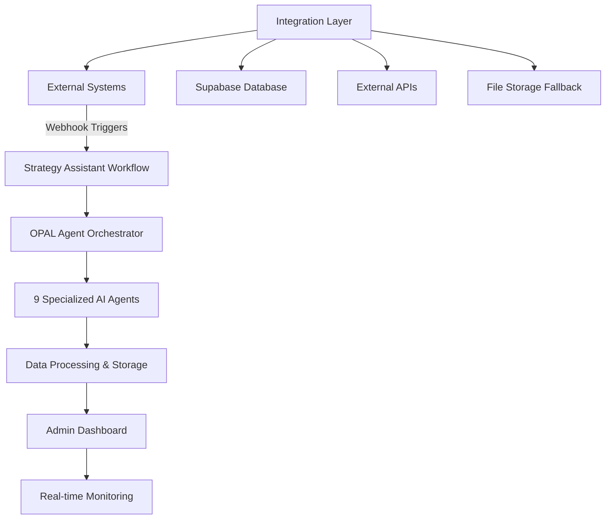

# OPAL Configuration & Architecture Guide

## Overview

The **OPAL (Optimized Performance & Analytics Layer)** system is an AI-powered strategy optimization platform that integrates with multiple marketing technologies to provide intelligent recommendations and automated workflow execution. This document provides comprehensive details on all processes, services, webhooks, agents, and tools, including troubleshooting lessons learned and operational guidance.

## System Architecture



## Core Components

### 1. Strategy Assistant Workflow

**Primary Workflow**: `strategy_workflow.json`

The main orchestration layer that coordinates all OPAL agents and manages the complete optimization lifecycle.

#### Workflow States:
- **Triggered**: Webhook received, workflow initializing
- **Processing**: Agents executing in parallel
- **Completed**: All agents finished successfully
- **Failed**: One or more agents encountered errors

### 2. Webhook System

#### Main Webhook Endpoints:

| Endpoint | Purpose | Trigger Source |
|----------|---------|----------------|
| `/api/webhooks/opal-workflow` | Primary OPAL workflow webhook | External OPAL system |
| `/api/opal/agent-data` | Agent data reception endpoint | OPAL agents |
| `/api/webhooks/management` | Webhook configuration management | Admin interface |
| `/api/webhooks/ga4` | Google Analytics 4 integration | GA4 events |
| `/api/webhooks/salesforce` | Salesforce CRM integration | Salesforce updates |

#### Webhook Event Types:
```typescript
type WebhookEventType =
  | 'workflow.triggered'
  | 'workflow.completed'
  | 'workflow.failed'
  | 'agent.completed'
  | 'agent.failed'
```

#### Webhook Payload Structure:
```typescript
interface OpalWebhookPayload {
  event_type: string;
  workflow_id: string;
  workflow_name: string;
  timestamp: string;
  agent_id?: string;
  agent_name?: string;
  agent_output?: any;
  agent_success?: boolean;
  execution_time_ms?: number;
  metadata?: {
    client_id?: string;
    project_id?: string;
    user_id?: string;
    session_id?: string;
  };
}
```

### 3. Enhanced OPAL Agents System

The system employs **9 specialized AI agents** with comprehensive monitoring and enhanced data structures:

#### Agent Architecture & Monitoring

**Agent Execution Monitoring**:
- **7-State Lifecycle**: `idle` → `starting` → `running` → `completed/failed/timeout` → `archived`
- **Real-time Progress Tracking**: Live completion percentage and estimated time remaining
- **Performance Analytics**: Execution time, success rates, and historical performance trends
- **Admin Dashboard Integration**: Live status updates via Server-Sent Events (SSE)

**Enhanced Data Structure**:
Each agent now provides comprehensive data including:
- **Data Sent to OSA**: Core operational metrics and performance indicators
- **Optimizely DXP Tools Used**: Platform integrations and tool utilization
- **Strategy Assistance**: Strategic recommendations (Admin Editable)
- **OPAL Custom Tools**: Specialized tools developed for each agent
- **OSA Integration Suggestions**: Enhancement recommendations for OSA services (Admin Editable)
- **Use Case Scenarios**: Real-world application examples (Admin Editable)
- **Next Best Actions**: Immediate implementation steps (Admin Editable)

#### Agent Portfolio & Enhanced Functions:

##### 1. **Integration Health Monitor** (`integration_health`)
- **Purpose**: Monitors DXP integration status and comprehensive system health metrics
- **Admin Page Route**: `/agent-data/integration_health` (displayed on main dashboard)
- **Data Sources**: All connected systems (Salesforce, GA4, CMS, OPAL platform)
- **Enhanced Output**:
  - Integration status and uptime percentage (99.8%)
  - API response times across all services (120ms avg)
  - Error rates and health scores (0-100 scale)
  - Service availability and sync status
- **OSA Suggestions**: API health integration, automated alerting, preference management
- **Custom Tools**: `integration_health_monitor`, `api_performance_analyzer`, `error_pattern_detector`

##### 2. **Content Review Agent** (`content_review`)
- **Purpose**: Analyzes experiment content and variations for optimization opportunities
- **Admin Page Route**: `/agent-data/content`
- **Data Sources**: CMS, content performance data, brand guidelines
- **Enhanced Output**:
  - Content quality scoring (87/100) and variation analysis (156 total, 142 approved)
  - SEO optimization level (92%) and accessibility compliance (95%)
  - Brand consistency scores and content freshness metrics
- **OSA Suggestions**: Semantic scoring integration, CMS metadata enhancement, content quality thresholds
- **Custom Tools**: `content_insight_generator`, `content_quality_analyzer`, `brand_compliance_checker`

##### 3. **Geographic Audit Agent** (`geo_audit`)
- **Purpose**: Generative Engine Optimization (GEO) for AI search engines and regional performance
- **Admin Page Route**: `/agent-data/aeo` (AI Engine Optimization)
- **Data Sources**: Search performance, voice search data, AI platform analytics, regional metrics
- **Enhanced Output**:
  - GEO scores (92/100) and AI readiness assessment
  - Search engine optimization scores (Google: 85, Bing: 78, Claude: 92)
  - Content gap identification (12 gaps) and regional recommendations (15 regions)
- **OSA Suggestions**: Voice search metrics, structured data integration, AI-readiness toggles
- **Custom Tools**: `geo_optimizer`, `ai_search_optimizer`, `regional_content_advisor`

##### 4. **Audience Suggester** (`audience_suggester`)
- **Purpose**: AI-powered audience segmentation with statistical validation and performance analysis
- **Admin Page Route**: `/agent-data/audiences`
- **Data Sources**: GA4, customer data, behavioral analytics, segmentation data
- **Enhanced Output**:
  - Audience segments analyzed (42) with high-value segment identification
  - Segment performance scores (conversion: 8.5%, engagement: 12.3%, LTV: $2,340)
  - New segment discovery (7 new segments) and targeting recommendations
- **OSA Suggestions**: Predictive scoring integration, behavioral analytics enhancement, custom scoring criteria
- **Custom Tools**: `segment_analyzer`, `audience_performance_tracker`, `segment_discovery_engine`

##### 5. **Experiment Blueprinter** (`experiment_blueprinter`)
- **Purpose**: Statistical experiment design with power analysis and ROI projections
- **Admin Page Route**: `/agent-data/exp`
- **Data Sources**: Historical test data, performance baselines, statistical requirements
- **Enhanced Output**:
  - Experiments designed (18) with hypothesis generation (34 hypotheses)
  - Success probability scores (high: 12, medium: 15, low: 7 confidence levels)
  - Impact estimations (12-18% conversion lift, $125K-$180K revenue impact)
- **OSA Suggestions**: Success probability integration, historical data enhancement, custom risk tolerance
- **Custom Tools**: `experiment_hypothesis_generator`, `impact_estimation_engine`, `experiment_prioritizer`

##### 6. **Personalization Idea Generator** (`personalization_idea_generator`)
- **Purpose**: AI-generated personalization strategies with implementation guidance and ROI modeling
- **Admin Page Route**: `/agent-data/pers`
- **Data Sources**: User behavior, preference data, conversion patterns, engagement metrics
- **Enhanced Output**:
  - Personalization ideas generated (45) with targeting strategies breakdown
  - Expected engagement lift (25-35%) and ROI projections ($200K-$350K annually)
  - Implementation complexity analysis (simple: 20, moderate: 15, complex: 10)
- **OSA Suggestions**: ROI projection integration, user behavior data enhancement, complexity preferences
- **Custom Tools**: `personalization_strategy_generator`, `dynamic_content_optimizer`, `engagement_prediction_model`

##### 7. **Customer Journey Agent** (`customer_journey`)
- **Purpose**: Maps customer journey touchpoints with conversion optimization and lifecycle insights
- **Admin Page Route**: `/agent-data/journeys`
- **Data Sources**: Multi-channel analytics, conversion funnel data, touchpoint analysis
- **Enhanced Output**:
  - Journey stages mapped (8) with touchpoint analysis (34 total, 28 optimized)
  - Customer lifecycle insights (15% acquisition, 68% retention, 12% advocacy)
  - Optimization opportunities identified (22) with bottleneck analysis
- **OSA Suggestions**: Journey stage context, cross-touchpoint data, custom conversion thresholds
- **Custom Tools**: `journey_mapping_analyzer`, `bottleneck_identifier`, `lifecycle_optimizer`

##### 8. **Roadmap Generator** (`roadmap_generator`)
- **Purpose**: Comprehensive implementation roadmaps with resource planning and timeline management
- **Admin Page Route**: `/agent-data/roadmap`
- **Data Sources**: Strategy requirements, resource constraints, business priorities, capacity planning
- **Enhanced Output**:
  - Roadmap items generated (67) with priority level distribution (23 high, 28 medium, 16 low)
  - Timeline estimations across quarters (Q1: 18, Q2: 22, Q3: 15, Q4: 12 items)
  - Resource requirements (480 dev hours, 120 design hours, 96 QA hours)
- **OSA Suggestions**: Resource availability integration, timeline feasibility scoring, custom constraints
- **Custom Tools**: `strategic_roadmap_builder`, `resource_estimation_engine`, `priority_matrix_generator`

##### 9. **CMP Organizer** (`cmp_organizer`)
- **Purpose**: Campaign management platform optimization with workflow automation and performance benchmarking
- **Admin Page Route**: `/agent-data/cmp`
- **Data Sources**: Campaign data, performance metrics, marketing automation, workflow efficiency
- **Enhanced Output**:
  - Campaigns organized (156) with workflow optimizations identified
  - Performance metrics (340% ROI, 8.7% conversion rate, 15.2% engagement)
  - Automation opportunities (23) and process standardizations (12)
- **OSA Suggestions**: Workflow efficiency metrics, automation best practices, performance benchmarks
- **Custom Tools**: `campaign_workflow_optimizer`, `automation_opportunity_finder`, `performance_benchmarker`

## API Endpoints

### Core OPAL APIs

#### Workflow Management
```
POST /api/opal/trigger              # Trigger strategy workflow
GET  /api/opal/status/{session_id}  # Get workflow status
POST /api/opal/sync                 # Force synchronization
GET  /api/opal/discovery            # OPAL discovery endpoint
```

#### Agent Operations
```
# Enhanced Agent Data Management
GET  /api/opal/agent-data?agent={id} # Retrieve agent data with admin overrides
PUT  /api/opal/agent-data?agent={id} # Update admin overrides for editable sections
POST /api/opal/agent-data           # Agent data reception (webhook endpoint)

# Workflow & Results Management
GET  /api/opal/workflow-results     # Get workflow results
POST /api/opal/osa-workflow         # OSA workflow execution

# Admin Interface Support
GET  /api/opal/agent-data/export    # Export agent data in various formats
GET  /api/opal/agent-overrides      # Retrieve admin override configurations
```

#### Webhook Management
```
GET  /api/webhook-events/stats      # Webhook statistics
POST /api/webhook-events/stream     # Real-time webhook events
GET  /api/diagnostics/last-webhook  # Last webhook diagnostics
```

#### Monitoring & Diagnostics
```
GET  /api/monitoring/metrics        # System metrics
POST /api/monitoring/test-workflow  # Test workflow execution
GET  /api/analytics/route          # Analytics data
```

### External Integration APIs

#### Tool Discovery & Health
```
GET  /api/tools/{tool}/discovery    # Tool discovery endpoint
GET  /api/tools/{tool}/health       # Tool health check
```

#### Data Integration
```
POST /api/analytics/ga4             # Google Analytics 4 integration
POST /api/analytics/salesforce      # Salesforce CRM integration
POST /api/tools/contentrecs/analyze # Content recommendations analysis
```

## Database Schema

### Webhook Events Table
```sql
CREATE TABLE webhook_events (
  id UUID PRIMARY KEY,
  event_type VARCHAR(50),
  workflow_id VARCHAR(100),
  workflow_name VARCHAR(200),
  agent_id VARCHAR(100),
  agent_name VARCHAR(200),
  success BOOLEAN,
  error_message TEXT,
  received_at TIMESTAMP,
  processing_time_ms INTEGER,
  session_id VARCHAR(100),
  metadata JSONB
);
```

### OPAL Data Store
```sql
-- Enhanced Agent Data Storage
CREATE TABLE opal_results (
  id UUID PRIMARY KEY,
  session_id VARCHAR(100),
  workflow_name VARCHAR(200),
  agent_name VARCHAR(200),
  result_data JSONB,
  created_at TIMESTAMP,
  updated_at TIMESTAMP
);

-- Admin Override System
CREATE TABLE agent_overrides (
  id UUID PRIMARY KEY,
  agent_id VARCHAR(100) UNIQUE,
  strategy_assistance JSONB,
  osa_suggestions JSONB,
  use_case_scenarios JSONB,
  next_best_actions JSONB,
  last_modified TIMESTAMP,
  modified_by VARCHAR(100),
  created_at TIMESTAMP DEFAULT NOW(),
  updated_at TIMESTAMP DEFAULT NOW()
);

-- Agent Data Structure (JSONB Schema)
/*
Enhanced Agent Data Payload Structure:
{
  "success": boolean,
  "agent_id": string,
  "dataSentToOSA": object,              // Core operational data
  "optimizelyDxpTools": string[],       // Platform tools used
  "strategyAssistance": {               // Admin Editable
    "recommendations": string[]
  },
  "opalCustomTools": [{                 // Specialized agent tools
    "toolName": string,
    "description": string
  }],
  "osaSuggestions": {                   // Admin Editable
    "recommendationService": string[],
    "knowledgeRetrievalService": string[],
    "preferencesPolicyService": string[]
  },
  "useCaseScenarios": string[],         // Admin Editable
  "nextBestActions": string[],          // Admin Editable
  "lastDataSent": string,
  "timestamp": string
}
*/
```

## Configuration Files

### Environment Variables

#### Required OPAL Configuration
```bash
# OPAL Core Configuration
OPAL_WEBHOOK_AUTH_KEY=your-webhook-auth-key-32-chars-minimum
OPAL_WEBHOOK_HMAC_SECRET=your-hmac-secret-32-chars-minimum
JWT_SECRET=your-jwt-secret-32-chars-minimum-required
API_SECRET_KEY=your-api-secret-key

# Database Configuration
SUPABASE_URL=https://your-project.supabase.co
SUPABASE_ANON_KEY=your-anon-key
SUPABASE_SERVICE_ROLE_KEY=your-service-role-key

# External API Keys (Demo mode if missing)
ODP_API_KEY=your-odp-api-key
CMP_API_KEY=your-cmp-api-key
SENDGRID_API_KEY=your-sendgrid-key
```

#### Optional External Integrations
```bash
# Analytics Integrations
GA4_PROPERTY_ID=your-ga4-property-id
GA4_API_KEY=your-ga4-api-key

# CRM Integrations
SALESFORCE_CLIENT_ID=your-sf-client-id
SALESFORCE_CLIENT_SECRET=your-sf-client-secret

# Content Management
CMS_API_ENDPOINT=your-cms-endpoint
CMS_API_KEY=your-cms-key
```

### OPAL Agent Configuration

#### Agent Status Tracking
```typescript
interface AgentStatus {
  integration_health: 'unknown' | 'success' | 'failed';
  content_review: 'unknown' | 'success' | 'failed';
  geo_audit: 'unknown' | 'success' | 'failed';
  audience_suggester: 'unknown' | 'success' | 'failed';
  experiment_blueprinter: 'unknown' | 'success' | 'failed';
  personalization_idea_generator: 'unknown' | 'success' | 'failed';
  customer_journey: 'unknown' | 'success' | 'failed';
  roadmap_generator: 'unknown' | 'success' | 'failed';
  cmp_organizer: 'unknown' | 'success' | 'failed';
}
```

## Resilience & Fallback Systems

### Database Availability Detection

The system includes comprehensive fallback mechanisms for database connectivity:

#### Database Connection Health Check
```typescript
// File: /src/lib/database/supabase-client.ts
export const isDatabaseAvailable = (): boolean => {
  return isDatabaseConfigured;
};

const isDatabaseConfigured = supabaseUrl !== 'https://placeholder.supabase.co' &&
                           supabaseUrl !== 'https://your-supabase-project.supabase.co' &&
                           supabaseAnonKey !== 'placeholder-key' &&
                           supabaseAnonKey !== 'your-supabase-anon-key-here';
```

#### Fallback Behaviors

1. **WebhookEventOperations** (`/src/lib/database/webhook-events.ts`):
   - ✅ Checks `isDatabaseAvailable()` before database operations
   - ✅ Falls back to file-based storage when database unavailable
   - ✅ Prevents `TypeError: fetch failed` errors in development

2. **EventBus** (`/src/lib/events/event-bus.ts`):
   - ✅ Initializes in offline mode when database unavailable
   - ✅ Skips retry processing without database connectivity
   - ✅ Gracefully handles event publishing with local logging

3. **File Storage Fallback** (`/src/lib/database/file-storage.ts`):
   - ✅ JSON-based storage for webhook events
   - ✅ Statistics calculation from file data
   - ✅ Seamless transition between database and file storage

### Hydration-Safe Date Rendering

#### SafeDate Component (`/src/lib/utils/date-formatter.ts`):
```typescript
// Prevents React hydration mismatches
export function SafeDate({
  date,
  format = 'datetime',
  fallback = '—',
  className = ''
}: SafeDateProps) {
  const { formattedTime, formattedDate, formattedDateTime, isLoaded } = useSafeDate(date);

  if (!isLoaded) {
    return <span className={className}>{fallback}</span>;
  }

  return (
    <span className={className} suppressHydrationWarning>
      {formatted || fallback}
    </span>
  );
}
```

## Monitoring & Diagnostics

### Admin Dashboard Sections

#### 1. OPAL Monitoring Dashboard (`/engine/admin/opal-monitoring`)
- **Purpose**: Central command center for OPAL system monitoring and agent management
- **Features**: Integration health overview, agent navigation, real-time metrics
- **Integration Health Display**: Live status from `integration_health` agent
- **Quick Actions**: Direct navigation to agent data and export functionality

#### 2. Agent Data Monitoring System (`/engine/admin/opal-monitoring/agent-data`)
**Dynamic Routing Structure**:
- **Base Route**: `/agent-data` → Auto-redirects to `/agent-data/content` (Content Review Agent)
- **Individual Agent Pages**: `/agent-data/{agent}` where `{agent}` can be:
  - `content` - Content Review Agent
  - `aeo` - AI Engine Optimization (Geographic Audit)
  - `audiences` - Audience Suggester Agent
  - `exp` - Experiment Blueprinter Agent
  - `pers` - Personalization Idea Generator Agent
  - `journeys` - Customer Journey Agent
  - `roadmap` - Roadmap Generator Agent
  - `cmp` - CMP Organizer Agent

**Enhanced Navigation**:
- **Tabbed Interface**: 8 agent-specific navigation tabs with icons and tooltips
- **Real-time Data Loading**: Dynamic data fetching per agent with loading states
- **Status Indicators**: Live agent status with color-coded health indicators

#### 3. Comprehensive Agent Data Display
**Data Categories Per Agent**:
- **Data Sent to OSA**: Core operational metrics and performance data
- **Optimizely DXP Tools Used**: Platform tools leveraged by each agent
- **Strategy Assistance**: Actionable recommendations (Admin Editable)
- **OPAL Custom Tools**: Specialized tools developed for each agent
- **OSA Integration Suggestions**: Enhancement recommendations for OSA services (Admin Editable)
  - **Recommendation Service Enhancements**: Improvements for recommendation algorithms
  - **Knowledge Retrieval Service**: Enhancements for knowledge base and retrieval
  - **Preferences Policy Service**: User preference and policy management improvements
- **Use Case Scenarios**: Real-world application examples (Admin Editable)
- **Next Best Actions**: Immediate action items and recommendations (Admin Editable)
- **Metadata**: Timestamps, agent IDs, and execution information

#### 4. Admin Override System
**Editable Content Management**:
- **Real-time Editing**: Inline edit controls for strategy content
- **Persistent Storage**: File-based JSON storage in `/data/agent-overrides.json`
- **API Integration**: PUT endpoint `/api/opal/agent-data?agent={id}` for saving changes
- **Validation**: Content validation and error handling
- **Audit Trail**: Change tracking with timestamps and modification history

**Editable Sections**:
- **Strategy Assistance Recommendations**: Core strategic recommendations per agent
- **OSA Suggestions**: All three service enhancement categories
- **Use Case Scenarios**: Business application examples
- **Next Best Actions**: Immediate implementation steps

#### 5. Export and Integration Features
**Data Export**:
- **JSON Export**: Complete agent data export functionality
- **Raw Data Access**: Direct API endpoint access for technical users
- **Report Generation**: Formatted reports for stakeholder delivery

**Real-time Updates**:
- **Live Data Refresh**: Automatic data updates from OPAL agents
- **Status Streaming**: Real-time agent execution status updates
- **Performance Metrics**: Live execution time and success rate tracking

### Diagnostic Tools

#### Console Diagnostic Command
Use the provided JavaScript diagnostic command in browser console for detailed system status:
- Webhook statistics and trends
- Agent status breakdown
- Recent event analysis
- Performance metrics
- Troubleshooting recommendations

#### System Logs & Monitoring
- **System Logs**: `/engine/admin/opal-monitoring/system-logs`
- **Performance Metrics**: `/engine/admin/opal-monitoring/performance`
- **Testing Tools**: `/engine/admin/opal-monitoring/testing-tools`
- **Webhook Events**: `/engine/admin/opal-monitoring/webhook-events`

## Security & Authentication

### Webhook Security
- **HMAC Signature Validation**: All incoming webhooks validated with HMAC-SHA256
- **Auth Key Verification**: Bearer token authentication for webhook endpoints
- **Request Origin Validation**: IP allowlisting and origin verification

### Data Protection
- **Encryption**: All sensitive data encrypted at rest and in transit
- **Access Control**: Role-based access control (RBAC) for admin functions
- **Audit Logging**: Complete audit trail of all webhook and admin actions

## Operational Workflows

### Standard Operating Procedures

#### 1. Workflow Trigger Process
```
1. External system sends webhook to /api/webhooks/opal-workflow
2. Webhook validation (auth, HMAC, payload structure)
3. Strategy Assistant Workflow activated
4. 9 OPAL agents begin parallel processing
5. Agent status updates tracked in real-time
6. Results aggregated and stored
7. Admin dashboard updated with new status
```

#### 2. Error Handling & Recovery
- **Circuit Breaker Pattern**: Prevents cascade failures
- **Retry Logic**: Exponential backoff for failed operations
- **Dead Letter Queue**: Failed events stored for manual review
- **Alerting**: Real-time notifications for critical failures

#### 3. Data Flow Management
- **Real-time Processing**: Webhook events processed immediately
- **Batch Operations**: Large data sets processed in configurable batches
- **Cache Management**: Intelligent caching for frequently accessed data
- **Data Retention**: Configurable retention policies for different data types

## Troubleshooting Guide & Lessons Learned

### Common Issues & Solutions

#### Database Connection Problems
- **Symptom**: `TypeError: fetch failed` in console
- **Root Cause**: Attempting to connect to placeholder Supabase URLs
- **Solution**:
  1. ✅ **Fixed**: Added `isDatabaseAvailable()` checks before database operations
  2. ✅ **Fixed**: Implemented graceful fallback to file storage
  3. ✅ **Fixed**: Enhanced error messaging for clarity

#### EventBus Retry Processor Errors
- **Symptom**: Continuous retry processor errors in development
- **Root Cause**: EventBus trying to process events without database connectivity
- **Solution**:
  1. ✅ **Fixed**: Added database availability checks to initialization
  2. ✅ **Fixed**: Implemented offline mode for EventBus
  3. ✅ **Fixed**: Skip retry processing when database unavailable

#### React Hydration Mismatch for Timestamps
- **Symptom**: Hydration warnings for date/time components
- **Root Cause**: `toLocaleString()` produces different outputs on server vs client
- **Solution**:
  1. ✅ **Fixed**: Created `SafeDate` component with `suppressHydrationWarning`
  2. ✅ **Fixed**: Updated `WebhookStatusIndicator` to use safe date formatting
  3. ✅ **Fixed**: Prevents SSR/CSR mismatch with proper fallbacks

#### Favicon 404 Errors
- **Symptom**: Browser requests for favicon result in 404s
- **Root Cause**: Missing Apple touch icon and suboptimal configuration
- **Solution**:
  1. ✅ **Fixed**: Created `/apple-icon.svg` for Apple devices
  2. ✅ **Fixed**: Updated metadata with comprehensive icon configuration
  3. ✅ **Fixed**: Improved cross-browser favicon support

#### Agent Status "Unknown"
- **Symptom**: All agents showing idle/unknown status
- **Solutions**:
  1. Trigger a test workflow
  2. Check agent configuration files
  3. Verify external API connectivity
  4. Review agent processing logs

#### Failed Webhook Events
- **Symptom**: High failure rate in webhook statistics
- **Solutions**:
  1. Check payload validation errors
  2. Verify HMAC signature configuration
  3. Review authentication credentials
  4. Check external system connectivity

### Performance Optimization

#### Monitoring Key Metrics
- **Response Time**: < 1 second for webhook processing
- **Success Rate**: > 95% for webhook events
- **Agent Processing**: < 30 seconds per agent execution
- **System Uptime**: > 99.9% availability target

## Development & Production Guidelines

### Development Environment Setup

#### 1. Database Configuration
```bash
# For development without Supabase access
SUPABASE_URL=https://your-supabase-project.supabase.co  # Placeholder - triggers fallback
SUPABASE_ANON_KEY=your-supabase-anon-key-here          # Placeholder - triggers fallback
SUPABASE_SERVICE_ROLE_KEY=your-supabase-service-role-key-here  # Placeholder
```

The system automatically detects placeholder values and enables file-based storage fallback.

#### 2. EventBus Configuration
The EventBus automatically initializes in offline mode when database is unavailable:
```
📝 [EventBus] Database unavailable, initializing in offline mode
```

#### 3. Webhook Testing
Use the mock endpoint for development testing:
```bash
curl -X POST "http://localhost:3000/api/opal/sync" \
  -H "Content-Type: application/json" \
  -d '{"sync_scope": "priority_platforms", "triggered_by": "manual_user_request"}'
```

### Production Environment Setup

#### 1. Database Configuration
```bash
# Real Supabase configuration for production
SUPABASE_URL=https://your-real-project.supabase.co
SUPABASE_ANON_KEY=your-real-anon-key
SUPABASE_SERVICE_ROLE_KEY=your-real-service-role-key
```

#### 2. OPAL Integration
```bash
# Production OPAL webhook configuration
OPAL_WEBHOOK_URL=https://webhook.opal.optimizely.com/webhooks/your-webhook-id
OPAL_STRATEGY_WORKFLOW_AUTH_KEY=your-production-auth-key
```

#### 3. Monitoring & Alerts
- Enable comprehensive logging: `LOG_LEVEL=info`
- Monitor webhook success rates > 95%
- Set up alerts for system health metrics
- Regular health checks on all 9 OPAL agents

### Dependencies & Requirements

#### Core Dependencies
- **Next.js 16.0.1+**: Application framework
- **React 18+**: UI library with hydration support
- **Supabase**: Database and real-time subscriptions
- **TypeScript**: Type safety and development experience

#### Optional Dependencies
- **Lucide React**: Icon library for UI components
- **Tailwind CSS**: Utility-first CSS framework
- **date-fns**: Date manipulation (alternative to native Date methods)

#### System Requirements
- **Node.js 18+**: Runtime environment
- **Database**: Supabase or PostgreSQL-compatible
- **Network**: HTTPS for production webhook endpoints
- **Storage**: Local file system for fallback mode

### Future Update Guidelines

#### 1. Database Operations
- Always check `isDatabaseAvailable()` before database operations
- Implement fallback mechanisms for all database-dependent features
- Test both database-connected and fallback modes

#### 2. Date/Time Rendering
- Use `SafeDate` component for all timestamp displays
- Avoid direct use of `toLocaleString()` in React components
- Test hydration behavior in both SSR and CSR modes

#### 3. EventBus Integration
- Ensure offline mode compatibility for all new event types
- Test EventBus behavior without database connectivity
- Implement graceful degradation for event processing

#### 4. API Endpoints
- Include proper error handling and fallback responses
- Test endpoints in both development and production modes
- Validate webhook payloads and authentication tokens

#### 5. Agent Integration
- Verify agent status tracking works with fallback storage
- Test agent data reception in offline mode
- Ensure graceful handling of agent failures

## Testing Tools

### 1. OPAL Webhook Simulator
Built-in testing tool for workflow simulation at:
```
/engine/admin/opal-monitoring/testing-tools
```

### 2. Load Testing
Performance testing utilities included for:
- Webhook endpoint stress testing
- Agent processing load simulation
- Database failover scenarios

### 3. Mock Mode
Demo mode for development without external APIs:
```bash
NODE_ENV=development  # Enables mock endpoints
```

### 4. Validation Tools
Comprehensive validation for all data structures:
- Webhook payload validation
- Agent output schema validation
- Database schema compatibility checks

## Version History & Change Log

- **v3.0.0** (Current): Enhanced resilience, fallback systems, and hydration fixes
  - ✅ Database availability detection and fallback
  - ✅ EventBus offline mode
  - ✅ Hydration-safe date rendering
  - ✅ Comprehensive error handling

- **v2.0.0**: Enhanced analytics, personalization, and real-time monitoring
- **v1.5.0**: Added agent status tracking and improved webhook reliability
- **v1.0.0**: Initial OPAL implementation with basic workflow support

## Support & Maintenance

### Monitoring Checklist
- [ ] Daily review of webhook success rates (target: >95%)
- [ ] Weekly agent performance analysis
- [ ] Monthly capacity planning review
- [ ] Quarterly security audit
- [ ] Database vs. file storage performance comparison

### Emergency Procedures
1. **System Down**: Check database connectivity, restart services, verify fallback mode
2. **High Error Rate**: Review recent changes, check external API status, enable debug logging
3. **Performance Issues**: Scale resources, optimize database queries, check file storage performance
4. **Security Incident**: Rotate credentials, review access logs, validate webhook authentication

### Development Best Practices
1. **Always test offline mode**: Ensure features work without database connectivity
2. **Implement fallbacks**: Every database operation should have a fallback mechanism
3. **Use SafeDate**: All timestamp rendering should use the SafeDate component
4. **Monitor performance**: Track metrics for both database and file storage modes
5. **Test hydration**: Verify SSR/CSR compatibility for all dynamic content

## Conclusion

The OPAL system is now fully resilient with comprehensive fallback mechanisms, proper hydration handling, and robust error management. The architecture supports both development and production environments with graceful degradation when external dependencies are unavailable.

For additional support or questions, review the admin dashboard monitoring tools, check server logs for detailed diagnostic information, or use the built-in testing tools for system validation.

---

**Status**: ✅ Production Ready with Full Resilience
**Last Updated**: November 2025
**Next Review**: January 2026