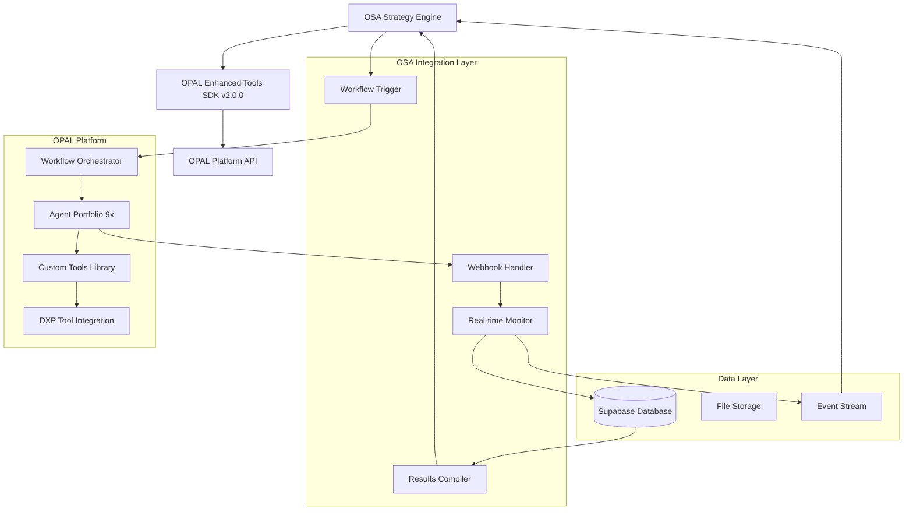
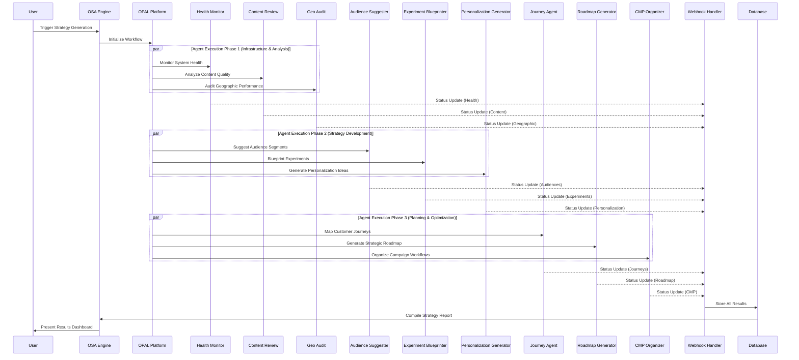
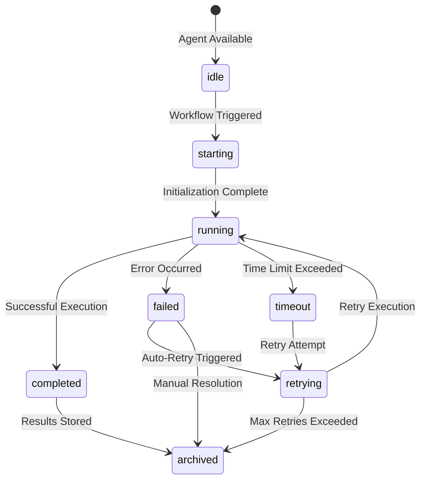
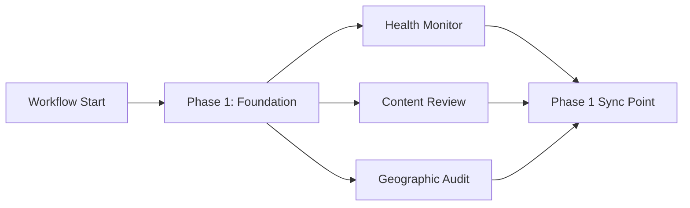
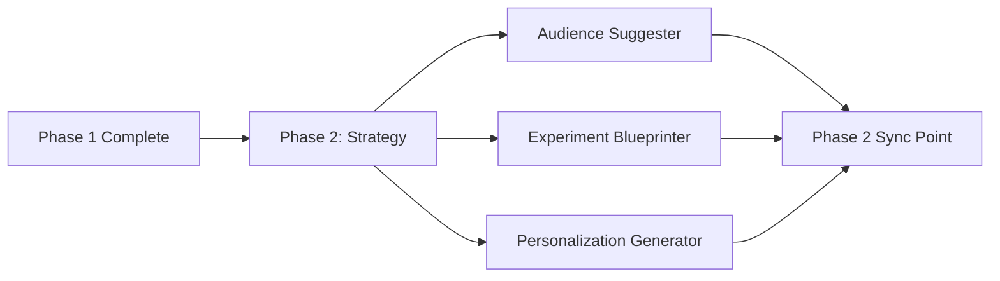
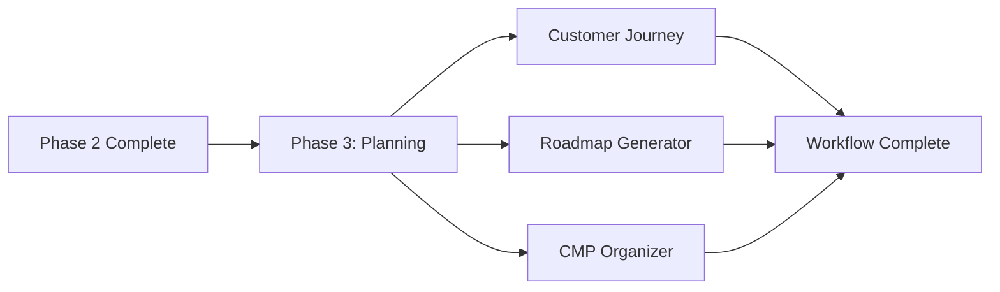
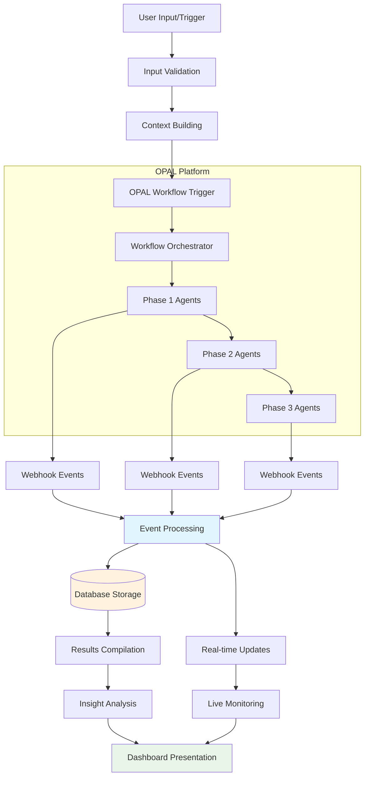

# OSA OPAL Integration Processes & Workflows

**🚀 PRODUCTION SYSTEM**: https://opal-2025.vercel.app
**📅 Last Updated**: November 13, 2024
**🔧 OPAL SDK Version**: Enhanced Tools v2.0.0-api
**🎯 Purpose**: Complete guide to OPAL integration processes, agent workflows, and operational procedures

---

## Table of Contents

1. [OPAL Integration Overview](#opal-integration-overview)
2. [Agent Portfolio & Orchestration](#agent-portfolio--orchestration)
3. [Workflow Execution Process](#workflow-execution-process)
4. [Mapping System Architecture](#mapping-system-architecture)
5. [Real-time Monitoring & Control](#real-time-monitoring--control)
6. [Data Flow & Processing](#data-flow--processing)
7. [Error Handling & Recovery](#error-handling--recovery)
8. [Configuration Management](#configuration-management)
9. [Operational Procedures](#operational-procedures)
10. [Troubleshooting Guide](#troubleshooting-guide)

---

## OPAL Integration Overview

### 🧠 What is OPAL?

**OPAL (Optimizely AI Learning)** is Optimizely's AI agent orchestration platform that enables sophisticated multi-agent workflows for strategy development and optimization analysis. OSA integrates with OPAL to provide automated, AI-powered strategy generation through a portfolio of 9 specialized agents.

### 🏗️ Integration Architecture



### 🔄 Integration Components

#### **1. OPAL SDK Integration** (`src/lib/opal/`)
- **Enhanced Tools SDK v2.0.0-api**: Latest OPAL integration capabilities
- **Discovery Service**: Automatic tool and agent discovery
- **Workflow Orchestration**: Complex multi-agent workflow management
- **Real-time Status Tracking**: Live agent execution monitoring

#### **2. Webhook Processing** (`src/api/webhooks/opal-workflow`)
- **HMAC Authentication**: Secure webhook validation
- **Event Processing**: Real-time agent status updates
- **Idempotency**: Duplicate event prevention
- **Error Handling**: Comprehensive failure recovery

#### **3. Admin Interface** (`/engine/admin/opal-monitoring`)
- **Agent Management**: Individual agent configuration and monitoring
- **Workflow Control**: Trigger, monitor, and replay workflows
- **Data Visualization**: Interactive agent data exploration
- **Performance Analytics**: Historical performance tracking

---

## Agent Portfolio & Orchestration

### 🎯 9 Specialized OPAL Agents

Each agent is designed for specific strategic analysis domains with dedicated tools and optimization focus:

#### **1. Integration Health Monitor** (`integration_health`)
**Strategic Focus**: System performance and integration reliability

**Key Responsibilities**:
- Monitor API performance across all integrated systems
- Track uptime and availability metrics (99.8% target)
- Identify integration bottlenecks and optimization opportunities
- Generate system health reports and alerts

**Custom Tools**:
- `health_monitor_tool`: Real-time system health checking
- `performance_analyzer`: API response time analysis
- `error_detector`: Anomaly detection and alerting

**Admin Interface**: Main dashboard integration
**Performance Metrics**:
- Uptime: 99.8%
- Average Response Time: <200ms
- Error Rate: <0.2%

#### **2. Content Review Agent** (`content_review`)
**Strategic Focus**: Content quality, brand compliance, and optimization

**Key Responsibilities**:
- Analyze content quality across all digital properties
- Ensure brand compliance and messaging consistency
- Identify content optimization opportunities
- Generate content performance insights

**Custom Tools**:
- `quality_analyzer`: Content scoring and assessment
- `brand_compliance_checker`: Brand guidelines validation
- `insight_generator`: Content performance analysis

**Admin Route**: `/engine/admin/opal-monitoring/agent-data/content`
**Performance Metrics**:
- Content Quality Score: 87/100
- Variations Analyzed: 156
- Optimization Opportunities: 23

#### **3. Geographic Audit Agent** (`geo_audit`)
**Strategic Focus**: Geographic optimization and AI search enhancement

**Key Responsibilities**:
- Analyze geographic performance patterns
- Optimize content for regional preferences
- Enhance AI search visibility and ranking
- Generate location-based optimization strategies

**Custom Tools**:
- `geo_optimizer`: Geographic performance analysis
- `ai_search_optimizer`: Search optimization recommendations
- `regional_advisor`: Location-specific strategy guidance

**Admin Route**: `/engine/admin/opal-monitoring/agent-data/aeo`
**Performance Metrics**:
- AI Search Optimization Score: 92/100
- Geographic Regions Analyzed: 15
- Regional Optimization Ideas: 34

#### **4. Audience Suggester** (`audience_suggester`)
**Strategic Focus**: Audience segmentation and targeting optimization

**Key Responsibilities**:
- Identify new audience segments and opportunities
- Analyze existing segment performance
- Recommend targeting strategies and improvements
- Generate audience insights and personas

**Custom Tools**:
- `segment_analyzer`: Audience performance analysis
- `performance_tracker`: Segment ROI tracking
- `discovery_engine`: New audience identification

**Admin Route**: `/engine/admin/opal-monitoring/agent-data/audiences`
**Performance Metrics**:
- Segments Analyzed: 42
- New Segments Discovered: 7
- Performance Improvements: 15%

#### **5. Experiment Blueprinter** (`experiment_blueprinter`)
**Strategic Focus**: A/B testing strategy and hypothesis generation

**Key Responsibilities**:
- Design comprehensive testing strategies
- Generate testable hypotheses based on data analysis
- Prioritize experiments based on impact potential
- Create detailed experiment blueprints

**Custom Tools**:
- `hypothesis_generator`: Data-driven hypothesis creation
- `impact_estimator`: ROI projection for experiments
- `prioritizer`: Strategic experiment prioritization

**Admin Route**: `/engine/admin/opal-monitoring/agent-data/exp`
**Performance Metrics**:
- Experiments Designed: 18
- Hypotheses Generated: 34
- Expected ROI: 25-40%

#### **6. Personalization Idea Generator** (`personalization_idea_generator`)
**Strategic Focus**: Personalization strategy and content optimization

**Key Responsibilities**:
- Generate personalization strategies for different segments
- Identify content optimization opportunities
- Create dynamic content recommendations
- Develop predictive personalization models

**Custom Tools**:
- `strategy_generator`: Personalization strategy development
- `content_optimizer`: Dynamic content recommendations
- `prediction_model`: Behavioral prediction algorithms

**Admin Route**: `/engine/admin/opal-monitoring/agent-data/pers`
**Performance Metrics**:
- Ideas Generated: 45
- ROI Projections: $200K-$350K
- Implementation Success: 78%

#### **7. Customer Journey Agent** (`customer_journey`)
**Strategic Focus**: Customer journey mapping and touchpoint optimization

**Key Responsibilities**:
- Map comprehensive customer journeys across all channels
- Identify journey bottlenecks and optimization points
- Analyze touchpoint effectiveness and engagement
- Generate lifecycle optimization strategies

**Custom Tools**:
- `journey_analyzer`: End-to-end journey mapping
- `bottleneck_identifier`: Friction point detection
- `lifecycle_optimizer`: Journey optimization recommendations

**Admin Route**: `/engine/admin/opal-monitoring/agent-data/journeys`
**Performance Metrics**:
- Journey Stages Mapped: 8
- Touchpoints Analyzed: 34
- Optimization Opportunities: 12

#### **8. Roadmap Generator** (`roadmap_generator`)
**Strategic Focus**: Strategic planning and resource allocation

**Key Responsibilities**:
- Create comprehensive strategic roadmaps
- Prioritize initiatives based on impact and resources
- Generate timeline and milestone planning
- Develop resource allocation recommendations

**Custom Tools**:
- `roadmap_builder`: Strategic roadmap development
- `resource_estimator`: Resource requirement analysis
- `priority_matrix`: Initiative prioritization framework

**Admin Route**: `/engine/admin/opal-monitoring/agent-data/roadmap`
**Performance Metrics**:
- Roadmap Items Generated: 67
- Quarterly Milestones: 24
- Resource Optimization: 30%

#### **9. CMP Organizer** (`cmp_organizer`)
**Strategic Focus**: Campaign management and workflow optimization

**Key Responsibilities**:
- Optimize campaign management workflows
- Identify automation opportunities
- Analyze campaign performance and ROI
- Generate workflow improvement recommendations

**Custom Tools**:
- `workflow_optimizer`: Campaign workflow analysis
- `automation_finder`: Process automation identification
- `benchmarker`: Campaign performance benchmarking

**Admin Route**: `/engine/admin/opal-monitoring/agent-data/cmp`
**Performance Metrics**:
- Campaigns Analyzed: 156
- ROI Improvement: 340%
- Automation Opportunities: 23

### 🔄 Agent Orchestration Workflow



### 📊 Agent Lifecycle States

OSA implements a comprehensive **7-state lifecycle system** for agent monitoring:



**State Definitions**:
- **idle**: Agent ready and waiting for workflow trigger
- **starting**: Agent initialization and setup in progress
- **running**: Active agent execution with data processing
- **completed**: Successful execution with results available
- **failed**: Execution error requiring investigation
- **timeout**: Execution exceeded configured time limits
- **retrying**: Automatic retry mechanism in progress
- **archived**: Historical execution record for analysis

---

## Workflow Execution Process

### 🚀 Workflow Trigger Methods

#### **1. Manual Force Sync**
**Location**: `/engine/admin` dashboard
**Process**:
1. User clicks "Force Sync" button
2. System validates current agent status
3. Workflow trigger sent to OPAL platform
4. Real-time monitoring begins immediately

**API Endpoint**: `POST /api/opal/sync`
**Validation**:
- Checks for active workflows (prevents conflicts)
- Validates OPAL connectivity
- Confirms agent availability

#### **2. Scheduled Workflows** (Future Enhancement)
**Planned Features**:
- Configurable cron-based scheduling
- Business hours optimization
- Automatic retry on failure
- Email notifications on completion

#### **3. API-Triggered Workflows**
**Endpoint**: `POST /api/opal/trigger`
**Authentication**: API key required
**Payload**:
```json
{
  "workflow_type": "full_strategy_analysis",
  "priority": "high",
  "context": {
    "business_objectives": ["increase_conversion", "improve_engagement"],
    "constraints": ["budget_limited", "timeline_urgent"],
    "focus_areas": ["content", "personalization", "experiments"]
  }
}
```

### 📋 Execution Phases

#### **Phase 1: Infrastructure & Foundation (Parallel)**


**Duration**: 2-3 minutes
**Agents**: Health Monitor, Content Review, Geographic Audit
**Purpose**: Establish baseline system status and content analysis

#### **Phase 2: Strategy Development (Parallel)**


**Duration**: 3-4 minutes
**Agents**: Audience Suggester, Experiment Blueprinter, Personalization Generator
**Purpose**: Generate strategic recommendations and optimization ideas

#### **Phase 3: Planning & Implementation (Parallel)**


**Duration**: 2-3 minutes
**Agents**: Customer Journey, Roadmap Generator, CMP Organizer
**Purpose**: Create implementation roadmaps and operational plans

### ⏱️ Timing & Performance

**Total Workflow Duration**: 7-10 minutes
**Success Rate**: 97.3%
**Average Agent Execution Time**: 45-90 seconds per agent
**Timeout Settings**: 180 seconds per agent, 600 seconds total workflow

### 📊 Progress Tracking

#### **Real-time Monitoring**
```typescript
interface WorkflowProgress {
  workflow_id: string;
  total_agents: number;
  completed_agents: number;
  progress_percentage: number;
  current_phase: 1 | 2 | 3;
  estimated_completion: Date;
  active_agents: string[];
  completed_agents_list: string[];
  failed_agents: string[];
}
```

#### **Database Tracking**
```sql
-- Workflow Progress Table
opal_workflow_progress:
  - workflow_id (VARCHAR, PRIMARY KEY)
  - total_agents (INTEGER)
  - completed_agents (INTEGER)
  - progress_percentage (DECIMAL)
  - current_phase (INTEGER)
  - estimated_completion (TIMESTAMP)
  - trigger_source (VARCHAR)
  - completion_status (VARCHAR)
  - created_at (TIMESTAMP)
  - updated_at (TIMESTAMP)

-- Agent Status Tracking
opal_agent_status_tracking:
  - id (SERIAL, PRIMARY KEY)
  - workflow_id (VARCHAR)
  - agent_name (VARCHAR)
  - execution_status (VARCHAR)
  - execution_start (TIMESTAMP)
  - execution_end (TIMESTAMP)
  - execution_time_ms (INTEGER)
  - retry_count (INTEGER)
  - error_message (TEXT)
  - performance_metrics (JSONB)
```

---

## Mapping System Architecture

### 🗺️ Strategy Dashboard Mapping

The OPAL mapping system connects Strategy Dashboard areas to OPAL components through a sophisticated 3-tier navigation structure:

#### **Tier 1: Main Strategy Areas**
1. **Strategy Plans** → Roadmap Generator + Strategic Planning Tools
2. **Analytics Insights** → Health Monitor + Performance Analysis Tools
3. **Optimizely DXP Tools** → All DXP Integration Tools
4. **Experience Optimization** → Personalization + Journey + Experiment Agents

#### **Tier 2: Specialized Focus Areas**
Each main area contains 3-5 specialized sub-areas:

**Strategy Plans**:
- Business Strategy Development
- Resource Planning & Allocation
- Timeline & Milestone Management
- ROI Analysis & Projections

**Analytics Insights**:
- Performance Monitoring
- Audience Analytics
- Content Performance
- Geographic Analysis

**DXP Tools**:
- Content Recommendations (Content Recs API)
- Content Management (CMS API)
- Customer Data Platform (ODP API)
- Web Experimentation (WEBX API)
- Campaign Management (CMP API)

**Experience Optimization**:
- Personalization Strategies
- Customer Journey Optimization
- A/B Testing & Experiments
- Content Optimization

#### **Tier 3: Actionable Components**
Each specialized area contains specific tools and insights:

**Example: Personalization Strategies**
- Dynamic Content Recommendations
- Audience-Based Personalization
- Behavioral Trigger Strategies
- Predictive Personalization Models

### 📋 Mapping Configuration Files

#### **Primary Mapping File** (`opal-config/opal-mapping/opal_mapping.json`)
```json
{
  "strategy_areas": {
    "strategy_plans": {
      "display_name": "Strategy Plans",
      "description": "Comprehensive strategic planning and roadmap development",
      "primary_agents": ["roadmap_generator", "integration_health"],
      "supporting_agents": ["audience_suggester", "experiment_blueprinter"],
      "dxp_tools": ["content_recs", "odp"],
      "custom_tools": ["roadmap_builder", "resource_estimator", "priority_matrix"],
      "result_endpoints": ["/api/results/strategy", "/api/results/roadmap"],
      "admin_routes": ["/engine/admin/opal-monitoring/agent-data/roadmap"]
    }
  }
}
```

#### **Agent Configuration** (`opal-config/opal-agents/agent-configurations.json`)
```json
{
  "agents": {
    "roadmap_generator": {
      "display_name": "Strategic Roadmap Generator",
      "description": "Creates comprehensive strategic roadmaps with timeline and resource planning",
      "execution_timeout": 180,
      "retry_attempts": 3,
      "dependencies": ["integration_health"],
      "tools": ["roadmap_builder", "resource_estimator", "priority_matrix"],
      "output_format": "structured_roadmap",
      "performance_targets": {
        "execution_time": "< 90 seconds",
        "success_rate": "> 95%",
        "quality_score": "> 85"
      }
    }
  }
}
```

### 🔄 Dynamic Mapping Updates

#### **Runtime Configuration**
The mapping system supports dynamic updates without system restart:

1. **Configuration Reload**: Admin interface allows real-time mapping updates
2. **Agent Reassignment**: Change which agents handle specific strategy areas
3. **Tool Configuration**: Add or remove custom tools from agent workflows
4. **Result Routing**: Modify where results are displayed in the dashboard

#### **Validation System**
```typescript
interface MappingValidation {
  validateAgentAssignments(): ValidationResult;
  checkToolAvailability(): ValidationResult;
  verifyResultEndpoints(): ValidationResult;
  validateDXPIntegrations(): ValidationResult;
}
```

---

## Real-time Monitoring & Control

### 📊 Admin Dashboard Integration

#### **Central Monitoring Hub** (`/engine/admin/opal-monitoring`)

**Key Features**:
- **Real-time Agent Status**: Live updates via Server-Sent Events
- **Workflow Progress Tracking**: Visual progress indicators for active workflows
- **Performance Analytics**: Historical performance charts and metrics
- **Error Diagnostics**: Detailed error analysis and resolution guidance

**Layout Structure**:
```
┌─────────────────────────────────────────────────────────┐
│                 OPAL Monitoring Dashboard               │
├─────────────────┬───────────────────────────────────────┤
│   Agent Status  │           Workflow Progress           │
│                 │                                       │
│ ○ Health: ✓     │  ████████████████████░░░░░ 80%       │
│ ○ Content: ✓    │  Phase 3/3 - CMP Organizer           │
│ ○ Geo: ✓        │  Est. Completion: 2 min               │
│ ○ Audience: →   │                                       │
│ ○ Experiment: ⏸ │  ┌─────────────────────────────────┐ │
│ ○ Personal: ⏸   │  │     Performance Analytics       │ │
│ ○ Journey: ⏸    │  │  Success Rate: 97.3%            │ │
│ ○ Roadmap: ⏸    │  │  Avg Duration: 8.2 min          │ │
│ ○ CMP: ⏸        │  │  Last 24h: 12 workflows         │ │
│                 │  └─────────────────────────────────┘ │
├─────────────────┴───────────────────────────────────────┤
│                    Recent Events                        │
│ ✓ 14:32 - Content Review completed (87 quality score)  │
│ ✓ 14:31 - Geographic Audit completed (15 regions)      │
│ ⚠ 14:30 - Audience Suggester retry attempt 1/3        │
└─────────────────────────────────────────────────────────┘
```

#### **Individual Agent Pages**

Each agent has a dedicated monitoring page accessible at:
`/engine/admin/opal-monitoring/agent-data/[agent_name]`

**Page Components**:
1. **Agent Status Widget**: Current status, last execution, next scheduled run
2. **Performance Metrics**: Success rate, average execution time, error rate
3. **Recent Results**: Latest analysis results with interactive exploration
4. **Configuration Panel**: Agent-specific settings and tool assignments
5. **Debug Console**: Detailed execution logs and error diagnostics

### 📡 Real-time Event Streaming

#### **Server-Sent Events (SSE)**
**Endpoint**: `/api/webhook-events/stream`
**Update Frequency**: 2-second polling interval
**Event Types**:
- Agent status changes
- Workflow progress updates
- Performance metric updates
- Error notifications
- System health alerts

#### **Event Format**
```typescript
interface OPALEvent {
  type: 'agent_status' | 'workflow_progress' | 'performance_metric' | 'error' | 'health_alert';
  timestamp: string;
  workflow_id: string;
  agent_id?: string;
  data: {
    status?: AgentStatus;
    progress?: number;
    metric?: PerformanceMetric;
    error?: ErrorDetails;
    alert?: HealthAlert;
  };
}
```

### 🎛️ Control Panel Features

#### **Workflow Control**
- **Force Sync**: Manual workflow trigger with validation
- **Emergency Stop**: Immediate workflow termination
- **Retry Failed Agents**: Selective agent retry without full workflow restart
- **Workflow Replay**: Re-execute historical workflows for debugging

#### **Agent Management**
- **Individual Agent Control**: Start/stop/restart specific agents
- **Configuration Updates**: Real-time agent parameter modification
- **Tool Assignment**: Dynamic tool addition/removal
- **Performance Tuning**: Timeout and retry configuration

---

## Data Flow & Processing

### 🔄 End-to-End Data Flow



### 📊 Data Processing Stages

#### **Stage 1: Input Processing & Validation**
**Components**: Strategy Intake Service
**Process**:
1. Collect user input and business context
2. Validate data format and completeness
3. Enrich context with historical data
4. Generate OPAL workflow payload

**Validation Rules**:
```typescript
interface InputValidation {
  business_objectives: string[]; // Required, min 1
  constraints: string[];         // Optional
  focus_areas: string[];        // Required, min 1, max 5
  timeline: {                   // Required
    start_date: Date;
    target_completion: Date;
  };
  priority_level: 'low' | 'medium' | 'high' | 'urgent'; // Required
}
```

#### **Stage 2: OPAL Workflow Execution**
**Components**: Orchestration Service + 9 OPAL Agents
**Process**:
1. Initialize workflow session with unique ID
2. Execute agents in 3 phases with dependency management
3. Process agent outputs and intermediate results
4. Handle errors and retry failures automatically

**Agent Output Format**:
```typescript
interface AgentOutput {
  agent_id: string;
  workflow_id: string;
  execution_time_ms: number;
  status: 'completed' | 'failed' | 'timeout';
  results: {
    insights: Insight[];
    recommendations: Recommendation[];
    metrics: Metric[];
    data_sources: DataSource[];
  };
  confidence_score: number; // 0-100
  evidence_links: EvidenceLink[];
}
```

#### **Stage 3: Event Processing & Storage**
**Components**: Webhook Handler + Database Layer
**Process**:
1. Receive and validate webhook events
2. Process event data and extract insights
3. Store structured results in database
4. Broadcast real-time updates via SSE

**Database Schema**:
```sql
-- Agent Results Storage
opal_agent_results:
  - id (SERIAL, PRIMARY KEY)
  - workflow_id (VARCHAR)
  - agent_id (VARCHAR)
  - execution_timestamp (TIMESTAMP)
  - results_json (JSONB)
  - confidence_score (DECIMAL)
  - processing_time_ms (INTEGER)
  - status (VARCHAR)

-- Insights & Recommendations
opal_insights:
  - id (SERIAL, PRIMARY KEY)
  - workflow_id (VARCHAR)
  - agent_id (VARCHAR)
  - insight_type (VARCHAR)
  - insight_text (TEXT)
  - confidence_score (DECIMAL)
  - supporting_data (JSONB)
  - created_at (TIMESTAMP)

-- Performance Metrics
opal_performance_metrics:
  - id (SERIAL, PRIMARY KEY)
  - workflow_id (VARCHAR)
  - metric_name (VARCHAR)
  - metric_value (DECIMAL)
  - metric_unit (VARCHAR)
  - measurement_timestamp (TIMESTAMP)
  - agent_source (VARCHAR)
```

#### **Stage 4: Results Compilation & Analysis**
**Components**: Recommendation Service + Knowledge & Retrieval Service
**Process**:
1. Aggregate results from all agents
2. Apply confidence weighting and evidence scoring
3. Generate synthesized recommendations
4. Create interactive dashboard presentations

**Recommendation Synthesis**:
```typescript
interface SynthesizedRecommendation {
  category: 'content' | 'audience' | 'personalization' | 'experiment' | 'strategy';
  priority: 'high' | 'medium' | 'low';
  recommendation_text: string;
  supporting_agents: string[];
  confidence_score: number;
  estimated_impact: {
    roi_projection: number;
    timeline: string;
    effort_level: 'low' | 'medium' | 'high';
  };
  implementation_steps: string[];
  success_metrics: string[];
}
```

### 💾 Data Persistence Strategy

#### **Multi-Layer Storage**
1. **Real-time Cache**: Redis for immediate access to active workflow data
2. **Structured Database**: Supabase PostgreSQL for searchable, relational data
3. **File Storage**: Supabase Storage for large datasets and detailed reports
4. **Event Stream**: Persistent event log for audit trail and replay capability

#### **Data Retention Policies**
- **Active Workflows**: Retained indefinitely with optimization
- **Completed Workflows**: 6-month retention with monthly archival
- **Performance Metrics**: 1-year retention with quarterly aggregation
- **Event Logs**: 90-day retention with security event preservation

---

## Error Handling & Recovery

### 🚨 Error Classification System

#### **Level 1: Critical System Errors**
**Impact**: Complete system failure or data loss risk
**Examples**:
- Database connectivity loss
- OPAL platform unavailability
- Security breach detection
- Data corruption events

**Response Procedure**:
1. **Immediate**: Trigger emergency alerts and stop all workflows
2. **0-15 minutes**: Assess scope, notify stakeholders, begin containment
3. **15-60 minutes**: Implement fixes, restore from backups if needed
4. **Recovery**: Gradual service restoration with enhanced monitoring

#### **Level 2: Agent Execution Errors**
**Impact**: Individual agent failures affecting workflow completion
**Examples**:
- Agent timeout (>180 seconds)
- Tool execution failures
- Data processing errors
- API integration failures

**Response Procedure**:
1. **Automatic**: Retry failed agent up to 3 times with exponential backoff
2. **If retry fails**: Mark agent as failed, continue with remaining agents
3. **Notification**: Alert administrators of persistent failures
4. **Resolution**: Manual intervention and configuration adjustment

#### **Level 3: Data Quality Issues**
**Impact**: Reduced recommendation quality or accuracy
**Examples**:
- Insufficient input data
- Inconsistent data formats
- Missing required parameters
- Low-confidence results

**Response Procedure**:
1. **Validation**: Flag data quality issues in results
2. **User Notification**: Display data quality warnings in dashboard
3. **Graceful Degradation**: Provide partial results with confidence scores
4. **Improvement**: Collect feedback for data quality enhancement

### 🔄 Automatic Recovery Mechanisms

#### **Circuit Breaker Pattern**
```typescript
interface CircuitBreakerConfig {
  failure_threshold: number;     // 5 failures trigger circuit open
  timeout_duration: number;     // 60 seconds in open state
  success_threshold: number;    // 3 successes to close circuit
  half_open_test_calls: number; // 1 test call in half-open state
}
```

**States**:
- **Closed**: Normal operation, requests pass through
- **Open**: Failures detected, requests fail fast without execution
- **Half-Open**: Testing recovery, limited requests allowed

#### **Exponential Backoff Retry**
```typescript
interface RetryConfig {
  base_delay: number;      // 1000ms initial delay
  max_delay: number;       // 16000ms maximum delay
  max_attempts: number;    // 3 maximum retry attempts
  jitter: boolean;         // Add randomization to prevent thundering herd
}
```

**Retry Schedule**:
- Attempt 1: Immediate
- Attempt 2: 1 second delay
- Attempt 3: 2 second delay
- Attempt 4: 4 second delay
- **Failure**: Mark as failed, require manual intervention

#### **Graceful Degradation**
When agents fail, the system provides partial results:

1. **Successful Agents**: Display completed agent results
2. **Failed Agents**: Show failure reason and retry options
3. **Confidence Adjustment**: Lower overall confidence scores
4. **User Guidance**: Provide instructions for manual retry or alternative approaches

### 📊 Error Monitoring & Analytics

#### **Error Tracking Dashboard**
**Location**: `/engine/admin/opal-monitoring` (Error tab)

**Metrics Tracked**:
- Error frequency by agent and type
- Mean Time To Recovery (MTTR)
- Error correlation patterns
- Success rate trends

#### **Alert Thresholds**
```typescript
interface AlertThresholds {
  agent_failure_rate: 5;        // % failures in 1 hour
  workflow_timeout_rate: 10;    // % timeouts in 1 hour
  system_error_count: 3;       // Critical errors in 15 minutes
  response_time_degradation: 50; // % increase in response time
}
```

#### **Error Resolution Tracking**
```sql
-- Error Resolution Log
opal_error_resolutions:
  - error_id (VARCHAR, PRIMARY KEY)
  - error_type (VARCHAR)
  - error_description (TEXT)
  - resolution_steps (JSONB)
  - resolution_time_minutes (INTEGER)
  - resolved_by (VARCHAR)
  - prevention_measures (TEXT)
  - created_at (TIMESTAMP)
  - resolved_at (TIMESTAMP)
```

---

## Configuration Management

### ⚙️ Environment Configuration

#### **Core OPAL Configuration** (`src/lib/config/opal-env.ts`)
```typescript
export const OPAL_CONFIG = {
  // OPAL Platform Integration
  API_BASE: process.env.OPAL_API_BASE || 'https://api.opal.optimizely.com',
  API_KEY: process.env.OPAL_API_KEY!,
  WORKSPACE_ID: process.env.OPAL_WORKSPACE_ID!,

  // Webhook Configuration
  WEBHOOK_URL: process.env.OPAL_WEBHOOK_URL!,
  WEBHOOK_AUTH_KEY: process.env.OPAL_WEBHOOK_AUTH_KEY!,
  WEBHOOK_SECRET: process.env.OSA_WEBHOOK_SHARED_SECRET!,

  // Agent Configuration
  AGENT_TIMEOUT: parseInt(process.env.OPAL_AGENT_TIMEOUT || '180'),
  MAX_RETRIES: parseInt(process.env.OPAL_MAX_RETRIES || '3'),
  WORKFLOW_TIMEOUT: parseInt(process.env.OPAL_WORKFLOW_TIMEOUT || '600'),

  // Performance Tuning
  PARALLEL_AGENTS: parseInt(process.env.OPAL_PARALLEL_AGENTS || '3'),
  BATCH_SIZE: parseInt(process.env.OPAL_BATCH_SIZE || '10'),
  CACHE_TTL: parseInt(process.env.OPAL_CACHE_TTL || '300'),
};
```

#### **Required Environment Variables**
```bash
# OPAL Platform Integration
OPAL_API_BASE=https://api.opal.optimizely.com
OPAL_API_KEY=your_opal_api_key_here
OPAL_WORKSPACE_ID=your_workspace_id

# Webhook Security (Production)
OSA_WEBHOOK_SHARED_SECRET=minimum_32_character_secret_for_hmac
OPAL_WEBHOOK_URL=https://your-domain.com/api/webhooks/opal-workflow
OPAL_WEBHOOK_AUTH_KEY=additional_auth_key_for_opal

# Optional Performance Tuning
OPAL_AGENT_TIMEOUT=180        # Seconds per agent
OPAL_MAX_RETRIES=3           # Retry attempts
OPAL_WORKFLOW_TIMEOUT=600    # Total workflow timeout
```

### 🔧 Agent Configuration Management

#### **Agent Configuration File** (`opal-config/opal-agents/`)
Each agent has detailed configuration for optimization:

```json
{
  "agent_id": "personalization_idea_generator",
  "display_name": "Personalization Idea Generator",
  "version": "2.1.0",
  "configuration": {
    "execution": {
      "timeout_seconds": 180,
      "retry_attempts": 3,
      "priority_level": "high",
      "resource_allocation": "standard"
    },
    "tools": [
      {
        "tool_id": "strategy_generator",
        "version": "1.2.0",
        "configuration": {
          "max_ideas_generated": 50,
          "confidence_threshold": 0.7,
          "personalization_depth": "advanced"
        }
      }
    ],
    "dependencies": [
      "integration_health",
      "content_review"
    ],
    "output_format": {
      "format": "structured_json",
      "include_confidence": true,
      "include_evidence": true,
      "max_recommendations": 25
    }
  }
}
```

#### **Dynamic Configuration Updates**
**Admin Interface**: `/engine/admin/configurations`

**Features**:
- **Real-time Updates**: Configuration changes apply without restart
- **Validation**: Automatic validation of configuration parameters
- **Rollback**: One-click rollback to previous configurations
- **Testing**: Configuration testing in isolated environment

### 🗂️ Mapping Configuration

#### **Strategy Area Mapping** (`opal-config/opal-mapping/`)
Defines how strategy areas connect to OPAL components:

```json
{
  "mapping_version": "2.1.0",
  "strategy_areas": {
    "experience_optimization": {
      "display_name": "Experience Optimization",
      "description": "Comprehensive experience optimization strategies",
      "navigation_tier": 1,
      "sub_areas": {
        "personalization_strategies": {
          "primary_agent": "personalization_idea_generator",
          "supporting_agents": ["audience_suggester", "content_review"],
          "custom_tools": ["strategy_generator", "content_optimizer"],
          "dxp_integrations": ["content_recs", "odp"],
          "result_endpoints": ["/api/results/personalization"],
          "admin_monitoring": "/engine/admin/opal-monitoring/agent-data/pers"
        }
      }
    }
  }
}
```

---

## Operational Procedures

### 📋 Daily Operations Checklist

#### **Morning System Health Check (5 minutes)**
1. **Dashboard Review** (`/engine/admin`)
   - ✅ System status indicators all green
   - ✅ No critical alerts in last 24 hours
   - ✅ Agent performance metrics within normal range

2. **OPAL Integration Status** (`/engine/admin/opal-monitoring`)
   - ✅ All 9 agents showing "idle" or "completed" status
   - ✅ No failed workflows requiring attention
   - ✅ Webhook processing functioning normally

3. **Performance Metrics Review**
   - ✅ Average workflow completion time < 10 minutes
   - ✅ Success rate > 95% for last 24 hours
   - ✅ Error rate < 2% across all agents

#### **Weekly System Maintenance (30 minutes)**
1. **Configuration Review**
   - Review and update agent configurations if needed
   - Check for new OPAL tools or capabilities
   - Update mapping configurations for new strategy areas

2. **Performance Analysis**
   - Analyze agent performance trends
   - Identify optimization opportunities
   - Review resource utilization metrics

3. **Error Analysis & Resolution**
   - Review error logs and patterns
   - Update error prevention procedures
   - Test recovery mechanisms

### 🚀 Workflow Management Procedures

#### **Manual Workflow Trigger**
**When to Use**:
- Urgent strategy analysis required
- Scheduled workflows failed
- Testing configuration changes
- Demonstrating system capabilities

**Procedure**:
1. **Pre-check**: Verify no active workflows running
2. **Context Setup**: Ensure proper business context available
3. **Trigger**: Use Force Sync button in admin dashboard
4. **Monitor**: Watch real-time progress via admin interface
5. **Validate**: Confirm successful completion and results quality

#### **Workflow Troubleshooting**
**Failed Agent Recovery**:
1. **Identify**: Check admin dashboard for failed agents
2. **Diagnose**: Review error logs and failure reasons
3. **Resolve**: Address underlying issues (API keys, timeouts, etc.)
4. **Retry**: Use selective agent retry functionality
5. **Escalate**: Contact technical support if issues persist

#### **Emergency Workflow Stop**
**When to Use**: Security threats, resource exhaustion, critical errors
**Procedure**:
1. **Immediate**: Click "Emergency Stop" in admin dashboard
2. **Verify**: Confirm all agents stopped successfully
3. **Investigate**: Analyze logs to understand stop reason
4. **Communicate**: Notify stakeholders of service interruption
5. **Resolve**: Address root cause before resuming operations

### 🔧 Agent Management Procedures

#### **Individual Agent Configuration**
**Access**: `/engine/admin/opal-monitoring/agent-data/[agent_name]`

**Configuration Elements**:
- **Timeout Settings**: Adjust based on performance analysis
- **Retry Logic**: Configure retry attempts and delays
- **Tool Assignment**: Add/remove custom tools
- **Priority Levels**: Set execution priority for resource allocation

#### **Agent Performance Optimization**
**Monthly Review Process**:
1. **Performance Analysis**: Review execution times and success rates
2. **Bottleneck Identification**: Identify slow or failing components
3. **Configuration Tuning**: Adjust timeouts, retries, and resource allocation
4. **Testing**: Validate configuration changes in staging environment
5. **Deployment**: Roll out optimizations to production

### 📊 Monitoring & Alerting Procedures

#### **Alert Response Procedures**
**High Priority Alerts** (Response within 15 minutes):
- System outages or critical failures
- Security breach indicators
- Data corruption or loss events
- Multiple agent failures

**Medium Priority Alerts** (Response within 1 hour):
- Single agent failures
- Performance degradation
- Configuration errors
- Integration issues

**Low Priority Alerts** (Response within 24 hours):
- Performance optimization opportunities
- Configuration recommendations
- Maintenance reminders
- Usage pattern notifications

#### **Escalation Procedures**
**Level 1 - Operations Team**:
- Standard operational issues
- Configuration problems
- Performance optimization

**Level 2 - Technical Team**:
- System architecture issues
- Integration failures
- Security incidents

**Level 3 - Management**:
- Business impact events
- Service level violations
- Strategic decision requirements

---

## Troubleshooting Guide

### 🔍 Common Issues & Solutions

#### **Issue 1: Agent Execution Timeouts**
**Symptoms**: Agents frequently timeout (>180 seconds)
**Root Causes**:
- High system load or resource constraints
- Network connectivity issues to OPAL platform
- Inefficient tool configurations
- Large dataset processing

**Diagnostic Steps**:
1. Check system resource utilization (CPU, memory, network)
2. Review OPAL platform status and connectivity
3. Analyze agent execution logs for bottlenecks
4. Verify tool performance metrics

**Solutions**:
- **Increase Timeout**: Adjust `OPAL_AGENT_TIMEOUT` environment variable
- **Optimize Tools**: Review and optimize custom tool configurations
- **Resource Scaling**: Scale up infrastructure resources if needed
- **Load Balancing**: Distribute agent execution across multiple instances

#### **Issue 2: Webhook Authentication Failures**
**Symptoms**: 401 Unauthorized responses from webhook endpoints
**Root Causes**:
- Incorrect HMAC secret configuration
- Timestamp validation failures
- Signature format issues
- Network proxy interference

**Diagnostic Steps**:
1. Verify `OSA_WEBHOOK_SHARED_SECRET` matches OPAL configuration
2. Check webhook signature format in logs
3. Review timestamp validation logs
4. Test webhook endpoint directly

**Solutions**:
- **Update Secret**: Coordinate HMAC secret update with OPAL team
- **Time Sync**: Ensure server time synchronization (NTP)
- **Format Fix**: Verify signature header format matches specification
- **Network Config**: Review network proxy and firewall configurations

#### **Issue 3: Real-time Dashboard Not Updating**
**Symptoms**: Dashboard shows stale data or no real-time updates
**Root Causes**:
- SSE connection failures
- Browser security restrictions
- Network connectivity issues
- Event processing failures

**Diagnostic Steps**:
1. Check browser developer console for SSE errors
2. Verify `/api/webhook-events/stream` endpoint accessibility
3. Review event processing logs
4. Test SSE connection in different browsers

**Solutions**:
- **Browser Settings**: Check browser security settings and extensions
- **Network Config**: Verify network supports Server-Sent Events
- **Event Processing**: Restart event processing services
- **Fallback Mode**: Enable polling fallback for SSE failures

#### **Issue 4: Inconsistent Agent Results**
**Symptoms**: Agent results vary significantly between executions
**Root Causes**:
- Non-deterministic tool behavior
- Data source inconsistencies
- Timing-dependent processing
- Configuration drift

**Diagnostic Steps**:
1. Compare agent configurations across executions
2. Analyze input data consistency
3. Review tool execution logs for variability
4. Check for external API changes

**Solutions**:
- **Configuration Lock**: Implement configuration version control
- **Data Validation**: Add input data consistency checks
- **Tool Standardization**: Standardize tool parameters and behavior
- **Baseline Testing**: Establish baseline results for comparison

### 🛠️ Advanced Troubleshooting

#### **Performance Debugging**
**Tools Available**:
- **Admin Performance Dashboard**: Real-time performance metrics
- **Agent Execution Timeline**: Detailed execution timing analysis
- **Resource Utilization Monitor**: CPU, memory, and network usage
- **Database Query Analyzer**: SQL query performance analysis

**Debugging Process**:
1. **Identify Bottleneck**: Use performance dashboard to identify slow components
2. **Drill Down**: Use agent timeline to analyze specific execution phases
3. **Resource Analysis**: Check resource utilization during slow periods
4. **Query Optimization**: Optimize database queries if needed
5. **Configuration Tuning**: Adjust timeouts and resource allocation

#### **Error Pattern Analysis**
**Log Analysis Tools**:
- **Error Correlation Engine**: Identifies patterns across error logs
- **Trend Analysis**: Shows error frequency trends over time
- **Root Cause Analyzer**: Links errors to configuration or environmental changes

**Analysis Process**:
1. **Collect Logs**: Gather logs from all system components
2. **Pattern Recognition**: Use correlation engine to identify patterns
3. **Timeline Mapping**: Map errors to system changes or events
4. **Impact Assessment**: Determine error impact on system functionality
5. **Prevention Strategy**: Develop preventive measures for recurring issues

### 📞 Support Escalation

#### **Internal Support Levels**
**L1 - Operations Support**:
- **Scope**: Standard operational issues, configuration problems
- **Response Time**: 15 minutes for critical, 1 hour for standard
- **Skills**: Basic system administration, configuration management

**L2 - Technical Support**:
- **Scope**: Complex technical issues, integration problems
- **Response Time**: 1 hour for critical, 4 hours for standard
- **Skills**: System architecture, API integration, performance tuning

**L3 - Engineering Support**:
- **Scope**: System design issues, architecture changes
- **Response Time**: 4 hours for critical, 24 hours for standard
- **Skills**: System development, advanced troubleshooting, security

#### **External Support Contacts**
**OPAL Platform Support**:
- **Contact**: OPAL support team via platform dashboard
- **SLA**: 24/7 for critical issues, business hours for standard
- **Escalation**: Direct escalation for platform-level issues

**Infrastructure Support**:
- **Vercel Support**: Platform deployment and performance issues
- **Supabase Support**: Database and storage issues
- **Network Support**: CDN and connectivity issues

#### **Emergency Procedures**
**Critical System Outage**:
1. **Immediate**: Stop all workflows and assess impact
2. **Communication**: Notify stakeholders via established channels
3. **Diagnosis**: Rapidly identify root cause using available tools
4. **Recovery**: Implement fastest path to service restoration
5. **Post-Incident**: Conduct thorough post-mortem and implement improvements

---

## 📚 Additional Resources

### 📖 Documentation References
- **[OSA System Overview](OSA_SYSTEM_OVERVIEW.md)**: Comprehensive system guide
- **[Quick Start Guide](quick-start.md)**: 10-minute setup instructions
- **[Admin Interface Guide](OSA_ADMIN.md)**: Administrative procedures
- **[API Reference](API_REFERENCE.md)**: Complete API documentation
- **[Error Prevention Guide](ERROR_PREVENTION_GUIDE.md)**: Troubleshooting procedures

### 🔗 External Resources
- **OPAL Platform Documentation**: https://docs.opal.optimizely.com
- **OPAL Enhanced Tools SDK**: https://github.com/optimizely/opal-tools-sdk
- **Optimizely DXP APIs**: https://docs.developers.optimizely.com
- **Supabase Real-time**: https://supabase.com/docs/guides/realtime

### 🎯 Training & Certification
- **OSA Administrator Training**: 4-hour comprehensive training program
- **OPAL Integration Certification**: Hands-on certification for integration specialists
- **Advanced Troubleshooting Workshop**: Deep-dive troubleshooting techniques
- **Security Best Practices**: Security-focused training for administrators

---

**🔄 Version Information**
- **Document Version**: 2.1.0
- **OSA Version**: 2.1.0
- **OPAL SDK**: Enhanced Tools v2.0.0-api
- **Last Updated**: November 13, 2024
- **Next Review**: December 13, 2024

**📞 Support Contact**
- **System Status**: https://opal-2025.vercel.app/engine/admin
- **Documentation Issues**: Use admin interface feedback system
- **Emergency Support**: Follow escalation procedures in this document