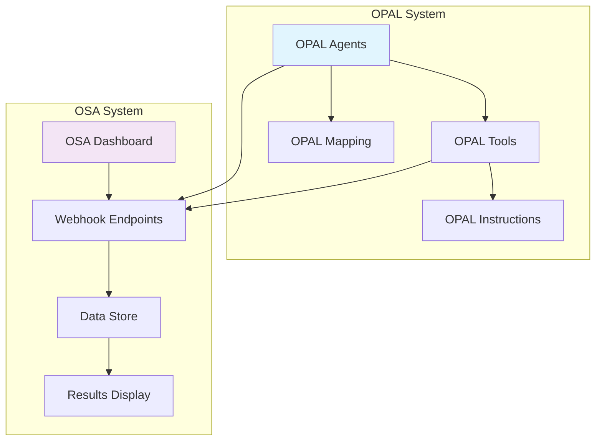
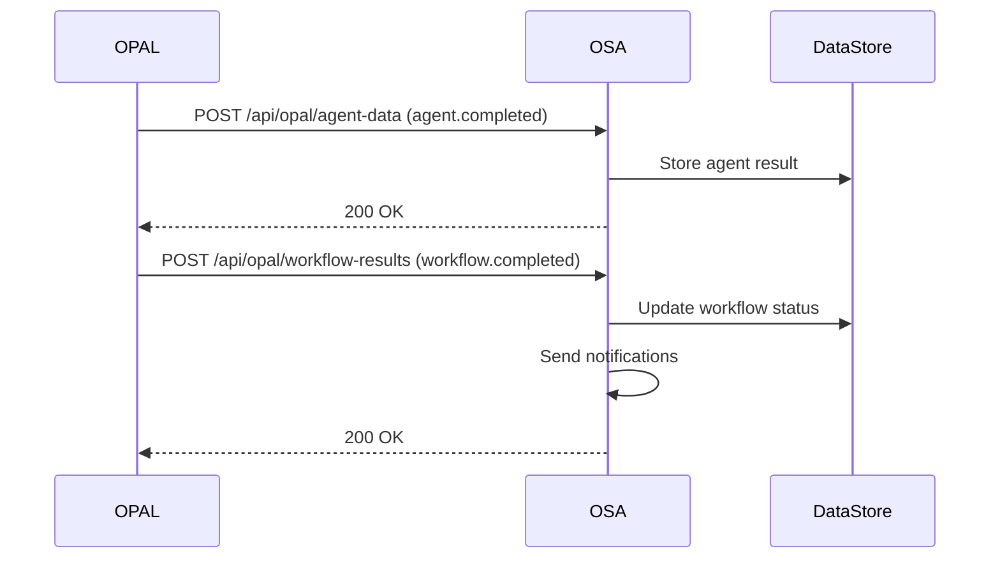

# OSA-OPAL Integration Standards

**Version**: 1.0
**Last Updated**: November 2025
**Status**: Production Ready

## Overview

This document defines the integration standards between Optimizely Strategy Assistant (OSA) and Optimizely Platform for AI-driven Language models (OPAL). These standards ensure reliable, consistent, and maintainable integration between the two systems.

## Architecture Overview



## OPAL Configuration Standards

### 1. Agent JSON File Format

All OPAL agent JSON files **MUST** follow this exact format:

```json
{
  "schema_version": "1.0",
  "agent_type": "specialized",
  "name": "Agent Name",
  "output": {
    "type": "text",
    "schema": null,
    "description": null
  },
  "version": "1.0.0",
  "agent_id": "agent_identifier",
  "file_urls": [],
  "is_active": true,
  "creativity": 0.3,
  "is_deleted": false,
  "parameters": [
    {
      "name": "parameter_name",
      "type": "string",
      "default": "default_value",
      "required": false,
      "description": "Parameter description"
    }
  ],
  "description": "Agent description",
  "enabled_tools": [
    "tool_name_with_underscores"
  ],
  "agent_metadata": null,
  "inference_type": "simple_with_thinking",
  "prompt_template": "**Role:** ...\n\n**Objective:** ...",
  "internal_version": 1
}
```

#### Critical Requirements:

- **schema_version**: Must be `"1.0"` (not `"2.0"`)
- **output.type**: Must be `"text"` with `null` schema
- **agent_metadata**: Must be `null` (not complex objects)
- **enabled_tools**: Use underscore naming (e.g., `"osa_odp_tools_fetch_segments"`)
- **inference_type**: Must be `"simple_with_thinking"`
- **internal_version**: Must be `1` (not `2`)

### 2. Tool Configuration Standards

Tool JSON files must include proper webhook endpoints:

```json
{
  "integration_endpoints": {
    "osa_webhook_agent": "https://ifpa-strategy.vercel.app/api/opal/agent-data",
    "osa_webhook_results": "https://ifpa-strategy.vercel.app/api/opal/workflow-results"
  }
}
```

### 3. Instruction File Standards

Instruction files must be Markdown format with clear sections:

```markdown
# Title - Purpose for Opal AI

## Section Overview
- Bullet points
- Clear structure

## Key Information
Detailed content that provides context for agents
```

## Data Flow Architecture

### Webhook Endpoints

The OSA system provides these endpoints for OPAL data:

1. **Primary Webhook**: `/api/webhooks/opal-workflow`
   - Handles all OPAL events
   - Authentication: Bearer token
   - Events: `workflow.completed`, `workflow.failed`, `agent.completed`

2. **Agent Data Endpoint**: `/api/opal/agent-data`
   - Forwards to primary webhook
   - Used by opal-tools configuration

3. **Workflow Results**: `/api/opal/workflow-results`
   - Forwards to primary webhook
   - Used for final workflow completion

### Authentication Standards

All webhook calls must include authentication:

```javascript
headers: {
  'Authorization': 'Bearer YOUR_WEBHOOK_TOKEN',
  'Content-Type': 'application/json'
}
```

### Data Flow Sequence



## Directory Structure Standards

```
opal-config/
├── opal-agents/          # Agent JSON configurations
│   ├── content_review.json
│   ├── audience_suggester.json
│   └── ...
├── opal-tools/           # Tool configurations
│   ├── workflow_data_sharing.json
│   ├── osa_odp_tools.json
│   └── ...
├── opal-instructions/    # Instruction markdown files
│   ├── 1-company-overview.md
│   ├── 4-personas.md
│   └── ...
└── opal-mapping/         # Integration mapping configurations
    ├── opal_mapping.json
    ├── agent-configurations.json
    └── ...
```

## Agent Configuration Best Practices

### 1. Parameter Simplification

**✅ Correct:**
```json
{
  "name": "analysis_depth",
  "type": "string",
  "default": "comprehensive",
  "required": false,
  "description": "Depth of analysis to perform"
}
```

**❌ Incorrect:**
```json
{
  "name": "analysis_depth",
  "type": "string",
  "enum": ["surface", "detailed", "comprehensive"],
  "min_length": 1,
  "max_length": 50,
  "required": false,
  "description": "Depth of analysis to perform"
}
```

### 2. Prompt Template Format

Use consistent markdown formatting:

```
**Role:** You are a [role] specializing in [domain].

**Objective:** [Clear objective statement with [[parameters]].

**Input:**
- Parameter 1: [[param1]]
- Parameter 2: [[param2]]
- Reference information: {instruction: context files}

**Framework:**

1. **Section Name**
   - Key points
   - Analysis approach

**Output Format:**

**Section Headers**
- Structured output
- Clear deliverables

***Send results to OSA dashboard.***
```

## Error Handling Standards

### Webhook Error Responses

```json
{
  "error": "Error description",
  "message": "Detailed error message",
  "timestamp": "2025-11-08T10:30:00Z",
  "workflow_id": "optional_workflow_id"
}
```

### Status Codes

- `200`: Success
- `400`: Bad Request (invalid JSON/parameters)
- `401`: Unauthorized (invalid auth token)
- `500`: Internal Server Error

## Testing Standards

### Agent JSON Validation

Before deployment, validate agent files:

```bash
# Check schema version
grep -r '"schema_version": "2.0"' opal-config/opal-agents/
# Should return no results

# Check output format
grep -r '"type": "structured"' opal-config/opal-agents/
# Should return no results
```

### Webhook Testing

Test webhook endpoints:

```bash
curl -X POST https://ifpa-strategy.vercel.app/api/opal/agent-data \
  -H "Authorization: Bearer YOUR_TOKEN" \
  -H "Content-Type: application/json" \
  -d '{"event_type": "agent.completed", "workflow_id": "test"}'
```

## Deployment Checklist

### Pre-Deployment Validation

- [ ] All agent JSON files use schema_version "1.0"
- [ ] All agent_metadata fields are null
- [ ] All enabled_tools use underscore naming
- [ ] All inference_type fields are "simple_with_thinking"
- [ ] Webhook endpoints are properly configured
- [ ] Authentication tokens are set

### Post-Deployment Verification

- [ ] Webhook endpoints respond correctly
- [ ] Agent data flows to OSA successfully
- [ ] Workflow completion events are processed
- [ ] Data is stored in OSA data store
- [ ] Error handling works as expected

## Troubleshooting Guide

### Common Issues

#### 1. OPAL Agent Import Failures

**Symptoms**: Agent JSON fails to import into OPAL

**Solutions**:
- Check schema_version is "1.0"
- Verify output.type is "text" with null schema
- Ensure agent_metadata is null
- Validate JSON syntax

#### 2. Webhook Authentication Failures

**Symptoms**: 401 Unauthorized responses

**Solutions**:
- Verify OPAL_WEBHOOK_AUTH_KEY environment variable
- Check Authorization header format: "Bearer TOKEN"
- Validate token matches configured secret

#### 3. Data Flow Interruptions

**Symptoms**: Agent results not appearing in OSA

**Solutions**:
- Check webhook endpoint URLs in opal-tools
- Verify network connectivity
- Review OSA webhook handler logs
- Validate JSON payload structure

### Debug Commands

```bash
# Check agent configurations
find opal-config/opal-agents -name "*.json" -exec jq '.schema_version' {} \;

# Validate webhook endpoints
curl -I https://ifpa-strategy.vercel.app/api/opal/agent-data

# Test webhook authentication
curl -X GET https://ifpa-strategy.vercel.app/api/webhooks/opal-workflow
```

## Monitoring & Maintenance

### Key Metrics to Monitor

- Webhook response times
- Authentication failure rates
- Agent completion rates
- Workflow success rates
- Data store update frequency

### Regular Maintenance Tasks

1. **Weekly**: Review webhook logs for errors
2. **Monthly**: Validate agent configurations
3. **Quarterly**: Update authentication tokens
4. **Semi-annually**: Review and update documentation

## Security Considerations

### Authentication

- Use strong, unique tokens for webhook authentication
- Rotate authentication keys regularly
- Implement rate limiting on webhook endpoints
- Log all authentication attempts

### Data Privacy

- Ensure GDPR/CCPA compliance in data handling
- Implement data retention policies
- Use HTTPS for all communications
- Sanitize logs to remove sensitive information

## Version History

| Version | Date | Changes |
|---------|------|---------|
| 1.0 | Nov 2025 | Initial release - Production standards |

## Support

For issues with OSA-OPAL integration:

1. Check this documentation
2. Review troubleshooting guide
3. Check webhook endpoint logs
4. Validate agent configurations
5. Contact development team

---

**Note**: This document represents the current production standards for OSA-OPAL integration. All future integrations must follow these guidelines to ensure system reliability and maintainability.