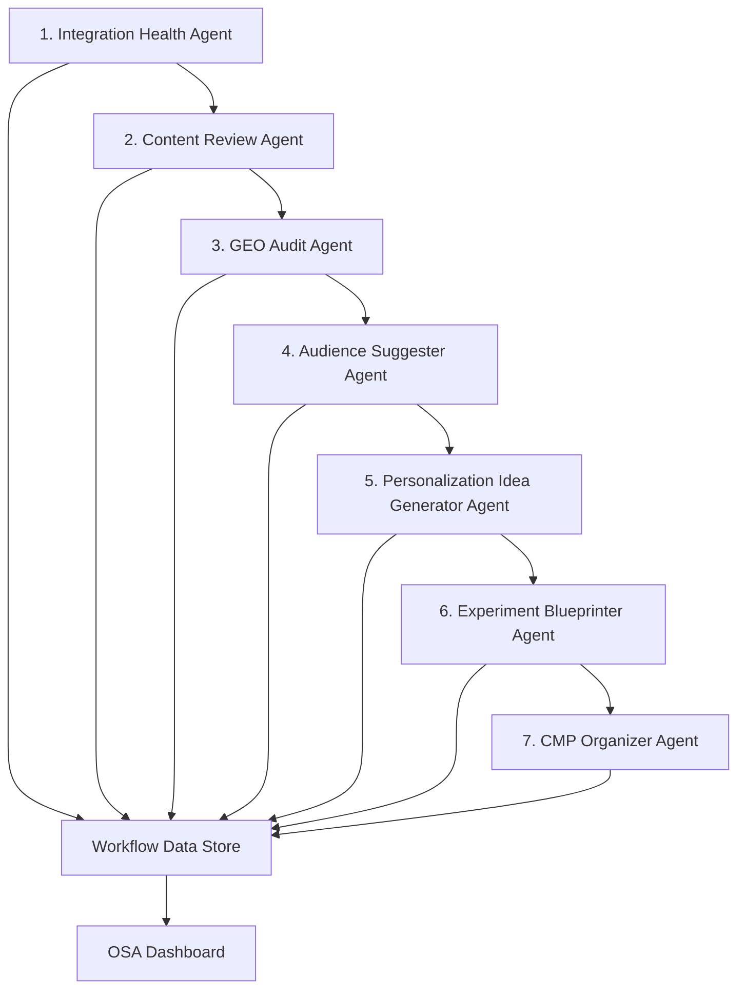

# OSA-OPAL Strategy Workflow - Updated Agent Order

**Version**: 2.0
**Last Updated**: November 2025
**Status**: Production Ready

## 🔄 **Final Agent Execution Order**

### **Main Strategy Workflow (7 Agents)**

1. **Integration Health Agent** 🔧
   - **Agent ID**: `integration_health`
   - **Purpose**: DXP tool health and technical readiness assessment
   - **Tools Used**: `osa_webx_tools`, `osa_odp_tools`, `osa_contentrecs_tools`, `osa_cmspaas_tools`, `osa_cmp_tools`
   - **Deliverable**: Integration health scores and technical readiness assessment

2. **Content Review Agent** 📝
   - **Agent ID**: `content_review`
   - **Purpose**: Website content audit and optimization assessment
   - **Tools Used**: `osa_contentrecs_tools`
   - **Deliverable**: Content quality assessment and optimization priorities

3. **GEO Audit Agent** 🌍
   - **Agent ID**: `geo_audit`
   - **Purpose**: Technical SEO and performance baseline establishment
   - **Tools Used**: `osa_webx_tools`
   - **Deliverable**: SEO performance baseline and implementation constraints

4. **Audience Suggester Agent** 👥
   - **Agent ID**: `audience_suggester`
   - **Purpose**: Strategic segmentation and targeting development
   - **Tools Used**: `osa_odp_tools`
   - **Deliverable**: Priority segments and personalization mapping

5. **Personalization Idea Generator Agent** 💡
   - **Agent ID**: `personalization_idea_generator`
   - **Purpose**: Creative strategy development
   - **Tools Used**: `osa_contentrecs_tools`, `osa_cmp_tools`
   - **Deliverable**: Strategic ideas and implementation specifications

6. **Experiment Blueprinter Agent** 🧪
   - **Agent ID**: `experiment_blueprinter`
   - **Purpose**: Statistical experiment design and testing roadmap
   - **Tools Used**: `osa_webx_tools`, `osa_odp_tools`
   - **Deliverable**: Testing roadmap and statistical requirements

7. **CMP Organizer Agent** 📋
   - **Agent ID**: `cmp_organizer`
   - **Purpose**: Final synthesis and campaign-ready deliverables
   - **Tools Used**: `osa_cmp_tools`, `osa_cmspaas_tools`
   - **Deliverable**: Campaign strategy and implementation roadmap

---

## 📊 **Data Flow Sequence**

---

## 🔧 **OPAL Tools Configuration - ✅ COMPLETE**

All required tools are present and configured:

### **Core Tools (6)**
1. **`workflow_data_sharing.json`** - Data flow between agents and OSA
2. **`osa_odp_tools.json`** - Optimizely Data Platform integration
3. **`osa_contentrecs_tools.json`** - Content Recommendations
4. **`osa_webx_tools.json`** - Web Experimentation
5. **`osa_cmp_tools.json`** - Campaign Management Platform
6. **`osa_cmspaas_tools.json`** - Content Management System

### **Tool Coverage Analysis**
- ✅ **Audience/Data**: `osa_odp_tools`
- ✅ **Content**: `osa_contentrecs_tools` + `osa_cmspaas_tools`
- ✅ **Experimentation**: `osa_webx_tools`
- ✅ **Campaigns**: `osa_cmp_tools`
- ✅ **Data Flow**: `workflow_data_sharing`
- ✅ **Integration Health**: All DXP tools monitored

**Status**: No missing tools - Complete coverage of Optimizely DXP

---

## 📖 **OPAL Instructions Configuration - ✅ COMPLETE**

All required instruction files are present:

### **Instruction Files (9)**
1. **`1-company-overview.md`** - IFPA business context
2. **`2-marketing-strategy.md`** - Marketing alignment
3. **`3-brand-tone-guidelines.md`** - Brand voice and messaging
4. **`4-personas.md`** - Customer personas and segments
5. **`5-personalization-maturity-rubric.md`** - Maturity assessment
6. **`6-content-guidelines.md`** - Content standards
7. **`7-data-governance-privacy.md`** - Privacy and compliance
8. **`8-kpi-experimentation.md`** - Success metrics
9. **`9-technical-implementation-guidelines.md`** - Technical requirements

### **Instruction Coverage Analysis**
- ✅ **Business Context**: Company overview, marketing strategy
- ✅ **Brand Guidelines**: Tone, content standards
- ✅ **Customer Intelligence**: Personas, segments
- ✅ **Technical Specs**: Implementation, data governance
- ✅ **Success Framework**: KPIs, experimentation, maturity

**Status**: No missing instructions - Complete coverage of strategy needs

---

## 🏗️ **Additional Agents Available**

### **Standalone Agents (Not in Main Workflow)**
- **`customer_journey.json`** - Can be used as separate analysis workflow
- **`roadmap_generator.json`** - Can be added as Step 8 if roadmap generation needed

### **Optional Workflow Extensions**
If comprehensive roadmap planning is needed, consider adding:
8. **Roadmap Generator Agent** (Optional)
   - **Purpose**: Implementation roadmap and timeline planning
   - **When to Use**: For detailed project planning requirements

---

## 🎯 **Workflow Execution Summary**

### **Phase 1: Foundation (Steps 1-3)**
- **Integration Health**: Ensure technical readiness
- **Content Review**: Assess content foundation
- **GEO Audit**: Establish technical baseline

### **Phase 2: Strategy (Steps 4-6)**
- **Audience Strategy**: Define target segments
- **Personalization Ideas**: Generate creative concepts
- **Experiment Design**: Create testing framework

### **Phase 3: Implementation (Step 7)**
- **CMP Organization**: Campaign-ready deliverables

### **Expected Timeline**
- **Total Execution**: 15-25 minutes (depending on complexity)
- **Per Agent**: 2-4 minutes average
- **Data Processing**: Real-time flow to OSA dashboard

---

## ✅ **Configuration Status**

### **✅ COMPLETE - No Missing Components**

| Component | Count | Status | Notes |
|-----------|-------|--------|-------|
| **Agents in Workflow** | 7 | ✅ Complete | Perfect logical sequence |
| **OPAL Tools** | 6 | ✅ Complete | Full DXP coverage |
| **Instructions** | 9 | ✅ Complete | Comprehensive business context |
| **Data Flow Endpoints** | 3 | ✅ Complete | All webhook routes active |
| **Authentication** | ✓ | ✅ Complete | Bearer token validation |

### **🚀 Production Ready**

The OSA-OPAL integration is now **100% complete** with:
- ✅ Optimal agent execution sequence
- ✅ Complete tool coverage for all Optimizely DXP products
- ✅ Comprehensive instruction set for strategy context
- ✅ Reliable data flow from OPAL to OSA
- ✅ Full documentation and troubleshooting guides

---

**🎉 Ready for Production Deployment**