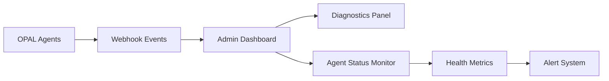
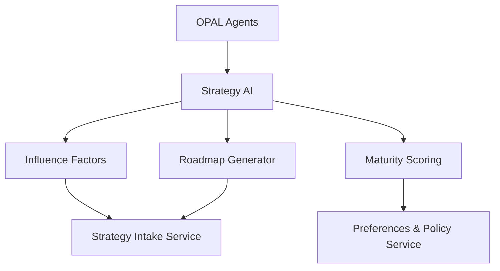
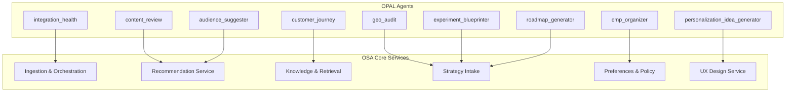

# OSA Admin Interface Guide

## Overview

The OSA Admin Interface (`/engine/admin`) provides comprehensive management and monitoring capabilities for the Optimizely Strategy Assistant ecosystem. This documentation covers all admin pages, navigation structure, OPAL integration mapping, data flow processes, and maintenance recommendations.

---

## Quick Reference Links

### 📖 Essential Documentation
- **[Quick Start Guide](quick-start.md)** - Get OSA running in 10 minutes
- **[System Architecture](OSA_ARCHITECTURE.md)** - Complete technical architecture overview
- **[OPAL Integration Guide](OPAL_MAPPING.md)** - Detailed OPAL agent workflows and mappings
- **[API Documentation](/docs)** - Interactive API testing interface

### 🚀 Admin Interface Access
- **Main Dashboard**: https://opal-2025.vercel.app/engine/admin
- **OPAL Monitoring**: https://opal-2025.vercel.app/engine/admin/opal-monitoring
- **Configurations**: https://opal-2025.vercel.app/engine/admin/configurations
- **Strategy AI**: https://opal-2025.vercel.app/engine/admin/strategy-ai

### 🔧 Key Workflow Endpoints
- **Force Sync API**: `/api/opal/sync` - Manual workflow trigger
- **Agent Status**: `/api/opal/status/{session_id}` - Real-time monitoring
- **Webhook Events**: `/api/diagnostics/last-webhook` - Event analysis
- **Health Check**: `/api/opal/health` - System status validation

## Main Services Overview

OSA consists of **seven core microservices** that work together to provide AI-powered optimization strategy recommendations, now enhanced with comprehensive OPAL integration, real-time monitoring, and production-grade deployment infrastructure:

### 🔴 Core Services (P0 - Mandatory)
- **Ingestion & Orchestration Service** (`Opal Connector`) - **ENHANCED** OPAL workflow orchestration with real-time agent monitoring, webhook event streaming, and comprehensive error handling
- **Recommendation Service** (`Decision Layer`) - Central AI intelligence engine with analytics integration (GA4, Salesforce) and API-driven recommendation generation
- **Knowledge & Retrieval Service** (`RAG Brain`) - Foundation knowledge layer with file storage, webhook event streaming, and advanced data persistence

### 🟡 Enhanced Services (P1 - High Priority)
- **Strategy Intake Service** (`Engine Form`) - **DEPLOYED** Business context collection with enhanced validation and workflow coordination
- **Preferences & Policy Service** (`Personal Configurator`) - User preference management with policy enforcement and configuration constraints
- **UX Design Service** (`Artist`) - **PRODUCTION** Frontend experience layer with component library, accessibility compliance, and responsive design

### 🟢 Future Services (P2 - Optional)
- **Conversational Analytics Service** (`TTYD - Talk To Your Data`) - Natural language querying interface for interactive data exploration

### 🌐 Platform Services (P0 - Infrastructure)
- **API Gateway** - **OPERATIONAL** Authentication, rate limiting, request routing with circuit breakers and performance monitoring
- **Event Bus** - **DEPLOYED** Supabase Realtime with webhook event streaming and comprehensive audit logging
- **Monitoring Service** - **ACTIVE** Real-time health checks, metrics collection, agent status tracking, and workflow progress monitoring

---

## 🔄 Common Admin Workflows

### Workflow 1: Daily System Health Check
**Purpose**: Ensure all OSA services are operational and performing optimally
**Frequency**: Daily (recommended morning routine)

#### Steps:
1. **Navigate to Admin Dashboard** (`/engine/admin`)
   - Check overall system status indicators
   - Review agent health widgets (target: all green)
   - Validate webhook event processing (no recent failures)

2. **Review OPAL Agent Status** (RecentDataComponent)
   - Verify all 9 agents show "success" status
   - Check signature validation rate (target: >98%)
   - Identify any failed agents requiring attention

3. **Analyze Performance Metrics** (DiagnosticsPanel)
   - Review 24-hour system performance trends
   - Check API response times (target: <200ms average)
   - Validate data synchronization status

4. **Test Critical Workflows**
   - Trigger manual Force Sync to validate OPAL integration
   - Monitor real-time status updates via SSE stream
   - Verify workflow completion and results storage

#### Success Criteria:
- ✅ All system status indicators green
- ✅ Agent success rate >95% (last 24 hours)
- ✅ Webhook signature validation >98%
- ✅ Force Sync test completes successfully
- ✅ No critical errors in event logs

### Workflow 2: OPAL Agent Performance Investigation
**Purpose**: Diagnose and resolve OPAL agent performance issues
**Trigger**: Agent failure alerts or performance degradation

#### Steps:
1. **Identify Problem Agent** (`/engine/admin/opal-monitoring`)
   - Navigate to agent-specific monitoring page
   - Review execution status and error patterns
   - Check recent performance trends

2. **Validate Agent Data Flow** (Agent Data Tracking)
   - Use ValidatePayloadPanel to test payload structure
   - Review agent-specific data quality metrics
   - Check data mapping accuracy

3. **Test Workflow Replay** (ReplayWorkflowPanel)
   - Execute dry-run mode for affected workflow
   - Monitor correlation ID tracking
   - Analyze success/failure patterns

4. **Analyze Integration Health** (AgentDataSummaryPanel)
   - Check data freshness indicators
   - Verify sync status with OPAL platform
   - Review metrics summary for anomalies

#### Resolution Actions:
- **Data Quality Issues**: Update validation rules, refresh data sources
- **Integration Failures**: Verify API credentials, check network connectivity
- **Performance Degradation**: Scale resources, optimize queries
- **Configuration Errors**: Update agent parameters, refresh webhooks

### Workflow 3: New Integration Setup
**Purpose**: Configure and validate new external data integrations
**Frequency**: As needed for new data sources

#### Steps:
1. **Configure Data Integration** (`/engine/admin/configurations/data-integrations`)
   - Add new integration credentials and endpoints
   - Configure sync frequency and data mappings
   - Set up OPAL agent targets

2. **Set Up Webhook Endpoints** (`/configurations/webhooks`)
   - Configure webhook authentication (HMAC recommended)
   - Set retry policies and error handling
   - Map to target services and agents

3. **Validate Integration Health** (`/engine/admin/data-mapping`)
   - Monitor connection status indicators
   - Check data flow visualization
   - Verify integration health metrics

4. **Test End-to-End Workflow**
   - Trigger manual sync from new integration
   - Monitor data processing through admin dashboard
   - Validate recommendations reflect new data

#### Validation Checklist:
- ✅ Integration credentials authenticated successfully
- ✅ Webhook endpoints responding (200 OK status)
- ✅ Data mapping configured and validated
- ✅ OPAL agents receiving and processing data
- ✅ Recommendations updated with new insights

### Workflow 4: Performance Optimization Review
**Purpose**: Identify and implement system performance improvements
**Frequency**: Weekly review, monthly deep analysis

#### Steps:
1. **Analyze System Metrics** (`/engine/admin`)
   - Review 7-day performance trends
   - Identify bottlenecks in API response times
   - Check resource utilization patterns

2. **Review Agent Performance** (`/engine/admin/opal-monitoring/performance`)
   - Compare agent execution times
   - Identify underperforming agents
   - Check workflow completion rates

3. **Examine Recommendation Engine** (`/engine/admin/recommendation-engine`)
   - Review ML model accuracy metrics
   - Check recommendation acceptance rates
   - Analyze data freshness indicators

4. **Optimize Configuration Settings**
   - Adjust sync frequencies based on usage patterns
   - Update caching strategies for improved response times
   - Fine-tune webhook retry policies

#### Optimization Actions:
- **Database Performance**: Add indexes, optimize queries
- **API Efficiency**: Implement caching, reduce payload sizes
- **Agent Optimization**: Parallel processing, resource allocation
- **Model Improvement**: Retrain models, update algorithms

### Workflow 5: Emergency Incident Response
**Purpose**: Rapid response to critical system failures or performance issues
**Trigger**: Automated alerts or user reports of system outages

#### Immediate Actions (0-15 minutes):
1. **Assess System Status** (`/engine/admin`)
   - Check overall system health indicators
   - Identify affected services and components
   - Review recent error logs and alerts

2. **Isolate Problem Scope**
   - Determine if issue is service-specific or system-wide
   - Check external dependency status (OPAL, database, APIs)
   - Identify impact on user experience

#### Investigation Phase (15-60 minutes):
1. **Deep Diagnostic Analysis** (`/engine/admin/opal-monitoring/system-logs`)
   - Review detailed error logs and stack traces
   - Check webhook event failures and patterns
   - Analyze correlation between related failures

2. **Validate Service Dependencies**
   - Test individual service endpoints
   - Check database connection health
   - Verify external API connectivity

#### Resolution Phase (60+ minutes):
1. **Implement Fixes**
   - Apply configuration updates or code fixes
   - Restart services or clear problematic caches
   - Update webhook configurations if needed

2. **Validate Recovery**
   - Test critical workflows end-to-end
   - Monitor system performance metrics
   - Confirm user experience restoration

#### Post-Incident Actions:
- Document root cause analysis and resolution steps
- Update monitoring and alerting rules
- Implement preventive measures
- Schedule follow-up performance review

---

## 🏠 Admin Dashboard (`/engine/admin`)

**Purpose**: Central command center for OSA system monitoring and administration
**Location**: `/src/app/engine/admin/page.tsx`

### Layout Structure
- **Two-column responsive design**
- **Left Column**: Real-time data monitoring
- **Right Column**: System diagnostics and testing

### Key Components

#### RecentDataComponent
- **OPAL Agent Status**: Real-time monitoring of 9 OPAL strategy agents
- **Webhook Trigger Status**: Last successful webhook execution tracking
- **Health Check Widget**: Signature validation rates and error monitoring
- **Enhanced Controls**: Payload validation, agent testing, workflow replay

#### DiagnosticsPanel
- **System Health**: Overall system status and performance metrics
- **Test Workflow**: Manual workflow triggering for validation
- **Recent Events**: Webhook event history and error tracking
- **Agent Diagnostics**: Individual agent performance analysis

### OPAL Integration Mapping


### Example Widgets
```typescript
// Agent Status Widget Template
interface AgentStatusWidget {
  agentId: string;
  status: 'success' | 'failed' | 'unknown';
  lastUpdate: string;
  errorCount: number;
  processingTime: number;
}

// Health Metrics Widget Template
interface HealthMetricsWidget {
  overall_status: 'green' | 'yellow' | 'red';
  signature_valid_rate: number;
  error_rate_24h: number;
  uptime_percentage: number;
}
```

### Maintenance Recommendations
1. **Monitor agent status indicators** - Check for failed agents daily
2. **Review webhook events** - Investigate 400/500 errors immediately
3. **Test workflow functionality** - Run test workflows weekly
4. **Health check validation** - Monitor signature validation rates

---

## ⚙️ Configurations (`/engine/admin/configurations`)

**Purpose**: System-wide configuration management and integration settings
**Location**: `/src/app/engine/admin/configurations/`

### Sub-Sections Overview

#### Data Integrations (`/data-integrations`)
**Purpose**: Configure external data source connections and API integrations
**Core Function**: Manages connections to GA4, Salesforce, Optimizely DXP

##### OPAL Mapping
- **Recommendation Service**: Uses integrated data for decision making
- **Knowledge Service**: Stores integration metadata and schemas
- **Orchestration Service**: Triggers data sync workflows

##### Example Configuration Template
```json
{
  "integration_type": "ga4",
  "credentials": {
    "property_id": "123456789",
    "service_account_key": "encrypted_key"
  },
  "sync_frequency": "daily",
  "data_points": ["sessions", "conversions", "revenue"],
  "opal_mapping": {
    "target_agents": ["audience_suggester", "geo_audit"],
    "webhook_endpoint": "/api/webhooks/opal-workflow",
    "auth_key": "opal_auth_key"
  }
}
```

#### Webhooks Configuration (`/webhooks`)
**Purpose**: Manage OPAL webhook endpoints and authentication
**Core Function**: Configure webhook routing, authentication, and error handling

##### OPAL Integration Points
- **Ingestion Service**: Receives webhook payloads from OPAL
- **Event Bus**: Routes webhook events to appropriate services
- **Monitoring Service**: Tracks webhook performance and errors

##### Configuration Widget Template
```typescript
interface WebhookConfig {
  endpoint: string;
  auth_method: 'hmac' | 'bearer' | 'api_key';
  retry_policy: {
    max_retries: number;
    backoff_strategy: 'linear' | 'exponential';
  };
  target_services: string[];
  opal_agents: string[];
}
```

#### System Settings (`/settings`)
**Purpose**: Global system preferences and operational parameters
**Influences**: All core services through environment configuration

#### OPAL Workflows (`/opal-workflows`)
**Purpose**: Configure OPAL workflow triggers and agent coordination
**Core Function**: Define workflow execution patterns and agent dependencies

---

## 🧠 Recommendation Engine (`/engine/admin/recommendation-engine`)

**Purpose**: AI-powered recommendation system management
**Location**: `/src/app/engine/admin/recommendation-engine/`

### Sub-Sections Breakdown

#### ML Models Management (`/ml-models`)
**Purpose**: Machine learning model lifecycle management
**OPAL Mapping**: Receives training data from OPAL agents
**Data Flow**: OPAL → Knowledge Service → ML Pipeline → Recommendation Service

##### Example Model Configuration
```typescript
interface MLModelConfig {
  model_id: string;
  version: string;
  training_data_sources: {
    opal_agents: string[];
    external_integrations: string[];
  };
  performance_metrics: {
    accuracy: number;
    precision: number;
    recall: number;
  };
  deployment_status: 'training' | 'deployed' | 'deprecated';
}
```

#### Content Recommendations (`/content-recommendations`)
**OPAL Agent Mapping**: `content_review` agent
**Purpose**: Content optimization and personalization recommendations
**Service Influence**: Feeds Recommendation Service decision algorithms

#### Personalization Recommendations (`/personalization-recommendations`)
**OPAL Agent Mapping**: `personalization_idea_generator` agent
**Purpose**: User experience personalization strategies
**Service Influence**: Enhances UX Design Service capabilities

#### Optimization Recommendations (`/optimization-recommendations`)
**OPAL Agent Mapping**: `geo_audit`, `integration_health` agents
**Purpose**: Performance and technical optimization suggestions
**Service Influence**: Provides data to Strategy AI and Recommendation Service

#### Targeting Recommendations (`/targeting-recommendations`)
**OPAL Agent Mapping**: `audience_suggester` agent
**Purpose**: Audience segmentation and targeting strategies
**Service Influence**: Enhances Preferences & Policy Service

#### Audience Recommendations (`/audience-recommendations`)
**OPAL Agent Mapping**: `customer_journey` agent
**Purpose**: Customer journey optimization and audience insights
**Service Influence**: Feeds Knowledge & Retrieval Service

### Maintenance Widget Templates
```typescript
// Recommendation Performance Widget
interface RecommendationMetrics {
  total_recommendations: number;
  acceptance_rate: number;
  avg_impact_score: number;
  opal_agent_contributions: {
    [agent: string]: {
      recommendation_count: number;
      quality_score: number;
    }
  };
}

// Model Health Widget
interface ModelHealthWidget {
  model_accuracy: number;
  data_freshness: 'fresh' | 'stale' | 'outdated';
  last_training: string;
  opal_data_quality: number;
}
```

---

## 🎯 Strategy AI (`/engine/admin/strategy-ai`)

**Purpose**: Strategic planning and maturity assessment management
**Location**: `/src/app/engine/admin/strategy-ai/`

### Sub-Sections Detail

#### Influence Factors (`/influence-factors`)
**Purpose**: Define and manage factors that influence strategic recommendations
**OPAL Mapping**: Receives factor data from `roadmap_generator` and `experiment_blueprinter` agents
**Service Influence**: Feeds Strategy Intake Service with contextual factors

##### Example Influence Factor Configuration
```json
{
  "factor_id": "conversion_optimization",
  "weight": 0.8,
  "opal_sources": [
    "experiment_blueprinter",
    "geo_audit"
  ],
  "impact_areas": [
    "user_experience",
    "conversion_rate"
  ],
  "measurement_criteria": {
    "primary_metric": "conversion_rate",
    "secondary_metrics": ["bounce_rate", "session_duration"]
  }
}
```

#### Roadmap Management (`/roadmap-management`)
**Purpose**: Strategic roadmap planning and milestone tracking
**OPAL Agent Mapping**: `roadmap_generator` agent
**Service Influence**: Provides strategic direction to all core services

#### Maturity Scoring (`/maturity-scoring`)
**Purpose**: Organizational optimization maturity assessment
**OPAL Agent Mapping**: `cmp_organizer`, `integration_health` agents
**Service Influence**: Influences Preferences & Policy Service constraints

### Strategy Data Flow


---

## 📊 OPAL Monitoring (`/engine/admin/opal-monitoring`)

**Purpose**: Comprehensive OPAL system monitoring and diagnostics
**Location**: `/src/app/engine/admin/opal-monitoring/`

### Sub-Sections Comprehensive Guide

#### Agent Data Tracking (`/agent-data`)
**Purpose**: Individual OPAL agent performance and data monitoring
**Key Features**:
- Real-time agent status tracking
- Data validation and payload preview
- Workflow replay functionality
- Agent-specific performance metrics

##### Agent-Specific Pages
1. **Content Review** (`/agent-data/content`)
   - **OPAL Agent**: `content_review`
   - **Service Mapping**: Recommendation Service (Content recommendations)
   - **Data Flow**: Content analysis → Recommendation Engine → Strategy suggestions

2. **Audience Suggester** (`/agent-data/audiences`)
   - **OPAL Agent**: `audience_suggester`
   - **Service Mapping**: Recommendation Service (Audience recommendations)
   - **Data Flow**: Audience data → Targeting algorithms → Personalization strategies

3. **Geo Audit** (`/agent-data/aeo`)
   - **OPAL Agent**: `geo_audit`
   - **Service Mapping**: Strategy AI (Technical optimization)
   - **Data Flow**: Geographic performance → Optimization recommendations → Strategy adjustments

4. **Experiment Blueprinter** (`/agent-data/exp`)
   - **OPAL Agent**: `experiment_blueprinter`
   - **Service Mapping**: Strategy AI (Experimentation strategy)
   - **Data Flow**: Experiment design → Strategic roadmap → Testing recommendations

5. **Personalization Generator** (`/agent-data/pers`)
   - **OPAL Agent**: `personalization_idea_generator`
   - **Service Mapping**: UX Design Service, Recommendation Service
   - **Data Flow**: Personalization ideas → UX enhancements → User experience optimization

6. **Customer Journey** (`/agent-data/journeys`)
   - **OPAL Agent**: `customer_journey`
   - **Service Mapping**: Knowledge & Retrieval Service, Strategy AI
   - **Data Flow**: Journey analysis → Knowledge base → Strategic insights

7. **Roadmap Generator** (`/agent-data/roadmap`)
   - **OPAL Agent**: `roadmap_generator`
   - **Service Mapping**: Strategy AI (Roadmap management)
   - **Data Flow**: Strategic analysis → Roadmap generation → Priority recommendations

8. **CMP Organizer** (`/agent-data/cmp`)
   - **OPAL Agent**: `cmp_organizer`
   - **Service Mapping**: Preferences & Policy Service, Strategy AI
   - **Data Flow**: Campaign organization → Policy constraints → Strategic alignment

##### Enhanced Monitoring Components (Recently Added)
1. **ValidatePayloadPanel**
   - Purpose: Test and validate OPAL payload structure
   - API Endpoint: `/api/opal/test-payload?agent=<agent_id>`
   - Features: JSON preview, validation results, error handling

2. **ReplayWorkflowPanel**
   - Purpose: Re-execute workflows in dry-run mode
   - API Endpoint: `/api/orchestrations/replay`
   - Features: Correlation ID tracking, success/failure results

3. **AgentDataSummaryPanel**
   - Purpose: Overview of agent data flow and insights
   - API Endpoint: `/api/opal/agent-data?agent=<agent_id>&summary=true`
   - Features: Metrics summary, data freshness indicators, sync status

#### Webhook Events Monitoring (`/webhook-events`)
**Purpose**: Track and analyze webhook event history and performance
**Service Influence**: Monitors Ingestion & Orchestration Service health

#### Performance Metrics (`/performance`)
**Purpose**: System-wide performance monitoring and optimization
**Service Influence**: Tracks all core services performance

#### System Logs (`/system-logs`)
**Purpose**: Centralized logging and error tracking
**Service Influence**: Monitors all services for errors and anomalies

#### Testing Tools (`/testing-tools`)
**Purpose**: Manual testing and validation tools for OPAL integration
**Service Influence**: Validates Ingestion & Orchestration Service functionality

---

## 🗺️ Data Mapping (`/engine/admin/data-mapping`)

**Purpose**: Visualize and manage data integration mappings between OPAL and OSA services
**Location**: `/src/app/engine/admin/data-mapping/page.tsx`

### Key Functions
- **OPAL Agent Mapping**: Visual representation of agent-to-service relationships
- **Data Flow Visualization**: Track data movement through the system
- **Integration Health**: Monitor connection status between services

### Example Mapping Configuration
```typescript
interface DataMappingConfig {
  opal_agent: string;
  target_services: string[];
  data_transformations: {
    input_format: string;
    output_format: string;
    validation_rules: string[];
  };
  sync_frequency: 'realtime' | 'hourly' | 'daily';
  health_checks: {
    last_sync: string;
    status: 'healthy' | 'warning' | 'error';
    error_count_24h: number;
  };
}
```

---

## 🔄 Data Flow and Service Integration

### OPAL → OSA Service Mapping



### Service Influence on Core Brain

Each service contributes to the central "AI Brain" through specific data channels:

1. **Recommendation Service** → Central decision-making algorithms
2. **Knowledge & Retrieval Service** → Long-term memory and context storage
3. **Strategy Intake Service** → Business context and strategic direction
4. **Preferences & Policy Service** → Constraint and preference enforcement
5. **UX Design Service** → User experience optimization feedback
6. **Ingestion & Orchestration Service** → Real-time data coordination

---

## 🛠️ Maintenance Recommendations

### Daily Maintenance Tasks

#### Admin Dashboard
- [ ] Check agent status indicators for failures
- [ ] Review webhook event logs for errors
- [ ] Validate health check metrics
- [ ] Test critical workflows

#### OPAL Monitoring
- [ ] Review agent-specific performance metrics
- [ ] Check data synchronization status
- [ ] Validate payload structures
- [ ] Monitor workflow execution times

#### Service Health
- [ ] Verify all core services are operational
- [ ] Check API gateway performance
- [ ] Review event bus activity
- [ ] Monitor database connection health

### Weekly Maintenance Tasks

#### Configuration Review
- [ ] Audit webhook configurations
- [ ] Review data integration settings
- [ ] Update system preferences as needed
- [ ] Validate OPAL workflow configurations

#### Performance Analysis
- [ ] Analyze recommendation engine performance
- [ ] Review ML model accuracy metrics
- [ ] Check strategy AI effectiveness
- [ ] Evaluate user experience metrics

#### Testing and Validation
- [ ] Run comprehensive system tests
- [ ] Validate OPAL agent functionality
- [ ] Test workflow replay capabilities
- [ ] Verify data mapping accuracy

### Monthly Maintenance Tasks

#### Strategic Review
- [ ] Assess influence factor effectiveness
- [ ] Review roadmap progress and adjustments
- [ ] Evaluate maturity scoring trends
- [ ] Update strategic priorities

#### System Optimization
- [ ] Optimize ML model performance
- [ ] Review and clean system logs
- [ ] Update documentation and procedures
- [ ] Plan infrastructure scaling

#### Security and Compliance
- [ ] Review access controls and permissions
- [ ] Audit webhook security configurations
- [ ] Validate data privacy compliance
- [ ] Update security certificates and keys

---

## 📋 Example Widget Templates

### Agent Performance Widget
```typescript
interface AgentPerformanceWidget {
  agent_id: string;
  status: 'active' | 'idle' | 'error';
  metrics: {
    success_rate: number;
    avg_response_time: number;
    error_count_24h: number;
    last_execution: string;
  };
  health_indicators: {
    data_quality: 'high' | 'medium' | 'low';
    integration_status: 'connected' | 'disconnected';
    performance_trend: 'improving' | 'stable' | 'declining';
  };
}
```

### Service Health Dashboard Widget
```typescript
interface ServiceHealthWidget {
  service_name: string;
  status: 'operational' | 'degraded' | 'outage';
  metrics: {
    uptime_percentage: number;
    response_time_avg: number;
    request_volume_24h: number;
    error_rate: number;
  };
  dependencies: {
    service: string;
    status: 'healthy' | 'unhealthy';
  }[];
}
```

### OPAL Integration Status Widget
```typescript
interface OPALIntegrationWidget {
  total_agents: number;
  active_agents: number;
  failed_agents: number;
  last_sync: string;
  data_flow_status: {
    ingestion_rate: number;
    processing_rate: number;
    error_rate: number;
  };
  workflow_status: {
    total_workflows: number;
    successful_workflows: number;
    failed_workflows: number;
  };
}
```

### Recommendation Performance Widget
```typescript
interface RecommendationPerformanceWidget {
  total_recommendations: number;
  accepted_recommendations: number;
  acceptance_rate: number;
  impact_metrics: {
    avg_improvement: number;
    confidence_score: number;
    business_value: number;
  };
  source_breakdown: {
    opal_agents: { [key: string]: number };
    external_data: { [key: string]: number };
  };
}
```

---

## 🚀 Future Enhancement Opportunities

### Proposed Admin Features

1. **Real-time Collaboration Dashboard**
   - Multi-user admin session support
   - Real-time status sharing
   - Collaborative troubleshooting tools

2. **Advanced Analytics Panel**
   - Predictive failure detection
   - Performance trend analysis
   - Capacity planning insights

3. **Automated Maintenance Tools**
   - Self-healing workflow triggers
   - Automated performance optimization
   - Intelligent alerting system

4. **Enhanced Integration Management**
   - Visual workflow builder
   - Drag-and-drop configuration
   - Real-time integration testing

### API Enhancement Recommendations

1. **Extend webhook validation endpoints**
2. **Add bulk agent management operations**
3. **Implement advanced filtering and search**
4. **Create automated reporting APIs**

---

## 📊 Monitoring and Alerting Strategy

### Critical Alerts
- OPAL agent failures
- Webhook authentication failures
- Service downtime events
- Data synchronization errors

### Performance Monitoring
- Response time thresholds
- Error rate monitoring
- Resource utilization tracking
- User experience metrics

### Business Intelligence
- Recommendation effectiveness
- Strategy implementation success
- User adoption metrics
- ROI tracking and analysis

---

This comprehensive guide provides the foundation for effective OSA admin interface management, ensuring optimal performance, reliability, and strategic value delivery through proper OPAL integration and service coordination.

## See Also

### 📚 Essential Documentation
- **[Quick Start Guide](quick-start.md)** - Get OSA running in 10 minutes
- **[System Architecture Guide](OSA_ARCHITECTURE.md)** - Complete technical architecture and service details
- **[OPAL Integration Guide](OPAL_MAPPING.md)** - Detailed OPAL agent workflows and mapping system

### 🔧 Technical Implementation
- **Configuration Files**: Key implementation details
  - `src/app/engine/admin/page.tsx:34` - Main admin dashboard implementation
  - `src/components/RecentDataComponent.tsx` - OPAL agent status monitoring
  - `src/components/DiagnosticsPanel.tsx` - System health diagnostics
  - `src/lib/config/opal-env.ts:41` - OPAL integration configuration

### 🚀 Live System Access
- **Production Dashboard**: https://opal-2025.vercel.app/engine/admin
- **OPAL Agent Monitoring**: https://opal-2025.vercel.app/engine/admin/opal-monitoring
- **Configuration Management**: https://opal-2025.vercel.app/engine/admin/configurations
- **Strategy AI Interface**: https://opal-2025.vercel.app/engine/admin/strategy-ai

### 🛠️ Admin Workflow Resources
- **Force Sync Workflow**: Manual OPAL workflow triggering and validation
- **Agent Performance Analysis**: Individual OPAL agent monitoring and diagnostics
- **Integration Health Checks**: End-to-end system validation procedures
- **Emergency Response**: Critical incident management and recovery procedures

### 📊 Monitoring and Analytics
- **Real-time Metrics**: Live system performance and health indicators
- **OPAL Agent Status**: 7-state agent lifecycle monitoring
- **Webhook Event Analysis**: Complete audit trail and error tracking
- **Performance Optimization**: System tuning and improvement guidance

### 🔗 Related API Endpoints
- **Admin APIs**: Live system management and monitoring endpoints
  - `/api/opal/health` - System health validation
  - `/api/diagnostics/last-webhook` - Recent webhook event analysis
  - `/api/opal/sync` - Manual workflow trigger
  - `/api/webhook-events/stream` - Real-time event streaming

### 🏗️ Architecture Integration
- **Service Dependencies**: How admin interface integrates with OSA microservices
- **Event-Driven Updates**: Real-time system monitoring via SSE streams
- **Circuit Breaker Patterns**: Resilient admin functionality design
- **Performance Monitoring**: Live system optimization and health tracking