# OSA (Optimizely Strategy Assistant) - Complete System Overview

**🚀 PRODUCTION SYSTEM**: https://opal-2025.vercel.app
**📅 Last Updated**: November 13, 2024
**📋 Version**: 2.1.0
**🎯 Purpose**: Comprehensive guide to understanding and using the OSA system

---

## Table of Contents

1. [What is OSA?](#what-is-osa)
2. [System Architecture Overview](#system-architecture-overview)
3. [OPAL Integration & Agent Orchestration](#opal-integration--agent-orchestration)
4. [Key Features & Capabilities](#key-features--capabilities)
5. [User Journey & Workflows](#user-journey--workflows)
6. [Admin Interface & Monitoring](#admin-interface--monitoring)
7. [API Endpoints & Integration](#api-endpoints--integration)
8. [Webhook System & Real-time Updates](#webhook-system--real-time-updates)
9. [Security & Data Privacy](#security--data-privacy)
10. [Getting Started Guide](#getting-started-guide)
11. [Troubleshooting & Support](#troubleshooting--support)

---

## What is OSA?

**OSA (Optimizely Strategy Assistant)** is an AI-powered strategy optimization platform that transforms raw Optimizely data into actionable strategic insights. It integrates with the Optimizely DXP platform to provide real-time recommendations, comprehensive analytics, and automated strategy generation through a sophisticated microservices architecture.

### 🎯 Core Value Proposition

OSA helps organizations:
- **Automate Strategy Development**: AI-powered analysis of content, audiences, and customer journeys
- **Optimize Performance**: Real-time recommendations based on comprehensive data analysis
- **Streamline Operations**: Centralized dashboard for monitoring and managing optimization efforts
- **Accelerate Decision Making**: Evidence-based insights with confidence scoring and ROI projections

### 🏢 Target Users

1. **Marketing Teams**: Strategy development and campaign optimization
2. **Digital Experience Teams**: Content and personalization strategies
3. **Data Analysts**: Performance monitoring and insights generation
4. **Administrators**: System management and configuration
5. **Executives**: Strategic oversight and ROI tracking

---

## System Architecture Overview

OSA is built as a **7-microservice, event-driven architecture** deployed on Vercel with Supabase as the data layer.

### 🏗️ Architecture Pattern

```mermaid
graph TB
    UI[User Interface Layer] --> Core[OSA Core Engine]
    Core --> OPAL[OPAL Agent Orchestra]
    Core --> Admin[Admin Dashboard System]

    OPAL --> Data[(Supabase Database)]
    Data --> APIs[External Integrations]

    Admin --> Monitor[Real-time Monitoring]
    Monitor --> SSE[Server-Sent Events]

    subgraph "🧠 9 OPAL Agents"
        A1[Integration Health Monitor]
        A2[Content Review Agent]
        A3[Geographic Audit Agent]
        A4[Audience Suggester]
        A5[Experiment Blueprinter]
        A6[Personalization Generator]
        A7[Customer Journey Agent]
        A8[Roadmap Generator]
        A9[CMP Organizer]
    end

    subgraph "🔗 Optimizely DXP Tools"
        CR[Content Recs API]
        CMS[CMS API]
        ODP[ODP API]
        WEBX[WEBX API]
        CMP[Campaign Management API]
    end

    OPAL --> A1
    OPAL --> A2
    OPAL --> A3
    OPAL --> A4
    OPAL --> A5
    OPAL --> A6
    OPAL --> A7
    OPAL --> A8
    OPAL --> A9

    APIs --> CR
    APIs --> CMS
    APIs --> ODP
    APIs --> WEBX
    APIs --> CMP

    style Core fill:#e1f5fe
    style OPAL fill:#f3e5f5
    style Admin fill:#e8f5e8
    style Data fill:#fff3e0
```



### 🏢 Microservices Architecture

#### **🔴 Core Services (P0 - Essential)**

1. **Ingestion & Orchestration Service** ("Opal Connector")
   - **Purpose**: Manages OPAL workflow orchestration and agent coordination
   - **Key Features**:
     - 9 specialized agent management with 7-state lifecycle tracking
     - HMAC webhook processing with authentication
     - Real-time monitoring with Server-Sent Events
     - Circuit breaker patterns for resilience
   - **Admin Interface**: `/engine/admin/opal-monitoring`

2. **Recommendation Service** ("Decision Layer")
   - **Purpose**: Central AI intelligence engine for strategy generation
   - **Key Features**:
     - Multi-source data integration (GA4, Salesforce, Optimizely)
     - Confidence scoring and evidence linking
     - ML-powered recommendation algorithms
     - Performance analytics and ROI projections
   - **Admin Interface**: `/engine/admin/recommendation-engine`

3. **Knowledge & Retrieval Service** ("RAG Brain")
   - **Purpose**: Foundation knowledge layer with semantic search capabilities
   - **Key Features**:
     - Supabase with pgvector for semantic search
     - Continuous learning from user interactions
     - File storage and knowledge base management
     - Contextual insight generation
   - **Integration**: Powers all admin interfaces with contextual knowledge

#### **🟡 Enhanced Services (P1 - High Priority)**

4. **Strategy Intake Service** ("Engine Form")
   - **Purpose**: Business context collection and validation
   - **Key Features**:
     - Dynamic form generation based on business needs
     - Enhanced validation and workflow coordination
     - Integration with OPAL agent trigger system
   - **Admin Interface**: `/engine/admin/strategy-ai`

5. **Preferences & Policy Service** ("Personal Configurator")
   - **Purpose**: User preference management and policy enforcement
   - **Key Features**:
     - Configurable business rules and constraints
     - Risk tolerance and compliance management
     - Integration settings and API configurations
   - **Admin Interface**: `/engine/admin/configurations`

6. **UX Design Service** ("Artist")
   - **Purpose**: Frontend experience layer and admin dashboard
   - **Key Features**:
     - shadcn/ui + Tailwind CSS component library
     - Responsive design with accessibility compliance
     - Real-time dashboard with monitoring widgets
     - Interactive data visualizations

#### **🌐 Platform Services (P0 - Infrastructure)**

7. **Platform Services**
   - **API Gateway**: Authentication, rate limiting, request routing
   - **Event Bus**: Supabase Realtime for pub/sub messaging
   - **Monitoring Service**: Health checks, metrics, performance tracking

---

## OPAL Integration & Agent Orchestration

### 🧠 9 Specialized OPAL Agents

Each agent analyzes specific domains and provides targeted recommendations:

#### **1. Integration Health Monitor** (`integration_health`)
- **Purpose**: System health monitoring and API performance analysis
- **Metrics**: 99.8% uptime tracking, API performance analysis
- **Admin Route**: Main dashboard display
- **Custom Tools**: Health monitor, performance analyzer, error detector

#### **2. Content Review Agent** (`content_review`)
- **Purpose**: Content quality analysis and brand compliance
- **Metrics**: Content quality (87/100), 156 variations analyzed
- **Admin Route**: `/engine/admin/opal-monitoring/agent-data/content`
- **Custom Tools**: Quality analyzer, brand compliance checker, insight generator

#### **3. Geographic Audit Agent** (`geo_audit`)
- **Purpose**: Geographic optimization and AI search enhancement
- **Metrics**: 92/100 AI search optimization score
- **Admin Route**: `/engine/admin/opal-monitoring/agent-data/aeo`
- **Custom Tools**: Geo optimizer, AI search optimizer, regional advisor

#### **4. Audience Suggester** (`audience_suggester`)
- **Purpose**: Audience segmentation and targeting optimization
- **Metrics**: 42 segments analyzed, 7 new segments discovered
- **Admin Route**: `/engine/admin/opal-monitoring/agent-data/audiences`
- **Custom Tools**: Segment analyzer, performance tracker, discovery engine

#### **5. Experiment Blueprinter** (`experiment_blueprinter`)
- **Purpose**: A/B testing strategy and hypothesis generation
- **Metrics**: 18 experiments designed, 34 hypotheses generated
- **Admin Route**: `/engine/admin/opal-monitoring/agent-data/exp`
- **Custom Tools**: Hypothesis generator, impact estimator, prioritizer

#### **6. Personalization Idea Generator** (`personalization_idea_generator`)
- **Purpose**: Personalization strategy and content optimization
- **Metrics**: 45 ideas generated, $200K-$350K ROI projections
- **Admin Route**: `/engine/admin/opal-monitoring/agent-data/pers`
- **Custom Tools**: Strategy generator, content optimizer, prediction model

#### **7. Customer Journey Agent** (`customer_journey`)
- **Purpose**: Customer journey mapping and touchpoint optimization
- **Metrics**: 8 stages mapped, 34 touchpoints analyzed
- **Admin Route**: `/engine/admin/opal-monitoring/agent-data/journeys`
- **Custom Tools**: Journey analyzer, bottleneck identifier, lifecycle optimizer

#### **8. Roadmap Generator** (`roadmap_generator`)
- **Purpose**: Strategic roadmap planning and resource allocation
- **Metrics**: 67 roadmap items, quarterly timeline planning
- **Admin Route**: `/engine/admin/opal-monitoring/agent-data/roadmap`
- **Custom Tools**: Roadmap builder, resource estimator, priority matrix

#### **9. CMP Organizer** (`cmp_organizer`)
- **Purpose**: Campaign management and workflow optimization
- **Metrics**: 156 campaigns, 340% ROI tracking
- **Admin Route**: `/engine/admin/opal-monitoring/agent-data/cmp`
- **Custom Tools**: Workflow optimizer, automation finder, benchmarker

### 🔄 Agent Lifecycle Management

OSA implements a **7-state agent lifecycle system**:


**State Definitions**:
- **idle**: Agent ready for execution
- **starting**: Agent initialization in progress
- **running**: Agent actively processing data
- **completed**: Successful execution with results
- **failed**: Execution error requiring attention
- **timeout**: Execution exceeded time limits
- **retrying**: Automatic retry in progress
- **archived**: Historical execution record

### 🗂️ OPAL Mapping System

**Location**: `/opal-config/opal-mapping/`

The mapping system connects Strategy Dashboard areas to:
- **OPAL Agents**: Specific agent assignments for each strategy area
- **Custom Tools**: Specialized tools available to each agent
- **DXP Tools**: Integration with Optimizely platform tools
- **Results Generation**: Endpoint routing for result compilation
- **Navigation Structure**: 3-tier hierarchy for intuitive exploration

**Key Mapping Files**:
- `content-mapping.json`: Content strategy and quality analysis
- `personalization-mapping.json`: Personalization and targeting strategies
- `experimentation-mapping.json`: A/B testing and optimization
- `audiences-mapping.json`: Audience segmentation and insights
- `journeys-mapping.json`: Customer journey optimization
- `roadmap-mapping.json`: Strategic planning and roadmaps
- `cmp-mapping.json`: Campaign management and workflows
- `aeo-seo-mapping.json`: Geographic and search optimization

---

## Key Features & Capabilities

### 🚀 Core Capabilities

#### **1. AI-Powered Strategy Generation**
- **Multi-Agent Analysis**: 9 specialized agents provide comprehensive coverage
- **Real-time Data Integration**: Live data from Optimizely DXP platform
- **Evidence-based Recommendations**: Confidence scoring with supporting data
- **ROI Projections**: Quantified impact estimates for strategic initiatives

#### **2. Production-Grade Reliability**
- **HMAC Webhook Authentication**: HMAC-SHA256 signature validation
- **Idempotency Protection**: Duplicate request prevention with caching
- **Circuit Breaker Patterns**: Automatic failover and recovery
- **Comprehensive Error Handling**: Detailed logging and recovery procedures

#### **3. Real-time Monitoring & Analytics**
- **Live Agent Status**: 7-state lifecycle tracking with performance metrics
- **Server-Sent Events**: Instant dashboard updates without polling
- **Performance Analytics**: Response times, success rates, error tracking
- **Comprehensive Admin Dashboard**: Centralized system management

#### **4. Event-Driven Architecture**
- **Microservices Communication**: Event-based service coordination
- **Supabase Realtime**: Pub/sub messaging with guaranteed delivery
- **Event Catalog**: Comprehensive event schema management
- **Audit Trail**: Complete system activity logging

### 🛡️ Security & Compliance

#### **Security Features**
- **HMAC-SHA256 Authentication**: Webhook signature verification
- **API Key Management**: Secure credential storage and rotation
- **Role-based Access Control**: Granular permission management
- **Data Encryption**: AES-256 at rest, TLS 1.3 in transit

#### **Privacy & GDPR Compliance**
- **Data Minimization**: Only necessary optimization data collected
- **Anonymization**: PII removal before processing
- **Retention Policies**: Automatic data cleanup (90 days default)
- **User Rights**: Data access, rectification, erasure, and portability

---

## User Journey & Workflows

### 🎯 Primary User Workflows

#### **1. Strategy Development Workflow**


**Steps**:
1. **Context Collection**: User provides business objectives, constraints, preferences
2. **Workflow Initiation**: System triggers OPAL agent portfolio
3. **Parallel Analysis**: 9 agents analyze different strategy aspects
4. **Results Compilation**: Recommendation Service synthesizes insights
5. **Dashboard Presentation**: 3-tier navigation with interactive visualizations

#### **2. Real-time Monitoring Workflow**


**Features**:
- **Live Status Updates**: Real-time agent progress tracking
- **Performance Metrics**: Execution time, success rates, error counts
- **Interactive Dashboards**: Drill-down capabilities for detailed analysis
- **Alert System**: Automated notifications for failures or anomalies

### 🔧 Admin Workflows

#### **1. System Health Monitoring**
- **Daily**: Check agent performance and system metrics
- **Weekly**: Review error logs and performance trends
- **Monthly**: System optimization and configuration updates

#### **2. OPAL Agent Management**
- **Agent Configuration**: Update instructions and tool assignments
- **Workflow Replay**: Debug and analyze agent executions
- **Performance Tuning**: Optimize agent parameters and timeouts

#### **3. Data Integration Management**
- **API Configuration**: Manage Optimizely DXP integrations
- **Webhook Setup**: Configure external system notifications
- **Data Validation**: Ensure data quality and consistency

---

## Admin Interface & Monitoring

### 🏠 Central Admin Dashboard (`/engine/admin`)

**Layout**: Two-column responsive design with real-time data widgets

#### **Left Column - System Overview**
- **System Health Status**: Overall system performance indicators
- **Active Agent Status**: Live agent execution monitoring
- **Recent Webhook Events**: Latest system events and notifications
- **Performance Metrics**: Response times and success rates

#### **Right Column - Detailed Analytics**
- **Agent Performance Charts**: Historical performance trends
- **Error Log Summary**: Recent issues and resolution status
- **Configuration Status**: Current system settings and integrations
- **Quick Actions**: Emergency controls and maintenance tools

### 🔧 Configuration Management (`/engine/admin/configurations`)

**Features**:
- **System-wide Settings**: Global configuration parameters
- **Data Integrations**: Optimizely DXP API configurations
- **Webhook Management**: External system notification setup
- **OPAL Workflow Settings**: Agent orchestration parameters

### 📊 OPAL Monitoring Hub (`/engine/admin/opal-monitoring`)

**Individual Agent Pages**:
- **Agent Status Dashboard**: Real-time execution status and metrics
- **Payload Validation**: Input/output data verification
- **Workflow Replay**: Debug and analyze agent executions
- **Performance Analytics**: Historical performance trends

**Features**:
- **Live Status Updates**: Server-Sent Events for real-time monitoring
- **Interactive Data Exploration**: Drill-down capabilities for detailed analysis
- **Error Diagnostics**: Comprehensive error tracking and resolution
- **Configuration Management**: Agent-specific settings and optimization

### 🗺️ Data Mapping Visualization (`/engine/admin/data-mapping`)

**Visual Representation**:
- **OPAL-to-OSA Service Relationships**: Interactive system architecture diagram
- **Data Flow Monitoring**: Real-time data movement tracking
- **Integration Health**: Status of external system connections
- **Performance Bottlenecks**: Identification of optimization opportunities

---

## API Endpoints & Integration

### 🔗 OPAL Integration APIs

**Base Path**: `/api/opal/*`

#### **Core Endpoints**
- **`/api/opal/enhanced-tools`** - OPAL SDK v2.0.0-api discovery and execution
- **`/api/opal/discovery`** - Service discovery with environment routing
- **`/api/opal/trigger`** - Workflow trigger with validation
- **`/api/opal/status/[session_id]`** - Real-time workflow status
- **`/api/opal/workflow-results`** - Agent results retrieval
- **`/api/opal/agent-data`** - Agent execution data management
- **`/api/opal/sync`** - Manual Force Sync with retry logic
- **`/api/opal/health`** - System health checks

#### **Authentication**
- **API Key**: `OPAL_API_KEY` for platform integration
- **Base URL**: `OPAL_API_BASE` (https://api.opal.optimizely.com)
- **Workspace**: `OPAL_WORKSPACE_ID` for multi-tenant support

### 🔔 Webhook Integration APIs

**Base Path**: `/api/webhooks/*`

#### **Webhook Endpoints**
- **`/api/webhooks/opal-workflow`** - **PRODUCTION** OPAL workflow handler
- **`/api/webhooks/ga4`** - Google Analytics 4 integration
- **`/api/webhooks/salesforce`** - Salesforce CRM integration
- **`/api/webhooks/management`** - Webhook configuration management

#### **Security Features**
- **HMAC-SHA256 Signature Validation**: Request authenticity verification
- **Idempotency Protection**: Duplicate request prevention
- **Timestamp Validation**: Replay attack prevention (5-minute window)
- **Comprehensive Logging**: Complete audit trail for all webhook events

### 🛠️ Service Layer APIs

**Base Path**: `/api/services/*`

#### **Microservice Endpoints**
- **`/api/services/intake`** - Strategy Intake Service
- **`/api/services/knowledge`** - Knowledge & Retrieval Service
- **`/api/services/orchestration`** - Orchestration service management
- **`/api/services/preferences`** - Preferences & Policy Service
- **`/api/services/recommendations`** - Recommendation Service
- **`/api/services/ux-design`** - UX Design Service

### 📈 Real-time Event APIs

#### **Streaming Endpoints**
- **`/api/webhook-events/stream`** - Server-Sent Events for dashboard updates
- **`/api/webhook-events/stats`** - Webhook performance statistics
- **`/api/monitoring/agent-logs`** - Agent error tracking
- **`/api/performance/metrics`** - Performance monitoring

---

## Webhook System & Real-time Updates

### 🔔 Webhook Architecture

OSA implements a **production-grade webhook system** with multiple security and reliability layers:


### 🛡️ Security Implementation

#### **HMAC-SHA256 Signature Validation**
```javascript
// Signature Header Format
X-OSA-Signature: t=<timestamp>,v1=<signature>

// Verification Process
1. Extract timestamp and signature from header
2. Validate timestamp (5-minute tolerance)
3. Compute HMAC-SHA256 of payload
4. Constant-time comparison to prevent timing attacks
```

#### **Idempotency & Deduplication**
- **Hash-based Detection**: SHA-256 hash of payload for duplicate identification
- **Cached Responses**: Return cached result for duplicate requests
- **Database Storage**: Complete event history with deduplication markers

### 📊 Event Storage Schema

```sql
-- OPAL Webhook Events Table
opal_webhook_events:
  - id (PRIMARY KEY)
  - workflow_id (VARCHAR)
  - agent_id (VARCHAR)
  - offset (INTEGER)
  - payload_json (JSONB)
  - signature_valid (BOOLEAN)
  - dedup_hash (VARCHAR)
  - http_status (INTEGER)
  - error_text (TEXT)
  - processing_time_ms (INTEGER)
  - created_at (TIMESTAMP)
  - updated_at (TIMESTAMP)
```

### 📡 Real-time Dashboard Updates

#### **Server-Sent Events (SSE)**
- **Endpoint**: `/api/webhook-events/stream`
- **Update Frequency**: 2-second polling interval
- **Auto-reconnection**: Automatic connection recovery
- **Event Types**: Agent status, workflow progress, error notifications

#### **Dashboard Integration**
- **Live Status Updates**: Real-time agent progress tracking
- **Performance Metrics**: Response times, success rates, error counts
- **Visual Indicators**: Color-coded status with progress bars
- **Interactive Alerts**: Clickable notifications for detailed analysis

---

## Security & Data Privacy

### 🔐 Security Architecture

#### **Authentication Methods**

1. **API Key Authentication**
   ```bash
   OPAL_API_KEY=your_api_key_here
   ```
   - Used for OPAL platform integration
   - Quarterly rotation for production environments
   - Secure storage in environment variables

2. **HMAC Request Signing**
   ```bash
   OSA_WEBHOOK_SHARED_SECRET=minimum_32_character_secret
   ```
   - Required for all webhook communications
   - Prevents request tampering and replay attacks
   - Implements RFC 7518 HMAC-SHA256 standard

3. **Bearer Token Authentication**
   - JWT-based authentication for admin interfaces
   - Configurable expiration times
   - Refresh token support for extended sessions

#### **Security Headers**
```typescript
const securityHeaders = {
  'X-Content-Type-Options': 'nosniff',
  'X-Frame-Options': 'DENY',
  'X-XSS-Protection': '1; mode=block',
  'Strict-Transport-Security': 'max-age=31536000; includeSubDomains',
  'Content-Security-Policy': "default-src 'self'; script-src 'self' 'unsafe-eval'"
};
```

### 🛡️ Data Privacy & GDPR Compliance

#### **Data Processing Principles**
- **Data Minimization**: Only necessary optimization data collected
- **Purpose Limitation**: Data used exclusively for strategy optimization
- **Storage Limitation**: 90-day retention policy with automatic cleanup
- **Accuracy**: Regular data validation and correction procedures

#### **Personal Data Handling**
**Data Categories**:
- **Analytics Data**: Aggregated behavior patterns (no PII)
- **Content Performance**: Engagement metrics (anonymized)
- **System Logs**: Technical operations (IP addresses masked)

**Privacy Safeguards**:
- **Data Anonymization**: PII removal before processing
- **Encryption at Rest**: AES-256 for stored data
- **Encryption in Transit**: TLS 1.3 for communications
- **Access Controls**: Role-based access with audit logging

#### **GDPR Rights Support**
1. **Right to Access**: Data export via admin interface
2. **Right to Rectification**: Data correction through admin workflows
3. **Right to Erasure**: Data deletion with audit trail
4. **Right to Portability**: JSON format data export

### 🚨 Security Incident Response

#### **Incident Classification**
1. **Level 1 - Critical**: System compromise, data breach
2. **Level 2 - High**: Authentication bypass, privilege escalation
3. **Level 3 - Medium**: Webhook failures, API rate limiting
4. **Level 4 - Low**: Configuration issues, monitoring alerts

#### **Response Procedures**
**Immediate Actions (0-15 minutes)**:
1. Assess incident scope and impact
2. Isolate affected systems if necessary
3. Notify security team and stakeholders
4. Begin incident documentation

**Investigation Phase (15-60 minutes)**:
1. Collect and preserve evidence
2. Analyze attack vectors and vulnerabilities
3. Determine root cause and extent
4. Implement containment measures

---

## Getting Started Guide

### 🚀 Quick Setup (10 Minutes)

#### **1. Access the System**
- **Production URL**: https://opal-2025.vercel.app
- **Admin Dashboard**: https://opal-2025.vercel.app/engine/admin
- **API Documentation**: https://opal-2025.vercel.app/docs

#### **2. Initial Configuration**
1. **Environment Setup**: Configure `.env.local` with required variables
2. **OPAL Integration**: Set up API keys and webhook endpoints
3. **Database Connection**: Verify Supabase connectivity
4. **Security Configuration**: Set up HMAC secrets and authentication

#### **3. Verify System Health**
1. Check admin dashboard for system status
2. Verify OPAL agent connectivity
3. Test webhook endpoints with sample data
4. Confirm real-time monitoring functionality

### 📋 Essential Environment Variables

```bash
# OPAL Integration
OPAL_API_BASE=https://api.opal.optimizely.com
OPAL_API_KEY=your_opal_api_key
OPAL_WORKSPACE_ID=your_workspace_id

# Webhook Security
OSA_WEBHOOK_SHARED_SECRET=minimum_32_character_webhook_secret
OPAL_WEBHOOK_URL=https://your-domain.com/api/webhooks/opal-workflow

# Database Configuration
DATABASE_URL=your_supabase_connection_string
DATABASE_ANON_KEY=your_supabase_anon_key

# Application Settings
BASE_URL=https://your-domain.com
NODE_ENV=production
```

### 🧪 Testing & Validation

#### **System Health Checks**
1. **API Endpoints**: Verify all endpoints respond correctly
2. **Agent Status**: Confirm all 9 agents are operational
3. **Webhook Processing**: Test webhook receipt and processing
4. **Real-time Updates**: Verify SSE functionality

#### **Integration Testing**
1. **OPAL Connectivity**: Test agent workflow execution
2. **DXP Integration**: Verify Optimizely platform connections
3. **Database Operations**: Confirm read/write operations
4. **Security Features**: Test authentication and authorization

---

## Troubleshooting & Support

### 🔧 Common Issues & Solutions

#### **1. OPAL Agent Failures**
**Symptoms**: Agent status shows "failed" or "timeout"
**Solutions**:
- Check OPAL API key validity and permissions
- Verify network connectivity to OPAL platform
- Review agent configuration and timeout settings
- Check admin logs for specific error messages

#### **2. Webhook Authentication Failures**
**Symptoms**: 401 Unauthorized responses from webhook endpoints
**Solutions**:
- Verify HMAC secret configuration matches sender
- Check webhook signature format and timestamp
- Review security logs for signature validation errors
- Confirm webhook URL configuration

#### **3. Real-time Dashboard Issues**
**Symptoms**: Dashboard not updating or SSE connection failures
**Solutions**:
- Check SSE endpoint connectivity
- Verify browser security settings allow EventSource
- Review network configuration for streaming support
- Check admin interface for connection status

### 📞 Support Resources

#### **Documentation**
- **Quick Start Guide**: [quick-start.md](quick-start.md)
- **API Reference**: [API_REFERENCE.md](API_REFERENCE.md)
- **Admin Guide**: [OSA_ADMIN.md](OSA_ADMIN.md)
- **Troubleshooting**: [ERROR_PREVENTION_GUIDE.md](ERROR_PREVENTION_GUIDE.md)

#### **System Monitoring**
- **Admin Dashboard**: https://opal-2025.vercel.app/engine/admin
- **OPAL Monitoring**: https://opal-2025.vercel.app/engine/admin/opal-monitoring
- **System Logs**: Available through admin interface
- **Performance Metrics**: Real-time monitoring dashboard

#### **Emergency Procedures**
1. **System Outage**: Follow incident response procedures in admin guide
2. **Security Issues**: Contact security team immediately
3. **Data Issues**: Use data recovery procedures in admin documentation
4. **Performance Issues**: Review performance optimization guide

---

## 📚 Additional Resources

### 📖 Documentation Library
- **[OSA Architecture](OSA_ARCHITECTURE.md)**: Technical system architecture
- **[OPAL Mapping](OPAL_MAPPING.md)**: Agent orchestration and mapping
- **[API Reference](API_REFERENCE.md)**: Complete endpoint documentation
- **[Deployment Guide](OPAL_DEPLOYMENT_GUIDE.md)**: Production deployment procedures
- **[Security Guide](ERROR_PREVENTION_GUIDE.md)**: Security best practices

### 🔗 External Resources
- **OPAL Platform Documentation**: https://docs.opal.optimizely.com
- **Optimizely DXP APIs**: https://docs.developers.optimizely.com
- **Supabase Documentation**: https://supabase.com/docs
- **Vercel Deployment Guide**: https://vercel.com/docs

### 🏷️ Version Information
- **OSA Version**: 2.1.0
- **OPAL SDK**: Enhanced Tools v2.0.0-api
- **Next.js**: 16.0.1
- **Node.js**: 20.9+
- **Last Updated**: November 13, 2024

---

**🎯 Ready to get started?** Visit the [Quick Start Guide](quick-start.md) to set up your OSA environment in 10 minutes!

**📊 Want to explore?** Access the live system at https://opal-2025.vercel.app

**🛠️ Need support?** Check the admin dashboard at https://opal-2025.vercel.app/engine/admin