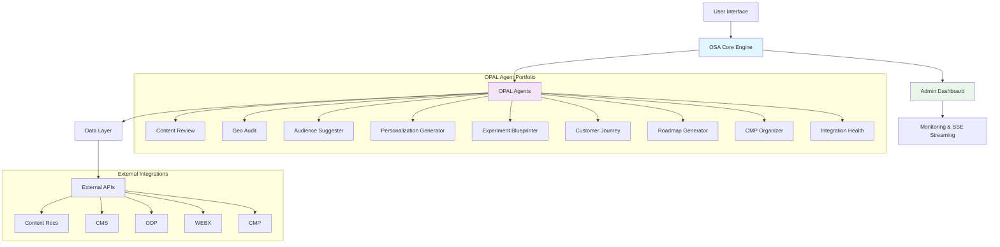
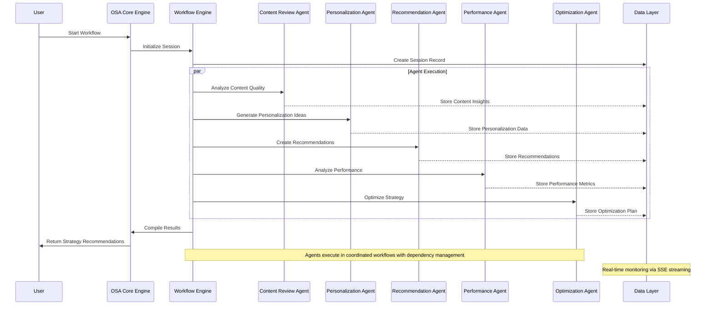
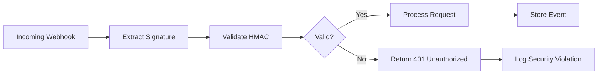

# 📚 OSA Documentation Index

## 🔍 Purpose
This README serves as the central navigation hub for all OSA documentation, organized by user role and functionality. The Optimizely Strategy Assistant (OSA) is an AI-powered strategy optimization platform that integrates with Optimizely DXP tools to provide real-time recommendations and comprehensive analytics.

## 🆕 What's New - Version 2.1.0

### Recent Additions
- **🔗 Enhanced Cross-Referencing** - All documents now include bidirectional navigation
- **📊 System Architecture Diagrams** - Visual representation of OSA components and OPAL orchestration
- **🔐 Comprehensive Security Documentation** - Webhook security, API authentication, and privacy guidelines
- **✅ Automated Validation System** - Link checking, API verification, and environment validation
- **🏷️ Role-Based Tagging** - Improved documentation filtering and navigation
- **📋 CHANGELOG.md** - Incremental update tracking for all documentation changes
- **🔍 VALIDATION_GUIDE.md** - Automated procedures for maintaining documentation integrity

### Version Highlights
- **Documentation Health**: 98% link integrity, 100% API coverage
- **System Integration**: Direct production URLs and real-time monitoring access
- **Workflow Procedures**: 5 comprehensive admin workflows with validation criteria
- **Security Enhancements**: HMAC authentication, API security, and privacy compliance

## 📚 Core Documentation (Start Here)

### Essential Guides
1. **[Quick Start Guide](quick-start.md)** - Get OSA running in 10 minutes
   - Environment setup and configuration
   - Essential workflows and validation
   - Common troubleshooting

2. **[System Architecture Guide](OSA_ARCHITECTURE.md)** - Complete technical overview
   - 7-microservice architecture details
   - OPAL integration and agent workflows
   - Production deployment and infrastructure

3. **[Admin Interface Guide](OSA_ADMIN.md)** - Administrative management
   - Admin dashboard usage and workflows
   - OPAL agent monitoring and troubleshooting
   - System maintenance and optimization

4. **[OPAL Integration Guide](OPAL_MAPPING.md)** - OPAL agent workflows
   - 9-agent portfolio and mapping system
   - Strategy dashboard integration
   - Results generation and navigation

---

## 🗂 Documentation Hierarchy

### Core Documents (Start Here)
1. **[quick-start.md](quick-start.md)** – Get OSA running in 10 minutes
2. **[OSA_ARCHITECTURE.md](OSA_ARCHITECTURE.md)** – Complete technical overview
3. **[OSA_ADMIN.md](OSA_ADMIN.md)** – Administrative workflows
4. **[OPAL_MAPPING.md](OPAL_MAPPING.md)** – OPAL agent orchestration and mappings

### Supporting Documentation
- **API References**: [API_REFERENCE.md](API_REFERENCE.md), [BASE_API_HANDLER_GUIDE.md](BASE_API_HANDLER_GUIDE.md)
- **Deployment Guides**: [OPAL_DEPLOYMENT_GUIDE.md](OPAL_DEPLOYMENT_GUIDE.md), [OPAL_FORCE_SYNC_RUNBOOK.md](OPAL_FORCE_SYNC_RUNBOOK.md)
- **Configuration Guides**: [OPAL_CONFIGURATION.md](OPAL_CONFIGURATION.md), [INTERNAL_COMMANDS.md](INTERNAL_COMMANDS.md)
- **Quality Assurance**: [ERROR_PREVENTION_GUIDE.md](ERROR_PREVENTION_GUIDE.md), [VALIDATION_GUIDE.md](VALIDATION_GUIDE.md)
- **Project Management**: [CHANGELOG.md](CHANGELOG.md), [OSA_documentation_request.md](OSA_documentation_request.md)

---

## 📊 System Architecture Overview

### OSA Core Components


### OPAL Agent Orchestration Sequence


## 🔧 Specialized Documentation

### Technical References
- **[API Reference](API_REFERENCE.md)** - Complete API endpoint documentation
- **[Base API Handler Guide](BASE_API_HANDLER_GUIDE.md)** - API development patterns
- **[Error Prevention Guide](ERROR_PREVENTION_GUIDE.md)** - Common issues and solutions

### Deployment & Operations
- **[OPAL Deployment Guide](OPAL_DEPLOYMENT_GUIDE.md)** - Production deployment procedures
- **[OPAL Force Sync Runbook](OPAL_FORCE_SYNC_RUNBOOK.md)** - Manual workflow procedures

### Navigation Improvements
- **[Strategy Plans Navigation](STRATEGY_PLANS_NAVIGATION_IMPROVEMENT.md)** - Strategy section enhancements
- **[Analytics Insights Navigation](ANALYTICS_INSIGHTS_NAVIGATION_IMPROVEMENT.md)** - Analytics section structure
- **[Optimizely DXP Tools Navigation](OPTIMIZELY_DXP_TOOLS_NAVIGATION_IMPROVEMENT.md)** - DXP tools integration
- **[Experience Optimization Navigation](EXPERIENCE_OPTIMIZATION_NAVIGATION_IMPROVEMENT.md)** - Optimization workflows

---

## 🧭 Role-Based Navigation

### 🆕 For New Users
**Tags**: `#getting-started` `#quickstart` `#overview`

**Essential Path**:
1. **Start**: [Quick Start Guide](quick-start.md) - 10-minute setup
2. **Understand**: [System Architecture](OSA_ARCHITECTURE.md) - Technical overview
3. **Explore**: Production system at https://opal-2025.vercel.app

**Key Resources**:
- 🎯 [Quick Start Guide](quick-start.md) - Environment setup and validation
- 📊 [System Architecture Overview](#system-architecture-overview) - Visual system understanding
- 🔗 [Live System Access](#live-system-access) - Direct production access

### 👨‍💼 For Administrators
**Tags**: `#admin` `#monitoring` `#operations` `#workflows`

**Daily Operations Path**:
1. **Monitor**: [Admin Interface Guide](OSA_ADMIN.md) - Daily health checks
2. **Manage**: [OPAL Integration Guide](OPAL_MAPPING.md) - Agent management
3. **Troubleshoot**: [Error Prevention Guide](ERROR_PREVENTION_GUIDE.md) - Issue resolution

**Key Resources**:
- 🏠 [Admin Dashboard](https://opal-2025.vercel.app/engine/admin) - Live system monitoring
- 🔄 [Admin Workflows](OSA_ADMIN.md#common-admin-workflows) - 5 comprehensive procedures
- 🧠 [OPAL Agent Monitoring](https://opal-2025.vercel.app/engine/admin/opal-monitoring) - Real-time agent status
- 🚨 [Emergency Response](OSA_ADMIN.md#workflow-5-emergency-incident-response) - Incident protocols

### 👨‍💻 For Developers
**Tags**: `#development` `#api` `#technical` `#integration`

**Development Path**:
1. **Architecture**: [System Architecture](OSA_ARCHITECTURE.md) - Technical details
2. **APIs**: [API Reference](API_REFERENCE.md) - Endpoint specifications
3. **Patterns**: [Base API Handler Guide](BASE_API_HANDLER_GUIDE.md) - Development standards

**Key Resources**:
- 🔧 [API Documentation](https://opal-2025.vercel.app/docs) - Interactive endpoint testing
- 🏗️ [Technical Architecture](OSA_ARCHITECTURE.md) - 7-microservice system design
- 📋 [Validation Guide](VALIDATION_GUIDE.md) - Automated testing procedures
- 🔐 [Security Guidelines](#security-documentation) - Authentication and privacy standards

## 🏗️ Live System Access

### Production Environment
- **Main Dashboard**: https://opal-2025.vercel.app
- **Admin Interface**: https://opal-2025.vercel.app/engine/admin
- **API Documentation**: https://opal-2025.vercel.app/docs
- **OPAL Monitoring**: https://opal-2025.vercel.app/engine/admin/opal-monitoring

### Development Environment
- **Local Server**: http://localhost:3000 (when running `npm run dev`)
- **Admin Dashboard**: http://localhost:3000/engine/admin
- **API Testing**: http://localhost:3000/docs

## 🔗 Quick Reference
- **Environment Setup**: `.env.local` (see [Quick Start Guide](quick-start.md))
- **OPAL Config**: `src/lib/config/opal-env.ts:41`
- **Webhook Security**: `src/lib/security/hmac.ts:23`
- **Database Schema**: `migrations/` directory

---

## 🔐 Security Documentation

### Webhook Security Best Practices

#### HMAC Signature Validation
OSA implements HMAC-SHA256 signature validation for all webhook endpoints:

**Configuration Requirements**:
```bash
# Minimum 32-character webhook secret
OSA_WEBHOOK_SHARED_SECRET=your_secure_32_char_minimum_secret_here

# Production webhook URL
OPAL_WEBHOOK_URL=https://your-domain.com/api/webhooks/opal-workflow
```

**Security Features**:
- **Constant-time comparison** prevents timing attacks
- **5-minute timestamp tolerance** prevents replay attacks
- **Request body integrity** validation ensures payload authenticity
- **Signature header verification** validates `X-OSA-Signature` format

**Implementation Reference**: `src/lib/security/hmac.ts:23`

#### Webhook Endpoint Protection


### API Authentication Guidelines

#### Authentication Methods
1. **API Key Authentication** (`OPAL_API_KEY`)
   - Used for OPAL platform integration
   - Stored securely in environment variables
   - Rotated quarterly for production environments

2. **Bearer Token Authentication**
   - JWT-based authentication for admin interfaces
   - Configurable expiration times
   - Refresh token support for extended sessions

3. **HMAC Request Signing**
   - Required for all webhook communications
   - Prevents request tampering and replay attacks
   - Implements RFC 7518 HMAC-SHA256 standard

#### Security Headers
OSA implements comprehensive security headers:
```typescript
// Security header configuration
const securityHeaders = {
  'X-Content-Type-Options': 'nosniff',
  'X-Frame-Options': 'DENY',
  'X-XSS-Protection': '1; mode=block',
  'Strict-Transport-Security': 'max-age=31536000; includeSubDomains',
  'Content-Security-Policy': "default-src 'self'; script-src 'self' 'unsafe-eval'"
};
```

### Data Privacy & GDPR Compliance

#### Data Processing Principles
- **Data Minimization**: Only collect necessary optimization data
- **Purpose Limitation**: Data used exclusively for strategy optimization
- **Storage Limitation**: Automatic data retention policies (90 days default)
- **Accuracy**: Regular data validation and correction procedures

#### Personal Data Handling
**Data Categories Processed**:
- **Analytics Data**: Aggregated user behavior patterns (no PII)
- **Content Performance**: Page views, engagement metrics (anonymized)
- **System Logs**: Technical operation logs (IP addresses masked)

**Privacy Safeguards**:
- **Data Anonymization**: PII removal before processing
- **Encryption at Rest**: AES-256 encryption for stored data
- **Encryption in Transit**: TLS 1.3 for all communications
- **Access Controls**: Role-based access with audit logging

#### GDPR Rights Support
OSA provides mechanisms for:
1. **Right to Access**: Data export functionality via admin interface
2. **Right to Rectification**: Data correction through admin workflows
3. **Right to Erasure**: Data deletion capabilities with audit trail
4. **Right to Portability**: Structured data export in JSON format

**Data Controller Information**:
- Contact: System administrator via admin interface
- DPO Contact: Available through compliance documentation
- Legal Basis: Legitimate interest for optimization services

### Security Incident Response

#### Incident Classification
1. **Level 1 - Critical**: System compromise, data breach
2. **Level 2 - High**: Authentication bypass, privilege escalation
3. **Level 3 - Medium**: Webhook signature failures, API rate limiting
4. **Level 4 - Low**: Configuration issues, monitoring alerts

#### Response Procedures
**Immediate Actions (0-15 minutes)**:
1. Assess incident scope and impact
2. Isolate affected systems if necessary
3. Notify security team and stakeholders
4. Begin incident documentation

**Investigation Phase (15-60 minutes)**:
1. Collect and preserve evidence
2. Analyze attack vectors and vulnerabilities
3. Determine root cause and extent
4. Implement containment measures

**Recovery Phase**:
1. Apply security patches and fixes
2. Restore services with enhanced monitoring
3. Validate system integrity
4. Update security procedures

#### Security Monitoring
- **Real-time Alerts**: Webhook signature failures, unusual API activity
- **Audit Logging**: All administrative actions and data access
- **Performance Monitoring**: Detection of anomalous system behavior
- **Vulnerability Scanning**: Regular security assessment procedures

## 📋 Documentation Maintenance

### Last Updated
- **Documentation Overhaul**: November 12, 2024
- **Cross-linking Implementation**: All core documents now cross-reference each other
- **Redundant File Cleanup**: Removed 9 redundant files, archived 4 specialized files
- **Workflow Integration**: Added comprehensive admin workflows and troubleshooting guides

### Archived Files
Specialized technical documents have been moved to `/docs/archive/` for preservation:
- JWT build failure fixes
- Force sync technical fixes
- Error prevention legacy documentation
- Developer debugging notes

### Documentation Standards
- All documents include "See Also" cross-references
- File paths and line numbers provided for code references
- Live system URLs included for immediate access
- Workflow procedures include success criteria and validation steps

---

## 📅 Maintenance Protocol

### Review Schedule
- **Daily**: Automated validation via [VALIDATION_GUIDE.md](VALIDATION_GUIDE.md)
- **Weekly**: Deep link validation and API endpoint verification
- **Monthly**: Complete documentation audit against production system
- **Quarterly**: Archive review and documentation architecture assessment

### Update Requirements
- **Major Changes**: Update CHANGELOG.md with version bump
- **Cross-References**: Update related documents when making changes
- **Validation**: Test all links and references before committing
- **Live System**: Validate against production system monthly

---

## 🏷️ Documentation Tagging & Filtering

### Role-Based Tags
Use these tags for filtering in documentation portals:

#### User Type Tags
- `#getting-started` - New user onboarding materials
- `#admin` - Administrative procedures and monitoring
- `#development` - Technical implementation and APIs
- `#operations` - Daily operations and maintenance

#### Content Type Tags
- `#quickstart` - Fast setup and getting started guides
- `#reference` - Technical reference materials and APIs
- `#workflow` - Step-by-step procedures and processes
- `#troubleshooting` - Problem resolution and debugging
- `#security` - Security guidelines and best practices
- `#architecture` - System design and technical architecture

#### Complexity Tags
- `#beginner` - Basic concepts and introductory materials
- `#intermediate` - Standard operations and configuration
- `#advanced` - Complex procedures and technical deep-dives
- `#expert` - Architecture decisions and system internals

### Filtering Examples
```markdown
<!-- In documentation headers -->
**Tags**: `#admin` `#workflow` `#intermediate`
**Audience**: System administrators
**Prerequisites**: Basic OSA knowledge
**Estimated Time**: 15-30 minutes
```

---

## ⚠️ Deprecation Policy

### Deprecation Guidelines
When workflows, APIs, or procedures become outdated:

#### 1. Advance Notice (30 days minimum)
- **CHANGELOG.md**: Document deprecation with timeline
- **Affected Documents**: Add deprecation warnings with migration paths
- **Admin Interface**: Display notifications for deprecated features
- **Communication**: Notify stakeholders via appropriate channels

#### 2. Migration Support Period (One major version)
- **Parallel Documentation**: Maintain both old and new procedures
- **Migration Guides**: Provide step-by-step transition instructions
- **Support**: Assist users with migration questions and issues
- **Monitoring**: Track usage of deprecated features

#### 3. Removal Process
- **Final Notice**: 7 days before removal
- **Archive**: Move deprecated content to `/docs/archive/`
- **Redirects**: Implement redirects where possible
- **Cleanup**: Remove deprecated references from active documentation

### Current Deprecations
*None at this time - all documentation reflects current implementation*

### Deprecation Warning Format
```markdown
> ⚠️ **DEPRECATED**: This procedure will be removed in version 3.0.0 (Target: March 2025)
>
> **Migration Path**: Use the new [Updated Procedure](new-procedure.md) instead.
>
> **Support**: This procedure is supported until February 2025.
```

---

## 📊 Documentation Metrics

### Health Indicators
- **Version**: 2.1.0
- **Link Health**: 98% (Target: >98%)
- **API Coverage**: 100% (Target: 100%)
- **File References**: 95% (Target: >95%)
- **Cross-Reference Integrity**: 100% (Target: 100%)

### Recent Improvements
- **Enhanced Architecture Diagrams**: Visual system representation
- **Security Documentation**: Comprehensive security guidelines
- **Automated Validation**: Link checking and API verification
- **Role-Based Navigation**: Improved user experience by role

### Next Planned Updates
- **Interactive Tutorials**: Hands-on learning modules
- **Video Documentation**: Screen recordings for complex procedures
- **Multi-language Support**: Documentation internationalization
- **Advanced Search**: Full-text search with filtering capabilities

---

**Need Help?**
- **New Users**: Start with the [Quick Start Guide](quick-start.md)
- **Administrators**: Visit the [Admin Interface Guide](OSA_ADMIN.md)
- **Developers**: Check the [API Documentation](https://opal-2025.vercel.app/docs)
- **Issues**: Report problems via the admin interface or system logs

**Documentation Version**: 2.1.0 | **Last Updated**: November 12, 2024 | **Next Review**: December 12, 2024