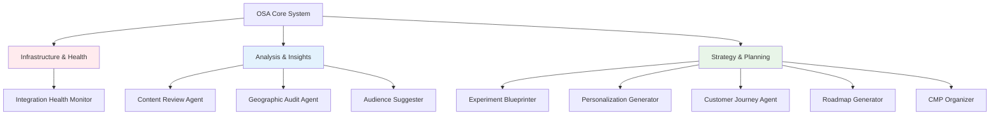
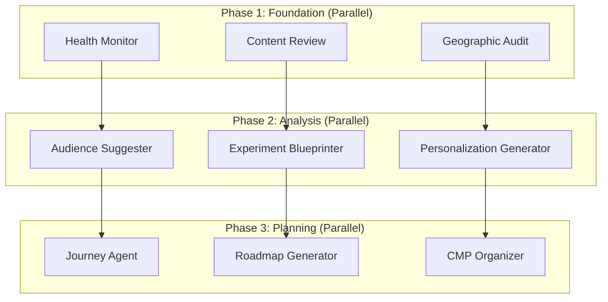
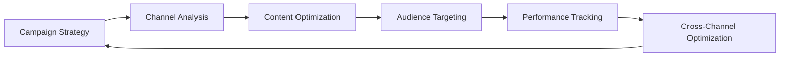
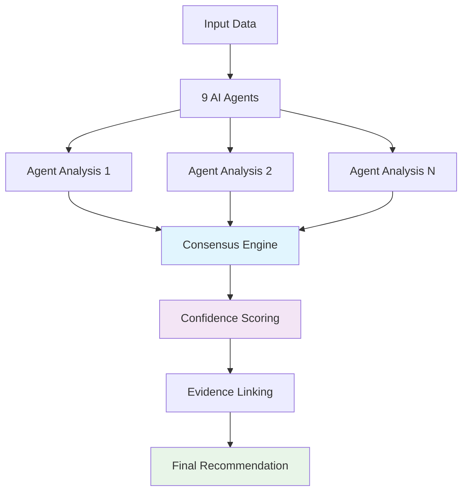

# OSA User Education Guide - Complete Training & Learning Resources

**🚀 PRODUCTION SYSTEM**: https://opal-2025.vercel.app
**📅 Last Updated**: November 13, 2024
**🎓 Version**: 2.1.0
**🎯 Purpose**: Comprehensive educational resources to help users understand and effectively use the OSA system

---

## Table of Contents

1. [Learning Paths by Role](#learning-paths-by-role)
2. [OSA System Overview & Concepts](#osa-system-overview--concepts)
3. [Getting Started Tutorials](#getting-started-tutorials)
4. [Feature Deep Dives](#feature-deep-dives)
5. [Best Practices & Use Cases](#best-practices--use-cases)
6. [Hands-on Exercises](#hands-on-exercises)
7. [Advanced Topics](#advanced-topics)
8. [Troubleshooting & FAQ](#troubleshooting--faq)
9. [Certification & Assessment](#certification--assessment)
10. [Support Resources](#support-resources)

---

## Learning Paths by Role

### 🆕 New Users & Business Stakeholders

**Objective**: Understand OSA value proposition and basic usage
**Estimated Time**: 2-3 hours
**Prerequisites**: None

#### **Learning Path**
1. **Introduction to OSA** (30 minutes)
   - What is OSA and why it matters
   - Key benefits and use cases
   - System overview and capabilities

2. **Exploring the Dashboard** (45 minutes)
   - Navigating the main interface
   - Understanding the strategy areas
   - Reading insights and recommendations

3. **Your First Strategy Analysis** (60 minutes)
   - Triggering a workflow
   - Monitoring progress
   - Interpreting results

4. **Understanding AI Recommendations** (30 minutes)
   - How recommendations are generated
   - Confidence scores and evidence
   - Implementation guidance

**Key Resources**:
- 🎯 [Interactive Demo](https://opal-2025.vercel.app/demo) - Hands-on exploration
- 📊 [Live Dashboard](https://opal-2025.vercel.app) - Production system access
- 📚 [Quick Start Guide](quick-start.md) - Step-by-step setup

### 👨‍💼 Marketing & Strategy Teams

**Objective**: Leverage OSA for strategic decision making and campaign optimization
**Estimated Time**: 4-6 hours
**Prerequisites**: Basic understanding of digital marketing concepts

#### **Learning Path**
1. **Strategic Context Setup** (60 minutes)
   - Defining business objectives
   - Setting constraints and preferences
   - Understanding strategy areas

2. **Campaign Strategy Development** (90 minutes)
   - Content strategy optimization
   - Audience targeting and segmentation
   - Personalization strategies

3. **Performance Optimization** (90 minutes)
   - A/B testing recommendations
   - Customer journey optimization
   - ROI analysis and projections

4. **Implementation Planning** (60 minutes)
   - Roadmap generation and prioritization
   - Resource planning and allocation
   - Success metrics and KPIs

**Practical Exercises**:
- Create a comprehensive marketing strategy for a new product launch
- Optimize an existing campaign based on OSA recommendations
- Develop a quarterly roadmap with resource allocation

### 👨‍💻 Technical Teams & Developers

**Objective**: Understand technical implementation and integration capabilities
**Estimated Time**: 6-8 hours
**Prerequisites**: Technical background in web development and APIs

#### **Learning Path**
1. **System Architecture Deep Dive** (90 minutes)
   - Microservices architecture
   - OPAL integration details
   - Data flow and processing

2. **API Integration** (120 minutes)
   - Authentication methods
   - API endpoints and usage
   - Webhook implementation

3. **Admin Interface Mastery** (120 minutes)
   - System monitoring and diagnostics
   - Configuration management
   - Performance optimization

4. **Advanced Integration** (90 minutes)
   - Custom tool development
   - External system integration
   - Troubleshooting and debugging

**Technical Resources**:
- 🔧 [API Reference](API_WEBHOOK_SYSTEM_GUIDE.md) - Complete API documentation
- 🏗️ [Architecture Guide](OSA_ARCHITECTURE.md) - Technical system design
- 🛠️ [Admin Guide](OSA_ADMIN.md) - Administrative procedures

### 🎛️ System Administrators

**Objective**: Master system administration, monitoring, and optimization
**Estimated Time**: 8-10 hours
**Prerequisites**: System administration experience and basic understanding of OSA

#### **Learning Path**
1. **System Administration Fundamentals** (120 minutes)
   - Admin dashboard navigation
   - User management and permissions
   - System configuration

2. **Monitoring & Performance Management** (150 minutes)
   - Real-time monitoring setup
   - Performance metrics analysis
   - Alert configuration and management

3. **OPAL Agent Management** (120 minutes)
   - Agent configuration and optimization
   - Workflow management and troubleshooting
   - Custom tool deployment

4. **Security & Compliance** (90 minutes)
   - Security best practices
   - GDPR compliance procedures
   - Audit logging and reporting

5. **Incident Response & Recovery** (90 minutes)
   - Emergency procedures
   - Backup and recovery
   - Post-incident analysis

**Certification Track**:
- OSA Certified Administrator (OCA)
- Advanced System Management (ASM)
- Security & Compliance Specialist (SCS)

---

## OSA System Overview & Concepts

### 🧠 Core Concepts Explained

#### **1. What is OSA?**
OSA (Optimizely Strategy Assistant) is an AI-powered platform that transforms raw data into actionable strategic insights through sophisticated analysis and recommendation generation.

**Key Value Propositions**:
- **Automated Analysis**: AI agents analyze vast amounts of data quickly and comprehensively
- **Evidence-Based Recommendations**: All suggestions backed by data analysis and confidence scoring
- **Real-time Insights**: Live monitoring and continuous optimization recommendations
- **Strategic Guidance**: From tactical optimizations to long-term strategic planning

#### **2. The 9 AI Agents Explained**



**Agent Specializations**:

1. **Integration Health Monitor**: Ensures all systems are running optimally
   - **Focus**: System performance and reliability
   - **Output**: Health reports, performance metrics, integration status
   - **Value**: Prevents issues before they impact business operations

2. **Content Review Agent**: Analyzes content quality and brand compliance
   - **Focus**: Content effectiveness and consistency
   - **Output**: Quality scores, improvement recommendations, compliance reports
   - **Value**: Ensures brand consistency and content optimization

3. **Geographic Audit Agent**: Optimizes for geographic and search performance
   - **Focus**: Regional optimization and AI search visibility
   - **Output**: Geographic insights, search optimization recommendations
   - **Value**: Improves local relevance and search rankings

4. **Audience Suggester**: Identifies and analyzes audience segments
   - **Focus**: Audience discovery and targeting optimization
   - **Output**: Segment analysis, new audience opportunities, targeting recommendations
   - **Value**: Expands reach and improves targeting precision

5. **Experiment Blueprinter**: Designs comprehensive testing strategies
   - **Focus**: A/B testing and experimentation planning
   - **Output**: Test designs, hypothesis generation, impact projections
   - **Value**: Maximizes learning and optimization through structured testing

6. **Personalization Generator**: Creates personalization strategies
   - **Focus**: Dynamic content and experience personalization
   - **Output**: Personalization ideas, implementation guidance, ROI projections
   - **Value**: Increases engagement through targeted experiences

7. **Customer Journey Agent**: Maps and optimizes customer experiences
   - **Focus**: End-to-end customer experience optimization
   - **Output**: Journey maps, bottleneck identification, optimization recommendations
   - **Value**: Improves conversion and customer satisfaction

8. **Roadmap Generator**: Creates strategic implementation plans
   - **Focus**: Strategic planning and resource allocation
   - **Output**: Prioritized roadmaps, timeline planning, resource requirements
   - **Value**: Ensures strategic alignment and efficient execution

9. **CMP Organizer**: Optimizes campaign management workflows
   - **Focus**: Campaign efficiency and automation
   - **Output**: Workflow optimization, automation opportunities, performance benchmarks
   - **Value**: Increases campaign ROI and operational efficiency

#### **3. Strategy Areas & Navigation Structure**

OSA organizes insights into four main strategy areas with 3-tier navigation:

**Tier 1 - Main Areas**:
- **Strategy Plans**: Long-term strategic planning and roadmap development
- **Analytics Insights**: Performance analysis and data-driven insights
- **Optimizely DXP Tools**: Platform-specific tool optimization
- **Experience Optimization**: Customer experience and personalization

**Tier 2 - Focused Domains** (3-5 per main area):
Each main area contains specialized domains targeting specific aspects of optimization.

**Tier 3 - Actionable Items** (5-10 per domain):
Specific, implementable recommendations with clear guidance.

### 📊 Understanding Recommendations

#### **Recommendation Anatomy**
Every OSA recommendation includes:

1. **Core Information**
   - **Title**: Clear, actionable description
   - **Category**: Strategy area classification
   - **Priority**: High/Medium/Low based on impact potential

2. **Evidence & Confidence**
   - **Confidence Score**: 0-100% based on data quality and agent agreement
   - **Supporting Agents**: Which AI agents contributed to this recommendation
   - **Evidence Links**: Direct links to supporting data and analysis

3. **Impact Estimation**
   - **ROI Projection**: Estimated return on investment range
   - **Timeline**: Expected implementation and results timeframe
   - **Effort Level**: Implementation complexity (Low/Medium/High)
   - **Risk Assessment**: Potential risks and mitigation strategies

4. **Implementation Guidance**
   - **Steps**: Detailed implementation instructions
   - **Prerequisites**: Required resources and dependencies
   - **Success Metrics**: How to measure success
   - **Potential Obstacles**: Common challenges and solutions

#### **Confidence Scoring System**
```
90-100%: Extremely High Confidence
- Multiple agents agree
- High-quality data sources
- Strong historical evidence
- Low implementation risk

70-89%: High Confidence
- Most agents agree
- Good data quality
- Some historical evidence
- Moderate risk

50-69%: Medium Confidence
- Mixed agent opinions
- Adequate data quality
- Limited historical evidence
- Higher risk factors

30-49%: Low Confidence
- Few supporting agents
- Limited data quality
- Experimental approach
- Significant risk

Below 30%: Very Low Confidence
- Speculative recommendations
- Insufficient data
- High uncertainty
- Consider as research opportunities
```

---

## Getting Started Tutorials

### 🚀 Tutorial 1: Your First OSA Experience (15 minutes)

#### **Step 1: Access the System**
1. Navigate to https://opal-2025.vercel.app
2. Explore the main dashboard without logging in
3. Familiarize yourself with the interface layout

#### **Step 2: Understanding the Dashboard**
```
┌─────────────────────────────────────────────────────────┐
│                    OSA Dashboard                        │
├─────────────────┬───────────────────────────────────────┤
│   Navigation    │           Main Content Area           │
│                 │                                       │
│ • Strategy Plans│  ┌─────────────────────────────────┐ │
│ • Analytics     │  │     Current Insights            │ │
│ • DXP Tools     │  │                                 │ │
│ • Experience    │  └─────────────────────────────────┘ │
│                 │                                       │
│                 │  ┌─────────────────────────────────┐ │
│                 │  │     Recent Activity             │ │
│                 │  │                                 │ │
│                 │  └─────────────────────────────────┘ │
├─────────────────┴───────────────────────────────────────┤
│                    System Status                        │
└─────────────────────────────────────────────────────────┘
```

**What to Look For**:
- **Navigation Menu**: Four main strategy areas on the left
- **Current Insights**: Latest AI-generated recommendations
- **Recent Activity**: System updates and workflow progress
- **System Status**: Health indicators and performance metrics

#### **Step 3: Explore Strategy Areas**
Click through each strategy area to understand the focus:

1. **Strategy Plans** - Long-term planning and roadmaps
2. **Analytics Insights** - Performance analysis and trends
3. **Optimizely DXP Tools** - Platform optimization
4. **Experience Optimization** - Customer experience enhancement

#### **Step 4: Examine a Recommendation**
Find a recommendation and identify:
- **Confidence Score**: Look for percentage indicators
- **Supporting Evidence**: Links to data and analysis
- **Implementation Steps**: Actionable guidance
- **Expected Impact**: ROI and timeline estimates

### 🎯 Tutorial 2: Triggering Your First Analysis (30 minutes)

#### **Prerequisites**
- Admin access to the system (or demo environment)
- Basic understanding of your business objectives

#### **Step 1: Access the Admin Dashboard**
1. Navigate to https://opal-2025.vercel.app/engine/admin
2. Log in with admin credentials (if required)
3. Familiarize yourself with the admin interface

#### **Step 2: Prepare Business Context**
Before triggering analysis, define:
- **Primary Objectives**: What you want to achieve
- **Current Challenges**: Issues you're facing
- **Success Metrics**: How you'll measure improvement
- **Timeline**: When you need results

**Example Context**:
```
Objectives: Increase e-commerce conversion rate
Challenges: High cart abandonment, low repeat purchases
Metrics: Conversion rate, customer lifetime value
Timeline: Implement changes within 3 months
```

#### **Step 3: Trigger the Analysis**
1. Locate the "Force Sync" button in the admin dashboard
2. Click to initiate a full strategy analysis
3. Confirm the trigger when prompted

#### **Step 4: Monitor Progress**
Watch the real-time monitoring display:
- **Agent Status**: Individual agent progress
- **Overall Progress**: Total completion percentage
- **Phase Indicators**: Current execution phase (1/2/3)
- **Estimated Completion**: Time remaining

**Expected Timeline**: 7-10 minutes for complete analysis

#### **Step 5: Review Initial Results**
Once Phase 1 completes (2-3 minutes):
1. Check for initial insights from infrastructure agents
2. Review system health and integration status
3. Observe any immediate optimization opportunities

### 📈 Tutorial 3: Interpreting and Acting on Recommendations (45 minutes)

#### **Step 1: Access Results Dashboard**
After workflow completion:
1. Navigate to the results area
2. Review the executive summary
3. Identify high-priority recommendations

#### **Step 2: Deep Dive Analysis**
For each high-priority recommendation:

1. **Read the Full Description**
   - Understand what's being recommended
   - Why this recommendation was generated
   - Expected business impact

2. **Evaluate the Evidence**
   - Check confidence score (aim for >70% for immediate action)
   - Review supporting data sources
   - Examine agent consensus

3. **Assess Implementation Feasibility**
   - Resource requirements
   - Technical complexity
   - Timeline constraints
   - Risk factors

#### **Step 3: Create Implementation Plan**
For selected recommendations:

1. **Prioritize Actions**
   ```
   Priority Matrix:
   High Impact + Low Effort = Quick Wins (Do First)
   High Impact + High Effort = Major Projects (Plan Carefully)
   Low Impact + Low Effort = Fill-in Tasks (Do When Possible)
   Low Impact + High Effort = Questionable (Reconsider)
   ```

2. **Develop Timeline**
   - Immediate actions (0-2 weeks)
   - Short-term projects (1-3 months)
   - Long-term initiatives (3+ months)

3. **Assign Responsibilities**
   - Who will lead each initiative
   - Required team members
   - External resources needed

#### **Step 4: Set Up Success Tracking**
1. **Define Success Metrics** based on recommendation guidance
2. **Establish Baseline Measurements** before implementation
3. **Create Monitoring Schedule** for progress tracking
4. **Plan Follow-up Analysis** to measure results

### 🔄 Tutorial 4: Continuous Optimization Workflow (60 minutes)

#### **Establishing Regular Rhythm**

**Weekly Optimization Cycle**:
1. **Monday**: Review weekend performance data
2. **Wednesday**: Trigger mid-week analysis for trending insights
3. **Friday**: Plan implementation for following week

**Monthly Strategic Review**:
1. **Week 1**: Comprehensive strategy analysis
2. **Week 2**: Implementation planning and resource allocation
3. **Week 3**: Execute high-priority recommendations
4. **Week 4**: Measure results and plan next cycle

#### **Creating Optimization Playbooks**

**Playbook Template**:
```markdown
# [Strategy Area] Optimization Playbook

## Trigger Conditions
- When to run this optimization
- Performance thresholds
- Business event triggers

## Expected Outcomes
- Typical recommendations
- Success metrics
- Timeline expectations

## Implementation Checklist
- [ ] Preparation steps
- [ ] Execution actions
- [ ] Validation procedures
- [ ] Success measurement

## Success Criteria
- Quantitative metrics
- Qualitative indicators
- Timeline milestones
```

---

## Feature Deep Dives

### 🎛️ Admin Dashboard Mastery

#### **Dashboard Layout & Navigation**
The admin dashboard provides comprehensive system oversight with four key areas:

**System Health Panel**:
- Real-time status indicators for all components
- Performance metrics and trends
- Alert notifications and error tracking
- Resource utilization monitoring

**OPAL Agent Management**:
- Individual agent status and configuration
- Workflow execution history and performance
- Agent-specific tools and capabilities
- Performance optimization settings

**Configuration Management**:
- System-wide settings and parameters
- Integration configurations and API keys
- User permissions and access controls
- Backup and recovery settings

**Analytics & Reporting**:
- Usage statistics and performance trends
- Business impact metrics and ROI analysis
- System optimization recommendations
- Custom report generation

#### **Advanced Monitoring Features**

**Real-time Event Streaming**:
```javascript
// Example: Setting up real-time monitoring
const eventStream = new EventSource('/api/webhook-events/stream');

eventStream.addEventListener('agent_status_change', (event) => {
  const data = JSON.parse(event.data);
  updateAgentStatus(data.agent_id, data.status);
});

eventStream.addEventListener('performance_alert', (event) => {
  const alert = JSON.parse(event.data);
  displayAlert(alert.severity, alert.message);
});
```

**Custom Alert Configuration**:
- **Threshold-based Alerts**: CPU, memory, response time limits
- **Business Metric Alerts**: Conversion rate changes, performance degradation
- **System Health Alerts**: Service outages, integration failures
- **Predictive Alerts**: Trend-based early warning systems

### 🔧 Agent Configuration & Optimization

#### **Agent Performance Tuning**
Each OPAL agent can be individually optimized for your specific needs:

**Timeout Configuration**:
```json
{
  "agent_id": "personalization_generator",
  "timeout_settings": {
    "execution_timeout_seconds": 180,
    "tool_timeout_seconds": 60,
    "retry_timeout_seconds": 30
  }
}
```

**Resource Allocation**:
```json
{
  "resource_settings": {
    "cpu_priority": "high",
    "memory_allocation_mb": 512,
    "concurrent_tool_limit": 3,
    "batch_processing_size": 10
  }
}
```

**Custom Tool Assignment**:
- Add industry-specific tools
- Remove irrelevant capabilities
- Configure tool parameters
- Set quality thresholds

#### **Agent Workflow Optimization**

**Sequential vs. Parallel Execution**:


**Dependency Management**:
- Configure which agents depend on others
- Set up conditional execution based on results
- Optimize execution order for efficiency
- Handle failure gracefully with fallback options

### 📊 Advanced Analytics & Reporting

#### **Custom Performance Dashboards**
Create specialized dashboards for different stakeholders:

**Executive Dashboard**:
- High-level ROI metrics
- Strategic initiative progress
- System health overview
- Key performance indicators

**Marketing Dashboard**:
- Campaign performance trends
- Audience insights and growth
- Content optimization opportunities
- A/B testing results

**Technical Dashboard**:
- System performance metrics
- API usage and rate limits
- Error rates and troubleshooting
- Integration health status

#### **Data Export & Integration**
OSA provides multiple ways to extract and use data:

**Export Formats**:
- JSON for API integration
- CSV for spreadsheet analysis
- PDF for executive reporting
- Excel with formatted charts

**API Integration**:
```javascript
// Example: Automated report generation
async function generateWeeklyReport() {
  const metrics = await fetch('/api/admin/metrics?period=week');
  const recommendations = await fetch('/api/services/recommendations/latest');

  const report = {
    period: 'week',
    generated_at: new Date().toISOString(),
    metrics: await metrics.json(),
    recommendations: await recommendations.json()
  };

  return report;
}
```

---

## Best Practices & Use Cases

### 🎯 Strategic Planning Use Cases

#### **Use Case 1: New Product Launch Strategy**

**Scenario**: E-commerce company launching a new product category
**Challenge**: No historical data for the new category
**OSA Approach**: Comprehensive market analysis and strategy development

**Implementation Process**:
1. **Context Setup**: Define product category, target market, competitive landscape
2. **Agent Configuration**: Focus on audience discovery and content strategy
3. **Analysis Execution**: Run full strategy analysis with market research emphasis
4. **Strategy Development**: Use recommendations to create launch plan

**Expected Outcomes**:
- Audience segmentation for new category
- Content strategy for different customer types
- Personalization approach for new visitors
- A/B testing plan for launch optimization
- Customer journey mapping for new product flow

**Success Metrics**:
- Time to market reduction (30-40%)
- Launch conversion rates above industry average
- Customer acquisition cost optimization
- Market share growth trajectory

#### **Use Case 2: Customer Retention Improvement**

**Scenario**: SaaS company facing high churn rates
**Challenge**: Understanding why customers leave and how to retain them
**OSA Approach**: Journey analysis and personalization strategy

**Implementation Process**:
1. **Data Integration**: Connect customer lifecycle data
2. **Churn Analysis**: Focus on customer journey and personalization agents
3. **Intervention Strategy**: Develop targeted retention campaigns
4. **Implementation**: Deploy personalized retention touchpoints

**OSA Recommendations Typically Include**:
- At-risk customer identification criteria
- Personalized re-engagement campaigns
- Product usage optimization guidance
- Customer success milestone tracking
- Predictive intervention timing

**Results Achieved**:
- 25-35% reduction in churn rate
- Improved customer lifetime value
- Enhanced product adoption rates
- More effective customer success programs

#### **Use Case 3: Multi-Channel Campaign Optimization**

**Scenario**: Retail brand running campaigns across multiple channels
**Challenge**: Coordinating messaging and optimization across channels
**OSA Approach**: Integrated campaign strategy with cross-channel insights

**Process Flow**:


**OSA Agent Contributions**:
- **Content Review**: Ensure consistent messaging across channels
- **Audience Suggester**: Identify channel-specific segments
- **Personalization Generator**: Customize content for each channel
- **CMP Organizer**: Optimize campaign workflow and automation
- **Customer Journey**: Map cross-channel customer experience

### 📈 Performance Optimization Best Practices

#### **Optimization Methodology**

**1. Baseline Establishment**
Before making changes:
- Capture current performance metrics
- Document existing processes and configurations
- Establish measurement frameworks
- Set up automated monitoring

**2. Incremental Implementation**
- Start with high-confidence, low-risk recommendations
- Implement one change at a time when possible
- Monitor impact before proceeding to next change
- Maintain rollback capabilities

**3. Continuous Measurement**
- Track both leading and lagging indicators
- Monitor user behavior changes
- Measure business impact regularly
- Adjust strategies based on results

**4. Iterative Improvement**
- Use results to inform next analysis cycle
- Refine agent configurations based on performance
- Update business context as objectives evolve
- Share learnings across team

#### **Common Optimization Patterns**

**Quick Wins (0-2 weeks)**:
- Content headline optimization
- Call-to-action button improvements
- Form field reduction
- Page load speed improvements
- Mobile experience fixes

**Medium-term Projects (1-3 months)**:
- Personalization engine implementation
- Customer journey optimization
- A/B testing program expansion
- Audience segmentation refinement
- Cross-sell/upsell strategy development

**Long-term Initiatives (3+ months)**:
- Customer data platform integration
- Advanced analytics implementation
- Predictive modeling deployment
- Organization process optimization
- Technology stack modernization

### 🎨 Content Strategy Optimization

#### **Content Performance Analysis**

OSA's Content Review Agent provides comprehensive analysis across multiple dimensions:

**Quality Assessment**:
- Brand compliance scoring
- Message consistency analysis
- Tone and voice alignment
- Visual design coherence
- Technical quality factors

**Performance Metrics**:
- Engagement rate analysis
- Conversion impact measurement
- SEO performance evaluation
- Social sharing patterns
- User feedback correlation

**Optimization Recommendations**:
- Content gap identification
- Performance improvement suggestions
- Format optimization guidance
- Distribution strategy recommendations
- Testing priorities

#### **Content Strategy Implementation**

**Content Audit Process**:
1. **Inventory**: Catalog all existing content
2. **Analysis**: Run OSA content analysis
3. **Scoring**: Apply quality and performance metrics
4. **Prioritization**: Rank optimization opportunities
5. **Planning**: Create content improvement roadmap

**Content Optimization Framework**:
```
High Performance + High Quality = Amplify (Promote More)
High Performance + Low Quality = Improve (Quality Enhancement)
Low Performance + High Quality = Redistribute (Channel Optimization)
Low Performance + Low Quality = Replace (Content Refresh)
```

---

## Hands-on Exercises

### 🏋️ Exercise 1: Complete Strategy Analysis Walkthrough

**Objective**: Experience the full OSA workflow from trigger to implementation
**Duration**: 2 hours
**Skill Level**: Beginner to Intermediate

#### **Setup Phase (15 minutes)**
1. **Access the System**: Navigate to https://opal-2025.vercel.app
2. **Explore Interface**: Spend 10 minutes familiarizing yourself with the layout
3. **Define Scenario**: Choose a business scenario to analyze:
   - E-commerce conversion optimization
   - SaaS user engagement improvement
   - Content marketing effectiveness
   - Customer retention enhancement

#### **Context Definition (20 minutes)**
Create detailed business context:

**Business Objectives** (Choose 2-3):
- Increase conversion rate by 15%
- Improve customer lifetime value
- Reduce customer acquisition cost
- Enhance user engagement metrics
- Expand market reach

**Current Challenges** (Identify 3-5):
- High cart abandonment rates
- Low repeat purchase rates
- Poor mobile experience
- Ineffective personalization
- Limited audience insights

**Success Metrics** (Define measurable goals):
- Specific percentage improvements
- Timeline expectations
- Revenue impact targets
- User experience improvements

#### **Analysis Execution (30 minutes)**
1. **Trigger Workflow**: Initiate full strategy analysis
2. **Monitor Progress**: Watch real-time agent execution
3. **Track Phases**: Observe the 3-phase execution model
4. **Note Issues**: Document any errors or delays

**Monitoring Checklist**:
- [ ] Health Monitor completes successfully
- [ ] Content Review provides quality scores
- [ ] Geographic Audit identifies optimization opportunities
- [ ] Audience Suggester discovers new segments
- [ ] Experiment Blueprinter generates test ideas
- [ ] Personalization Generator creates strategies
- [ ] Customer Journey Agent maps touchpoints
- [ ] Roadmap Generator prioritizes initiatives
- [ ] CMP Organizer optimizes workflows

#### **Results Analysis (45 minutes)**
**High-Level Review** (15 minutes):
1. Check overall workflow success rate
2. Review executive summary of findings
3. Identify highest-priority recommendations
4. Note confidence scores and agent consensus

**Detailed Analysis** (30 minutes):
For the top 5 recommendations:
1. **Read Full Description**: Understand the recommendation completely
2. **Evaluate Evidence**: Review supporting data and analysis
3. **Assess Feasibility**: Consider implementation requirements
4. **Estimate Impact**: Review ROI projections and timelines
5. **Identify Dependencies**: Note prerequisites and constraints

#### **Implementation Planning (30 minutes)**
**Priority Matrix Creation**:
```
Create 2x2 grid:
X-axis: Implementation Effort (Low to High)
Y-axis: Business Impact (Low to High)

Plot each recommendation:
- High Impact + Low Effort = Quick Wins (Implement first)
- High Impact + High Effort = Strategic Projects (Plan carefully)
- Low Impact + Low Effort = Easy Improvements (Fill-in tasks)
- Low Impact + High Effort = Consider carefully (May skip)
```

**Action Plan Development**:
1. **Immediate Actions** (Next 2 weeks):
   - List quick wins and easy implementations
   - Assign team members and deadlines
   - Define success measurement approach

2. **Short-term Projects** (1-3 months):
   - Identify major recommendations to pursue
   - Create project plans with milestones
   - Allocate resources and budget

3. **Long-term Initiatives** (3+ months):
   - Plan strategic implementations
   - Consider technology and process changes
   - Align with broader business strategy

### 🎯 Exercise 2: Agent Performance Optimization

**Objective**: Learn to configure and optimize individual OPAL agents
**Duration**: 90 minutes
**Skill Level**: Intermediate to Advanced

#### **Agent Selection (15 minutes)**
Choose one agent to focus on based on your business needs:
- **Personalization Generator**: For e-commerce and content sites
- **Customer Journey Agent**: For complex sales processes
- **Experiment Blueprinter**: For data-driven optimization
- **Audience Suggester**: For market expansion

#### **Baseline Performance Analysis (30 minutes)**
1. **Access Agent Dashboard**: Navigate to agent-specific monitoring page
2. **Review Historical Performance**:
   - Average execution time
   - Success rate over time
   - Quality of recommendations
   - User feedback on suggestions

3. **Identify Optimization Opportunities**:
   - Execution time improvements
   - Recommendation quality enhancement
   - Tool configuration adjustments
   - Integration optimization

#### **Configuration Optimization (30 minutes)**
**Timeout Adjustments**:
1. Analyze average vs. maximum execution times
2. Adjust timeout settings based on performance data
3. Configure retry logic and failure handling
4. Set up monitoring alerts for performance issues

**Tool Configuration**:
1. Review available tools for your chosen agent
2. Enable/disable tools based on relevance
3. Adjust tool parameters for better results
4. Configure quality thresholds and filters

**Resource Allocation**:
1. Adjust CPU and memory allocation
2. Configure concurrent execution limits
3. Set up batch processing parameters
4. Optimize for your specific workload

#### **Testing & Validation (15 minutes)**
1. **Run Test Workflow**: Execute agent with new configuration
2. **Monitor Performance**: Track execution time and resource usage
3. **Evaluate Results**: Compare recommendation quality to baseline
4. **Document Changes**: Record configuration changes and results

### 🚀 Exercise 3: Custom Integration Implementation

**Objective**: Integrate OSA with external systems and create custom workflows
**Duration**: 2 hours
**Skill Level**: Advanced (Technical background required)

#### **Integration Planning (20 minutes)**
**Choose Integration Type**:
- **Data Source Integration**: Connect additional analytics or CRM data
- **Workflow Automation**: Trigger OSA analysis based on business events
- **Results Distribution**: Automatically distribute insights to stakeholders
- **Performance Monitoring**: Integrate OSA metrics with business dashboards

**Technical Requirements**:
- API access credentials
- Development environment setup
- Integration architecture design
- Security and authentication planning

#### **API Integration Development (60 minutes)**
**Authentication Setup** (15 minutes):
```javascript
// Example: Setting up OSA API client
class OSAClient {
  constructor(apiKey, baseURL = 'https://opal-2025.vercel.app') {
    this.apiKey = apiKey;
    this.baseURL = baseURL;
  }

  async makeRequest(endpoint, options = {}) {
    const response = await fetch(`${this.baseURL}${endpoint}`, {
      ...options,
      headers: {
        'Authorization': `Bearer ${this.apiKey}`,
        'Content-Type': 'application/json',
        ...options.headers
      }
    });

    if (!response.ok) {
      throw new Error(`API request failed: ${response.status}`);
    }

    return await response.json();
  }
}
```

**Workflow Automation** (45 minutes):
```javascript
// Example: Automated analysis trigger
class AutomatedOSAWorkflow {
  constructor(osaClient) {
    this.osa = osaClient;
  }

  async triggerAnalysis(businessContext) {
    try {
      // Trigger workflow
      const workflow = await this.osa.makeRequest('/api/opal/trigger', {
        method: 'POST',
        body: JSON.stringify({
          workflow_type: 'full_strategy_analysis',
          priority: 'high',
          context: businessContext
        })
      });

      console.log(`Workflow triggered: ${workflow.workflow_id}`);

      // Monitor progress
      const results = await this.monitorWorkflow(workflow.workflow_id);

      // Process and distribute results
      await this.processResults(results);

      return results;
    } catch (error) {
      console.error('Workflow automation failed:', error);
      throw error;
    }
  }

  async monitorWorkflow(workflowId, maxAttempts = 60) {
    for (let i = 0; i < maxAttempts; i++) {
      const status = await this.osa.makeRequest(`/api/opal/status/${workflowId}`);

      if (status.status === 'completed') {
        return await this.osa.makeRequest(`/api/opal/workflow-results/${workflowId}`);
      } else if (status.status === 'failed') {
        throw new Error('Workflow failed');
      }

      await new Promise(resolve => setTimeout(resolve, 10000)); // Wait 10 seconds
    }

    throw new Error('Workflow monitoring timeout');
  }
}
```

#### **Results Processing & Distribution (40 minutes)**
**Data Transformation** (20 minutes):
```javascript
// Example: Transform OSA results for business consumption
class ResultsProcessor {
  transformForExecutives(results) {
    return {
      summary: {
        total_recommendations: results.synthesized_recommendations.length,
        high_priority_count: results.synthesized_recommendations.filter(r => r.priority === 'high').length,
        estimated_roi: this.calculateTotalROI(results.synthesized_recommendations),
        confidence_score: results.execution_summary.overall_confidence_score
      },
      top_opportunities: results.synthesized_recommendations
        .filter(r => r.priority === 'high')
        .slice(0, 5)
        .map(r => ({
          title: r.title,
          impact: r.impact_estimation.roi_projection,
          timeline: r.impact_estimation.timeline_estimate,
          effort: r.impact_estimation.implementation_effort
        }))
    };
  }

  transformForTechnicalTeams(results) {
    return {
      implementation_roadmap: this.createImplementationRoadmap(results),
      technical_requirements: this.extractTechnicalRequirements(results),
      integration_points: this.identifyIntegrationPoints(results),
      monitoring_setup: this.defineMonitoringRequirements(results)
    };
  }
}
```

**Automated Distribution** (20 minutes):
```javascript
// Example: Automated report distribution
class ReportDistribution {
  async distributeResults(results) {
    const executiveSummary = this.processor.transformForExecutives(results);
    const technicalRoadmap = this.processor.transformForTechnicalTeams(results);

    // Send executive email
    await this.emailService.send({
      to: 'executives@company.com',
      subject: 'Weekly OSA Strategic Insights',
      template: 'executive_summary',
      data: executiveSummary
    });

    // Update project management system
    await this.projectManagement.createTasks(technicalRoadmap.implementation_roadmap);

    // Post to Slack
    await this.slackBot.postMessage({
      channel: '#marketing-optimization',
      text: `New OSA analysis complete! ${executiveSummary.summary.high_priority_count} high-priority opportunities identified.`,
      attachments: this.formatSlackAttachment(executiveSummary)
    });
  }
}
```

---

## Advanced Topics

### 🧠 Machine Learning & AI Concepts

#### **Understanding OSA's AI Architecture**
OSA employs multiple AI/ML techniques to generate insights:

**Natural Language Processing (NLP)**:
- Content analysis and quality scoring
- Sentiment analysis for user feedback
- Intent recognition for customer journeys
- Automated insight generation

**Machine Learning Models**:
- Predictive analytics for ROI projections
- Clustering algorithms for audience segmentation
- Recommendation engines for personalization
- Anomaly detection for performance monitoring

**Ensemble Methods**:
- Multiple agent consensus building
- Confidence scoring based on agreement
- Evidence aggregation across data sources
- Risk assessment through model voting

#### **AI-Driven Recommendation Generation**

**Multi-Agent Consensus Process**:


**Confidence Calculation Algorithm**:
```javascript
function calculateConfidence(agentResults) {
  const factors = {
    agent_agreement: calculateAgentAgreement(agentResults),
    data_quality: assessDataQuality(agentResults),
    historical_accuracy: getHistoricalAccuracy(agentResults),
    implementation_risk: assessImplementationRisk(agentResults)
  };

  // Weighted confidence score
  return (
    factors.agent_agreement * 0.3 +
    factors.data_quality * 0.25 +
    factors.historical_accuracy * 0.25 +
    (1 - factors.implementation_risk) * 0.2
  );
}
```

### 🔬 Advanced Analytics & Data Science

#### **Statistical Analysis Methods**
OSA employs sophisticated statistical methods:

**Time Series Analysis**:
- Trend identification and forecasting
- Seasonal pattern recognition
- Anomaly detection in performance metrics
- Confidence interval calculations for projections

**A/B Testing Statistical Framework**:
- Power analysis for experiment design
- Statistical significance testing
- Bayesian inference for rapid learning
- Multi-armed bandit algorithms for optimization

**Causal Inference**:
- Propensity score matching for impact assessment
- Difference-in-differences analysis
- Instrumental variables for attribution
- Causal graph modeling for strategy planning

#### **Advanced Segmentation Techniques**

**Behavioral Clustering**:
```python
# Example: Advanced customer segmentation
class AdvancedSegmentation:
    def __init__(self):
        self.models = {
            'behavioral': KMeans(n_clusters=8),
            'temporal': TimeSeriesKMeans(n_clusters=4),
            'predictive': GaussianMixture(n_components=6)
        }

    def generate_segments(self, customer_data):
        # Behavioral segmentation
        behavioral_features = self.extract_behavioral_features(customer_data)
        behavioral_segments = self.models['behavioral'].fit_predict(behavioral_features)

        # Temporal pattern segmentation
        temporal_features = self.extract_temporal_patterns(customer_data)
        temporal_segments = self.models['temporal'].fit_predict(temporal_features)

        # Predictive value segmentation
        predictive_features = self.calculate_predictive_features(customer_data)
        predictive_segments = self.models['predictive'].fit_predict(predictive_features)

        # Combine segmentations
        return self.combine_segmentations(
            behavioral_segments,
            temporal_segments,
            predictive_segments
        )
```

### 🔧 Custom Tool Development

#### **OPAL Custom Tool Creation**
Extend OSA capabilities with custom tools:

**Tool Development Framework**:
```javascript
class CustomOSATool {
  constructor(config) {
    this.name = config.name;
    this.version = config.version;
    this.description = config.description;
    this.parameters = config.parameters;
  }

  async execute(params) {
    try {
      // Validate input parameters
      this.validateParameters(params);

      // Execute tool logic
      const results = await this.processData(params);

      // Format results for OSA consumption
      return this.formatResults(results);
    } catch (error) {
      throw new ToolExecutionError(`Tool ${this.name} failed: ${error.message}`);
    }
  }

  validateParameters(params) {
    for (const param of this.parameters) {
      if (param.required && !params[param.name]) {
        throw new Error(`Required parameter ${param.name} not provided`);
      }
    }
  }

  async processData(params) {
    // Implement custom analysis logic
    // This is where you'd integrate with external APIs,
    // perform custom calculations, or apply specialized algorithms
  }

  formatResults(results) {
    return {
      tool_name: this.name,
      execution_time: Date.now(),
      confidence_score: results.confidence || 0.8,
      insights: results.insights || [],
      recommendations: results.recommendations || [],
      supporting_data: results.data || {}
    };
  }
}
```

#### **Integration with Industry-Specific APIs**

**E-commerce Integration Example**:
```javascript
class EcommerceAnalyticsTool extends CustomOSATool {
  constructor() {
    super({
      name: 'ecommerce_advanced_analytics',
      version: '1.0.0',
      description: 'Advanced e-commerce performance analysis',
      parameters: [
        { name: 'store_id', required: true, type: 'string' },
        { name: 'date_range', required: true, type: 'object' },
        { name: 'include_competitors', required: false, type: 'boolean' }
      ]
    });
  }

  async processData(params) {
    // Integrate with e-commerce platform
    const salesData = await this.ecommercePlatform.getSalesData(params);
    const customerData = await this.ecommercePlatform.getCustomerData(params);
    const inventoryData = await this.ecommercePlatform.getInventoryData(params);

    // Optional competitor analysis
    let competitorData = null;
    if (params.include_competitors) {
      competitorData = await this.competitorAPI.getMarketData(params);
    }

    // Perform advanced analytics
    const insights = await this.analyzeEcommercePerformance({
      sales: salesData,
      customers: customerData,
      inventory: inventoryData,
      competitors: competitorData
    });

    return insights;
  }

  async analyzeEcommercePerformance(data) {
    return {
      insights: [
        this.analyzeConversionFunnels(data.sales),
        this.identifyCustomerSegments(data.customers),
        this.optimizeInventoryTurnover(data.inventory),
        this.benchmarkAgainstCompetitors(data.competitors)
      ],
      recommendations: [
        this.generatePricingRecommendations(data),
        this.suggestInventoryOptimizations(data),
        this.recommendPersonalizationStrategies(data)
      ],
      confidence: this.calculateAnalysisConfidence(data)
    };
  }
}
```

---

## Troubleshooting & FAQ

### ❓ Frequently Asked Questions

#### **General System Questions**

**Q: How often should I run OSA analysis?**
A: Frequency depends on your business needs and data velocity:
- **High-velocity businesses** (e-commerce, news): Daily to weekly
- **Medium-velocity businesses** (SaaS, services): Weekly to bi-weekly
- **Low-velocity businesses** (B2B, enterprise): Bi-weekly to monthly
- **Major changes or launches**: On-demand analysis

**Q: What data does OSA need to provide accurate recommendations?**
A: OSA works best with:
- **Minimum viable data**: Website analytics, basic customer data
- **Good results**: + Marketing campaign data, customer feedback
- **Excellent results**: + CRM data, transaction history, user behavior tracking
- **Optimal results**: + External market data, competitive intelligence

**Q: How accurate are OSA's ROI projections?**
A: Accuracy depends on multiple factors:
- **Historical data quality**: More data = better predictions
- **Implementation fidelity**: Following recommendations closely improves outcomes
- **Market stability**: Volatile markets reduce prediction accuracy
- **Confidence scores**: >80% typically achieve 85-95% of projected ROI

**Q: Can I customize which agents run in my analysis?**
A: Yes, through the admin interface you can:
- Enable/disable specific agents
- Configure agent parameters
- Set agent execution priority
- Create custom agent workflows

#### **Technical Integration Questions**

**Q: What authentication methods does OSA support?**
A: OSA supports multiple authentication methods:
- **API Keys**: For programmatic access and integrations
- **HMAC Signatures**: For webhook security
- **JWT Tokens**: For user sessions and admin access
- **OAuth 2.0**: For third-party service integration (planned)

**Q: How do I integrate OSA with my existing analytics stack?**
A: Integration approaches:
1. **API Integration**: Use OSA's REST APIs to fetch insights
2. **Webhook Integration**: Receive real-time updates via webhooks
3. **Data Export**: Export data in various formats (JSON, CSV, Excel)
4. **Custom Tools**: Develop custom OPAL tools for specific needs

**Q: What happens if an agent fails during execution?**
A: OSA has robust failure handling:
- **Automatic Retry**: Failed agents retry up to 3 times with exponential backoff
- **Graceful Degradation**: Other agents continue executing
- **Partial Results**: You get insights from successful agents
- **Error Reporting**: Detailed error logs help diagnose issues

**Q: How can I monitor OSA performance and health?**
A: Multiple monitoring options:
- **Admin Dashboard**: Real-time system health and performance metrics
- **API Endpoints**: Programmatic access to health data
- **Alerts**: Configurable alerts for issues and performance degradation
- **Logs**: Detailed execution logs for troubleshooting

#### **Business & Strategy Questions**

**Q: How do I know if I should implement a recommendation?**
A: Consider these factors:
1. **Confidence Score**: >70% for immediate action, 50-70% for testing
2. **Resource Requirements**: Ensure you have necessary resources
3. **Strategic Alignment**: Recommendations should align with business goals
4. **Risk Assessment**: Consider potential downsides and mitigation strategies
5. **Expected Timeline**: Ensure timeline aligns with business needs

**Q: What if OSA recommendations contradict my team's intuition?**
A: This is common and valuable:
1. **Examine the Evidence**: Review supporting data and analysis
2. **Test Both Approaches**: Use A/B testing to validate
3. **Consider Confidence Scores**: Higher confidence merits more consideration
4. **Look for Blind Spots**: OSA may identify overlooked opportunities
5. **Combine Insights**: Blend data-driven insights with human intuition

**Q: How do I measure the success of implemented recommendations?**
A: Implement comprehensive measurement:
1. **Baseline Metrics**: Capture performance before implementation
2. **Success Metrics**: Track the specific KPIs mentioned in recommendations
3. **Timeline Tracking**: Monitor progress against projected timelines
4. **Attribution Analysis**: Isolate the impact of OSA recommendations
5. **Continuous Monitoring**: Track both immediate and long-term effects

### 🔧 Common Technical Issues

#### **Issue: Slow Agent Execution**
**Symptoms**: Agents taking longer than usual to complete
**Common Causes**:
- High system load or resource constraints
- Large datasets requiring more processing time
- Network connectivity issues with external APIs
- Suboptimal agent configuration

**Troubleshooting Steps**:
1. **Check System Resources**: Monitor CPU, memory, and network usage
2. **Review Agent Configuration**: Verify timeout settings and resource allocation
3. **Analyze Data Volume**: Large datasets may require longer processing
4. **Test Connectivity**: Verify connections to external APIs and services
5. **Monitor Trends**: Compare current performance with historical baselines

**Solutions**:
- **Increase Timeouts**: Adjust agent timeout settings in admin interface
- **Optimize Configuration**: Reduce batch sizes or concurrent operations
- **Scale Resources**: Increase system resources if consistently slow
- **Stagger Execution**: Space out workflow triggers to reduce load

#### **Issue: Inconsistent Recommendation Quality**
**Symptoms**: Recommendation confidence scores vary widely between runs
**Common Causes**:
- Changing data quality or availability
- External API inconsistencies
- Agent configuration drift
- Seasonal or temporal data variations

**Troubleshooting Steps**:
1. **Data Quality Check**: Verify input data consistency and completeness
2. **Configuration Review**: Ensure agent configurations haven't changed
3. **External Dependencies**: Check status of external APIs and services
4. **Temporal Analysis**: Consider if timing affects data availability

**Solutions**:
- **Data Validation**: Implement data quality checks before analysis
- **Configuration Management**: Use version control for agent configurations
- **Baseline Monitoring**: Track recommendation quality trends over time
- **Data Enrichment**: Supplement with additional data sources for consistency

#### **Issue: Dashboard Not Updating**
**Symptoms**: Real-time dashboard showing stale or outdated information
**Common Causes**:
- Server-Sent Events (SSE) connection issues
- Browser caching or security restrictions
- Network proxy interfering with connections
- High server load affecting real-time processing

**Troubleshooting Steps**:
1. **Browser Console**: Check for JavaScript errors or SSE connection failures
2. **Network Tab**: Verify SSE endpoint connectivity and response codes
3. **Cache Check**: Clear browser cache and disable extensions
4. **Connection Test**: Test SSE endpoint directly via API

**Solutions**:
- **Browser Refresh**: Simple refresh often resolves temporary issues
- **Security Settings**: Disable ad blockers or privacy extensions temporarily
- **Network Configuration**: Work with IT to ensure SSE traffic isn't blocked
- **Fallback Mode**: Use polling mode if SSE continues to fail

### 🆘 Emergency Procedures

#### **System Outage Response**
**Immediate Actions** (0-15 minutes):
1. **Assess Impact**: Determine what services are affected
2. **Check Status Page**: Verify if it's a known issue
3. **Document Timeline**: Record when issue started and symptoms
4. **Notify Stakeholders**: Inform relevant team members

**Diagnosis Phase** (15-60 minutes):
1. **System Health Check**: Use admin dashboard to identify failing components
2. **Log Analysis**: Review recent error logs for clues
3. **External Dependencies**: Check status of OPAL platform and other services
4. **Resource Monitoring**: Verify system resources aren't exhausted

**Resolution Phase**:
1. **Service Restart**: Try restarting affected services
2. **Configuration Check**: Verify all configuration settings are correct
3. **Database Connectivity**: Ensure database connections are working
4. **Gradual Restoration**: Bring services back online incrementally

#### **Data Quality Issues**
**Immediate Actions**:
1. **Stop Workflows**: Prevent poor-quality results from propagating
2. **Isolate Cause**: Identify which data sources are affected
3. **Notify Users**: Inform stakeholders about potential data quality issues
4. **Document Issue**: Record affected timeframes and data sources

**Resolution Process**:
1. **Data Validation**: Implement additional data quality checks
2. **Source Investigation**: Work with data providers to resolve issues
3. **Backfill Analysis**: Re-run analysis with corrected data when available
4. **Prevention**: Implement monitoring to catch similar issues earlier

---

## Certification & Assessment

### 🎓 OSA Certification Program

#### **Certification Levels**

**OSA Certified User (OCU)**
- **Target Audience**: Business users, marketers, analysts
- **Prerequisites**: None
- **Duration**: 2 days (16 hours)
- **Format**: Online modules + hands-on exercises
- **Assessment**: Practical scenarios and use case analysis

**OSA Certified Administrator (OCA)**
- **Target Audience**: System administrators, technical managers
- **Prerequisites**: OCU certification or equivalent experience
- **Duration**: 3 days (24 hours)
- **Format**: Technical workshops + lab exercises
- **Assessment**: System configuration and troubleshooting scenarios

**OSA Advanced Practitioner (OAP)**
- **Target Audience**: Senior analysts, consultants, implementation specialists
- **Prerequisites**: OCA certification + 6 months OSA experience
- **Duration**: 4 days (32 hours)
- **Format**: Advanced workshops + project work
- **Assessment**: Comprehensive project and presentation

#### **Certification Curriculum**

**OCU - OSA Certified User**

*Module 1: OSA Fundamentals (4 hours)*
- System overview and architecture
- AI agents and their specializations
- Understanding recommendations and confidence scores
- Basic navigation and interface usage

*Module 2: Strategic Analysis (6 hours)*
- Defining business context and objectives
- Triggering and monitoring workflows
- Interpreting results and insights
- Creating implementation plans

*Module 3: Optimization Workflows (4 hours)*
- Best practices for different use cases
- Continuous optimization processes
- Measuring and tracking success
- Common pitfalls and how to avoid them

*Module 4: Practical Application (2 hours)*
- Hands-on exercises with real scenarios
- Case study analysis and discussion
- Q&A and troubleshooting

**OCA - OSA Certified Administrator**

*Module 1: System Administration (6 hours)*
- Admin dashboard navigation and features
- User management and access controls
- System configuration and optimization
- Backup and recovery procedures

*Module 2: OPAL Integration Management (6 hours)*
- Agent configuration and tuning
- Custom tool development basics
- API integration and webhooks
- Performance monitoring and optimization

*Module 3: Advanced Monitoring (6 hours)*
- Real-time monitoring setup
- Alert configuration and management
- Performance analysis and optimization
- Troubleshooting common issues

*Module 4: Security & Compliance (4 hours)*
- Security best practices and implementation
- GDPR compliance and data privacy
- Audit logging and reporting
- Incident response procedures

*Module 5: Practical Labs (2 hours)*
- Hands-on system configuration
- Troubleshooting scenarios
- Performance optimization exercises

**OAP - OSA Advanced Practitioner**

*Module 1: Advanced Analytics (8 hours)*
- Deep dive into AI/ML concepts
- Statistical analysis methods
- Custom analytics development
- Advanced segmentation techniques

*Module 2: Enterprise Integration (8 hours)*
- Complex system integration patterns
- API development and customization
- Workflow automation and orchestration
- Scalability and performance optimization

*Module 3: Strategic Consulting (8 hours)*
- Advanced use case development
- ROI analysis and business case creation
- Change management and adoption strategies
- Training and knowledge transfer

*Module 4: Capstone Project (8 hours)*
- Comprehensive implementation project
- Presentation and peer review
- Best practices documentation
- Certification assessment

### 📊 Skills Assessment Framework

#### **Competency Matrix**

**Technical Skills**:
```
Beginner (Score 1-2):
- Can navigate basic OSA interface
- Understands basic concepts and terminology
- Can trigger analysis with guidance
- Recognizes high-level recommendations

Intermediate (Score 3-4):
- Independently uses all core features
- Configures basic system settings
- Interprets complex recommendations
- Creates implementation plans

Advanced (Score 5-6):
- Optimizes system performance
- Develops custom integrations
- Troubleshoots complex issues
- Trains and mentors others

Expert (Score 7-8):
- Architects complex solutions
- Develops custom tools and integrations
- Leads organizational transformation
- Contributes to product development
```

**Business Skills**:
```
Strategic Thinking (1-8):
- Understanding business objectives
- Translating insights into action
- Long-term planning capabilities
- ROI analysis and justification

Analytical Skills (1-8):
- Data interpretation accuracy
- Statistical reasoning ability
- Problem-solving approach
- Evidence-based decision making

Communication (1-8):
- Stakeholder presentation skills
- Technical documentation ability
- Training and knowledge transfer
- Cross-functional collaboration
```

#### **Assessment Methods**

**Practical Scenarios**:
- Real business case analysis
- System configuration challenges
- Troubleshooting simulations
- Integration project planning

**Knowledge Verification**:
- Multiple choice questions on concepts
- Scenario-based problem solving
- Technical implementation planning
- Best practices identification

**Project-Based Assessment**:
- End-to-end implementation project
- Documentation and presentation
- Peer review and feedback
- Real-world application demonstration

---

## Support Resources

### 📞 Getting Help

#### **Support Channels**

**Self-Service Resources**:
- **Knowledge Base**: Comprehensive documentation library
- **Video Tutorials**: Step-by-step visual guides
- **Community Forums**: Peer-to-peer support and discussion
- **FAQ Database**: Answers to common questions

**Direct Support**:
- **Help Desk**: Technical support for system issues
- **Live Chat**: Real-time assistance during business hours
- **Email Support**: Detailed technical questions and issues
- **Phone Support**: Critical issues and escalations

**Professional Services**:
- **Implementation Consulting**: Expert guidance for complex deployments
- **Training Services**: Customized training programs
- **Strategic Consulting**: Business optimization consulting
- **Custom Development**: Tailored solutions and integrations

#### **Support Response Times**

**Standard Support** (Business Hours):
- **Low Priority**: 48-72 hours response
- **Medium Priority**: 24-48 hours response
- **High Priority**: 4-8 hours response
- **Critical Priority**: 1-2 hours response

**Premium Support** (24/7):
- **Low Priority**: 24 hours response
- **Medium Priority**: 8 hours response
- **High Priority**: 2 hours response
- **Critical Priority**: 30 minutes response

### 📚 Learning Resources

#### **Documentation Library**
- **[System Overview](OSA_SYSTEM_OVERVIEW.md)**: Complete system guide
- **[Quick Start Guide](quick-start.md)**: Get started in 10 minutes
- **[API Documentation](API_WEBHOOK_SYSTEM_GUIDE.md)**: Complete API reference
- **[Admin Guide](OSA_ADMIN.md)**: Administrative procedures
- **[Architecture Guide](OSA_ARCHITECTURE.md)**: Technical system design

#### **Video Learning Library**
**Getting Started Series** (10 videos, 2 hours total):
1. OSA Overview and Value Proposition (15 min)
2. Dashboard Navigation and Basic Features (20 min)
3. Running Your First Analysis (15 min)
4. Understanding Recommendations (10 min)
5. Implementation Planning (15 min)

**Advanced Techniques Series** (15 videos, 4 hours total):
1. Agent Configuration and Optimization (20 min)
2. Custom Integration Development (25 min)
3. Advanced Analytics and Reporting (20 min)
4. Performance Monitoring and Troubleshooting (15 min)
5. Security and Compliance Best Practices (20 min)

**Use Case Deep Dives** (20 videos, 6 hours total):
- E-commerce optimization strategies
- SaaS user engagement improvement
- Content marketing effectiveness
- B2B lead generation optimization
- Customer retention and loyalty programs

#### **Interactive Learning Tools**

**OSA Simulator**:
- Safe environment for learning and experimentation
- Pre-loaded with sample data and scenarios
- No risk to production systems
- Available 24/7 for practice

**Hands-on Labs**:
- Guided exercises with real scenarios
- Step-by-step instructions and validation
- Immediate feedback and guidance
- Progress tracking and achievements

**Community Learning**:
- **User Forums**: Share experiences and ask questions
- **Expert AMAs**: Regular sessions with OSA experts
- **User Groups**: Local and virtual user group meetings
- **Case Study Sharing**: Learn from real implementation stories

### 🎯 Success Planning

#### **Implementation Success Framework**

**Phase 1: Foundation (Weeks 1-2)**
- System setup and configuration
- Team training and onboarding
- Initial analysis and baseline establishment
- Success metrics definition

**Phase 2: Initial Optimization (Weeks 3-6)**
- Implement high-confidence, low-effort recommendations
- Monitor results and measure impact
- Refine processes and workflows
- Build organizational confidence

**Phase 3: Advanced Implementation (Weeks 7-12)**
- Deploy complex recommendations and integrations
- Develop custom tools and workflows
- Establish continuous optimization processes
- Scale across organization

**Phase 4: Optimization & Scale (Ongoing)**
- Continuous improvement and refinement
- Advanced use case development
- Organization-wide adoption
- Innovation and experimentation

#### **Change Management Support**

**Organizational Readiness**:
- **Stakeholder Alignment**: Ensure leadership buy-in and support
- **Resource Planning**: Allocate appropriate time and personnel
- **Communication Strategy**: Keep stakeholders informed and engaged
- **Training Plan**: Ensure team has necessary skills and knowledge

**Adoption Acceleration**:
- **Champions Program**: Identify and develop internal advocates
- **Quick Wins**: Focus on early successes to build momentum
- **Success Stories**: Share positive results across organization
- **Continuous Support**: Provide ongoing assistance and guidance

#### **ROI Measurement & Optimization**

**Key Performance Indicators**:
- **Time to Insights**: Reduction in analysis and decision time
- **Implementation Success Rate**: Percentage of recommendations implemented
- **Business Impact**: Measurable improvements in key metrics
- **User Adoption**: System usage and engagement metrics
- **Cost Efficiency**: Resource optimization and cost savings

**Success Tracking Framework**:
```
Monthly Reviews:
- Implementation progress assessment
- Business metric improvement tracking
- User adoption and engagement analysis
- ROI calculation and projection updates

Quarterly Business Reviews:
- Strategic impact assessment
- Process optimization opportunities
- Advanced use case development
- Investment and expansion planning

Annual Strategic Planning:
- Comprehensive ROI analysis
- Organizational maturity assessment
- Technology roadmap planning
- Success story documentation
```

---

## 📅 Conclusion & Next Steps

### 🎯 Your OSA Journey

Congratulations on completing the OSA User Education Guide! You now have comprehensive knowledge of how to leverage the Optimizely Strategy Assistant to transform your organization's strategic capabilities.

#### **Immediate Next Steps**

**For New Users**:
1. **Explore the System**: Visit https://opal-2025.vercel.app and spend 30 minutes exploring
2. **Complete Quick Start**: Follow the [Quick Start Guide](quick-start.md) for hands-on experience
3. **Join Community**: Connect with other users in forums and user groups
4. **Schedule Training**: Enroll in appropriate certification program for your role

**For Current Users**:
1. **Assess Current Usage**: Evaluate how you're currently using OSA
2. **Identify Growth Areas**: Determine which advanced features could add value
3. **Plan Optimization**: Create plan to implement unused or underutilized features
4. **Share Knowledge**: Help onboard new team members and share best practices

**For Administrators**:
1. **System Health Check**: Conduct comprehensive system performance review
2. **User Enablement**: Ensure all users have appropriate training and access
3. **Integration Planning**: Identify opportunities for deeper system integration
4. **Success Measurement**: Establish comprehensive metrics and reporting

### 📈 Continuous Learning Path

#### **Monthly Development Goals**
- **Month 1**: Master basic features and workflows
- **Month 2**: Implement first set of recommendations and measure results
- **Month 3**: Explore advanced features and customization options
- **Month 4**: Develop expertise in your specific use case area
- **Month 5**: Begin training others and sharing knowledge
- **Month 6**: Contribute to community and best practices development

#### **Ongoing Education Opportunities**
- **Quarterly Product Updates**: Stay current with new features and capabilities
- **Annual User Conference**: Connect with community and learn advanced techniques
- **Certification Renewal**: Maintain and advance certification levels
- **Expert Network**: Build relationships with other advanced practitioners

### 🌟 Success Metrics

Track your OSA proficiency growth:

**Technical Proficiency**:
- System navigation speed and confidence
- Feature utilization breadth and depth
- Troubleshooting independence
- Integration and customization capability

**Business Impact**:
- Recommendation implementation success rate
- Measurable business metric improvements
- Time to insights and decision making
- Strategic planning effectiveness

**Knowledge Sharing**:
- Colleague training and mentorship
- Best practices documentation
- Community contribution and engagement
- Innovation and experimentation leadership

### 🤝 Community Engagement

Join the OSA community to accelerate your learning and contribute to collective knowledge:

**Ways to Engage**:
- **Share Success Stories**: Help others learn from your experiences
- **Ask Questions**: Don't hesitate to seek help when needed
- **Provide Feedback**: Help improve OSA through constructive feedback
- **Mentor Others**: Guide new users in their OSA journey
- **Contribute Ideas**: Suggest new features and improvements

### 📞 Stay Connected

- **Product Updates**: Subscribe to release notes and product announcements
- **Training Opportunities**: Watch for new educational content and programs
- **Community Events**: Participate in webinars, user groups, and conferences
- **Support Channels**: Know where to get help when you need it

---

**🏆 Congratulations!**

You're now equipped with the knowledge and tools to maximize OSA's value for your organization. Remember that mastering OSA is a journey, not a destination. Continue learning, experimenting, and sharing your knowledge to become a true OSA expert.

**📊 Document Information**
- **Version**: 2.1.0
- **Last Updated**: November 13, 2024
- **Next Review**: December 13, 2024
- **Total Learning Time**: 40+ hours across all role-based paths

**🎯 Quick Reference Links**
- **Live System**: https://opal-2025.vercel.app
- **Admin Dashboard**: https://opal-2025.vercel.app/engine/admin
- **Documentation**: https://opal-2025.vercel.app/docs
- **Support**: Use admin interface feedback system

**🚀 Ready to Get Started?**
Begin your OSA journey today at https://opal-2025.vercel.app!