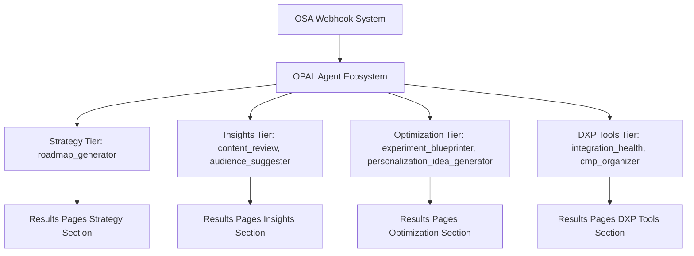
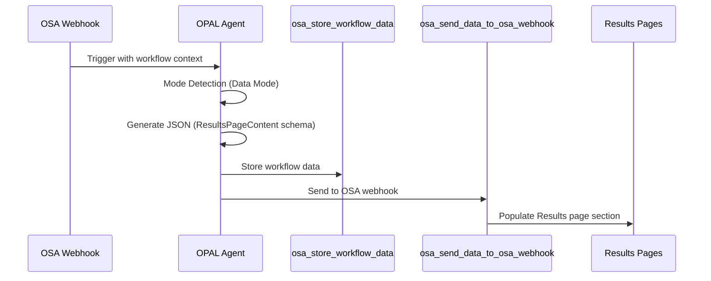

# OPAL Agent Configuration Standards

Comprehensive documentation for maintaining consistency, quality, and business alignment across all OPAL agents in the OSA (Optimizely Strategy Assistant) ecosystem.

## Table of Contents

1. [Overview](#overview)
2. [The 5 Core Standards](#the-5-core-standards)
3. [Implementation Guidelines](#implementation-guidelines)
4. [Business Context Integration](#business-context-integration)
5. [OSA Results Pipeline Integration](#osa-results-pipeline-integration)
6. [Agent Validation Workflows](#agent-validation-workflows)
7. [Troubleshooting Guide](#troubleshooting-guide)
8. [Multi-Agent Update Patterns](#multi-agent-update-patterns)
9. [Performance Guidelines](#performance-guidelines)
10. [Maintenance & Monitoring](#maintenance--monitoring)

## Overview

The OPAL Agent Configuration Standards ensure that every agent in the `opal-config/opal-agents/` directory delivers consistent, data-driven recommendations that integrate seamlessly with the OSA Results pipeline and business context for FreshProduce.com/IFPA.

### Why These Standards Matter

- **Consistency**: Uniform output quality across all 9+ OPAL agents
- **Data-Driven**: Recommendations based on actual DXP platform data, not generic advice
- **Business Alignment**: All outputs reference specific IFPA context and personas
- **Pipeline Integration**: Seamless flow through OSA webhook system to Results pages
- **Quality Assurance**: Standardized confidence calculation and language compliance

### Agent Ecosystem Overview



## The 5 Core Standards

### 1. Data-Driven Specificity

**Requirement**: Ground all recommendations in actual DXP platform data, never generic marketing advice.

**Implementation**:
- Reference actual ODP audience segments and behavioral traits
- Cite actual CMS content performance metrics
- Use actual WebX experiment results where applicable
- Analyze actual CMP campaign performance data
- Reference actual Content Recs topic performance

**Examples**:
```
✅ CORRECT: "Based on ODP trait 'Industry_Role:Buyer' (12,450 members), create targeted navigation"
❌ WRONG: "Improve your value proposition"

✅ CORRECT: "Content topic 'Food Safety' shows 2.3x engagement vs baseline - expand this theme"
❌ WRONG: "Consider A/B testing your homepage"
```

**Validation**: Use tools like `osa_analyze_member_behavior`, `osa_track_content_performance_metrics` to ensure data backing.

### 2. Standardized Confidence Calculation

**Requirement**: Calculate confidence (0-100) based on data availability, not reasoning quality.

**Confidence Thresholds**:
- **High Confidence (80-100)**: Complete DXP data available with statistical significance
- **Medium Confidence (60-79)**: Partial DXP data with reasonable sample sizes  
- **Moderate Confidence (40-59)**: Limited DXP data or early-stage implementation
- **Low Confidence (0-39)**: Minimal DXP data or new implementation (crawl maturity)

**Confidence Messages**:
- `< 40`: "Building confidence as your DXP data accumulates. Recommendations based on industry best practices."
- `40-59`: "Moderate confidence based on initial data patterns. Confidence will improve as more interaction data flows in."
- `60-80`: "Good confidence - solid data foundation supports these recommendations."
- `80+`: "High confidence - comprehensive data analysis validates these insights."

**Implementation**:
```json
{
  "hero": {
    "confidence": 65,
    "confidenceNote": "Good confidence - solid data foundation supports these recommendations."
  }
}
```

### 3. Mandatory Language Rules Validation

**Requirement**: Validate all output against OSA language rules before final JSON generation.

**Forbidden Terms**: 
- Revenue, ROI, profit, cost, price, projections, forecast
- Currency symbols: $, €, £
- Monetary amounts or financial projections

**Preferred Terminology**:
- Use "impact" instead of "effect"
- Use "optimization" instead of "improvement"  
- Use "performance" instead of "results"

**Avoided Terms**:
- Synergy, leverage (as verb), "somewhat", "pretty good", "kind of", "sort of"

**Implementation**:
```javascript
// MANDATORY: Call before generating final JSON
await osa_validate_language_rules(outputContent);
```

### 4. Clear Mode Detection

**Requirement**: Detect and operate in correct mode based on invocation method.

**Data Mode** (Triggered by `osa_retrieve_workflow_context` or OSA webhook):
- Output pure JSON matching ResultsPageContent schema
- NO conversational text, NO markdown formatting
- Focus on structured data for Results page population

**Chat Mode** (Triggered by direct user conversation in Opal UI):
- Use natural language and follow-up questions
- Suggest Canvas visualizations
- Provide educational guidance and explanations

**Implementation Pattern**:
```javascript
// Mode Detection Logic
if (workflowContext || webhookTrigger) {
    // Data Mode: Pure JSON output
    return generateStructuredJSON();
} else {
    // Chat Mode: Conversational guidance
    return generateConversationalResponse();
}
```

### 5. Explicit Business Context Integration

**Requirement**: Reference specific FreshProduce.com/IFPA business context in all recommendations.

**Required Context Elements**:
- **Industry**: Fresh produce professional association (IFPA)
- **Primary Goal**: Member acquisition and engagement
- **Key Segments**: Commercial Buyers, Produce Suppliers/Growers, Industry Professionals, Association Members
- **Primary KPIs**: Membership conversion rate, content engagement score, event registration rate, member retention
- **Content Pillars**: Industry Intelligence, Operational Excellence, Regulatory Compliance, Innovation & Technology, Professional Development

**Persona Integration**:
- **Strategic Buyer Sarah**: Commercial buyer focused on supply chain optimization
- **Innovation-Focused Frank**: Technology adopter interested in industry innovations
- **Compliance-Conscious Carol**: Regulatory expert focused on food safety and compliance
- **Executive Leader Linda**: Association leadership focused on member value

**Implementation**:
```
YOU MUST reference these specific details in recommendations, NOT generic placeholders.
```

## Implementation Guidelines

### Agent Configuration Structure

Every agent must include a `_agent_standards_documentation` section:

```json
{
  "_agent_standards_documentation": {
    "overview": "Brief description of how this agent implements the 5 standards",
    "standards_implemented": {
      "1_data_driven_specificity": {
        "requirement": "Specific requirement for this agent",
        "implementation": "How this agent implements data-driven recommendations",
        "examples": {
          "correct": "Data-driven example",
          "incorrect": "Generic advice example"
        }
      },
      // ... other standards
    },
    "osa_results_pipeline_integration": {
      "schema_compliance": "How output matches ResultsPageContent interface",
      "data_flow": "How data flows through OSA webhook system",
      "tier_classification": "Which Results page tier this agent serves"
    },
    "agent_role_in_ecosystem": {
      "primary_function": "Core purpose of this agent",
      "data_sources": "What data sources this agent uses",
      "output_consumers": "What systems consume this agent's output",
      "collaboration_agents": "How this agent collaborates with others"
    }
  }
}
```

### Prompt Template Requirements

Every agent prompt must include these sections:

1. **Critical Data-Driven Requirements** section with forbidden/allowed examples
2. **Mode Detection Requirements** section defining Data vs Chat mode operation
3. **Business Context (FreshProduce.com - IFPA)** section with specific details
4. **Language Rules Compliance** section with validation requirements
5. **Confidence Scoring** section with data availability-based methodology

### JSON Output Schema Compliance

All agents must output JSON matching the ResultsPageContent interface:

```json
{
  "hero": {
    "title": "Agent-specific title",
    "promise": "Value proposition (max 200 chars)",
    "metrics": [3 agent-specific metrics],
    "confidence": 0-100,
    "confidenceNote": "Confidence message"
  },
  "overview": {
    "summary": "Business impact explanation",
    "keyPoints": ["2-4 key takeaways"]
  },
  "insights": [
    {
      "title": "Insight category",
      "description": "Clear explanation",
      "bullets": ["Specific observations"]
    }
  ],
  "opportunities": [
    {
      "label": "Actionable opportunity",
      "impactLevel": "High|Medium|Low",
      "effortLevel": "Low|Medium|High", 
      "confidence": 0-100
    }
  ],
  "nextSteps": [
    {
      "label": "Specific next step",
      "ownerHint": "Appropriate role",
      "timeframeHint": "Realistic timeframe"
    }
  ],
  "meta": {
    "tier": "strategy|insights|optimization|dxptools",
    "agents": ["agent_name"],
    "maturity": "crawl|walk|run|fly",
    "lastUpdated": "ISO 8601 timestamp"
  }
}
```

## Business Context Integration

### IFPA-Specific Implementation Patterns

#### Member Acquisition Focus
```
Instead of: "Increase conversions"
Use: "Optimize membership conversion rate for Commercial Buyers segment"
```

#### Content Pillar Alignment
```
Instead of: "Improve content strategy"
Use: "Enhance Industry Intelligence content pillar based on Food Safety topic performance (2.3x engagement vs baseline)"
```

#### Persona-Specific Recommendations
```
Strategic Buyer Sarah: "Supply chain optimization features show 45% higher engagement"
Innovation-Focused Frank: "Digital transformation content drives 3.2x higher session duration"
Compliance-Conscious Carol: "Regulatory compliance tools achieve 89% task completion rate"
Executive Leader Linda: "Member value communications generate 67% higher click-through rates"
```

### KPI Integration Requirements

Every agent must reference actual IFPA KPIs:
- **Membership conversion rate**: Reference actual conversion metrics
- **Content engagement score**: Use actual content analytics data
- **Event registration rate**: Cite actual event performance data  
- **Member retention**: Reference actual retention analytics

## OSA Results Pipeline Integration

### Data Flow Architecture



### Tier Classification

**Strategy Tier** (`tier: "strategy"`):
- **Agents**: roadmap_generator
- **Focus**: Strategic planning and implementation roadmaps
- **Metrics**: Progress tracking, timeline confidence, plan reliability

**Insights Tier** (`tier: "insights"`):
- **Agents**: content_review, audience_suggester, customer_journey
- **Focus**: Analytics and behavioral insights
- **Metrics**: Quality scores, segmentation confidence, engagement metrics

**Optimization Tier** (`tier: "optimization"`):
- **Agents**: experiment_blueprinter, personalization_idea_generator  
- **Focus**: A/B testing and personalization optimization
- **Metrics**: Test specifications, statistical confidence, expected impact

**DXP Tools Tier** (`tier: "dxptools"`):
- **Agents**: integration_health, cmp_organizer, geo_audit
- **Focus**: Platform integration and system health
- **Metrics**: Health scores, system availability, integration status

### Schema Validation Requirements

Before final output, validate JSON structure:
```javascript
// Required validation steps
1. Ensure all required fields present (hero, overview, insights, opportunities, nextSteps, meta)
2. Validate metrics array (exactly 3 items)
3. Confirm confidence is 0-100 number
4. Verify tier matches agent classification
5. Validate ISO 8601 timestamp format
```

## Agent Validation Workflows

### Pre-Deployment Validation Checklist

- [ ] **Standards Documentation**: `_agent_standards_documentation` section complete
- [ ] **Data-Driven Requirements**: Actual DXP data references implemented
- [ ] **Confidence Calculation**: Data availability-based methodology implemented
- [ ] **Language Rules**: `osa_validate_language_rules` tool integration verified
- [ ] **Mode Detection**: Data Mode vs Chat Mode logic implemented
- [ ] **Business Context**: FreshProduce.com/IFPA specifics integrated
- [ ] **Schema Compliance**: ResultsPageContent interface match verified
- [ ] **Tool Integration**: Required OSA tools properly configured
- [ ] **Tier Classification**: Correct tier assignment validated
- [ ] **Canvas Integration**: Canvas visualization patterns implemented (if applicable)

### Validation Tools

#### opal-integration-validator Agent
Use for comprehensive end-to-end validation:
```bash
# Launch validation agent
Task({ 
  subagent_type: "opal-integration-validator", 
  description: "Validate agent configuration", 
  prompt: "Validate [agent_name] against 5 OPAL Agent Configuration Standards"
});
```

#### Manual Validation Commands
```bash
# Validate JSON schema
cat opal-config/opal-agents/[agent].json | jq '.output.schema'

# Check for required documentation section
cat opal-config/opal-agents/[agent].json | jq '._agent_standards_documentation'

# Validate enabled tools include osa_validate_language_rules
cat opal-config/opal-agents/[agent].json | jq '.enabled_tools[]' | grep "osa_validate_language_rules"
```

### Testing Workflows

#### Unit Testing
```javascript
// Test data-driven requirements
test('Agent produces data-driven recommendations', async () => {
  const result = await invokeAgent(testInput);
  expect(result).toContainDXPDataReferences();
});

// Test confidence calculation
test('Confidence based on data availability', async () => {
  const result = await invokeAgent({ dataCompleteness: 'partial' });
  expect(result.hero.confidence).toBeBetween(40, 79);
});
```

#### Integration Testing  
```javascript
// Test Results page population
test('Agent output populates Results page correctly', async () => {
  const agentOutput = await invokeAgent(testInput);
  const resultsPage = await populateResultsPage(agentOutput);
  expect(resultsPage.hero.metrics).toHaveLength(3);
});
```

## Troubleshooting Guide

### Common Configuration Issues

#### Issue: Generic Marketing Advice
**Symptoms**: Agent outputs generic recommendations not backed by DXP data
**Solution**: 
1. Review Critical Data-Driven Requirements section
2. Add actual ODP/CMS/WebX data references
3. Replace generic examples with IFPA-specific scenarios

#### Issue: Incorrect Confidence Calculation
**Symptoms**: High confidence with minimal data or low confidence with complete data
**Solution**:
1. Review data availability assessment logic
2. Implement confidence thresholds based on actual data completeness
3. Add appropriate confidence degradation messages

#### Issue: Language Rule Violations
**Symptoms**: Agent output contains forbidden terms (ROI, revenue, cost, etc.)
**Solution**:
1. Ensure `osa_validate_language_rules` tool is in enabled_tools array
2. Add validation call before final JSON output
3. Review and update preferred terminology usage

#### Issue: Mode Detection Failure
**Symptoms**: Agent produces conversational output when pure JSON expected
**Solution**:
1. Review Mode Detection Requirements section implementation
2. Add workflow context detection logic
3. Ensure Data Mode outputs only valid JSON

#### Issue: Schema Compliance Failures
**Symptoms**: Results page fails to populate or displays incorrectly
**Solution**:
1. Validate JSON structure matches ResultsPageContent interface
2. Ensure all required fields are present
3. Check metric array has exactly 3 items
4. Verify tier classification matches agent purpose

### Debugging Commands

```bash
# Check agent configuration completeness
grep -r "_agent_standards_documentation" opal-config/opal-agents/

# Validate language rules integration  
grep -r "osa_validate_language_rules" opal-config/opal-agents/

# Check confidence calculation implementation
grep -r "confidence.*data.*availability" opal-config/opal-agents/

# Verify business context integration
grep -r "FreshProduce\|IFPA" opal-config/opal-agents/

# Validate mode detection implementation
grep -r "Mode Detection Requirements" opal-config/opal-agents/
```

### Performance Diagnostics

```bash
# Check agent response times
time curl -X POST /api/opal/agents/[agent_name] -d '{"test": "data"}'

# Monitor memory usage during agent execution
top -p $(pgrep -f opal-agent) -d 1

# Validate JSON schema compliance
cat opal-config/opal-agents/[agent].json | jq empty

# Test Results page population speed
time curl -X POST /api/results/populate -d '{"agent": "[agent_name]", "data": {...}}'
```

## Multi-Agent Update Patterns

### Systematic Update Procedures

When updating multiple agents, follow this sequence:

1. **Planning Phase**
   - Document required changes across all affected agents
   - Identify dependencies between agents
   - Plan rollout sequence (core agents first, specialized agents second)

2. **Implementation Phase**
   - Update agents in dependency order
   - Apply changes consistently across all agents
   - Validate each agent before proceeding to next

3. **Validation Phase**
   - Run opal-integration-validator for each updated agent
   - Test end-to-end workflow execution
   - Validate Results page population

4. **Monitoring Phase**
   - Monitor system health after deployment
   - Track agent performance metrics
   - Validate recommendation quality

### Batch Update Commands

```bash
# Apply language rule updates to all agents
for agent in opal-config/opal-agents/*.json; do
  echo "Updating $agent..."
  # Apply consistent updates
done

# Validate all agents after updates
for agent in opal-config/opal-agents/*.json; do
  echo "Validating $agent..."
  cat "$agent" | jq '.enabled_tools[]' | grep -q "osa_validate_language_rules" && echo "✅ Language rules OK" || echo "❌ Missing language rules"
done

# Test all agent outputs
for agent in content_review audience_suggester experiment_blueprinter roadmap_generator integration_health; do
  echo "Testing $agent..."
  curl -X POST "/api/opal/agents/$agent" -d '{"test": true}'
done
```

### Version Control Best Practices

```bash
# Create feature branch for agent updates
git checkout -b opal-agent-standards-update

# Commit agents by tier for easier rollback
git add opal-config/opal-agents/content_review.json
git add opal-config/opal-agents/audience_suggester.json  
git commit -m "OPAL: Update insights tier agents with 5 standards"

git add opal-config/opal-agents/experiment_blueprinter.json
git commit -m "OPAL: Update optimization tier agents with 5 standards"

# Test before merging
npm run validate:all
npm run test:opal-agents

# Merge with pull request for review
git push origin opal-agent-standards-update
```

## Performance Guidelines

### Agent Response Time Targets

- **Simple agents** (geo_audit): < 2 seconds
- **Complex agents** (integration_health): < 5 seconds  
- **Canvas-heavy agents** (roadmap_generator): < 8 seconds
- **Multi-tool agents** (experiment_blueprinter): < 10 seconds

### Memory Usage Optimization

```javascript
// Efficient data handling
const processAgentData = (input) => {
  // Process data in chunks to avoid memory spikes
  const chunks = chunkArray(input.data, 1000);
  return chunks.map(chunk => processChunk(chunk));
};

// Clean up resources after agent execution
const cleanupAgent = () => {
  // Clear large data structures
  // Release API connections
  // Reset agent state
};
```

### Caching Strategies

```javascript
// Cache frequently accessed DXP data
const cachedODPData = new Map();
const getCachedODPData = (traitId) => {
  if (!cachedODPData.has(traitId)) {
    cachedODPData.set(traitId, fetchODPData(traitId));
  }
  return cachedODPData.get(traitId);
};

// Cache agent configurations
const agentConfigCache = new Map();
const getCachedAgentConfig = (agentId) => {
  if (!agentConfigCache.has(agentId)) {
    agentConfigCache.set(agentId, loadAgentConfig(agentId));
  }
  return agentConfigCache.get(agentId);
};
```

## Maintenance & Monitoring

### Regular Maintenance Tasks

#### Weekly Tasks
- [ ] Review agent performance metrics
- [ ] Check for language rule violations in outputs
- [ ] Validate confidence calculation accuracy
- [ ] Monitor Results page population success rates

#### Monthly Tasks
- [ ] Update business context details (new IFPA data, personas, KPIs)
- [ ] Review and update DXP data integration points
- [ ] Validate agent collaboration patterns
- [ ] Update Canvas visualization recommendations

#### Quarterly Tasks
- [ ] Comprehensive agent configuration audit
- [ ] Business context alignment review
- [ ] Performance optimization analysis
- [ ] Schema evolution planning

### Monitoring Dashboards

#### Agent Performance Metrics
```javascript
// Key metrics to track
const agentMetrics = {
  responseTime: 'Average response time per agent',
  confidenceAccuracy: 'Actual vs predicted confidence scores',
  dataIntegration: 'Percentage of recommendations using actual DXP data',
  languageCompliance: 'Percentage of outputs passing language rules',
  schemaCompliance: 'Percentage of outputs matching ResultsPageContent schema',
  businessAlignment: 'Percentage of outputs referencing IFPA context'
};
```

#### Health Check Endpoints
```bash
# Agent configuration health
GET /api/admin/opal/agent-health

# Standards compliance monitoring  
GET /api/admin/opal/standards-compliance

# Performance metrics
GET /api/admin/opal/performance-metrics

# Business context alignment
GET /api/admin/opal/business-alignment
```

### Alerting Configuration

```yaml
# Critical alerts
alerts:
  - name: "Agent Configuration Drift"
    condition: "standards_compliance < 95%"
    severity: "critical"
    
  - name: "Language Rule Violations"
    condition: "language_violations > 0"
    severity: "warning"
    
  - name: "Schema Compliance Failure"
    condition: "schema_compliance < 100%"
    severity: "critical"
    
  - name: "Business Context Missing"
    condition: "business_alignment < 90%"
    severity: "warning"
```

---

## Conclusion

The OPAL Agent Configuration Standards ensure consistent, high-quality, data-driven recommendations across the entire OSA ecosystem. By implementing these 5 core standards, agents deliver business-aligned insights that integrate seamlessly with the Results pipeline and provide actionable value to FreshProduce.com/IFPA members.

### Key Success Metrics

- **95%+ Standards Compliance**: All agents implement the 5 core standards
- **100% Schema Compliance**: All outputs match ResultsPageContent interface  
- **90%+ Business Alignment**: All recommendations reference IFPA context
- **< 5 second Average Response Time**: Optimal user experience
- **Zero Language Rule Violations**: Consistent terminology across all outputs

### Next Steps

1. **Implement Remaining Agents**: Apply standards to all 9+ agents in ecosystem
2. **Automate Validation**: Build automated testing for standards compliance
3. **Monitor Performance**: Establish ongoing monitoring and alerting
4. **Iterate and Improve**: Continuously refine standards based on usage patterns

For questions or support with OPAL Agent Configuration Standards, consult:
- **Technical Issues**: `docs/OPAL-Troubleshooting-Guide.md`
- **Integration Patterns**: `docs/agent-integration-patterns.md` 
- **Business Context**: IFPA member personas and KPI documentation
- **Schema Reference**: `docs/results-content-model-patterns.md`