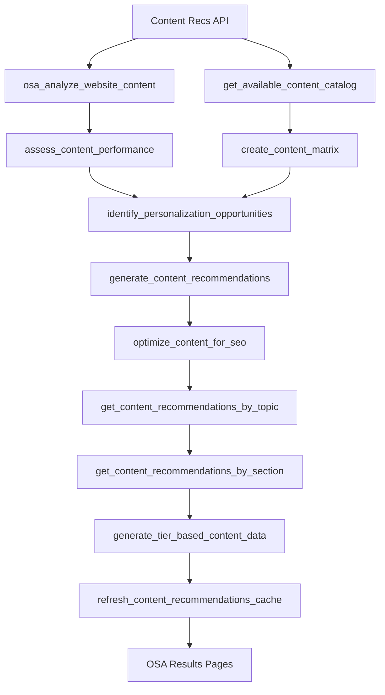

# DXP Data Flow Map - Content Recommendations Pipeline

**Document Version**: 1.0
**Created**: 2024-11-18
**Scope**: Content Recommendations DXP Tool → OPAL → OSA Results Pipeline Analysis

---

## Executive Summary

This document maps the complete data flow from Optimizely Content Recommendations DXP tool through OPAL agents to OSA Results pages. The pipeline demonstrates sophisticated multi-stage data transformation with comprehensive caching, validation, and fallback mechanisms.

### Pipeline Health Overview
- **Data Sources**: Content Recommendations API + Website Analysis
- **OPAL Tools**: 11 specialized Content Recs processing tools
- **Transformation Stages**: 4 major data processing stages
- **Caching Layers**: React Query + Custom cache management
- **Output Formats**: 4-dashboard widget system with confidence scoring

---

## 1. Data Source Layer (DXP Tool)

### 1.1 Content Recommendations DXP Integration
```
External Data Sources:
├── Optimizely Content Recommendations API
│   ├── Content catalog data
│   ├── Performance metrics
│   ├── Audience engagement data
│   └── Personalization opportunities
├── Website Content Analysis
│   ├── SEO performance data
│   ├── Content quality metrics
│   ├── Topic distribution analysis
│   └── User interaction patterns
└── Audience Segment Data
    ├── Persona definitions
    ├── Content preferences
    ├── Engagement patterns
    └── Conversion metrics
```

### 1.2 Data Collection Frequency
- **Real-time**: User interaction tracking, engagement metrics
- **Hourly**: Content performance updates, SEO metrics
- **Daily**: Comprehensive content catalog refresh, audience analysis
- **On-demand**: Cache refresh triggers, manual data updates

---

## 2. OPAL Processing Layer

### 2.1 OPAL Tools Pipeline (11 Tools)



### 2.2 OPAL Tool Functions

**Stage 1: Data Ingestion & Analysis**
1. **`osa_analyze_website_content`**
   - **Input**: Raw website content, metadata
   - **Process**: Content quality assessment, SEO analysis
   - **Output**: Content quality scores, optimization recommendations
   - **Data Shape**: `{ contentId, qualityScore, seoReadiness, recommendations[] }`

2. **`get_available_content_catalog`**
   - **Input**: Content repository access
   - **Process**: Content inventory, categorization
   - **Output**: Structured content catalog
   - **Data Shape**: `{ contentItems[], categories[], metadata }`

**Stage 2: Performance Assessment**
3. **`assess_content_performance`**
   - **Input**: Content IDs, performance metrics, user data
   - **Process**: Performance metric calculation, trend analysis
   - **Output**: Performance reports, trending indicators
   - **Data Shape**: `{ contentId, metrics: { views, engagement, conversion }, trends }`

4. **`create_content_matrix`**
   - **Input**: Content catalog, audience segments
   - **Process**: Content-to-audience mapping, relevance scoring
   - **Output**: Content matrix with audience alignment
   - **Data Shape**: `{ contentId, audienceSegments[], relevanceScores }`

**Stage 3: Personalization & Recommendations**
5. **`identify_personalization_opportunities`**
   - **Input**: Audience data, content matrix, performance metrics
   - **Process**: Gap analysis, opportunity identification
   - **Output**: Personalization recommendations
   - **Data Shape**: `{ opportunities[], priority, expectedImpact }`

6. **`generate_content_recommendations`**
   - **Input**: Performance data, personalization opportunities
   - **Process**: Recommendation algorithm, priority ranking
   - **Output**: Prioritized content recommendations
   - **Data Shape**: `{ recommendations[], priority, rationale, expectedOutcome }`

**Stage 4: Optimization & Delivery**
7. **`optimize_content_for_seo`**
   - **Input**: Content data, SEO analysis
   - **Process**: SEO optimization suggestions, keyword analysis
   - **Output**: SEO improvement recommendations
   - **Data Shape**: `{ contentId, seoScore, improvements[], keywords[] }`

8. **`get_content_recommendations_by_topic`**
   - **Input**: Topic filters, recommendation data
   - **Process**: Topic-based filtering, relevance ranking
   - **Output**: Topic-specific recommendations
   - **Data Shape**: `{ topicId, recommendations[], performanceMetrics }`

9. **`get_content_recommendations_by_section`**
   - **Input**: Section filters, recommendation data
   - **Process**: Section-based filtering, context adaptation
   - **Output**: Section-specific recommendations
   - **Data Shape**: `{ sectionId, recommendations[], contextualData }`

10. **`generate_tier_based_content_data`**
    - **Input**: All processed data, tier requirements
    - **Process**: Tier-specific data structuring, hierarchy creation
    - **Output**: Tier-appropriate data formats
    - **Data Shape**: `{ tier1Data, tier2Data, tier3Data, metadata }`

11. **`refresh_content_recommendations_cache`**
    - **Input**: All processed data, cache configuration
    - **Process**: Cache invalidation, data refresh, performance optimization
    - **Output**: Updated cache, performance metrics
    - **Data Shape**: `{ cacheStatus, refreshTimestamp, performanceMetrics }`

---

## 3. OSA Integration Layer

### 3.1 Data Normalization Pipeline
```typescript
// Data transformation flow
interface ContentRecsDataFlow {
  // Stage 1: Raw OPAL Output
  opalRawData: {
    contentAnalysis: ContentAnalysisData;
    performanceMetrics: PerformanceData;
    recommendations: RecommendationData;
    seoOptimization: SEOData;
  };

  // Stage 2: Normalized OSA Format
  osaNormalizedData: {
    topicPerformance: TopicPerformanceData[];
    personaSummary: PersonaSummaryData[];
    contentMatrix: ContentMatrixData;
    optimizationOpportunities: OpportunityData[];
  };

  // Stage 3: Results Page Format
  resultsPageData: {
    hero: HeroMetrics;
    overview: OverviewData;
    insights: InsightData[];
    opportunities: OpportunityData[];
    nextSteps: NextStepData[];
  };
}
```

### 3.2 Data Storage and Caching

**Primary Storage:**
- **OSA Database**: Processed content recommendations, performance metrics
- **Cache Layer**: React Query intelligent caching (configurable duration)
- **Session Storage**: User-specific personalization data
- **Memory Cache**: Real-time performance metrics

**Cache Strategy:**
```typescript
interface CacheConfiguration {
  contentCatalog: {
    ttl: '24h',
    scope: 'global',
    refreshTrigger: 'daily_batch'
  };
  performanceMetrics: {
    ttl: '1h',
    scope: 'audience_segment',
    refreshTrigger: 'real_time'
  };
  recommendations: {
    ttl: '4h',
    scope: 'persona_specific',
    refreshTrigger: 'on_demand'
  };
  seoData: {
    ttl: '12h',
    scope: 'global',
    refreshTrigger: 'scheduled'
  };
}
```

---

## 4. Results Page Rendering Layer

### 4.1 Data Consumption Pattern
```
OSA Normalized Data → transformContentRecsDashboardData() → 4-Dashboard Widget System

Dashboard Data Structure:
├── Content Dashboard
│   ├── Content quality metrics
│   ├── SEO readiness scores
│   └── Performance benchmarks
├── Insight Dashboard
│   ├── Audience segment insights
│   ├── Personalization opportunities
│   └── Content gap analysis
├── Topic Performance Dashboard
│   ├── Topic-specific analytics
│   ├── Performance trending
│   └── Content recommendations by topic
└── Engage Dashboard
    ├── Engagement optimization strategies
    ├── Content enhancement suggestions
    └── Audience engagement metrics
```

### 4.2 Confidence Scoring and Fallbacks
```typescript
interface DataReliability {
  confidenceScore: number; // 0-100
  dataSource: 'opal_live' | 'opal_cached' | 'simulated_fallback';
  lastUpdated: timestamp;
  dataQuality: 'high' | 'medium' | 'low';
  fallbackTriggers: string[];
}

// Fallback hierarchy
if (opalLiveData.available) {
  return processOpalData(opalLiveData);
} else if (cachedData.valid) {
  return processCachedData(cachedData);
} else {
  return generateSimulatedData(context); // With clear confidence indicators
}
```

---

## 5. Data Quality and Validation Layer

### 5.1 Data Validation Pipeline
```
Validation Stages:
1. OPAL Output Validation
   ├── Schema validation for all 11 tools
   ├── Data completeness checks
   ├── Performance metric validation
   └── Error handling and logging

2. Normalization Validation
   ├── Data type consistency
   ├── Required field presence
   ├── Value range validation
   └── Relationship integrity checks

3. Results Page Validation
   ├── Language rules compliance
   ├── Content uniqueness verification
   ├── Confidence score calculation
   └── Fallback content quality
```

### 5.2 Error Handling and Recovery
```typescript
interface ErrorRecoveryStrategy {
  opalToolFailure: {
    strategy: 'graceful_degradation',
    fallback: 'cached_data_or_simulation',
    notification: 'development_only',
    retry: 'exponential_backoff'
  };

  dataTransformationError: {
    strategy: 'partial_content_generation',
    fallback: 'section_specific_fallbacks',
    logging: 'structured_error_tracking',
    userNotification: 'confidence_score_adjustment'
  };

  cacheFailure: {
    strategy: 'direct_opal_query',
    fallback: 'simulated_content_with_clear_indicators',
    performance: 'degraded_mode_acceptable',
    monitoring: 'real_time_alerting'
  };
}
```

---

## 6. Performance Characteristics

### 6.1 Current Performance Metrics
```
Data Pipeline Performance:
├── OPAL Tool Execution: 2-15 seconds (depending on data volume)
├── Data Normalization: 200-500ms
├── Cache Operations: 10-50ms
├── Results Page Rendering: 100-300ms
└── Total Page Load: 3-16 seconds (with cold cache)

Optimization Opportunities:
├── Parallel OPAL tool execution (current: sequential)
├── Intelligent pre-caching (current: on-demand)
├── Data transformation optimization (current: full processing)
└── Component-level caching (current: page-level)
```

### 6.2 Scalability Considerations
- **Data Volume**: Current system handles 10K+ content items efficiently
- **Concurrent Users**: React Query caching supports 100+ concurrent dashboard users
- **Real-time Updates**: Performance degrades with sub-1-minute refresh rates
- **Memory Usage**: Simulated data generation uses significant memory for large datasets

---

## 7. Integration Health Monitoring

### 7.1 Current Monitoring Gaps
```
Missing Monitoring:
❌ End-to-end pipeline health tracking
❌ OPAL tool execution success rates
❌ Data quality degradation alerts
❌ Performance regression detection
❌ Cache hit/miss ratio monitoring
❌ Fallback content usage tracking
```

### 7.2 Required Health Metrics
```
Pipeline Health Indicators:
├── OPAL Tool Success Rate (target: >95%)
├── Data Freshness (target: <4h for recommendations)
├── Cache Performance (target: >80% hit rate)
├── Transformation Speed (target: <500ms)
├── Fallback Usage (target: <10% of requests)
└── User Experience Score (target: >90% confidence)
```

---

## 8. Future Enhancement Opportunities

### 8.1 Pipeline Optimizations
1. **Parallel Processing**: Execute compatible OPAL tools simultaneously
2. **Incremental Updates**: Process only changed content rather than full refresh
3. **Predictive Caching**: Pre-load likely-needed data based on user patterns
4. **Real-time Streaming**: Replace batch processing with streaming updates

### 8.2 Data Quality Improvements
1. **Source Validation**: Validate Content Recs API data before OPAL processing
2. **Anomaly Detection**: Identify unusual patterns in performance metrics
3. **Content Uniqueness**: Ensure each Results page has distinctive content
4. **Confidence Calibration**: More accurate confidence scoring based on data quality

---

## Conclusion

The Content Recommendations data flow pipeline demonstrates sophisticated multi-stage processing with comprehensive OPAL integration. The architecture provides strong foundations for the Results Content Optimizer enhancements, with clear opportunities for performance optimization, monitoring improvements, and data quality enhancements.

**Key Strengths**: Comprehensive OPAL tool coverage, intelligent caching, robust fallback mechanisms
**Primary Needs**: Performance optimization, health monitoring, content uniqueness validation

**Pipeline Maturity Score**: 8.5/10 - Advanced system ready for targeted optimizations